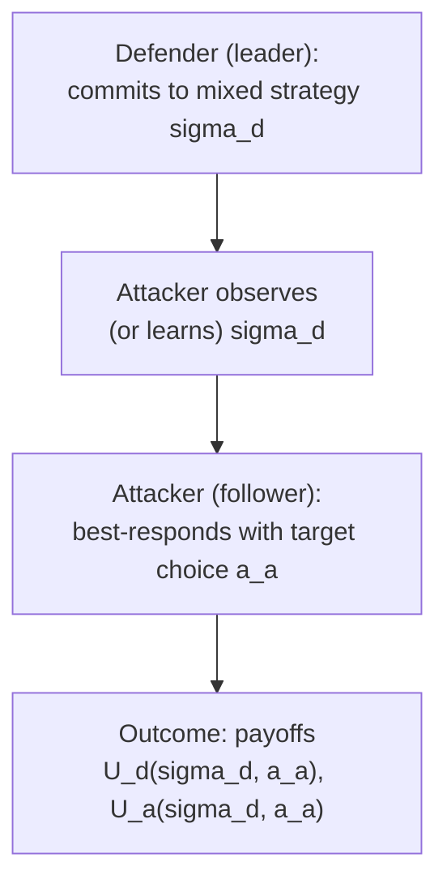
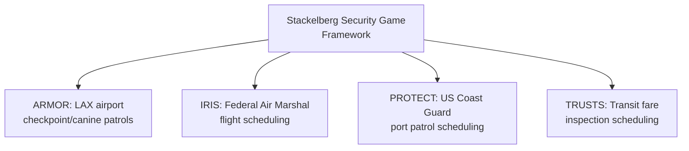

## Security Games and Stackelberg Defense

### Overview

Security games model the strategic interaction between a defender (protecting a set of targets with limited security resources) and an attacker (choosing which target to attack after observing, or reasoning about, the defender's deployed strategy). The dominant formal framework for this problem is the **Stackelberg security game (SSG)**, in which the defender commits first to a (possibly randomized) resource-allocation strategy, and the attacker observes this commitment and best-responds. This leader-follower (Stackelberg) structure, rather than a simultaneous-move Nash setting, reflects the realistic assumption that attackers can surveil fixed or patterned security deployments over time, making a Stackelberg equilibrium concept — where the defender's optimal strategy anticipates the attacker's best response — more appropriate than a simultaneous Nash equilibrium.

### Stackelberg Games: Formal Background

**Key Points**

- A **Stackelberg game** is a sequential game with a **leader** (moves first, commits to a strategy) and a **follower** (observes the leader's strategy, then best-responds).
- The solution concept is a **Strong Stackelberg Equilibrium (SSE)**: the leader chooses the strategy that maximizes its own payoff, correctly anticipating that the follower will best-respond, with ties in the follower's best response broken in the leader's favor (the standard tie-breaking convention used in the security-games literature, justified by the idea that the follower can be incentivized with an arbitrarily small payoff perturbation to break ties as the leader prefers).
- This differs fundamentally from a simultaneous-move Nash equilibrium: committing first can be *advantageous* to the leader in many games (the "first-mover advantage" of commitment), because the leader can strategically shape the follower's incentives, whereas in a Nash equilibrium neither player observes the other's move before choosing.

$$\max_{\sigma_d} \; U_d(\sigma_d, BR(\sigma_d)) \quad \text{where } BR(\sigma_d) = \arg\max_{a_a} U_a(\sigma_d, a_a)$$

where $\sigma_d$ is the defender's (possibly mixed) strategy and $BR(\sigma_d)$ is the attacker's best response to it.

### The Security Game Model

**Key Points**

- A finite set of **targets** $T = \{t_1, \ldots, t_m\}$ (e.g., airport terminals, flight routes, ports, patrol zones), each with an associated payoff structure: if the defender successfully covers (protects) target $t_i$ and the attacker attacks it, the defender receives $U_d^c(t_i)$ (covered payoff) and the attacker receives $U_a^c(t_i)$; if uncovered and attacked, the defender receives $U_d^u(t_i)$ and the attacker receives $U_a^u(t_i)$.
- Standard security-game payoff structure assumes $U_d^c(t_i) > U_d^u(t_i)$ (the defender always prefers a covered attack to an uncovered one) and $U_a^u(t_i) > U_a^c(t_i)$ (the attacker always prefers an uncovered target to a covered one), producing a strictly zero-sum or general-sum structure depending on the specific formulation.
- The defender has $k < m$ limited security resources (patrol units, checkpoints, canine units) to allocate across the $m$ targets, so the defender's action is typically a **mixed strategy** — a probability distribution over which subset of targets to cover — rather than a pure, deterministic schedule, because a deterministic patrol schedule can be learned and exploited by a patient attacker who observes the pattern over repeated instances of the game.
- The optimal defender mixed strategy induces a *coverage probability* $c_i \in [0,1]$ for each target, and the linear-programming and mixed-integer-programming methods used to compute the optimal SSE strategy must satisfy resource constraints (e.g., $\sum_i c_i \leq k$ for a single, unconstrained resource-scheduling case, with considerably more complex constraints for scheduling with spatial, temporal, or capacity restrictions).

### Why Randomization Matters: A Worked Example

**Example**

Suppose a defender has one security resource to allocate between two targets, and the payoffs (defender, attacker) under each coverage scenario are:

|  | Target 1 covered, attacked | Target 1 uncovered, attacked |
| --- | --- | --- |
| Payoffs | $(5, -3)$ | $(-10, 8)$ |

|  | Target 2 covered, attacked | Target 2 uncovered, attacked |
| --- | --- | --- |
| Payoffs | $(3, -2)$ | $(-6, 5)$ |

If the defender committed to a deterministic pure strategy (e.g., "always cover Target 1"), a rational, surveilling attacker would simply attack Target 2, which is guaranteed uncovered, earning the attacker payoff 5 and the defender payoff $-6$.

By instead committing to a mixed strategy — covering Target 1 with probability $c_1$ and Target 2 with probability $c_2 = 1 - c_1$ — the defender can make the attacker indifferent between the two targets at the optimal $c_1$, so that the attacker's expected payoff from attacking either target is equalized, and the defender's strategy cannot be exploited by concentrating attacks on a known-uncovered target. Solving for the indifference point:

$$-3c_1 + 8(1-c_1) = -2c_2 + 5(1-c_2), \quad \text{with } c_2 = 1-c_1$$

This is the same logic as computing a mixed-strategy Nash equilibrium in a zero-sum game, adapted to the Stackelberg leader-commitment setting: the defender's optimal randomization is calculated precisely to remove any exploitable pattern from the attacker's perspective, which is the formal justification for randomized security patrols (e.g., randomized airport checkpoint locations, randomized patrol routes) over fixed, predictable schedules.

### Solving for the Optimal Strategy: DOBSS and Multiple LPs

**Key Points**

- Early security-game applications used the **DOBSS (Decomposed Optimal Bayesian Stackelberg Solver)** algorithm and related mixed-integer linear programming (MILP) formulations to compute the optimal SSE strategy efficiently, decomposing the problem across attacker types in Bayesian (multiple possible attacker type) settings.
- The **Multiple Linear Programs (Multiple-LP)** method solves for the optimal SSE by iterating over each possible target the attacker might be induced to attack, solving a linear program that maximizes the defender's payoff subject to the constraint that the chosen target is indeed the attacker's best response, and then selecting the best outcome across all such candidate targets.
- For games with combinatorial resource-allocation constraints (e.g., patrol schedules subject to spatial adjacency or temporal ordering constraints), specialized algorithms (e.g., **ORIGAMI**, and later **ASPEN** and compact/marginal-representation techniques) are used to avoid the exponential blow-up of enumerating every possible pure defender strategy directly.

### Deployed Real-World Applications

**Key Points**

- **ARMOR** (Assistant for Randomized Monitoring over Routes), developed by researchers at the University of Southern California, was deployed by the Los Angeles International Airport (LAX) police to randomize the placement of vehicle checkpoints and canine patrol routes, and is frequently cited as one of the first large-scale, real-world deployments of Stackelberg security game theory.
- **IRIS** (Intelligent Randomization In Scheduling) was deployed by the US Federal Air Marshals Service to randomize which flights receive air marshal coverage, addressing the combinatorial scheduling problem of covering flights across many overlapping routes and schedules with a limited marshal workforce.
- **PROTECT** was deployed by the US Coast Guard to randomize patrol patterns for protecting ports (including the Port of Boston and later other US ports) against potential waterborne attacks, incorporating a more refined attacker behavioral model than the fully rational-attacker assumption used in earlier systems.
- **TRUSTS** applied security-game techniques to randomize fare-inspection patrol schedules on urban transit systems (e.g., the Los Angeles Metro Rail system), addressing fare evasion as a security-game-style resource-allocation problem. [Inference — the specific set of named deployed systems and the details of their scope reflect publications describing these systems as of their respective deployment periods; Claude's knowledge of the current operational status of any specific system may be outdated]

### Incorporating Bounded Rationality: Behavioral Security Games

**Key Points**

- The classical SSE solution concept assumes a perfectly rational attacker who always best-responds exactly to the defender's committed strategy; empirical and behavioral evidence from deployed systems and human-subject experiments suggested real adversaries deviate from perfect rationality in systematic, modelable ways.
- The **Quantal Response Equilibrium (QRE)** and its adaptation to security games, **SUQR (Subjective Utility Quantal Response)**, model the attacker as choosing each target with a probability that increases smoothly (rather than as a strict best-response step function) with that target's expected payoff, formalized via a logistic/softmax choice function rather than a hard-maximization best response.

$$P(\text{attack } t_i) = \frac{e^{\lambda \cdot U_a(t_i)}}{\sum_{j} e^{\lambda \cdot U_a(t_j)}}$$

where $\lambda$ is a rationality parameter (as $\lambda \to \infty$, this converges to a strict best response; as $\lambda \to 0$, the attacker's choice approaches uniform randomness).

- Incorporating a bounded-rationality attacker model of this kind can change the defender's optimal strategy relative to the strict SSE prescription, and behavioral security-game research (associated particularly with the PROTECT deployment and subsequent academic work) found that accounting for bounded rationality improved real-world defender performance relative to the classical, perfect-rationality SSE baseline in specific studied deployments. [Inference — this is the standard motivating finding cited in the behavioral-security-games literature, though the magnitude of improvement is deployment- and study-specific rather than a universal constant]

### Extensions: Green Security Games and Cybersecurity

**Key Points**

- **Green security games** extend the SSG framework to wildlife anti-poaching patrol optimization (e.g., the **PAWS** — Protection Assistant for Wildlife Security — system) and illegal fishing/logging interdiction, where the "attacker" is a poacher or illegal harvester and the defender is a ranger patrol force with similarly limited coverage resources.
- **Cybersecurity applications** of security-game theory model network-defense resource allocation (e.g., which subset of network nodes or honeypots to actively monitor) using an analogous target-coverage framework, though cybersecurity settings frequently introduce additional complications such as very large or combinatorial target/action spaces and attackers who can adapt within a single engagement rather than only across repeated instances of a scheduling game.
- **Adversarial patrolling with moving targets** and **network security games** (protecting graph-structured infrastructure such as road networks or computer networks rather than a simple finite target list) extend the basic model to settings where the "targets" have topological structure relevant to the attacker's traversal strategy.

### Conclusion

Security games formalize the resource-allocation problem facing a real-world defender protecting valuable but numerous targets against a strategic adversary, using the Stackelberg leader-follower solution concept to reflect the realistic assumption that attackers can surveil and adapt to observed (rather than merely hypothesized) defender strategies. The core theoretical insight — that optimal defense generally requires randomization, calibrated precisely to remove exploitable patterns — has been operationalized into a series of algorithmically sophisticated, real-world-deployed systems (ARMOR, IRIS, PROTECT, TRUSTS, PAWS), with subsequent research extending the basic perfectly-rational-attacker model to incorporate bounded rationality (QRE/SUQR), combinatorial and graph-structured resource constraints, and domains beyond counterterrorism, including wildlife protection and cybersecurity.

**Related Topics**

- Stackelberg Equilibrium and Leader-Follower Games
- Mixed-Strategy Nash Equilibrium in Zero-Sum Games
- Quantal Response Equilibrium and Bounded Rationality
- Mechanism Design and Mixed-Integer Programming for Game Solving
- Green Security Games (Anti-Poaching, PAWS)
- Network Security Games and Graph-Structured Adversarial Games
- Multi-Agent Systems and Adversarial Reinforcement Learning