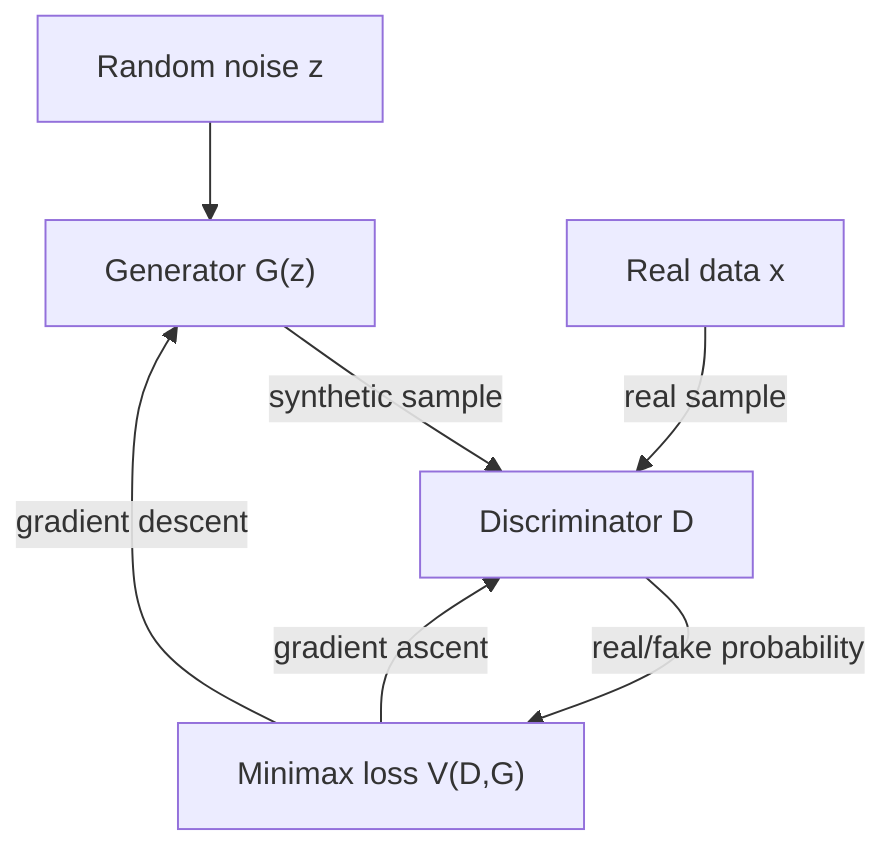
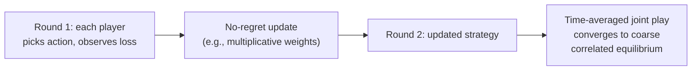

## Game Theory in Machine Learning

### Overview

Game theory provides both a descriptive and a constructive lens for modern machine learning. Descriptively, several core ML training paradigms are literally two-player or multi-player games in the formal sense — GANs pit a generator against a discriminator, adversarial robustness pits a model against an attacker, federated learning coordinates many self-interested data holders — so equilibrium concepts (Nash, minimax) directly characterize what these systems converge to (or fail to converge to). Constructively, ML also supplies the computational machinery — gradient-based optimization, deep function approximation, regret-minimization algorithms — used to *solve* large-scale games that are intractable via classical linear-programming or backward-induction methods. This entry surveys the principal intersections between the two fields, building on the equilibrium concepts introduced in Multi-Agent Systems and Security Games.

### Generative Adversarial Networks as a Minimax Game

**Key Points**

- A **Generative Adversarial Network (GAN)** (Goodfellow et al., 2014) is formalized as a two-player, zero-sum minimax game between a **generator** $G$ (mapping random noise $z$ to synthetic samples $G(z)$) and a **discriminator** $D$ (mapping a sample to a probability that it is real rather than generated).
- The GAN objective is exactly a minimax game value:

$$\min_G \max_D \; V(D, G) = \mathbb{E}_{x \sim p_{data}}[\log D(x)] + \mathbb{E}_{z \sim p_z}[\log(1 - D(G(z)))]$$

- At the theoretical Nash equilibrium of this game (under an idealized, non-parametric analysis with unlimited model capacity), the generator's distribution exactly matches the true data distribution ($p_G = p_{data}$), and the discriminator is unable to distinguish real from generated samples any better than random guessing ($D^*(x) = 1/2$ everywhere).
- In practice, training GANs via simultaneous or alternating gradient descent on $G$ and $D$ does not reliably converge to this Nash equilibrium: because both players use local gradient updates rather than solving for a global best response, GAN training is well documented to exhibit **oscillation, non-convergence, and mode collapse** (the generator producing only a limited subset of the true data distribution's diversity), which is a direct consequence of the fact that simultaneous gradient descent on a minimax objective is not guaranteed to converge to a saddle point in general non-convex settings, unlike the convex-concave case where such guarantees exist.

### Adversarial Robustness as a Stackelberg or Simultaneous Game

**Key Points**

- **Adversarial examples** — inputs perturbed by a small, often imperceptible amount specifically to cause a model to misclassify — turn model robustness into a direct game between a model defender and an attacker, structurally analogous to the security games covered earlier in this chapter, but operating in continuous, high-dimensional input space rather than over a discrete target set.
- **Adversarial training** (Goodfellow et al.'s Fast Gradient Sign Method, and Madry et al.'s projected-gradient-descent-based robust training) is formalized as a **min-max robust optimization** problem: the defender minimizes expected loss under the worst-case adversarial perturbation within a bounded norm ball, which is precisely a Stackelberg-style formulation where the attacker (inner maximization) responds optimally to whatever model parameters the defender (outer minimization) has currently committed to.

$$\min_\theta \; \mathbb{E}_{(x,y)} \left[ \max_{\|\delta\| \leq \epsilon} \; L(f_\theta(x + \delta), y) \right]$$

- This formulation is a direct computational analogue of the Stackelberg security games covered earlier in this chapter: the outer minimization plays the role of the defender committing to a strategy (model parameters), and the inner maximization plays the role of an attacker best-responding within a constrained perturbation budget, though in the adversarial-training setting both players are typically approximated via gradient-based methods rather than solved exactly via linear programming.
- The robustness-accuracy trade-off documented empirically in adversarially trained models (robust models often show reduced accuracy on unperturbed, "clean" data) is frequently discussed in terms of this game-theoretic framing: a model robust against a strong, wide-perturbation-budget adversary is being optimized against a more pessimistic worst case than a model trained only on clean data. [Inference — the precise theoretical characterization of why this trade-off exists is an active area of ML-theory research, and specific quantitative trade-off magnitudes are architecture- and dataset-dependent]

### Federated Learning as a Multi-Agent Game

**Key Points**

- **Federated learning** coordinates model training across many distributed data holders (clients) who do not share their raw data directly, instead exchanging model updates with a central server; when clients are modeled as self-interested (rather than fully cooperative) agents, several distinct strategic problems arise.
- **Free-riding**: a client may contribute low-quality or no genuine local training effort while still benefiting from the globally aggregated model, an incentive structure directly analogous to the public-goods free-riding problem discussed in the climate-negotiations entry, adapted to a distributed-computing context.
- **Data poisoning and Byzantine-robustness games**: a subset of clients may be adversarial, submitting corrupted model updates to degrade the global model or introduce a backdoor; robust aggregation rules (e.g., coordinate-wise median, trimmed mean, Krum) are designed as mechanisms intended to bound the influence any single (or bounded fraction of) adversarial client(s) can exert, an application of the same mechanism-design logic used to design incentive-compatible or manipulation-resistant systems elsewhere in game theory.
- **Incentive mechanism design for federated learning**: a body of research applies mechanism design and cooperative game theory (e.g., Shapley-value-based contribution accounting) to determine how to fairly compensate or reward clients in proportion to the actual marginal value their data/computation contributed to the final model, directly reusing the Shapley value concept introduced in the context of legislative coalition power indices.

### Regret Minimization and Online Learning as Game-Solving Algorithms

**Key Points**

- **Online learning** and **no-regret algorithms** (e.g., online gradient descent, multiplicative weights update, Hedge) were developed within machine learning theory but are now central computational tools for approximately *solving* large games, connecting directly to the no-regret learning dynamics introduced in the Multi-Agent Systems entry.
- The key bridging result: if every player in a repeated game runs a no-regret learning algorithm, the time-averaged empirical distribution of joint play converges to the set of **coarse correlated equilibria** of the stage game — this result underlies why regret-minimization, an ML optimization technique, is directly usable as an equilibrium-computation method for games too large to solve via classical linear programming.
- **Counterfactual Regret Minimization (CFR)**, introduced earlier in the context of poker AI, is precisely an application of online-learning regret-minimization theory to the extensive-form-game setting, applying a separate regret-minimizing "expert" algorithm at every information set of the game tree.
- **Multiplicative Weights Update (MWU) and its game-theoretic role**: MWU is both a foundational no-regret online-learning algorithm and, when both players in a zero-sum game use it, a method that provably converges (in a time-averaged sense) to the game's minimax value, providing an alternative computational route to the same conclusion guaranteed by von Neumann's minimax theorem.

### Game-Theoretic Explanations in Explainable AI: Shapley Values

**Key Points**

- **SHAP (SHapley Additive exPlanations)**, a widely used model-interpretability technique, directly repurposes the cooperative-game-theoretic **Shapley value** (introduced in the legislative-coalition-formation entry as a measure of a player's average marginal contribution across all possible coalition orderings) to attribute a machine learning model's prediction to its individual input features.
- In the SHAP framing, each input feature is treated as a "player" in a cooperative game where the "payoff" of a coalition of features is the model's output when only that subset of features is known (with the rest marginalized out or replaced by a baseline value), and the Shapley value of a feature quantifies its fair, order-independent average marginal contribution to the prediction.

$$\phi_i = \sum_{S \subseteq F \setminus \{i\}} \frac{|S|!(|F|-|S|-1)!}{|F|!} \left[v(S \cup \{i\}) - v(S)\right]$$

where $F$ is the full feature set and $v(S)$ is the model's expected output given only the features in $S$ — an equation structurally identical to the Shapley-Shubik power index formula introduced earlier in this chapter, applied here to input features rather than legislative voters.

- SHAP's popularity partly derives from the Shapley value's axiomatic guarantees (efficiency, symmetry, dummy-player, additivity) carrying over directly: these axioms provide a principled uniqueness argument for why the Shapley-value-based attribution is, in a formal sense, the *only* attribution method satisfying a specific, desirable set of fairness properties simultaneously, which is a stronger theoretical justification than most competing feature-attribution heuristics can offer.

### Mechanism Design in ML-Mediated Markets

**Key Points**

- **Ad auctions and recommendation-ranking systems** deployed by large online platforms are frequently designed using mechanism-design principles (e.g., generalized second-price auctions, Vickrey-Clarke-Groves-based mechanisms) directly building on the incentive-compatibility concepts introduced in the Multi-Agent Systems entry, applied at the scale of automated, ML-driven bidding agents rather than human bidders.
- **Strategic classification**: a distinct ML-game-theory subfield studying settings where the *subjects* being classified (e.g., loan applicants, or users of a ranking algorithm) can strategically alter their features in response to a known or inferred classifier, in order to obtain a more favorable classification outcome, without necessarily improving the underlying quality the classifier is meant to measure. This reframes classifier design as a Stackelberg game where the classifier is the leader and the population being classified is a strategic (rather than passive, i.i.d.-sampled) follower, motivating classifier-design objectives that are explicitly robust to anticipated strategic feature manipulation.

### Comparative Summary

| ML Setting | Game-Theoretic Structure | Key Concept Applied |
| --- | --- | --- |
| GAN training | Two-player zero-sum minimax game | Nash equilibrium (theoretical); non-convergence in practice |
| Adversarial robustness | Min-max robust optimization / Stackelberg | Worst-case best response within perturbation budget |
| Federated learning | Multi-agent cooperative/mixed-motive game | Free-riding, Byzantine robustness, Shapley-value incentive design |
| Online learning / regret minimization | Repeated game, no-regret dynamics | Coarse correlated equilibrium, CFR, multiplicative weights |
| SHAP feature attribution | Cooperative game among features | Shapley value |
| Ad auctions / recommendation ranking | Mechanism design | Incentive compatibility, VCG mechanisms |
| Strategic classification | Stackelberg game (classifier vs. strategic population) | Robustness to anticipated feature manipulation |

### Conclusion

The relationship between game theory and machine learning runs in both directions: several of ML's most consequential training paradigms — GANs, adversarial training, federated learning — are formally games whose training dynamics and failure modes (non-convergence, mode collapse, free-riding, poisoning) are best understood through equilibrium concepts developed in classical game theory, while ML's optimization and function-approximation toolkit (regret minimization, gradient-based methods, deep networks) supplies practical algorithms for approximately solving games too large for classical linear-programming or backward-induction approaches. The reuse of the Shapley value in SHAP and of mechanism-design principles in ad auctions and strategic classification further illustrates that this is not a superficial analogy but a substantive, formally grounded application of the same mathematical machinery introduced throughout this course.

**Related Topics**

- Minimax Theorem and Zero-Sum Game Solving
- No-Regret Learning and Coarse Correlated Equilibria
- The Shapley Value in Cooperative Game Theory
- Mechanism Design and Vickrey-Clarke-Groves Auctions
- Robust Optimization and Adversarial Machine Learning Theory
- Multi-Agent Reinforcement Learning
- Strategic Classification and Performative Prediction