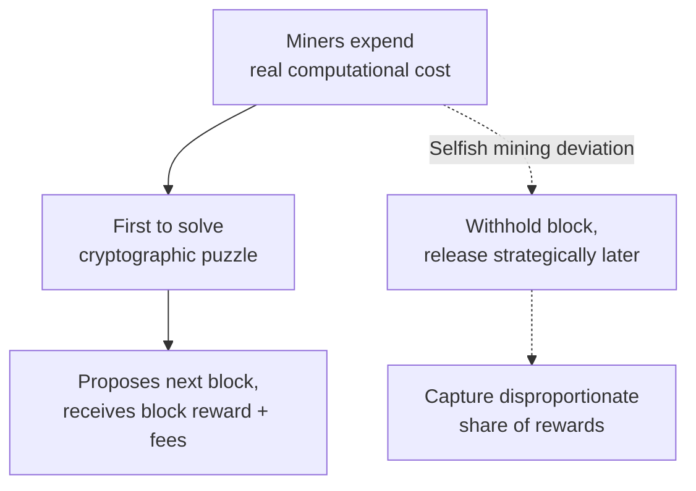
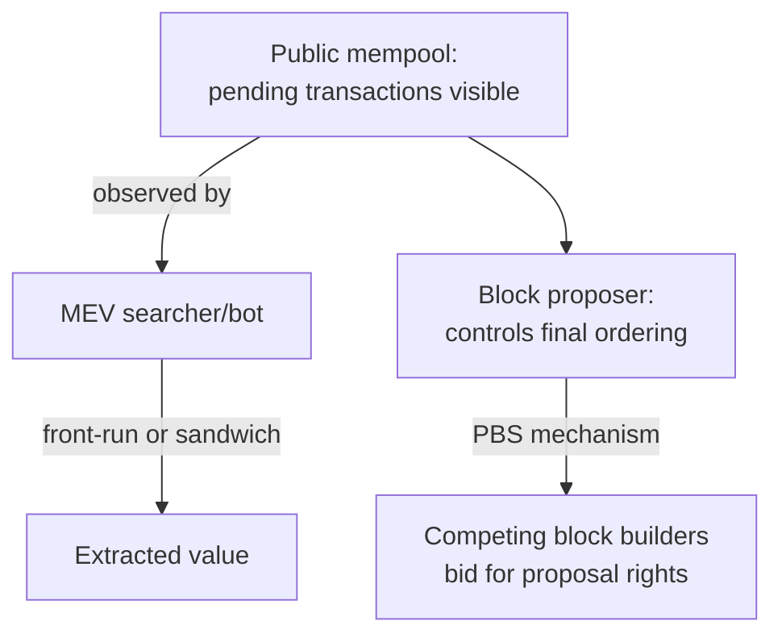

## Game Theory in Blockchain and Cryptoeconomics

### Overview

Blockchain systems are, at their core, mechanism-design problems: a decentralized network of mutually distrusting, self-interested participants (miners, validators, users, developers) must be incentivized, purely through protocol-defined rewards and penalties, to behave in a way that produces a secure, consistent, and censorship-resistant ledger, without relying on any central trusted authority. "Cryptoeconomics" is the term commonly used for the applied discipline of designing these incentive structures, and it draws directly and explicitly on mechanism design, auction theory, and repeated-game/folk-theorem reasoning covered elsewhere in this course. This entry surveys the principal game-theoretic structures underlying consensus mechanisms, transaction-fee markets, and the strategic vulnerabilities that have been identified in deployed systems.

### Byzantine Fault Tolerance and Consensus as a Game

**Key Points**

- Classical distributed-systems theory established that reaching agreement among a set of nodes, some of which may be faulty or actively malicious ("Byzantine"), is possible only if strictly fewer than one-third of participants (by whatever weighting the protocol uses) are Byzantine, a foundational result (the Byzantine Generals Problem, and the associated impossibility results) that predates blockchain but underlies its consensus-security requirements.
- Blockchain systems reframe this classical, non-strategic fault-tolerance problem as an explicitly game-theoretic one: rather than merely tolerating a bounded fraction of *arbitrarily* faulty nodes, the protocol is designed so that **rational, payoff-maximizing** participants have no incentive to deviate from honest behavior, shifting the security argument from a worst-case adversarial-fault-tolerance bound to an incentive-compatibility argument.
- This distinction matters because a purely fault-tolerance-based argument says nothing about whether a rational participant, correctly computing that deviation is profitable, *would* deviate; cryptoeconomic security design must additionally ensure that the equilibrium of the induced game is one in which honest participation is a best response for a sufficiently large fraction of participants.

### Proof-of-Work Mining as a Game

**Key Points**

- In a **Proof-of-Work (PoW)** system (e.g., Bitcoin), miners expend real, costly computational resources (electricity, specialized hardware) competing to solve a cryptographic puzzle; the winner proposes the next block and receives a block reward plus transaction fees.
- The core security property relies on a **cost-of-attack argument**: rewriting blockchain history (a "51% attack") requires controlling a majority of the network's total computational power, which is designed to be prohibitively costly relative to the value an attacker could extract, making honest mining the dominant strategy for a rational, profit-maximizing miner under standard assumptions about attack cost versus potential gain.
- **Selfish mining** (Eyal and Sirer, 2014) is a well-known strategic deviation from honest mining in which a miner (or coalition) withholds newly found blocks temporarily rather than broadcasting them immediately, strategically releasing them later to invalidate honest miners' subsequent work and capture a disproportionate share of block rewards relative to their true share of network computational power — a formally demonstrated profitable deviation from honest mining under specific network and coalition-size conditions, illustrating that "majority is required to attack" is a necessary but not always sufficient characterization of PoW security, since certain strategic deviations can be profitable with less than a full majority share.
- **Mining pool formation** is itself modeled as a cooperative-game / coalition-formation problem structurally similar to the legislative-coalition and self-enforcing-environmental-coalition frameworks discussed elsewhere in this course: individual miners with small, high-variance probabilities of solving a block voluntarily pool computational resources to smooth reward variance, with pool-reward-sharing rules themselves subject to strategic manipulation (e.g., "pool hopping," where a miner strategically joins and leaves pools based on the pool's current internal state to maximize expected reward).

### Proof-of-Stake and Its Distinct Incentive Structure

**Key Points**

- **Proof-of-Stake (PoS)** systems (e.g., Ethereum post-Merge) replace computational competition with **economic stake**: validators lock up ("stake") a quantity of the network's native cryptocurrency as collateral, and are selected to propose or attest to blocks with probability generally proportional to their staked amount, receiving rewards for correct participation.
- The central game-theoretic security mechanism in PoS is **slashing**: a validator caught behaving provably maliciously (e.g., signing two conflicting blocks at the same height, a "double-signing" or equivocation attack) has a portion or all of their staked collateral destroyed by the protocol, converting dishonest behavior from a potentially profitable deviation into a directly, automatically punished one, functioning as a credible, automatically enforced commitment device — precisely the kind of mechanism the commitment-problem literature in international relations identifies as necessary when a promise alone ("I won't misbehave") is not credible absent an enforceable cost for reneging.
- The **"Nothing at Stake" problem**, an early theoretical concern raised against PoS designs, observes that because validating on multiple competing chain forks is (absent an explicit penalty) computationally costless in a PoS system (unlike PoW, where computational power is a scarce, non-duplicable resource that a miner must choose to allocate to only one fork), a purely payoff-maximizing validator might rationally validate on every competing fork simultaneously to guarantee a reward regardless of which fork ultimately wins, potentially preventing consensus from converging — modern PoS protocols address this directly through slashing conditions that specifically penalize equivocation (validating conflicting forks), converting what would otherwise be a costless, exploitable strategy into an economically punished one.
- **Long-range attacks**, a related PoS-specific concern, involve an attacker acquiring keys that were once, but are no longer, associated with significant stake (e.g., purchased cheaply from validators who have since exited and withdrawn their stake) and using them to construct an alternative history from far in the past; protocol-level defenses (e.g., "weak subjectivity" checkpoints, requiring new or returning nodes to trust a recent, socially-agreed checkpoint rather than relying purely on the protocol's own chain-selection rule from genesis) are a partly social, partly cryptoeconomic mitigation.

### Transaction Fee Markets as Auction Mechanisms

**Key Points**

- Because block space is a scarce resource (blocks have a maximum size or gas limit), transactions compete for inclusion, and this competition has historically been modeled and, in some protocols, explicitly redesigned as an **auction mechanism**, directly applying the auction-theory and mechanism-design concepts introduced in the Multi-Agent Systems entry.
- **First-price auction fee markets** (the original Bitcoin and pre-2021 Ethereum fee model, where users directly bid a gas price and the highest bidders are included) are well documented to produce the classic first-price-auction strategic problem: bidders must strategically shade their bids below their true valuation and engage in costly fee estimation, since bidding one's true maximum willingness to pay is not a dominant strategy in a first-price format.
- **EIP-1559** (implemented on Ethereum in 2021) redesigned the fee market using a **base-fee-plus-tip** mechanism: a protocol-computed base fee (burned rather than paid to any miner/validator, algorithmically adjusted based on how full recent blocks were relative to a target) combined with a user-specified priority tip paid directly to the block proposer, intended to make honest reporting of one's true urgency-driven valuation closer to a dominant strategy for typical (non-block-space-constrained) conditions, an explicit application of mechanism-design principles (drawing conceptually on Vickrey-style, non-first-price auction reasoning) to redesign a previously inefficient fee market. [Inference — the degree to which EIP-1559 achieves full incentive compatibility in all network conditions, versus only approximating it under typical, non-congested conditions, is a nuanced point addressed in the mechanism-design literature analyzing this specific proposal, and Claude's knowledge of any subsequent protocol refinements should be treated as potentially incomplete given ongoing Ethereum protocol development]

### Maximal Extractable Value (MEV)

**Key Points**

- **Maximal Extractable Value (MEV)**, formerly often termed "Miner Extractable Value," refers to the additional value a block proposer (miner or validator) can extract beyond standard block rewards and fees by strategically choosing the **ordering, inclusion, or exclusion** of transactions within a block they control, rather than processing transactions in the order or manner users submitted them.
- Canonical MEV extraction strategies include **front-running** (observing a profitable pending transaction in the public mempool and inserting one's own transaction ahead of it to capture the same profit opportunity first) and **sandwich attacks** (placing one transaction immediately before and another immediately after a victim's trade on a decentralized exchange, profiting from the price impact the victim's own trade causes).
- MEV is formally analyzed as a strategic game between the block proposer (who has unilateral, unchecked power over transaction ordering within their proposed block) and ordinary users (whose transactions are, by default, publicly visible in the mempool before inclusion, creating an exploitable information asymmetry directly analogous to a first-mover-observability problem).
- **Proposer-Builder Separation (PBS)** and specialized **MEV-relay infrastructure** (e.g., systems built on the broader "Flashbots" ecosystem of MEV research and infrastructure) represent an attempted mechanism-design response: separating the role of *building* a maximally profitable block (a specialized, competitive "builder" role) from *proposing* it (the validator's protocol-assigned role), with builders competing in an auction-like mechanism for the right to have their block proposed, intended to democratize access to MEV revenue and reduce the centralizing pressure that MEV extraction otherwise creates toward large, sophisticated validators. [Inference — the specific architecture and adoption status of PBS-related infrastructure is an actively evolving area of Ethereum protocol and infrastructure development, and any description here should be treated as reflecting the general design pattern rather than necessarily the current, exact deployed implementation]

### Tokenomics and Mechanism Design for Protocol Incentives

**Key Points**

- **Token-based incentive design** (broadly, "tokenomics") applies mechanism-design reasoning to structure how a protocol's native token rewards or penalizes desired behaviors — staking rewards, liquidity-provision incentives in decentralized finance (DeFi) protocols, and governance-token voting rights are all instances of designed incentive mechanisms rather than incidental features.
- **Governance games** in DeFi and DAO (Decentralized Autonomous Organization) contexts directly reuse voting-theory and social-choice concepts covered earlier in this course (e.g., token-weighted voting is a direct analogue of the weighted-voting-game power-index examples from the legislative-coalition entry), while also introducing distinctive strategic considerations such as **vote-buying/bribery markets** and **flash-loan-enabled governance attacks** (temporarily acquiring enough voting tokens via an uncollateralized, same-transaction loan to pass a malicious governance proposal), a strategic vulnerability with no direct classical-voting-theory analogue, since it exploits the atomic, same-block execution model specific to blockchain transactions.
- **Liquidity mining and yield-farming incentive programs** are modeled using public-goods and coordination-game reasoning similar to that used for climate-coalition and alliance-formation analysis: a protocol distributes token rewards to bootstrap a network effect (deep liquidity, wide adoption) that benefits all participants collectively, facing an analogous free-rider and mercenary-capital problem (liquidity that departs immediately once reward incentives end, rather than remaining out of genuine, durable preference for the platform).

### Conclusion

Blockchain and cryptoeconomic system design is applied mechanism design under an unusually adversarial and transparent set of constraints: no central enforcer, fully public and often front-runnable transaction data, and real, measurable financial stakes for every participant. Consensus mechanisms (PoW, PoS) function as the base-layer incentive-compatibility solution ensuring honest participation is a rational best response; transaction-fee-market design (culminating in mechanisms like EIP-1559) directly applies auction theory; and the ongoing, actively contested problem of MEV extraction illustrates a genuine, unsolved (or only partially solved) mechanism-design challenge, where proposer-builder separation represents one attempted equilibrium-restructuring response rather than a settled, complete solution. Because this is a rapidly evolving applied field, specific protocol implementations, deployed mitigations, and their measured effectiveness should be treated as subject to change beyond any fixed description.

**Related Topics**

- Mechanism Design and Auction Theory
- Byzantine Fault Tolerance and Distributed Consensus
- Repeated Games and Credible Commitment Devices
- Self-Enforcing Coalition Formation (Mining Pools, DAOs)
- Vickrey-Clarke-Groves Mechanisms and Fee-Market Redesign
- Token-Weighted Voting and Governance Attacks
- Security Games and Adversarial Resource Allocation