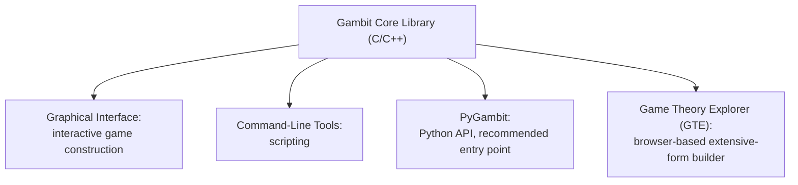

## Game Theory Software and Solvers


### Overview

Computational tools for game theory range from general-purpose academic solvers that compute Nash equilibria for arbitrary finite games, to specialized research libraries built around a single class of game (iterated Prisoner's Dilemma tournaments, extensive-form poker solving), to general-purpose scientific-computing libraries that happen to include a game-theory module. This entry surveys the principal tools currently in active use, their intended scope, and the classes of problem each is and is not suited to solve.

### Gambit: The General-Purpose Standard

**Key Points**

- **Gambit** is the most established general-purpose software package for computation in game theory, with roots dating to the mid-1980s at the California Institute of Technology, and remains under active development, with development support in recent years from the University of East Anglia and, since September 2023, the Alan Turing Institute's "Automated analysis of strategic interactions" project.
- Gambit supports both **normal-form (strategic-form)** and **extensive-form** finite games, and provides a suite of equilibrium-computation algorithms rather than a single method, since different algorithms are better suited to different game structures and sizes.
- Gambit is distributed as **Free/Open Source software** under the GNU General Public License, and offers a graphical interface (for interactively constructing games and building intuition on small examples), a command-line interface (for scripting), and a Python extension.
- The recommended installation path for most newcomers is the **PyGambit** Python package, installed via `pip install pygambit`, with tutorial Jupyter notebooks and a complete API reference provided in the accompanying documentation.



**Example**

A minimal PyGambit workflow for constructing and solving a normal-form Prisoner's Dilemma involves creating a `Game` object with the strategic-form payoff table (each player's cooperate/defect strategies and the associated payoffs), then invoking one of Gambit's equilibrium-computation methods on that game object, which returns the computed Nash equilibrium or equilibria — in the Prisoner's Dilemma case, the unique equilibrium where both players defect. The library's extensive-form support additionally allows specifying a game tree directly, with decision nodes, information sets (to represent imperfect information), and chance nodes, matching the same formal structures introduced in the war-bargaining and security-games entries of this course.

### Game Theory Explorer (GTE)

**Key Points**

- **Game Theory Explorer** is a graphical, browser-based interface built as part of the Gambit Project, designed specifically to let users interactively construct small-to-medium extensive-form and strategic-form games and compute their equilibria without writing code, making it particularly well suited to classroom teaching contexts.
- GTE's original implementation used a Flash/ActionScript client communicating with a server-side solving backend; as with any browser-based teaching tool built on now-deprecated web technologies, the currently accessible deployment and interface details should be verified directly rather than assumed to match older documentation. [Unverified — Claude's search did not confirm the current, actively maintained deployment status or interface technology of GTE as of this response, since available sources describe the tool's architecture without a clear recent confirmation of it]

### Nashpy: A Lightweight Python Library for Two-Player Games

**Key Points**

- **Nashpy** is a Python library scoped specifically to computing equilibria in **two-player** games, positioned by its own documentation as a lighter-weight, pure-Python alternative to Gambit for this restricted but common case, rather than a full replacement for Gambit's broader $n$-player and extensive-form capabilities.
- Installation is via `pip install nashpy`. A game is represented directly as a pair of payoff matrices (one per player), passed to a `nash.Game` constructor, with each player's payoff matrix expressed as a NumPy array or nested list.
- Nashpy's primary equilibrium-computation method is **support enumeration**, which systematically searches over possible supports (subsets of strategies played with positive probability) for each player, checking each candidate support pair for a valid Nash equilibrium — a complete but combinatorially scaling method appropriate for the small strategy spaces typical of textbook and teaching examples.

**Example**

```python
import nashpy as nash

A = [[1, 2], [3, 0]]
B = [[0, 2], [3, 1]]
game = nash.Game(A, B)

for eq in game.support_enumeration():
    print(eq)
```

This returns each Nash equilibrium found via support enumeration as a pair of strategy vectors — in this example, two pure-strategy equilibria and one mixed-strategy equilibrium, illustrating that a single game can have multiple, formally valid equilibria, exactly the equilibrium-selection ambiguity discussed in the coordination-game contexts of the international-relations entry.

### Axelrod-Python: Iterated Prisoner's Dilemma Tournament Library

**Key Points**

- **Axelrod-Python** is a specialized research library scoped specifically to the study of the **Iterated Prisoner's Dilemma (IPD)**, providing a large, community-contributed library of pre-implemented strategies (ranging from simple deterministic rules like Tit-for-Tat and Grim Trigger to complex memory-based or machine-learning-derived strategies) alongside tournament- and match-running infrastructure.
- The library allows users to run pairwise matches or full round-robin tournaments among selected strategies, track cumulative and per-round payoffs, and visualize results (e.g., using "sparkline" representations where cooperation and defection are rendered as solid blocks and gaps respectively), directly supporting empirical, simulation-based study of the repeated-game cooperation dynamics discussed in the international-relations entry (the Folk Theorem, trigger strategies, the shadow of the future).
- Because Axelrod-Python is scoped narrowly to the (possibly noisy or probabilistically ended) iterated Prisoner's Dilemma rather than arbitrary extensive- or normal-form games, it is best understood as complementary to, rather than a substitute for, general solvers like Gambit or Nashpy: it is the appropriate tool specifically when the research question concerns repeated-game strategic dynamics and empirical tournament performance, not general equilibrium computation for an arbitrary game structure.

### Other Specialized and Historical Tools

**Key Points**

- **PyNFG** is a Python package specifically for modeling and solving **Network Form Games**, a distinct extensive-form-like representation particularly suited to games with explicit graphical/network dependency structure among decision nodes.
- **lrslib** is a C implementation of a reverse-search algorithm, with modules specifically for Nash equilibrium computation via vertex enumeration of the relevant polytopes — a lower-level, algorithmically specialized tool more commonly used as a computational backend or for research into equilibrium-computation algorithms themselves than as an end-user application.
- **SageMath's game theory module** provides game-theoretic computation (including normal-form game construction and equilibrium-finding) integrated within the broader SageMath open-source mathematics system, useful when game-theoretic computation needs to be combined directly with other symbolic or numerical mathematics already being performed in a SageMath (or CoCalc-hosted) environment.

### Solvers for Extensive-Form Imperfect-Information Games

**Key Points**

- Beyond general-purpose normal-form and small extensive-form solvers, specialized solving techniques are used for large, imperfect-information extensive-form games (the class of game underlying poker and similar sequential, hidden-information settings), building on the **Counterfactual Regret Minimization (CFR)** family of algorithms introduced in the Multi-Agent Systems entry.
- Gambit itself provides extensive-form support suitable for small-to-medium imperfect-information games (as illustrated in published research using Gambit's GUI to construct and solve games such as Kuhn poker, a simplified three-card poker variant used as a standard pedagogical and research benchmark), but production-scale poker-solving systems (e.g., the Libratus and Pluribus research systems) rely on custom, highly optimized CFR implementations rather than general-purpose solvers, since the information-set counts involved in full-scale poker variants vastly exceed what general tools like Gambit are designed to handle efficiently.

### Choosing a Tool: Comparative Summary

| Tool | Scope | Best Suited For |
| --- | --- | --- |
| Gambit / PyGambit | General finite games: normal-form and extensive-form, $n$-player | Full-featured research and teaching; the default general-purpose choice |
| Game Theory Explorer | Small-to-medium extensive/strategic-form games | Interactive, code-free classroom construction and solving |
| Nashpy | Two-player normal-form games | Lightweight Python scripting, teaching, quick equilibrium checks |
| Axelrod-Python | Iterated Prisoner's Dilemma specifically | Repeated-game / cooperation-dynamics research and tournaments |
| PyNFG | Network form games | Games with explicit graphical dependency structure |
| lrslib | Equilibrium computation via vertex enumeration | Low-level algorithmic research, computational backend use |
| SageMath game theory module | Normal-form games within a broader math environment | Combining game-theory computation with other symbolic/numeric math |
| Custom CFR implementations | Large imperfect-information extensive-form games | Production-scale poker-style solving (research systems, not general tools) |

### Practical Setup: A Typical Research Workflow

**Key Points**

- For coursework or small research problems involving general finite games (arbitrary player count, mixed normal/extensive form), installing **PyGambit** (`pip install pygambit`) and working through its tutorial notebooks is the standard recommended starting point.
- For a narrowly scoped two-player normal-form equilibrium check, **Nashpy** offers a lower-overhead alternative with a simpler installation and API surface.
- For repeated-game, tournament-style experimentation (testing strategies against a large library of established IPD strategies), **Axelrod-Python** is purpose-built and avoids re-implementing well-known reference strategies from scratch.
- For teaching contexts where students should build and visualize games interactively without programming, **Game Theory Explorer** or Gambit's own graphical interface are the appropriate choice, reserving PyGambit's scripting interface for when programmatic, reproducible, or larger-scale computation is required.

### Conclusion

No single tool covers the entire landscape of game-theoretic computation: Gambit functions as the general-purpose standard capable of handling arbitrary finite normal- and extensive-form games and remains under active institutional development, while Nashpy and Axelrod-Python trade generality for a lighter-weight, more specialized fit to two-player equilibrium computation and iterated-Prisoner's-Dilemma tournament research respectively. Selecting the appropriate tool is primarily a matter of matching the software's intended scope (general finite games, two-player-only, or a single specific repeated game) to the actual research or teaching question, rather than assuming a single package suffices for every game-theoretic computation task.

**Related Topics**

- Nash Equilibrium Computation Algorithms (Support Enumeration, Lemke-Howson)
- Counterfactual Regret Minimization and Extensive-Form Solving
- Iterated Prisoner's Dilemma and Repeated-Game Strategy Design
- Extensive-Form Game Representation and Information Sets
- Open-Source Scientific Computing Ecosystems (SageMath, NumPy)
- Reproducible Computational Research Workflows in Game Theory