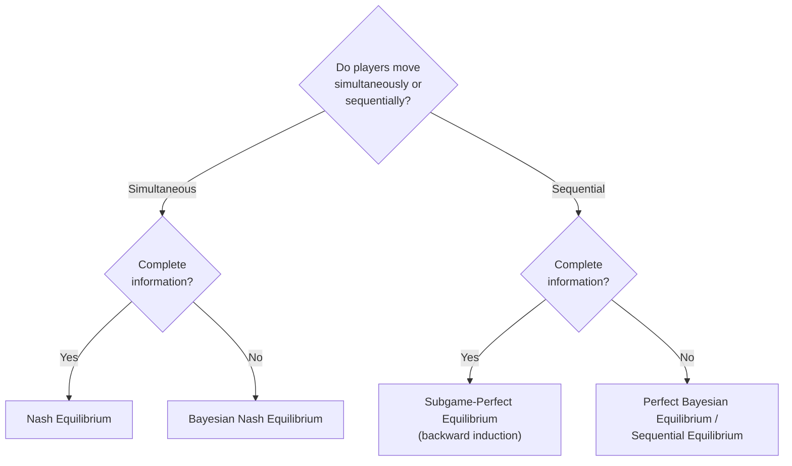
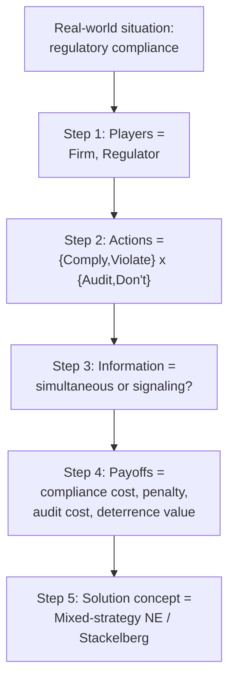

## Modeling Real-World Strategic Situations

### Overview

Applying game theory to a real-world situation is fundamentally a **modeling** exercise, not merely a computational one: before any equilibrium can be computed, the analyst must translate a messy, ambiguous real-world interaction into a formal game — deciding who the players are, what actions are available to them, what information each player has at each decision point, and how outcomes translate into payoffs. This entry synthesizes the modeling methodology implicit across the applications covered elsewhere in this course (voting, war bargaining, security games, blockchain incentive design) into an explicit, reusable workflow, and highlights the most common pitfalls that cause a formal model to mischaracterize the situation it was built to represent.

### Step 1: Identifying the Players

**Key Points**

- The first modeling decision is delimiting the **player set**: who has agency and independently makes decisions that affect the outcome? This is often less obvious than it appears — a "state" in an international-relations game is a simplifying abstraction over many internal actors (executive, legislature, military, public opinion), and whether that abstraction is appropriate depends on the specific question being asked.
- **Unitary-actor assumptions** (treating an organization, state, or firm as a single decision-maker with coherent, consistent preferences) are a standard simplification, explicitly used, for example, in the basic bargaining-model-of-war framework covered elsewhere in this course, but this assumption is itself a modeling choice with consequences: two-level games (also covered in the international-relations entry) exist precisely because the unitary-actor assumption breaks down when domestic ratification constraints materially affect the analysis.
- A common error is **omitting a relevant player** whose actions materially affect the outcome (e.g., modeling a two-firm price-competition game while ignoring the regulator whose enforcement decisions shape both firms' incentives) or, conversely, **including too many players**, needlessly complicating the model when several parties' interests and information are functionally identical and could be merged into a single representative player.

### Step 2: Specifying the Action Space

**Key Points**

- Once players are identified, each player's available **actions** (or, in a dynamic game, the full **strategy space** — a complete contingency plan specifying an action for every possible information state the player might find themselves in) must be specified.
- A critical distinction is between a **discrete/finite action space** (candidate choice in an election, cooperate/defect in a Prisoner's Dilemma) and a **continuous action space** (a platform position on a policy line, as in the Median Voter Theorem; a bid amount in an auction), since this choice determines which solution techniques and solvers (see the Game Theory Software and Solvers entry) are applicable — discrete finite games admit support-enumeration or linear-programming solution methods, while continuous action spaces typically require calculus-based first-order-condition analysis or specialized continuous-game solvers.
- Real-world action spaces are frequently richer than a stylized model captures; the modeling task is to identify which simplification of the true, effectively unbounded action space (e.g., "raise tariffs" collapsed to a binary choice, rather than a continuous tariff-rate choice) still captures the strategically relevant structure of the actual decision, without discarding a distinction that materially changes which outcomes are reachable.

### Step 3: Determining the Information Structure

**Key Points**

- The **information structure** — what each player knows, and when, relative to other players' moves — is frequently the single most consequential modeling decision, since it determines whether the appropriate solution concept is a simple Nash equilibrium (simultaneous-move, complete information), a subgame-perfect equilibrium (sequential-move, complete information, solved via backward induction), or a Bayesian/perfect Bayesian equilibrium (incomplete information, requiring explicit beliefs over types).
- **Complete vs. incomplete information**: does each player know the other players' payoffs (or "types," e.g., a state's true military resolve, discussed in the war-bargaining entry) with certainty, or only a probability distribution over possible types? Incomplete-information models require specifying a prior probability distribution over types and checking that the resulting equilibrium concept (e.g., a signaling-game separating or pooling equilibrium) is internally consistent via Bayes' rule updating.
- **Perfect vs. imperfect information**: in a sequential (extensive-form) game, does each player observe all previous moves before acting (perfect information, as in chess), or are some previous moves hidden (imperfect information, represented via information sets, as in poker or in a Stackelberg security game where the attacker cannot directly observe which specific patrol pattern was realized on a given day, only the underlying mixed strategy)?
- Misspecifying the information structure is one of the most common sources of a model producing predictions that are qualitatively wrong rather than merely imprecise: treating a genuinely sequential, observable interaction as simultaneous-move (or vice versa) can produce a different equilibrium concept entirely and a materially different predicted outcome, exactly as the Stackelberg-versus-Nash distinction in the Security Games entry demonstrates.

### Step 4: Constructing Payoffs

**Key Points**

- Payoffs must represent each player's **von Neumann-Morgenstern utility**, not merely a raw, observable outcome measure (money, vote share, territory) — this distinction matters because utility is meant to capture risk attitudes and relative valuation, and mixed-strategy equilibrium computation specifically relies on expected-utility comparisons being meaningful, not just expected raw-outcome comparisons.
- **Ordinal vs. cardinal payoffs**: some solution concepts (pure-strategy Nash equilibrium in a game with no relevant randomization) require only an ordinal ranking of outcomes for each player, while others (any equilibrium involving mixed strategies, or any expected-utility calculation under uncertainty, as in the bargaining-model-of-war expected-payoff calculations) require cardinal payoffs capturing relative magnitudes of preference, not merely ranking.
- A frequent real-world modeling difficulty is that payoffs for genuinely important dimensions (reputation, political capital, existential risk) are inherently hard to quantify cardinally; the standard practice is to use a stylized, simplified payoff structure that preserves the qualitatively important strategic trade-offs (e.g., the ordering of temptation, reward, punishment, and sucker payoffs that defines a Prisoner's Dilemma) even where the exact cardinal values are uncertain or contested, since many qualitative equilibrium predictions are robust to the exact payoff values as long as the relevant payoff *orderings* and *inequalities* are preserved.

### Step 5: Choosing a Solution Concept

**Key Points**

- Once players, actions, information, and payoffs are specified, the choice of **solution concept** should follow from the modeling decisions already made, not be selected independently: a one-shot, simultaneous-move, complete-information game calls for Nash equilibrium; a repeated version of the same game calls for consideration of the Folk Theorem and trigger-strategy equilibria (as in the international-relations cooperation-theory entry); a game where one player can credibly commit first calls for a Stackelberg equilibrium rather than a simultaneous-move Nash equilibrium (as in the security-games entry).
- Where multiple equilibria exist (a common occurrence in coordination games and repeated games under the Folk Theorem), the modeling exercise is not complete until an **equilibrium-selection** argument is made — appealing to focal points (Schelling-style), evolutionary or learning-based refinement (which equilibria are dynamically stable under a plausible learning process, as discussed in the no-regret-learning material in the Multi-Agent Systems entry), or institutional detail that pins down which equilibrium is actually played.
- The modeler should explicitly distinguish between a **descriptive** goal (predicting what will actually happen, which may call for incorporating bounded rationality, as in the Quantal Response Equilibrium adaptation used in real-world security-game deployments) and a **normative/design** goal (determining what mechanism would produce a desired outcome, which calls for mechanism-design reasoning rather than equilibrium analysis of a fixed, already-specified game).

### Common Modeling Pitfalls

**Key Points**

- **Conflating a game's payoff structure with its label.** Not every situation that "looks like" a Prisoner's Dilemma (mutual cooperation preferred to mutual defection, but each side individually tempted to defect) actually has that exact payoff ordering; misclassifying a Stag Hunt (where mutual defection is also a Nash equilibrium, making trust and coordination the central issue) as a Prisoner's Dilemma (where defection is dominant regardless of the other's play) leads to incorrect policy prescriptions, exactly the classification debate noted in the security-dilemma discussion of the international-relations entry.
- **Ignoring repeated-game effects when the real interaction is ongoing.** Treating an interaction that will genuinely recur (an alliance relationship, an ongoing regulatory relationship, a long-term business partnership) as a one-shot game discards the reputational and "shadow of the future" mechanisms that materially change which outcomes are sustainable in equilibrium, per the Folk Theorem logic covered in the cooperation-theory material.
- **Assuming common knowledge of rationality or of the game's structure itself when this is empirically doubtful.** Classical equilibrium concepts generally assume that the game's structure is common knowledge among the players (not merely known, but known to be known, and so on); real-world strategic situations frequently involve genuine ambiguity, not just about payoffs, but about what game is even being played, a complication that behavioral and bounded-rationality extensions (QRE, level-k reasoning) are specifically designed to address.
- **Treating a static model as though its predictions are invariant to changes in the underlying environment.** A number of the applications covered elsewhere in this course (Duverger's Law under different electoral rules, coalition stability under different institutional investiture rules, MEV extraction under different proposer-builder-separation designs) illustrate that a game's equilibrium is frequently highly sensitive to institutional or rule-level details that a modeler must get right, not incidental features safely abstracted away.
- **Neglecting to check robustness to alternative modeling assumptions.** Because many of the modeling choices above (unitary-actor assumption, discrete-vs-continuous action space, specific payoff cardinalization) are simplifications rather than empirically settled facts, a well-executed applied analysis typically reports how sensitive its qualitative conclusions are to plausible alternative specifications, rather than presenting a single model's equilibrium as though it were an unconditional prediction.

### A Worked Modeling Example: From Situation to Formal Game

**Example**

Consider modeling a real-world regulatory-compliance situation: a firm decides whether to comply fully with an environmental regulation, and a regulator decides whether to audit the firm, with limited inspection resources.

1. **Players:** the firm and the regulator (a two-player model; whether to further disaggregate the regulator into distinct enforcement-agency sub-actors depends on whether their incentives are genuinely distinct for the question at hand).
2. **Actions:** firm chooses {Comply, Violate}; regulator chooses {Audit, Don't Audit} (a discrete action space, appropriate if compliance is treated as binary; a continuous compliance-effort variable would be needed if partial compliance is analytically important).
3. **Information:** if the regulator cannot observe compliance status before deciding whether to audit, this is a simultaneous-move game; if the regulator can observe some prior signal (e.g., self-reported disclosures) before deciding, a sequential, signaling-game structure is more appropriate, connecting directly to the private-information mechanisms in the war-bargaining entry.
4. **Payoffs:** the firm saves compliance costs by violating but risks a penalty if audited and caught; the regulator incurs audit costs but values catching violations (deterrence value) and-or genuinely values compliance outcomes on their own terms — this payoff structure is the classic **Inspection Game**, a well-studied game class with a mixed-strategy equilibrium in which neither the firm's compliance decision nor the regulator's audit decision is deterministic, precisely because a deterministic policy on either side is exploitable by the other, mirroring the mixed-strategy security-game logic covered earlier in this chapter.
5. **Solution concept:** because this is most naturally a simultaneous-move (or, if sequential, still a game with a mixed-strategy structure due to unobserved compliance), a mixed-strategy Nash equilibrium (or a Stackelberg equilibrium if the regulator can credibly commit to a randomized audit policy first, as in the Security Games entry) is the appropriate solution concept.

### Validating a Model Against Reality

**Key Points**

- A formal model's value is ultimately judged by whether its qualitative predictions (which comparative statics hold — e.g., "higher audit costs should reduce equilibrium audit frequency but increase equilibrium violation frequency," a testable, falsifiable implication of the inspection-game mixed-strategy equilibrium) are consistent with observed real-world patterns, not merely by the internal mathematical consistency of the equilibrium computation.
- Where possible, comparing a model's predictions against **natural experiments or observed policy variation** (e.g., comparing audit and compliance rates across jurisdictions with different penalty levels) is the standard empirical validation strategy, directly analogous to how comparative-politics research tests coalition-stability and Duverger's-Law predictions against cross-national electoral data.
- When a model's predictions are systematically inconsistent with observed behavior, the appropriate response is usually to revisit the modeling assumptions from Steps 1-4 above (is the information structure right? are the payoffs capturing the actually-relevant incentives? is a bounded-rationality solution concept more appropriate than perfect-rationality Nash equilibrium?) rather than to conclude that game-theoretic modeling is inapplicable to the situation.

### Conclusion

Modeling a real-world strategic situation is a disciplined act of simplification: the analyst must make explicit, defensible choices about who the players are, what they can do, what they know and when, and how outcomes map to their preferences, before any equilibrium computation is meaningful. The applications covered throughout this course — from Condorcet's Paradox to MEV extraction to AI safety debate protocols — each represent a worked instance of this same underlying methodology, and the most common source of a misleading formal analysis is not an error in equilibrium computation but a mismatch between the formal model's structure (unitary actors, information timing, payoff assumptions) and the real strategic situation it purports to represent.

**Related Topics**

- Extensive-Form vs. Normal-Form Game Representation
- Bayesian Games and Incomplete-Information Modeling
- The Inspection Game and Mixed-Strategy Equilibria
- Behavioral Game Theory and Bounded Rationality (QRE, Level-k)
- Mechanism Design as a Normative Modeling Approach
- Comparative Statics and Empirical Validation of Game-Theoretic Models
- Schelling Points and Equilibrium Selection