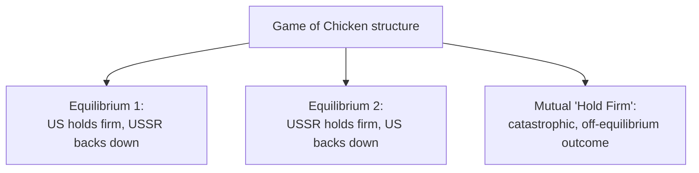

## Case Studies in Applied Game Theory

### Overview

This entry compiles a set of well-documented, historically significant case studies where formal game-theoretic analysis was explicitly applied to a real-world strategic situation, either to explain observed behavior after the fact or to directly guide decision-making. Each case study is chosen to illustrate a distinct point in the modeling methodology covered in the previous entry, and to connect back to specific theoretical results developed throughout this course — bargaining theory, mechanism design, repeated games, and Stackelberg equilibrium.

### Case Study 1: The Cuban Missile Crisis as a Game of Chicken

**Key Points**

- The 1962 Cuban Missile Crisis is one of the most extensively analyzed real-world events in the applied-game-theory literature, most famously in political scientist Graham Allison's 1971 study *Essence of Decision*, which explicitly contrasted a rational-actor game-theoretic model against organizational-process and bureaucratic-politics alternative explanations for the same historical events.
- The core standoff (Soviet missile deployment in Cuba versus a US naval blockade and ultimatum) is frequently modeled as a **Game of Chicken**: each side prefers the other back down, both sides prefer mutual backing-down to mutual escalation to nuclear war, but each side's worst outcome is being the one who backs down while the other holds firm — a payoff structure distinct from a Prisoner's Dilemma because unlike PD, Chicken has **two pure-strategy Nash equilibria** (one side holds firm while the other yields), rather than a single dominant-strategy equilibrium.

|  | USSR: Back Down | USSR: Hold Firm |
| --- | --- | --- |
| **US: Back Down** | (2, 2) | (1, 3) |
| **US: Hold Firm** | (3, 1) | (0, 0) |

- This payoff structure directly illustrates the equilibrium-selection problem discussed in the modeling-methodology entry: the game has multiple equilibria, so the interesting theoretical question is not merely "what is an equilibrium" but which mechanism (commitment devices, resolve signaling, brinkmanship) determined which of the two asymmetric equilibria was actually realized — connecting directly to the credible-commitment and costly-signaling logic developed in the war-bargaining-models entry (e.g., Thomas Schelling's own contemporaneous analysis of the crisis emphasized "the threat that leaves something to chance," a form of intentionally relinquished control used as a credibility-enhancing commitment device).
- Allison's broader methodological point — that the same historical events can be given a coherent rational-actor game-theoretic account, but also a materially different account under organizational-process or bureaucratic-politics models — is itself a standard caution cited in applied political-science methodology: formal game-theoretic modeling is one lens among several, and its predictions should be checked against, not assumed to dominate, alternative explanatory frameworks. [Inference — this methodological caution is Allison's own explicit framing in the original study, not merely Claude's own qualification]

### Case Study 2: FCC Spectrum Auctions and Mechanism Design

**Key Points**

- Beginning in 1994, the US Federal Communications Commission (FCC) adopted **auction-based mechanisms** to allocate radio spectrum licenses to telecommunications firms, replacing earlier allocation methods (comparative hearings and lotteries) that had proven slow, subject to gaming, or economically inefficient.
- The **Simultaneous Multiple-Round Auction (SMRA)**, designed with substantial input from academic auction theorists (notably Paul Milgrom and Robert Wilson, whose broader auction-theory contributions were recognized with the 2020 Nobel Memorial Prize in Economic Sciences), was specifically engineered to address the **interdependent-value problem**: because spectrum licenses in different geographic regions can be complementary (a firm may specifically want a contiguous set of regional licenses to build a national network, making the combined value of several licenses together greater than the sum of their individual values), a naive sequential or simple sealed-bid auction risks an "exposure problem," where a bidder who wins only some of a complementary package overpays relative to the value of the partial package actually won.
- The SMRA format's design — simultaneous, multi-round bidding with information revealed about current standing bids across all licenses at once — was a direct, deliberate application of mechanism-design principles to solve a specific incentive problem (the exposure problem, and more broadly, sincere/efficient price discovery across interdependent goods) identified by economic theory before the auction was ever run, making it a rare, well-documented example of formal game theory driving policy design ex ante, rather than only explaining outcomes ex post. [Inference — the specific attribution of design credit and the precise mechanism details reflect the standard account in auction-theory and policy literature describing the FCC auction program's origins, and Claude's knowledge of the auction design's most current form and subsequent refinements (e.g., later incentive auctions) may be incomplete without a current search]

### Case Study 3: Nuclear Deterrence and the Logic of Mutually Assured Destruction

**Key Points**

- Cold War nuclear strategy is a canonical applied domain for the **deterrence-game** framework introduced in the international-relations entry: the credibility problem for a second-strike retaliatory threat (would a rational leader, once already devastated by a first strike, truly choose to retaliate and further destroy the world, or would rational calculation favor restraint after the fact?) is a textbook instance of the backward-induction credibility problem.
- **Mutually Assured Destruction (MAD)** as a strategic doctrine was explicitly designed, in game-theoretic terms discussed extensively by Cold War-era strategists including Thomas Schelling and Herman Kahn, to remove the credibility problem by engineering a retaliatory capability that did not depend on a rational, deliberate decision at the moment of retaliation — for example, through automated or delegated response systems, or through simply ensuring second-strike capability was so assured and overwhelming that the *expectation* of automatic retaliation, rather than a case-by-case rational recalculation, governed the adversary's expectations.
- This case connects directly to the **commitment-problem** mechanism identified in the bargaining-models-of-war entry: a threat that requires a rational actor to actually carry out a self-destructive action, after the point where deterrence has already failed, is not credible under simple backward induction; the strategic innovation of Cold War deterrence theory was engineering commitment devices (redundant, hardened, and in some doctrines explicitly automated retaliatory systems) that made the threat's execution a near-certainty independent of contemporaneous rational recalculation, addressing the credibility gap directly rather than relying on an adversary's naive trust.

### Case Study 4: eBay and Vickrey-Style Second-Price Auction Design

**Key Points**

- Online marketplace auction design (most prominently studied in the economics literature via eBay's original proxy-bidding mechanism) is frequently analyzed through the lens of the **Vickrey (second-price sealed-bid) auction**, a mechanism in which the highest bidder wins but pays only the second-highest bid, a design proven by William Vickrey to make **truthful bidding a weakly dominant strategy** for every bidder, directly connecting to the incentive-compatibility concepts introduced in the Multi-Agent Systems and blockchain-cryptoeconomics entries.
- eBay's proxy-bidding system (where a bidder specifies a maximum willingness-to-pay, and the system automatically bids incrementally on the bidder's behalf up to that maximum) approximates a second-price auction in intent, though empirical research on eBay auctions has documented that in practice, actual bidder behavior deviates from the pure dominant-strategy prediction in specific, systematic ways — most notably, **late bidding ("sniping")**, where bidders strategically delay their true-value bid until the very last moments of a fixed-end-time auction.
- The empirical prevalence of sniping is itself explained game-theoretically: in an auction with a hard, fixed end time (rather than eBay's later "automatic extension" alternative used on some platforms), late bidding can be a rational response to the presence of **naive or incremental bidders** (who might revise their own bid upward in response to observing an earlier bid, rather than bidding their true maximum value immediately) or to avoid revealing private information (about one's own valuation) to rival bidders who might use it to inform their own subsequent bidding, illustrating that a mechanism's theoretical dominant-strategy property can be practically undermined by realistic departures from the idealized private-values, fully rational-bidder assumptions the original theorem relies on. [Inference — the specific behavioral explanations for eBay sniping reflect a body of empirical auction-theory research analyzing this platform, and the current prevalence and platform-specific mechanics (e.g., whether automatic extension features remain in their originally studied form) may have changed since the original studies were conducted]

### Case Study 5: OPEC as a Cartel and the Repeated-Game Stability Problem

**Key Points**

- The Organization of the Petroleum Exporting Countries (OPEC) is a standard applied case for **cartel stability** analysis, modeled as a repeated game among oil-producing member states who could, in principle, jointly maximize profit by restricting output (acting as a coordinated monopolist), but where each individual member has a unilateral incentive to **cheat** by producing above its agreed quota, since the marginal member's own output decision has a negligible effect on the world price while directly increasing that member's own revenue — a structure directly analogous to the Prisoner's Dilemma and self-enforcing-coalition-stability logic covered in the climate-negotiations entry.
- OPEC's observed historical periods of both successful output-restriction discipline and periods of quota-cheating and price collapse are frequently explained using the same **Folk Theorem / trigger-strategy** logic introduced in the international-relations cooperation-theory entry: cartel discipline is best sustained when monitoring of actual member output is more reliable (higher probability of detecting a deviation) and when members are more patient (a higher effective discount factor, often linked to expectations of a long, stable relationship among the same set of producing states), while periods of low oil prices or high demand volatility have historically coincided with observed breakdowns in quota discipline, consistent with the theoretical prediction that cartel stability is fragile precisely when the short-term temptation to cheat is highest relative to the discounted value of continued cooperation. [Inference — this is a standard economic explanation applied to OPEC's observed historical behavior, but attributing any specific historical price-collapse episode to a single, cleanly identified game-theoretic cause versus other contributing economic and geopolitical factors is a matter of ongoing empirical debate among energy economists, and current OPEC dynamics should be checked directly rather than assumed static]

### Comparative Summary of Case Studies

| Case Study | Primary Game-Theoretic Concept Illustrated | Theoretical Connection |
| --- | --- | --- |
| Cuban Missile Crisis | Game of Chicken; multiple equilibria; brinkmanship | Bargaining/commitment problems (war-bargaining entry) |
| FCC Spectrum Auctions | Mechanism design; exposure problem; auction design | Auction theory, incentive compatibility |
| Nuclear Deterrence (MAD) | Credible commitment; backward-induction credibility problem | Commitment problems (war-bargaining entry) |
| eBay Auctions | Vickrey second-price auction; dominant-strategy incentive compatibility | Mechanism design; behavioral departures from theory |
| OPEC Cartel | Repeated-game cartel stability; Folk Theorem; trigger strategies | Cooperation theory (international-relations entry) |

### Methodological Lessons Across the Case Studies

**Key Points**

- **Formal models illuminate mechanisms, not certainties.** Each case study above uses game theory to identify *why* a particular strategic logic operates (credibility problems in deterrence, exposure problems in interdependent-value auctions, the temptation-to-cheat mechanism in cartels), rather than to generate a single deterministic prediction that overrides all other historical or institutional detail — Allison's explicit multi-model contrast in the Cuban Missile Crisis case is the clearest illustration of this point.
- **Successful applied game theory frequently requires engineering the game, not just analyzing a pre-existing one.** The FCC spectrum-auction case is distinctive precisely because economists were asked to *design* the rules of engagement (the mechanism) to achieve a desired policy outcome, rather than merely modeling an already-existing, naturally occurring strategic interaction — the mechanism-design mode of applied game theory, versus the purely descriptive mode used in most of the other case studies here.
- **Theoretical predictions (e.g., dominant-strategy truthful bidding) can be empirically undermined by real-world departures from idealized assumptions.** The eBay sniping case demonstrates that a mechanism's formally proven incentive-compatibility property is a claim about behavior *under the model's stated assumptions*, and real bidders' actual behavior is an empirical question that can and should be checked against the theoretical prediction rather than simply assumed to hold.

### Conclusion

These case studies collectively demonstrate the range of applied game theory's practical use: as a retrospective analytical lens for understanding historical crises (Cuban Missile Crisis, nuclear deterrence doctrine), as an active, prescriptive design tool for engineering policy mechanisms (FCC spectrum auctions), and as a framework for explaining both the successes and empirically documented departures from prediction observed in real markets and institutions (eBay auctions, OPEC cartel discipline). Across all five cases, the recurring theoretical threads — credible commitment, mechanism design for incentive compatibility, and repeated-game cooperation sustained by the shadow of the future — connect directly back to the formal theory developed throughout the earlier chapters of this course, illustrating that the value of the formal apparatus lies precisely in its capacity to be redeployed, with appropriate modeling care, across an unusually broad range of substantively unrelated real-world domains.

**Related Topics**

- Brinkmanship and Costly Commitment in Crisis Bargaining
- Auction Theory and the Exposure Problem in Combinatorial Auctions
- Vickrey-Clarke-Groves Mechanisms and Incentive Compatibility
- The Folk Theorem and Cartel Stability
- Behavioral Departures from Dominant-Strategy Predictions
- Modeling Real-World Strategic Situations (methodology)
- Nobel Memorial Prize-Winning Contributions to Game Theory and Market Design