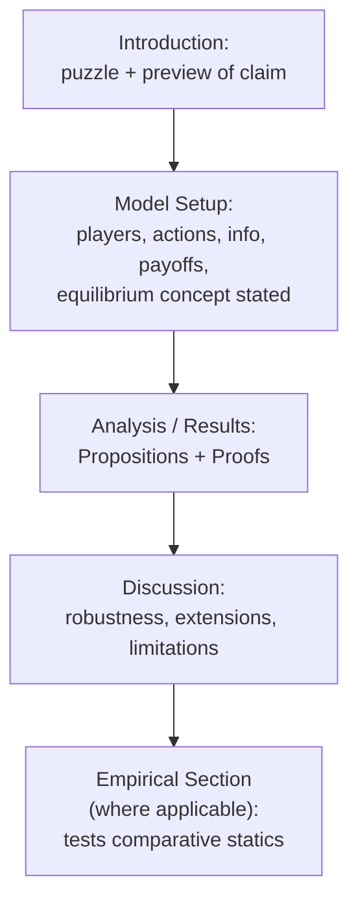

## Reading and Analyzing Research Papers

### Overview

Game theory research papers follow a distinctive set of structural and notational conventions that differ somewhat across the field's subdisciplines (pure economic theory, computer science/algorithmic game theory, political science applications). Reading such a paper efficiently and critically requires recognizing this structure, knowing which sections carry the paper's actual novel contribution, and applying a specific set of technical and conceptual checks to assess whether a claimed equilibrium result, mechanism, or empirical claim is well-supported. This entry provides a practical methodology for approaching the primary literature referenced implicitly throughout this course (Fearon 1995, Baron and Ferejohn 1989, Milgrom and Wilson's auction-design work, and similar sources).

### Typical Structure of a Game-Theoretic Paper

**Key Points**

- **Introduction and motivation:** states the substantive puzzle or empirical regularity the paper addresses (e.g., Fearon's framing of "why do rational states fight costly wars when a mutually preferable bargain always exists"), situates the paper relative to prior literature, and previews the paper's core theoretical or empirical claim, typically without yet presenting the formal model.
- **Model setup:** the formal core of the paper — players, action/strategy spaces, information structure, timing (the extensive-form sequence of moves), and payoff functions are defined precisely, usually accompanied by an explicit statement of the equilibrium concept the paper will use (Nash, subgame-perfect, Bayesian Nash, perfect Bayesian, etc.).
- **Analysis / results:** the paper derives and states its main theoretical results, typically as formally numbered **propositions, lemmas, or theorems**, each followed immediately or in an appendix by a **proof**. In applied (rather than purely theoretical) papers, this section may instead or additionally present comparative statics — how the equilibrium changes as a model parameter varies — which frequently constitutes the paper's most substantively interesting and empirically testable content.
- **Discussion / extensions:** explores robustness of the main result to alternative modeling assumptions, connects the formal result back to the original substantive motivation, and often explicitly notes the model's limitations — this section frequently signals which of the paper's assumptions the authors themselves regard as load-bearing versus incidental.
- **Empirical section (where present):** particularly common in applied political-science and economics papers (e.g., testing coalition-stability or Duverger's-Law predictions against cross-national data), presenting a research design intended to test the formal model's comparative-statics predictions against observed data, distinct from and subsequent to the purely theoretical derivation.

### Reading the Model Setup Critically

**Key Points**

- Before evaluating any result, verify that you can answer, from the model-setup section alone: who are the players; what is each player's action or strategy space; what does each player know, and when, relative to the others' moves; and what is each player's payoff as a function of the full action/strategy profile. If any of these four elements is unclear after a careful read, the ambiguity should be resolved before evaluating the paper's claimed results, since an imprecise model specification frequently signals an imprecise or under-specified result as well.
- Pay close attention to **stated versus implicit assumptions**. Published papers sometimes bury a consequential assumption in a parenthetical remark or a footnote (e.g., an assumption of risk-neutrality, a restriction to a specific parameter region, or a tie-breaking convention such as the Strong Stackelberg Equilibrium convention discussed in the Security Games entry) — these assumptions frequently determine whether the paper's headline result is general or is instead a special case.
- Identify the **equilibrium refinement** being used, and why. Many games admit multiple Nash equilibria; a paper's choice of a specific refinement (subgame-perfection, to rule out incredible off-path threats; a specific perfect-Bayesian-equilibrium refinement like the Intuitive Criterion, to rule out implausible off-path beliefs in a signaling game) is itself a substantive modeling choice, and understanding *why* a given refinement was invoked (usually to eliminate equilibria the authors regard as implausible or uninteresting) is necessary to correctly interpret what the paper's main result does and does not claim.

### Evaluating Propositions and Proofs

**Key Points**

- A **proposition** in a game-theory paper is a precise, usually conditional, mathematical claim (e.g., "if $\delta \geq \frac{T-R}{T-P}$, then cooperation is sustainable as a subgame-perfect equilibrium via a grim trigger strategy," per the Folk Theorem condition introduced in the international-relations entry) — the conditions attached to the proposition (the "if" clause) are as important as the conclusion, since a result that holds only under a narrow parameter restriction is a different, generally weaker claim than an unconditional result.
- Standard proof techniques worth recognizing on sight: **backward induction** (for extensive-form, complete-information games, working from terminal nodes toward the root); **verification of a fixed point / best-response consistency** (for Nash equilibrium existence or characterization, checking that each player's proposed strategy is indeed a best response to the others'); **Bayes' rule consistency checks** (for Bayesian/perfect Bayesian equilibria, verifying that posterior beliefs are correctly derived from priors and equilibrium strategies via Bayes' rule wherever the relevant information set is reached with positive probability); and **revelation-principle arguments** (common in mechanism-design papers, reducing the search over all possible mechanisms to a search over truthful, direct mechanisms, a technique that substantially simplifies many optimal-mechanism-design proofs).
- When a proof is relegated to an appendix (common in top economics and political-science journals to keep the main text readable), it is still worth at least skimming the appendix proof structure, since the specific step where an assumption is invoked (e.g., where single-peakedness is used in a proof of the Median Voter Theorem) often clarifies exactly why that assumption is necessary, which is valuable for understanding the result's robustness to relaxing it.

### Interpreting Comparative Statics

**Key Points**

- **Comparative statics** — how the equilibrium outcome changes as an exogenous parameter (a discount factor, a cost parameter, a distribution of types) varies — are frequently the paper's most practically useful and most falsifiable content, since they generate directional, testable predictions (e.g., "higher war costs should narrow the conditions under which private information alone can generate war," extending the bargaining-range logic from the war-bargaining entry).
- Distinguish a **comparative-static claim** (how the equilibrium changes as a parameter changes) from a **level claim** (what the equilibrium value is at a specific parameter value) — the former is generally the more robust and more frequently emphasized type of result in applied game-theoretic papers, since exact numerical predictions are usually far more sensitive to the specific (and often stylized) functional-form assumptions of the model than are directional (increasing/decreasing) predictions.
- Check whether a stated comparative static is a **global** result (holds for all admissible parameter values) or a **local** result (holds only in a neighborhood of a specific point, or only for interior/boundary solutions, or only under a specific parameter regime) — many published game-theoretic comparative-statics results are more narrowly scoped than an inattentive reading might suggest, and the paper's own stated proposition (not the prose discussion of it) is the authoritative source for the result's actual scope.

### Distinguishing Theoretical, Computational, and Empirical Claims

**Key Points**

- **Purely theoretical claims** (existence of an equilibrium, its characterization, comparative statics) are established via mathematical proof and should be evaluated on the internal logical validity of that proof and the plausibility of the model's assumptions — not on whether the paper's conclusion "feels" empirically correct, since a valid proof of a claim under stated assumptions is not falsified by contrary empirical intuition about a different, unmodeled situation.
- **Computational claims** (e.g., an algorithm's convergence to a Nash equilibrium, computational-complexity results about equilibrium-finding, benchmark performance of an equilibrium-computation method like those catalogued in the Game Theory Software and Solvers entry) should be evaluated on the correctness of the algorithm's derivation and, where empirical benchmarks are presented, on whether comparison conditions (baselines, computational budget, problem instances used) are fair and clearly specified.
- **Empirical claims** (e.g., testing whether observed coalition governments are disproportionately minimal-winning, per the legislative-coalition entry, or whether Duverger's Law holds across a cross-national dataset of electoral systems) should be evaluated using standard empirical-methodology criteria (identification strategy, robustness to alternative specifications, sample representativeness) largely independent of, though ideally motivated by, the paper's theoretical model — a common and important critical question is whether the paper's empirical test is actually a sharp, discriminating test of the specific theoretical mechanism claimed, or whether the same empirical pattern would be equally consistent with a competing, non-game-theoretic explanation.

### A Practical Checklist for Critical Reading

**Key Points**

- Can you restate the model's players, actions, information structure, and payoffs in your own words, without referring back to the paper's notation?
- Is the equilibrium concept explicitly stated, and do you understand why that specific concept (rather than a weaker or stronger alternative) was chosen for this game?
- For the paper's main proposition(s): what are the necessary conditions (parameter restrictions, tie-breaking conventions, functional-form assumptions) under which the result holds, and how essential do those conditions appear to the paper's substantive conclusion?
- If comparative statics are presented, are they global or local, and does the paper's prose discussion accurately represent the scope of the formally stated result?
- If an empirical test is presented, does it actually discriminate between the paper's proposed mechanism and plausible alternative explanations for the same observed pattern, or is it consistent with multiple competing theories?
- Does the discussion/extensions section identify which assumptions the authors themselves regard as essential versus merely simplifying, and are there follow-up papers (often citable via the same literature) that specifically test robustness to relaxing the most consequential of these assumptions?

### Conclusion

Reading a game-theoretic research paper productively requires moving beyond simply following the prose narrative to actively reconstructing the formal model (players, actions, information, payoffs, equilibrium concept), scrutinizing the conditions attached to each proposition rather than only its headline conclusion, and explicitly distinguishing theoretical, computational, and empirical claims, each of which warrants a different kind of critical evaluation. This disciplined reading practice — directly mirroring the model-construction methodology covered in the Modeling Real-World Strategic Situations entry, applied here in reverse to *deconstruct* someone else's published model — is the skill that makes it possible to correctly assess how far a given paper's result actually generalizes beyond its stated assumptions, and to accurately judge which of its claims are load-bearing for the substantive conclusions the paper (or a later popularization of it) draws.

**Related Topics**

- Equilibrium Refinements (Subgame Perfection, Perfect Bayesian Equilibrium, Intuitive Criterion)
- The Revelation Principle in Mechanism Design
- Comparative Statics Analysis in Formal Models
- Identification Strategies in Empirical Political Economy
- Modeling Real-World Strategic Situations (methodology)
- Case Studies in Applied Game Theory
- Writing and Presenting Formal Game-Theoretic Models