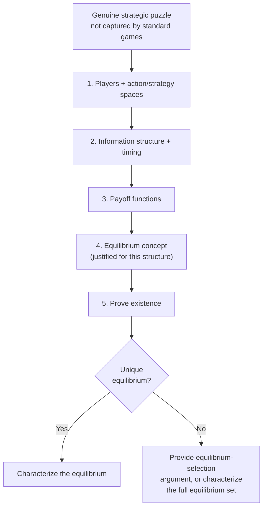
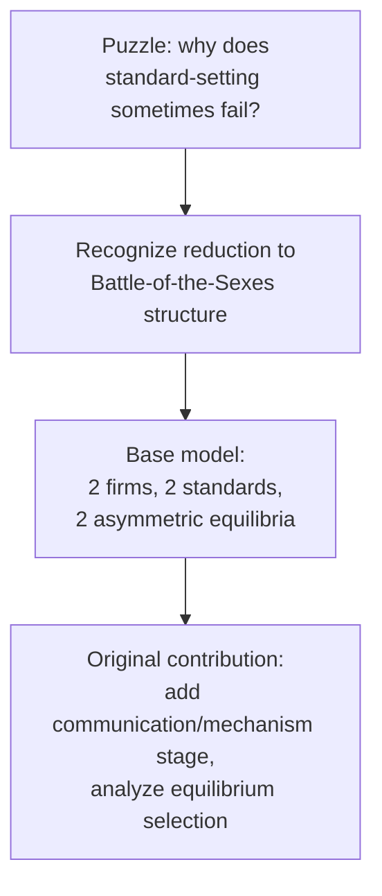

## Designing Original Game Models

### Overview

Designing an original game model — as opposed to applying an existing, published model to a new context — requires constructing a novel formal structure specifically to capture a strategic phenomenon not already well-represented by standard game forms (Prisoner's Dilemma, Stackelberg security game, Baron-Ferejohn bargaining, and so on). This is the generative counterpart to the deconstructive reading skill covered in the previous entry, and the modeling-methodology framework covered in the Modeling Real-World Strategic Situations entry: this entry focuses specifically on the additional craft involved in building a genuinely new model from scratch, including how to establish that a model's equilibrium exists and is well-characterized, and how to position an original contribution relative to existing published literature.

### Starting from a Genuine Strategic Puzzle

**Key Points**

- Original model design should begin from a **specific, well-articulated strategic puzzle** — an observed behavior, institutional pattern, or theoretical tension that existing standard models do not adequately capture — rather than from a desire to apply game theory for its own sake; the strongest original models in the literature (Fearon's bargaining model of war, Baron-Ferejohn's legislative bargaining model, Akerlof's market for lemons) each trace to a specific puzzle the existing toolkit did not resolve.
- A useful diagnostic question: can the puzzle be resolved by a straightforward relabeling of an existing standard game (e.g., recognizing that a novel-seeming coordination problem is structurally identical to a Stag Hunt), or does it require a genuinely new formal structure (a new information structure, a new action space, a new payoff-interdependency pattern) not captured by any standard game form? Most apparently novel strategic situations turn out, on careful analysis, to reduce to a known game class — this is not a failure of originality but a sign that the existing theoretical toolkit can be directly applied, which is itself valuable and should not be discarded in favor of manufactured novelty.
- Where a genuinely new structure is warranted, it is good practice to explicitly identify **which specific element** of a standard model is inadequate for the puzzle at hand (the information structure, the number of players, the static-versus-repeated distinction, the discreteness of the action space) rather than redesigning the entire model wholesale, since isolating the specific point of departure clarifies exactly what the new model's incremental contribution actually is.

### The Design Sequence: Building the Formal Object

**Key Points**

- The design sequence mirrors, but goes one level deeper than, the modeling-methodology checklist covered previously: (1) specify players and their action/strategy spaces; (2) specify the information structure and timing (a normal-form/simultaneous-move representation, or an extensive-form game tree with explicit information sets); (3) specify payoffs as functions of the full strategy profile; (4) state the equilibrium concept to be used and justify why it is the appropriate one for this specific information/timing structure; (5) prove existence and characterize the equilibrium or equilibria.
- A critical, frequently underemphasized step unique to *original* model design (as opposed to applying an existing one) is verifying **equilibrium existence** before attempting to characterize its properties: for finite games, Nash's existence theorem guarantees at least one (possibly mixed-strategy) Nash equilibrium exists, but for games with continuous action spaces or non-compact strategy sets, existence is not automatic and must be separately established (typically via a fixed-point argument, such as an application of Kakutani's or Brouwer's fixed-point theorem to the players' best-response correspondences), since a model whose "equilibrium" does not actually exist under the stated assumptions is not a coherent contribution regardless of how interesting its intended qualitative story is.
- Once existence is established, the design process should explicitly check for **multiplicity**: does the model admit a unique equilibrium, or multiple equilibria? If multiple equilibria exist, the original contribution should include either an equilibrium-selection argument (a refinement criterion, a focal-point argument, or an evolutionary/learning-based justification, as discussed in the Multi-Agent Systems entry's coverage of no-regret learning dynamics converging to specific equilibrium sets) or an explicit acknowledgment that the model's contribution is characterizing the *set* of possible equilibria rather than pinning down a unique prediction.

### Choosing the Right Level of Abstraction

**Key Points**

- An original model should be built at the **minimum level of complexity** needed to generate the qualitative result of interest — adding players, action-space richness, or payoff parameters beyond what is strictly needed to produce the puzzle's core strategic tension typically makes the model harder to solve and characterize without adding genuine explanatory content, a discipline sometimes summarized as building the "smallest model that could possibly work."
- **Parsimony versus realism** is a genuine, unavoidable trade-off in original model design, not a problem to be engineered away: a model rich enough to capture every empirically relevant detail of the real situation is usually intractable to solve in closed form and difficult for a reader to build clear intuition from, while a maximally simple model risks omitting the very feature that generates the phenomenon being explained — the design skill lies in identifying the smallest set of features whose *interaction* is responsible for the puzzle, and building only those into the formal model.
- It is standard and appropriate practice to build a **baseline model** first (the simplest version capturing the core mechanism) and then present **extensions** that relax specific simplifying assumptions one at a time (e.g., moving from two players to $n$ players, from complete to incomplete information, from a one-shot to a repeated interaction) — this sequencing lets a reader see precisely which qualitative results are robust to which specific simplifications, directly supporting the robustness-checking practice recommended in the modeling-methodology entry.

### Establishing Novelty Relative to Existing Literature

**Key Points**

- Before finalizing an original model, a careful literature search is necessary to confirm the specific formal structure (or one close enough that the paper's contribution would need to be reframed as an extension rather than a new model) has not already been published — this is a standard, unavoidable step in academic game-theoretic modeling, since many apparently novel strategic structures have, in fact, already been formally analyzed under a different substantive framing (e.g., a novel-seeming platform-competition model may turn out to be formally isomorphic to an already-published spatial-voting model, given the structural parallels between the Median Voter Theorem and Hotelling-style spatial competition noted in earlier entries of this course).
- When a new model is closely related to existing published work, the clearest way to establish and communicate its contribution is to explicitly state which specific assumption of the prior model is being relaxed or altered (e.g., "unlike the baseline Baron-Ferejohn model, which assumes proposer recognition is exogenous and random, this model endogenizes proposer selection as a function of prior-period behavior") and to show precisely how the equilibrium characterization changes as a result — an original contribution framed this way is both easier for readers to evaluate and more clearly positioned relative to the field's existing theoretical toolkit.
- Genuinely novel action spaces, information structures, or payoff-interdependency patterns (rather than routine parameter or player-count generalizations of an existing model) constitute the strongest form of original contribution, but are also the hardest to execute correctly, since novel formal structures often surface unanticipated technical difficulties (non-existence of equilibrium under initially proposed payoff specifications, multiplicity problems requiring a new refinement argument) that a well-trodden model form would not.

### Common Pitfalls in Original Model Design

**Key Points**

- **Overfitting the payoff structure to force a desired conclusion.** It is possible to construct almost any payoff matrix that produces a chosen "predicted" equilibrium; a credible original model instead derives its payoff structure from independently plausible, substantively motivated assumptions (e.g., costs of production, verifiable institutional rules, or empirically observed preferences) and then reports whatever equilibrium those assumptions imply, rather than reverse-engineering the payoffs from the desired conclusion.
- **Neglecting off-equilibrium-path behavior.** In extensive-form games, a common design error is fully specifying on-path strategies and payoffs while leaving off-path beliefs and behavior underspecified or inconsistent, which can silently produce a model where the claimed equilibrium is not actually subgame-perfect (or perfect Bayesian) once off-path incentives are checked carefully — a discipline directly connected to the "verify best-response consistency at every information set" practice recommended in the paper-reading entry.
- **Conflating a model's descriptive and normative purposes.** A model designed to *predict* what self-interested agents will actually do (positive/descriptive analysis) requires a different payoff and rationality specification than a model designed to *prescribe* what mechanism a designer should build to achieve a target outcome (normative/mechanism-design analysis, as covered in several applications throughout this course); building a single model intended to serve both purposes simultaneously, without being explicit about which mode is operative at each stage of the analysis, is a frequent source of internally inconsistent or ambiguously interpreted results.
- **Under-specifying the equilibrium concept's justification.** As emphasized in the paper-reading entry, simply asserting "we look for the Nash equilibrium" without justifying why that specific concept (rather than a refinement, or an alternative solution concept like a correlated or coarse correlated equilibrium) is appropriate for the model's specific information and timing structure is a common weakness in less rigorous original model designs.

### Worked Example: Designing a Simple Original Model

**Example**

Suppose the puzzle is: why might two firms in a market with network effects (a product's value to a user increases with the number of other users) sometimes fail to achieve compatibility (a shared technical standard) even when compatibility would raise total industry profit?

1. **Players:** two firms, A and B.
2. **Actions:** each firm simultaneously chooses a technical standard, $S_1$ or $S_2$ (a discrete, binary action space, sufficient to capture the compatibility-versus-incompatibility question without unneeded richness).
3. **Payoffs:** if both firms choose the same standard, network effects are pooled and both firms earn a higher payoff $\pi_{compat}$; if firms choose different standards, network effects are split across two smaller, incompatible networks, and both firms earn a lower payoff $\pi_{incompat} < \pi_{compat}$ — but if the firms' preferred underlying technologies differ (Firm A's proprietary technology is $S_1$, Firm B's is $S_2$), each firm may additionally earn a technology-specific rent $r$ only if the *market* standardizes on its own preferred technology.

|  | Firm B: $S_1$ | Firm B: $S_2$ |
| --- | --- | --- |
| **Firm A: $S_1$** | ($\pi_{compat}+r$, $\pi_{compat}$) | ($\pi_{incompat}$, $\pi_{incompat}$) |
| **Firm A: $S_2$** | ($\pi_{incompat}$, $\pi_{incompat}$) | ($\pi_{compat}$, $\pi_{compat}+r$) |

4. **Equilibrium concept:** simultaneous-move, complete-information game, so plain Nash equilibrium is appropriate.
5. **Existence and characterization:** this payoff structure is a **Battle of the Sexes**-type coordination game (already introduced in the international-relations entry as a model of asymmetric-preference coordination) — it has two pure-strategy Nash equilibria (both choosing $S_1$, or both choosing $S_2$), each Pareto-superior to the miscoordinated outcome, but the two equilibria are not Pareto-ranked relative to each other (each firm prefers the equilibrium matching its own preferred technology), plus a mixed-strategy equilibrium.

This example illustrates the design sequence directly: recognizing that the "genuinely new" puzzle (technology-standard competition) formally reduces to an already-known game class (Battle of the Sexes) is itself a legitimate and useful modeling outcome, and the original contribution in a case like this would lie in the further analysis built on top of this base structure (e.g., adding a pre-play communication or standard-setting-body stage, and asking whether cheap talk or a designed coordination mechanism can reliably select the Pareto-efficient — or a specific — equilibrium), rather than in inventing an entirely new game form from nothing.

### Conclusion

Designing an original game model is a disciplined act of formal construction, not merely a creative one: it requires starting from a genuine, well-articulated strategic puzzle; building the minimal formal structure (players, actions, information, payoffs) capable of reproducing that puzzle's core tension; rigorously establishing equilibrium existence and characterizing multiplicity; and positioning the resulting model precisely relative to existing published game forms, since many apparently novel situations reduce, on careful analysis, to already-well-understood structures (Prisoner's Dilemma, Stag Hunt, Battle of the Sexes, or the more specialized structures covered throughout this course). The strongest original contributions in the field typically come not from maximizing formal novelty for its own sake, but from correctly identifying the smallest, most precisely targeted departure from existing theory needed to resolve a genuine explanatory gap.

**Related Topics**

- Nash's Existence Theorem and Fixed-Point Arguments
- Equilibrium Refinements and Equilibrium Selection
- Battle of the Sexes and Asymmetric Coordination Games
- Reading and Analyzing Research Papers
- Modeling Real-World Strategic Situations
- Mechanism Design as a Normative Design Framework
- The Revelation Principle and Direct Mechanisms