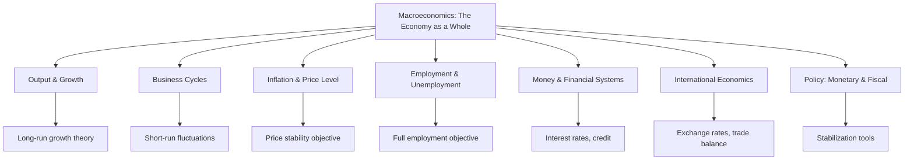

## Defining Macroeconomics and Its Core Questions

### Definition and Scope

Macroeconomics is the branch of economics that studies the behavior, structure, and performance of an economy as a whole, rather than the behavior of individual households, firms, or markets. It examines aggregate variables — economy-wide totals and averages — such as total output, the general price level, aggregate employment, and the overall rate of economic growth.

The term is derived from the Greek *makros* (large) combined with *economics*, contrasting it with **microeconomics**, which studies individual decision-making units (a single consumer, a single firm, a single market).

Macroeconomics asks: how do millions of individual decisions by households, firms, and governments aggregate into economy-wide outcomes, and what forces drive those outcomes over time?

### Macroeconomics vs. Microeconomics

| Dimension | Microeconomics | Macroeconomics |
| --- | --- | --- |
| Unit of analysis | Individual agents (households, firms) | The economy as a whole |
| Key variables | Individual prices, individual quantities, single-market equilibrium | Price level (inflation), aggregate output (GDP), aggregate employment |
| Typical questions | Why does a firm set a particular price? | Why does the price level rise across the entire economy? |
| Core tools | Supply and demand for a single good | Aggregate demand and aggregate supply |
| Policy relevance | Antitrust, firm regulation, market design | Monetary policy, fiscal policy, exchange rate policy |

Despite this distinction, modern macroeconomics is built substantially on **microfoundations** — models of aggregate behavior derived from the optimizing decisions of individual households and firms (utility maximization, profit maximization) aggregated up to the economy-wide level. This is a defining feature of post-1970s macroeconomic theory, in contrast to earlier approaches that specified aggregate relationships directly without deriving them from individual optimization.

### The Aggregation Problem

A central conceptual challenge in macroeconomics is aggregation: summing or averaging across heterogeneous individual units to produce meaningful economy-wide measures.

- **Output aggregation**: Adding up production of apples, haircuts, software, and steel requires a common unit — typically market value in a base or current currency — to produce Gross Domestic Product (GDP).
- **Price aggregation**: The "price level" is not the price of any single good but a weighted average of many prices, captured via index numbers such as the Consumer Price Index (CPI) or the GDP deflator.
- **Labor aggregation**: "Employment" aggregates workers across vastly different occupations, skill levels, and sectors into a single count or rate.

[Inference] Because aggregation necessarily discards information about distributional and compositional detail, macroeconomic aggregates can mask significant heterogeneity — for example, a stable aggregate price level can coexist with large relative price changes across sectors.

### Core Questions of Macroeconomics

Macroeconomics is traditionally organized around a small set of persistent, defining questions:

**1. What determines the level of national output and income?**

This concerns the total quantity of goods and services an economy produces in a given period, typically measured as GDP, and what determines its size and its rate of growth over decades.

**2. Why does output fluctuate around its long-run trend? (The business cycle)**

Economies do not grow smoothly; they experience alternating periods of expansion and contraction. Macroeconomics studies the causes, duration, and consequences of these fluctuations, and whether and how policy can moderate them.

**3. What determines the price level and its rate of change? (Inflation)**

This addresses why prices rise (inflation) or fall (deflation) over time, what causes changes in the inflation rate, and the costs inflation imposes on an economy.

**4. What determines employment and unemployment?**

This examines why unemployment exists even in functioning economies, why its rate varies over time, and what distinguishes different types of unemployment (frictional, structural, cyclical).

**5. What explains long-run economic growth?**

Beyond short-run fluctuations, macroeconomics asks why some economies grow rich over generations while others stagnate — the study of growth theory, productivity, capital accumulation, and technological change.

**6. What determines a country's international economic position?**

This covers exchange rates, trade balances, capital flows, and how domestic macroeconomic conditions interact with the rest of the world.

**7. What is the role of money and financial systems?**

This concerns how the supply of money and the structure of financial intermediation affect output, prices, and interest rates.

**8. Can government policy improve macroeconomic outcomes, and how?**

This is the normative and applied core of the field: the study of monetary policy (central bank actions) and fiscal policy (government spending and taxation) as tools for influencing output, employment, and inflation.

### The Four Classic Macroeconomic Objectives

Macroeconomic policy discussions are frequently organized around four widely cited objectives, sometimes called the "magic diamond" or macroeconomic policy targets:

1. **Sustainable output growth** — expanding productive capacity over time
2. **Full employment / low unemployment** — minimizing involuntary joblessness
3. **Price stability** — keeping inflation low and predictable
4. **External balance** — sustainable trade and capital flows with the rest of the world

[Inference] These four objectives can conflict with one another in the short run — for instance, policies that stimulate output and reduce unemployment may generate upward pressure on inflation — which is part of why macroeconomic policy design is a persistent subject of debate rather than a solved engineering problem.

### Core Aggregate Variables

| Variable | What It Measures | Typical Data Source |
| --- | --- | --- |
| Real GDP | Total quantity of output, adjusted for price changes | National income and product accounts |
| Nominal GDP | Total output valued at current prices | National income and product accounts |
| Inflation rate | Percentage change in the general price level | CPI, PCE deflator, GDP deflator |
| Unemployment rate | Share of the labor force without work but seeking it | Labor force surveys |
| Interest rates | Cost of borrowing / return on saving | Central bank policy rates, bond yields |
| Exchange rate | Value of domestic currency relative to foreign currencies | Foreign exchange markets |
| Current account balance | Net flow of goods, services, and income with the rest of the world | Balance of payments statistics |

### Positive vs. Normative Macroeconomics

- **Positive macroeconomics** describes and explains how the economy actually behaves — e.g., "an increase in the money supply is associated with higher inflation in the long run." These are testable, factual claims.
- **Normative macroeconomics** makes prescriptive judgments about what policy *should* do — e.g., "the central bank should prioritize price stability over full employment." These involve value judgments and are not resolvable by data alone.

Much of the ongoing disagreement between macroeconomic schools of thought (Classical, Keynesian, Monetarist, New Classical, New Keynesian, and others) stems as much from differing normative priorities and differing assumptions about how markets clear as from disagreements over positive facts.

### Time Horizons in Macroeconomics

Macroeconomic analysis is conventionally split by time horizon, because the dominant forces at work differ across horizons:

- **Short run**: Prices and wages may be "sticky" (slow to adjust); demand-side factors and shocks can cause output to deviate from its potential level. This is the domain of business-cycle analysis and stabilization policy.
- **Long run**: Prices and wages are assumed fully flexible; output is determined by the economy's productive capacity (labor, capital, technology). This is the domain of growth theory.
- **Very long run**: The study of growth over generations, institutional change, and the deep determinants of why nations differ in wealth.

### Illustration: Structure of Macroeconomic Inquiry (svg_diagram)

<svg xmlns="http://www.w3.org/2000/svg" viewBox="0 0 760 380">
<text x="380" y="28" text-anchor="middle" font-size="18" font-weight="bold" fill="#1a1a1a">Structure of Macroeconomic Inquiry (svg_diagram)</text>
<rect x="290" y="50" width="180" height="45" rx="6" fill="#2c5f8a" />
<text x="380" y="78" text-anchor="middle" font-size="14" fill="#ffffff">The Aggregate Economy</text>
<line x1="380" y1="95" x2="130" y2="150" stroke="#555" stroke-width="1.5" />
<line x1="380" y1="95" x2="380" y2="150" stroke="#555" stroke-width="1.5" />
<line x1="380" y1="95" x2="630" y2="150" stroke="#555" stroke-width="1.5" />
<rect x="40" y="150" width="180" height="45" rx="6" fill="#3b7d3b" />
<text x="130" y="178" text-anchor="middle" font-size="13" fill="#ffffff">Output &amp; Growth</text>
<rect x="290" y="150" width="180" height="45" rx="6" fill="#8a4b2c" />
<text x="380" y="171" text-anchor="middle" font-size="13" fill="#ffffff">Prices &amp;</text>
<text x="380" y="188" text-anchor="middle" font-size="13" fill="#ffffff">Employment</text>
<rect x="540" y="150" width="180" height="45" rx="6" fill="#6a3b8a" />
<text x="630" y="171" text-anchor="middle" font-size="13" fill="#ffffff">Money, Finance &amp;</text>
<text x="630" y="188" text-anchor="middle" font-size="13" fill="#ffffff">External Sector</text>
<line x1="130" y1="195" x2="130" y2="230" stroke="#555" stroke-width="1.5" />
<line x1="380" y1="195" x2="380" y2="230" stroke="#555" stroke-width="1.5" />
<line x1="630" y1="195" x2="630" y2="230" stroke="#555" stroke-width="1.5" />
<rect x="40" y="230" width="180" height="55" rx="6" fill="#e8e8e8" stroke="#999" />
<text x="130" y="252" text-anchor="middle" font-size="12" fill="#1a1a1a">Long-run growth</text>
<text x="130" y="268" text-anchor="middle" font-size="12" fill="#1a1a1a">Business cycles</text>
<rect x="290" y="230" width="180" height="55" rx="6" fill="#e8e8e8" stroke="#999" />
<text x="380" y="252" text-anchor="middle" font-size="12" fill="#1a1a1a">Inflation dynamics</text>
<text x="380" y="268" text-anchor="middle" font-size="12" fill="#1a1a1a">Unemployment types</text>
<rect x="540" y="230" width="180" height="55" rx="6" fill="#e8e8e8" stroke="#999" />
<text x="630" y="252" text-anchor="middle" font-size="12" fill="#1a1a1a">Interest rates</text>
<text x="630" y="268" text-anchor="middle" font-size="12" fill="#1a1a1a">Exchange rates, trade</text>
<line x1="130" y1="285" x2="380" y2="320" stroke="#555" stroke-width="1.5" />
<line x1="380" y1="285" x2="380" y2="320" stroke="#555" stroke-width="1.5" />
<line x1="630" y1="285" x2="380" y2="320" stroke="#555" stroke-width="1.5" />
<rect x="230" y="320" width="300" height="45" rx="6" fill="#b03a3a" />
<text x="380" y="348" text-anchor="middle" font-size="13" fill="#ffffff">Monetary &amp; Fiscal Policy Response</text>
</svg>

### Why Macroeconomics Matters

Macroeconomic outcomes shape the material conditions of entire populations in ways individual market outcomes cannot. A recession affects millions of workers simultaneously regardless of their individual firm's productivity; high inflation erodes the purchasing power of all money-denominated wealth; slow long-run growth compounds over decades into large differences in living standards between nations. Because these outcomes are shaped substantially by policy — central bank interest rate decisions, government budgets, exchange rate arrangements — macroeconomics is inseparable from public policy debate in a way few other branches of economics are.

**Related Topics**

- National income accounting and GDP measurement (expenditure, income, and output approaches)
- Circular flow of income model
- Aggregate demand and aggregate supply framework
- Classical vs. Keynesian macroeconomic paradigms
- The business cycle: phases, indicators, and dating
- Unemployment types (frictional, structural, cyclical) and the natural rate of unemployment
- Inflation measurement (CPI, PCE, GDP deflator) and the Phillips curve
- Money supply, money demand, and the role of central banks
- Fiscal policy tools: government spending, taxation, and budget deficits
- Monetary policy tools: policy interest rates, open market operations, quantitative easing
- Open-economy macroeconomics: exchange rate regimes and the balance of payments
- Long-run growth theory: Solow model and endogenous growth theory
- Microfoundations of macroeconomics: representative agent and rational expectations