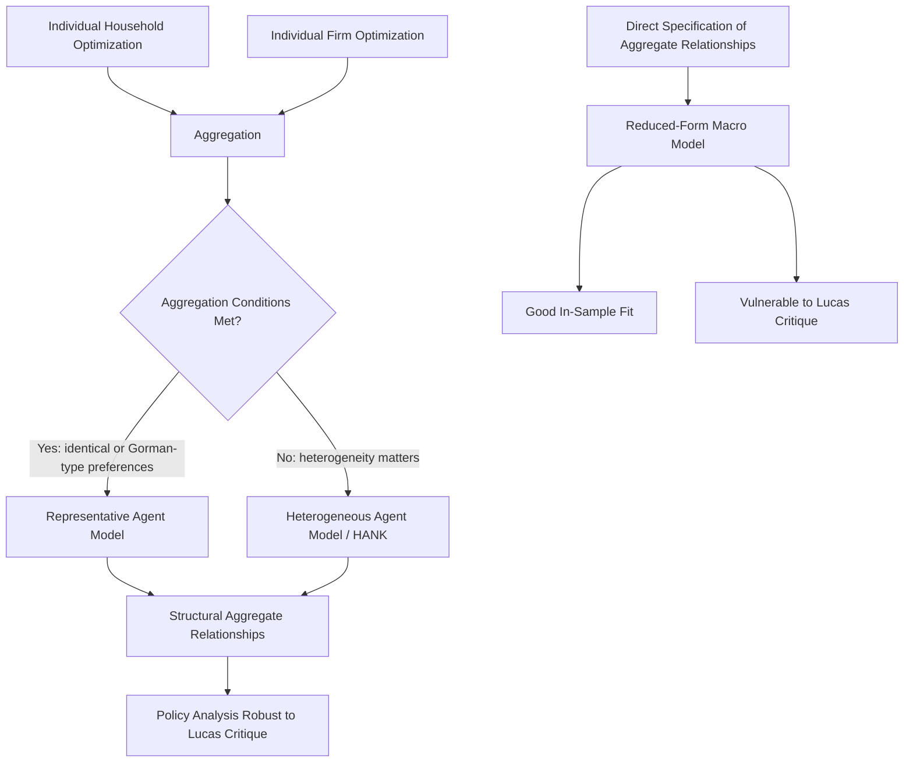

## Microeconomic Foundations Versus Aggregate Analysis

### Overview

A central methodological divide in macroeconomics concerns how aggregate relationships should be derived: whether they should be built up from the optimizing behavior of individual agents (**microfoundations**) or specified directly at the level of economy-wide aggregates (**aggregate/reduced-form analysis**). This distinction shapes model construction, policy evaluation, and the interpretation of empirical relationships throughout modern macroeconomic theory.

### Defining the Two Approaches

**Microfounded (bottom-up) analysis** constructs macroeconomic relationships by explicitly modeling individual households and firms as optimizing agents — maximizing utility subject to budget constraints, maximizing profit subject to technology and cost constraints — and then aggregating their decisions (often via a representative agent or a distribution of heterogeneous agents) to obtain economy-wide behavior.

**Aggregate (top-down / reduced-form) analysis** specifies behavioral relationships directly at the level of economy-wide variables — for example, positing a consumption function relating aggregate consumption to aggregate income — without deriving that relationship from an explicit individual optimization problem.

| Dimension | Microfounded Approach | Aggregate/Reduced-Form Approach |
| --- | --- | --- |
| Starting point | Individual agent optimization | Economy-wide behavioral relationships |
| Internal consistency | Guaranteed by construction (agents optimize) | Not guaranteed; relationships posited directly |
| Parameter interpretation | Tied to preferences, technology (structural) | Often statistical/empirical (reduced-form) |
| Policy analysis | Robust to the Lucas critique, in principle | Vulnerable to the Lucas critique |
| Tractability | Can be mathematically demanding | Often simpler, more tractable |
| Empirical fit | Sometimes weaker fit to short-run data | Often better short-run empirical fit |
| Historical association | New Classical, RBC, New Keynesian DSGE models | Early Keynesian (IS-LM, ISLM-AS) models |

### Historical Context

Early macroeconomics, following the Keynesian revolution of the 1930s–1940s, was built largely on aggregate relationships specified by assumption: a consumption function where aggregate consumption depends on aggregate income, an investment function depending on the interest rate, and so on. These relationships were plausible and empirically useful but were not derived from explicit models of individual decision-making.

Beginning in the 1970s, a body of criticism — most influentially associated with the **Lucas critique** (Robert Lucas, 1976) — argued that reduced-form relationships estimated from historical data are not "structural": they implicitly embed the policy regime and expectations prevailing when the data were generated. If policy changes, individuals' optimal behavior changes, and the previously estimated relationship can break down. This motivated a shift toward models explicitly grounded in individual optimization, whose deep parameters (preferences, technology) are assumed invariant to policy changes and therefore useful for policy evaluation.

[Inference] This shift substantially reshaped mainstream academic macroeconomics from the 1980s onward, though reduced-form and semi-structural models remain widely used in applied policy work (e.g., at central banks) alongside fully microfounded models, reflecting a persistent trade-off between structural rigor and empirical tractability.

### The Lucas Critique in Detail

The Lucas critique holds that econometric relationships estimated from historical data reflect the optimal decision rules of agents operating under a particular policy regime and set of expectations. Because these decision rules depend on the policy environment itself, using a historically estimated relationship to forecast the effects of a *new* policy is invalid — the relationship itself would shift under the new policy.

**Example**: Suppose historical data show that consumers spend a stable fraction of a temporary tax rebate. A reduced-form model might use this fraction to predict the effect of a new rebate. But if consumers' spending decisions are actually governed by expectations about future income and taxes (as in the permanent income hypothesis), a rebate explicitly announced as one-time versus one perceived as likely to recur will produce different spending responses — even though the "historical" marginal propensity to consume was estimated as if it were a fixed structural parameter.

This is a paradigm case motivating microfounded models: only by modeling the underlying optimization problem (and how expectations of future policy enter it) can economists claim their predicted responses to a genuinely new policy are reliable.

### The Representative Agent Framework

The most common device for building microfounded aggregate models is the **representative agent**: a single household (or firm) whose optimization problem, when solved, is assumed to characterize aggregate behavior as if the economy consisted of many identical copies of this agent.

A canonical representative-household problem:

$$\max_{\{C_t\}_{t=0}^{\infty}} \sum_{t=0}^{\infty} \beta^t U(C_t)$$

subject to a budget constraint such as

$$C_t + K_{t+1} = Y_t + (1-\delta)K_t$$

where $C_t$ is consumption, $K_t$ is capital, $Y_t$ is output, $\beta$ is the discount factor, and $\delta$ is the depreciation rate. Solving this problem yields an optimal consumption/saving rule that, when combined with a production function and market-clearing conditions, generates aggregate dynamics for consumption, investment, and output.

**Key Points**

- The representative agent's first-order conditions (e.g., an Euler equation governing intertemporal consumption choice) become structural building blocks of the aggregate model.
- Aggregation is achieved by assumption (identical agents) rather than by explicitly summing over a heterogeneous population.
- This approach underlies Real Business Cycle (RBC) theory and most New Keynesian Dynamic Stochastic General Equilibrium (DSGE) models.

### Limitations of the Representative Agent

[Inference] Critics argue that the representative agent device, while tractable, can obscure economically important phenomena that arise specifically from heterogeneity across agents:

- **Distributional effects**: Policies (e.g., unequal tax changes, credit constraints affecting some households but not others) can have aggregate effects that depend on *which* households are affected, not just the average household.
- **Aggregation theorems**: Formal aggregation of heterogeneous individual demand functions into a well-behaved aggregate demand function requires restrictive conditions (e.g., the Gorman polar form for preferences) that may not hold in practice.
- **Financial frictions and heterogeneous agents**: Borrowing constraints, incomplete insurance markets, and wealth heterogeneity generate aggregate dynamics (e.g., precautionary saving, amplified responses to shocks) that a representative agent model cannot replicate by construction.

These concerns motivated the development of **heterogeneous agent models**, including Bewley-Aiyagari-type models and, more recently, **Heterogeneous Agent New Keynesian (HANK)** models, which retain microfoundations while allowing for a distribution of agents differing in wealth, income, or other characteristics.

### Aggregation: From Individual Behavior to Macro Variables

Even within a microfounded framework, aggregation is not automatic. Formal justification for treating an economy "as if" it had a single representative decision-maker generally requires conditions such as:

- Identical homothetic preferences across agents, or
- Preferences of the Gorman polar form, permitting exact aggregation of individual demands into a well-defined aggregate demand function regardless of the distribution of income, or
- Complete markets allowing full risk-sharing across agents, effectively equalizing their consumption growth rates (as in complete-markets asset pricing models).

[Unverified] The precise empirical extent to which real economies satisfy these aggregation conditions is disputed and depends on the specific market and population being modeled; this remains an active area of both theoretical and empirical research.

### Case Comparison: Consumption Function

**Reduced-form (Keynesian) consumption function:**

$$C = a + bY_d$$

where $C$ is aggregate consumption, $Y_d$ is aggregate disposable income, $a$ is autonomous consumption, and $b$ is the marginal propensity to consume — parameters estimated directly from aggregate data.

**Microfounded (permanent income / life-cycle) consumption function:**

Derived from an individual's intertemporal optimization problem, consumption depends not on current income alone but on the present discounted value of expected lifetime resources (permanent income), $Y^P$:

$$C_t = f(Y_t^P, r_t, \text{preferences})$$

**Example**: Under the reduced-form model, a one-time $1,000 tax rebate and a permanent $1,000 tax cut are predicted to have identical effects on consumption (same marginal propensity to consume applied to the same dollar amount). Under the microfounded permanent-income model, the two are predicted to have very different effects: the permanent cut raises permanent income substantially and should increase consumption close to one-for-one, while the temporary rebate raises permanent income only slightly (spread over a long horizon) and should generate a much smaller consumption response. [Inference] Empirical tests distinguishing these predictions have historically been used as evidence for evaluating the relative validity of the two modeling approaches, though results across different studies and rebate episodes have not been fully unanimous.

### Structural vs. Reduced-Form Parameters

A key methodological distinction:

- **Structural parameters** are assumed to represent "deep" features of the economy — preferences (risk aversion, discount rates), technology (production function parameters), or market frictions — that do not change when policy changes.
- **Reduced-form parameters** are statistical summaries of observed relationships among aggregate variables, which may be stable under the historical policy regime but are not guaranteed to remain stable under a different regime.

This distinction underlies why microfounded models are often preferred for **counterfactual policy analysis** (evaluating a policy that has never been tried), even though reduced-form models may fit historical data equally well or better within-sample.

### Convergence in Practice: DSGE and Semi-Structural Models

Modern applied macroeconomics, particularly at central banks and international institutions, often blends both approaches:

- **DSGE (Dynamic Stochastic General Equilibrium) models** are fully microfounded, incorporating optimizing households, firms, and often nominal rigidities (sticky prices/wages), providing internally consistent frameworks for policy analysis.
- **Semi-structural models** retain some reduced-form elements (e.g., estimated Phillips curves, IS relationships) but attempt to discipline them with theoretical restrictions informed by microfounded reasoning.
- **Reduced-form/VAR (Vector Autoregression) models** remain widely used for forecasting and identifying empirical regularities, without claiming full structural interpretation, and often serve as a benchmark against which DSGE model predictions are evaluated.

[Inference] This coexistence reflects a practical trade-off: fully microfounded models offer greater internal consistency and (in principle) robustness to the Lucas critique, but can be more complex to solve, may fit certain aggregate time series less well, and rest on debatable auxiliary assumptions (e.g., rational expectations, specific functional forms); reduced-form models are simpler and often track data more closely in-sample but are more exposed to the Lucas critique when used for policy evaluation.

### Illustration: Bottom-Up vs. Top-Down Modeling Paths (svg_diagram)

<svg xmlns="http://www.w3.org/2000/svg" viewBox="0 0 760 340">
<text x="380" y="26" text-anchor="middle" font-size="17" font-weight="bold" fill="#1a1a1a">Bottom-Up vs. Top-Down Modeling Paths (svg_diagram)</text>

<text x="180" y="55" text-anchor="middle" font-size="13" font-weight="bold" fill="`#2c5f8a`">Microfounded (Bottom-Up)</text>

<rect x="80" y="70" width="200" height="40" rx="6" fill="`#2c5f8a`" />

<text x="180" y="95" text-anchor="middle" font-size="12" fill="#fff">Individual Optimization</text>

<line x1="180" y1="110" x2="180" y2="140" stroke="#555" stroke-width="1.5" />
<rect x="80" y="140" width="200" height="40" rx="6" fill="#2c5f8a" />
<text x="180" y="165" text-anchor="middle" font-size="12" fill="#fff">Aggregation Rule Applied</text>
<line x1="180" y1="180" x2="180" y2="210" stroke="#555" stroke-width="1.5" />
<rect x="80" y="210" width="200" height="40" rx="6" fill="#2c5f8a" />
<text x="180" y="235" text-anchor="middle" font-size="12" fill="#fff">Structural Macro Model</text>
<line x1="180" y1="250" x2="180" y2="280" stroke="#555" stroke-width="1.5" />
<rect x="80" y="280" width="200" height="40" rx="6" fill="#3b7d3b" />
<text x="180" y="305" text-anchor="middle" font-size="12" fill="#fff">Policy-Robust Predictions</text>

<text x="580" y="55" text-anchor="middle" font-size="13" font-weight="bold" fill="`#8a4b2c`">Aggregate (Top-Down)</text>

<rect x="480" y="70" width="200" height="40" rx="6" fill="`#8a4b2c`" />

<text x="580" y="95" text-anchor="middle" font-size="12" fill="#fff">Aggregate Data Observed</text>

<line x1="580" y1="110" x2="580" y2="140" stroke="#555" stroke-width="1.5" />
<rect x="480" y="140" width="200" height="40" rx="6" fill="#8a4b2c" />
<text x="580" y="165" text-anchor="middle" font-size="12" fill="#fff">Reduced-Form Relationship</text>
<line x1="580" y1="180" x2="580" y2="210" stroke="#555" stroke-width="1.5" />
<rect x="480" y="210" width="200" height="40" rx="6" fill="#8a4b2c" />
<text x="580" y="235" text-anchor="middle" font-size="12" fill="#fff">Estimated Parameters</text>
<line x1="580" y1="250" x2="580" y2="280" stroke="#555" stroke-width="1.5" />
<rect x="480" y="280" width="200" height="40" rx="6" fill="#b03a3a" />
<text x="580" y="305" text-anchor="middle" font-size="12" fill="#fff">Lucas-Critique Exposure</text>
</svg>

### Practical Implications for Policy Evaluation

**Key Points**

- Microfounded models are generally preferred when evaluating policies without historical precedent, since their parameters are assumed invariant to policy regime.
- Reduced-form and semi-structural models remain valuable for short-term forecasting and for capturing empirical regularities that fully structural models may not yet incorporate.
- The choice between approaches is not purely academic: central banks (e.g., in their published macroeconomic models) typically maintain suites of both DSGE and reduced-form/semi-structural models, cross-checking predictions across model types precisely because neither approach dominates the other on every criterion.
- The heterogeneous-agent literature (Bewley-Aiyagari, HANK) represents an attempt to retain the internal consistency of microfoundations while relaxing the representative-agent simplification, at the cost of greater computational and analytical complexity.

**Related Topics**

- The Lucas critique and rational expectations
- Real Business Cycle (RBC) theory
- New Keynesian DSGE models and nominal rigidities
- Representative agent models and aggregation theorems (Gorman polar form)
- Heterogeneous Agent New Keynesian (HANK) models
- Permanent income hypothesis and life-cycle hypothesis of consumption
- Euler equations and intertemporal optimization
- Vector Autoregression (VAR) models in empirical macroeconomics
- Complete markets and risk-sharing in aggregation theory
- Bewley-Aiyagari incomplete-markets models