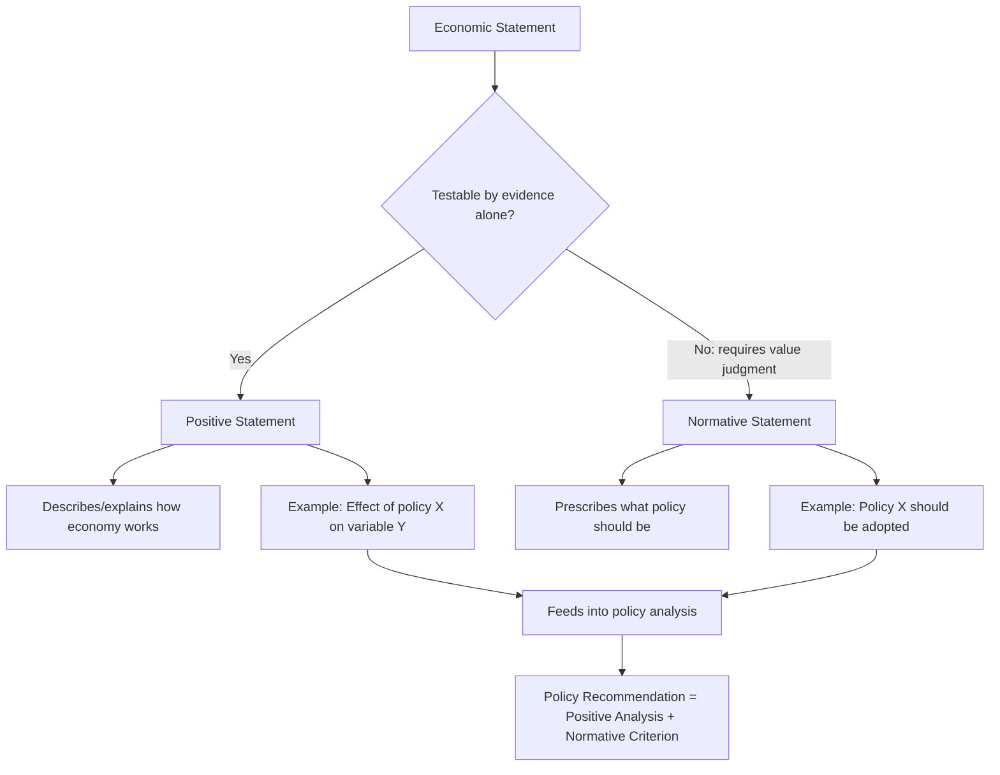

## Positive Versus Normative Economics

### Definitions

**Positive economics** is the study of "what is" — descriptive and explanatory statements about how the economy actually functions, framed as testable propositions that can, in principle, be confirmed or refuted by evidence. Positive statements do not depend on the values of the person making them; two economists with opposing political views should, in principle, agree on a positive claim once the relevant evidence is examined.

**Normative economics** is the study of "what ought to be" — prescriptive statements involving value judgments about desirable outcomes or policies. Normative statements cannot be settled by evidence alone because they rest on ethical, political, or philosophical premises about what is good, fair, or desirable.

### The Core Distinction Illustrated

| Feature | Positive Statement | Normative Statement |
| --- | --- | --- |
| Nature | Descriptive / explanatory | Prescriptive / evaluative |
| Testability | Testable against data, in principle | Not testable; depends on values |
| Contains value words? | No ("is," "causes," "increases") | Often yes ("should," "ought," "better," "fair") |
| Example | "An increase in the minimum wage reduces employment among low-skill workers, holding other factors constant." | "The government should raise the minimum wage to reduce poverty." |
| Resolution mechanism | Empirical evidence, statistical testing | Value judgment, political process |

**Example**: Consider two claims about inflation:

- Positive: "Sustained increases in the money supply beyond the growth rate of real output tend to raise the price level over time." This is a testable causal claim about how the economy works.
- Normative: "The central bank should tolerate higher inflation to keep unemployment lower." This claim requires a value judgment about the relative importance of price stability versus employment — it cannot be resolved by economic analysis alone, because it depends on how much weight one places on inflation costs versus unemployment costs.

### Why the Distinction Matters

**Key Points**

- It clarifies where economists, in principle, should be able to reach consensus (positive claims, given sufficient evidence) versus where disagreement can persist even among economists with identical technical training (normative claims reflecting differing values).
- It disciplines economic communication: describing a policy's *effects* is a separate task from advocating *for* or *against* that policy.
- It underlies the traditional claim that economics can be a "positive science," analogous in method (though not always in precision) to natural sciences, while still informing normative policy debates.
- Much observed disagreement among economists on policy questions is not, in fact, disagreement about positive economics (how the world works) but disagreement about normative economics (which outcomes are more desirable) — or disagreement about which positive model is empirically correct.

### The Fact/Value Distinction in Philosophy of Science

The positive/normative distinction in economics is a specific application of a broader philosophical idea, sometimes called the **fact/value distinction** or associated with the **is-ought problem** (traced to the philosopher David Hume, who observed that one cannot logically derive a prescriptive "ought" conclusion purely from descriptive "is" premises without an additional value premise).

[Inference] Applied to economics, this means that even a fully correct and well-evidenced positive model of the economy cannot, by itself, generate a policy recommendation; a policy recommendation always requires combining positive analysis with a normative criterion (e.g., "maximize total output," "minimize inequality," "protect a specific group") supplied from outside the positive model itself.

### Historical Origins in Economic Methodology

The formal articulation of the positive/normative distinction in economics is most closely associated with:

- **Nassau William Senior** and **John Neville Keynes**, who in the 19th century distinguished between economic science (positive) and the "art" of political economy (applying economic knowledge to achieve given ends).
- **Lionel Robbins** (1932), whose influential methodological essay argued for economics as a positive science of choice under scarcity, explicitly separating economic analysis from ethical judgments about the desirability of particular ends.
- **Milton Friedman**, in his 1953 essay "The Methodology of Positive Economics," argued strongly that economics should be understood primarily as a positive science, judged by the predictive accuracy of its theories rather than by the realism of their assumptions — a methodological stance that remains influential and contested.

[Unverified] The precise degree to which mainstream economics fully achieves Friedman's positivist ideal — value-free, prediction-focused theory — remains a subject of ongoing methodological debate within the philosophy of economics, since model selection, assumption choice, and even which questions are deemed worth studying can be argued to embed implicit value judgments.

### Positive and Normative Elements Coexisting in Policy Analysis

Most real-world macroeconomic policy analysis combines both types of statement in sequence:

1. **Positive step**: Build or estimate a model of how a policy affects outcomes (e.g., "a $1 increase in the minimum wage is estimated to reduce low-wage employment by X percent and raise the incomes of workers who remain employed by Y percent").
2. **Normative step**: Apply a value criterion to evaluate whether the trade-off implied by the positive analysis is desirable (e.g., "the poverty-reduction benefit for those who keep their jobs outweighs the employment loss for those who do not," or the reverse).

**Example**: Evaluating a proposed carbon tax:

- Positive claims: "A carbon tax of $50 per ton would reduce carbon emissions by an estimated Z percent and raise government revenue of $W billion, while increasing energy costs disproportionately for lower-income households (holding other policies fixed)."
- Normative claims: "The environmental benefit justifies the regressive burden," or alternatively, "the regressive burden on lower-income households is unacceptable without offsetting rebates" — both are value judgments layered on top of the (shared) positive analysis.

### Common Confusions and Pitfalls

[Inference] Several recurring errors blur the positive/normative line in practice:

- **Smuggled normativity**: Using seemingly neutral technical language (e.g., "efficient," "optimal," "welfare-maximizing") that actually embeds a specific normative criterion (commonly, some form of aggregate welfare or efficiency criterion, such as Pareto efficiency or a utilitarian social welfare function) without making that criterion explicit.
- **Treating disputed positive claims as normative disagreements, or vice versa**: A policy debate may appear to be a values dispute when it is actually a dispute over unresolved empirical questions (e.g., disagreement over the actual employment effect of a minimum wage increase, rather than disagreement over how much weight to place on employment versus wages).
- **Assuming consensus implies correctness, or disagreement implies pure ideology**: Positive claims can remain genuinely unsettled due to identification challenges, data limitations, or model uncertainty — disagreement among economists on a positive question does not necessarily indicate that the question is actually normative.

### Welfare Economics as a Bridge

**Welfare economics** is the subfield most explicitly concerned with combining positive analysis with normative criteria in a rigorous way. It develops formal criteria for evaluating social outcomes, such as:

- **Pareto efficiency**: An allocation is Pareto efficient if no individual's situation can be improved without making at least one other individual worse off. This criterion is often presented as normatively "thin" (requiring minimal value commitments), since it does not require interpersonal comparisons of well-being, though selecting *among* multiple Pareto-efficient allocations still requires additional normative input.
- **Social welfare functions**: Explicit normative frameworks (e.g., utilitarian, Rawlsian) that aggregate individual well-being into a single social objective, making the underlying value judgments explicit rather than implicit.

[Inference] Welfare economics illustrates that even highly formalized economic theory does not eliminate normative content — it can, at best, make the normative assumptions explicit and separate from the positive (empirical/theoretical) components of the analysis, allowing for clearer debate about which parts of a disagreement are empirical and which are ethical.

### Application to Macroeconomic Schools of Thought

[Inference] Much of the enduring disagreement between macroeconomic schools of thought (e.g., Keynesian versus Classical/New Classical, or debates over the appropriate role of discretionary fiscal policy) reflects a mixture of:

- Genuine positive disagreements (e.g., how quickly wages and prices adjust, how large fiscal multipliers are, how expectations are formed).
- Normative disagreements (e.g., how much weight to place on short-run stabilization of employment versus long-run price stability, or how much government intervention in markets is acceptable in principle, independent of its measured effects).

Distinguishing which type of disagreement is driving a given policy debate is itself a useful analytical exercise, since it clarifies whether more data and better models could, in principle, resolve the dispute (positive) or whether the disagreement would persist even under perfect information (normative).

### Illustration: Positive-Normative Decision Pipeline (svg_diagram)

<svg xmlns="http://www.w3.org/2000/svg" viewBox="0 0 760 300">
<text x="380" y="26" text-anchor="middle" font-size="17" font-weight="bold" fill="#1a1a1a">Positive-Normative Decision Pipeline (svg_diagram)</text>
<rect x="30" y="60" width="220" height="55" rx="6" fill="#2c5f8a" />
<text x="140" y="83" text-anchor="middle" font-size="12" fill="#fff">Positive Analysis</text>
<text x="140" y="100" text-anchor="middle" font-size="11" fill="#dce8f5">"What are the effects?"</text>
<rect x="30" y="150" width="220" height="55" rx="6" fill="#8a4b2c" />
<text x="140" y="173" text-anchor="middle" font-size="12" fill="#fff">Normative Criterion</text>
<text x="140" y="190" text-anchor="middle" font-size="11" fill="#f5e3d8">"What outcomes matter?"</text>
<line x1="250" y1="87" x2="330" y2="140" stroke="#555" stroke-width="1.5" />
<line x1="250" y1="177" x2="330" y2="140" stroke="#555" stroke-width="1.5" />
<rect x="330" y="115" width="220" height="55" rx="6" fill="#3b7d3b" />
<text x="440" y="138" text-anchor="middle" font-size="12" fill="#fff">Combined Judgment</text>
<text x="440" y="155" text-anchor="middle" font-size="11" fill="#dcefdc">Facts + Values</text>
<line x1="550" y1="142" x2="610" y2="142" stroke="#555" stroke-width="1.5" />
<rect x="610" y="115" width="130" height="55" rx="6" fill="#b03a3a" />
<text x="675" y="138" text-anchor="middle" font-size="12" fill="#fff">Policy</text>
<text x="675" y="155" text-anchor="middle" font-size="12" fill="#fff">Recommendation</text>

<text x="140" y="230" text-anchor="middle" font-size="11" fill="#555">Resolved by evidence</text>

<text x="140" y="245" text-anchor="middle" font-size="11" fill="#555">and testing</text>

<text x="140" y="260" text-anchor="middle" font-size="11" fill="#555" font-style="italic">(below normative box)</text>

</svg>

**Related Topics**

- Welfare economics and social welfare functions
- Pareto efficiency and the Pareto criterion
- Utilitarianism and Rawlsian justice in economic policy
- Milton Friedman's "The Methodology of Positive Economics" (1953)
- The is-ought problem (Hume's guillotine) in philosophy
- Cost-benefit analysis as an applied positive/normative tool
- Interpersonal utility comparisons and their methodological limits
- Public choice theory and the political economy of policy selection
- Behavioral economics and its implications for welfare analysis
- Macroeconomic policy debates: Keynesian vs. Classical/New Classical perspectives