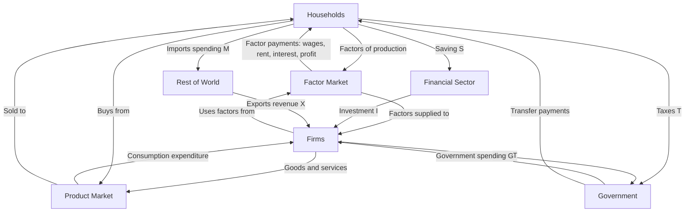

## Circular Flow of Income and Expenditure

### Overview

The circular flow model is a foundational diagrammatic and conceptual representation of how money, goods, services, and factors of production move between the major sectors of an economy. It illustrates the fundamental identity that, in aggregate, total income earned in an economy must equal total expenditure on that economy's output, and that both must equal the value of output produced — the core logical foundation underlying national income accounting and GDP measurement.

### The Basic Two-Sector Model

In its simplest form, the circular flow model considers only two sectors: **households** and **firms**.

- **Households** own the factors of production (labor, land, capital, entrepreneurship) and supply them to firms in the **factor market** (also called the resource market or input market), in exchange for factor payments: wages, rent, interest, and profit.
- **Firms** use these factors to produce goods and services, which they sell to households in the **product market** (goods and services market), in exchange for consumption expenditure.

This generates two counter-flowing circuits:

1. **Real flow**: Factors of production flow from households to firms; goods and services flow from firms to households.
2. **Money flow**: Factor payments (income) flow from firms to households; consumption expenditure flows from households to firms.

In this simplified closed model with no saving, investment, government, or foreign sector, total income earned by households equals total expenditure by households, which equals the total value of goods and services produced by firms — establishing the basic circular flow identity:

$$Y = C$$

where $Y$ is aggregate income (equivalently, aggregate output) and $C$ is aggregate consumption expenditure.

### Injections and Leakages

The two-sector model is unrealistic because households do not spend all their income on domestic consumption, and firms do not receive revenue solely from household consumption. The circular flow is extended by introducing **leakages** (withdrawals of money from the circular flow) and **injections** (additions of spending into the circular flow).

| Leakage (withdrawal from the flow) | Corresponding Injection (addition to the flow) |
| --- | --- |
| Saving ($S$) — income not spent on consumption | Investment ($I$) — firm spending on capital goods |
| Taxes ($T$) — income paid to government | Government spending ($G$) — government purchases of goods and services |
| Imports ($M$) — spending on foreign-produced goods | Exports ($X$) — foreign spending on domestically produced goods |

**Key Points**

- Leakages represent income earned by households (or firms) that does not flow directly back into domestic firms as consumption spending.
- Injections represent spending on domestic output that does not originate from household consumption expenditure.
- In macroeconomic equilibrium, aggregate leakages must equal aggregate injections for the circular flow to be in a steady state:

$$S + T + M = I + G + X$$

[Inference] This equality is not merely a bookkeeping convenience — it functions as an equilibrium condition: if leakages exceed injections, aggregate expenditure falls short of aggregate income/output, creating downward pressure on output and employment (and vice versa if injections exceed leakages), which is a foundational concept connecting the circular flow model to Keynesian income-expenditure analysis.

### The Four-Sector Circular Flow Model

A more complete and commonly taught version of the model incorporates four sectors and their interconnections:

1. **Households** — supply factors of production, receive factor income, pay taxes, consume goods and services, and save.
2. **Firms** — produce goods and services, pay factor incomes, receive consumption and investment expenditure, and pay taxes.
3. **Government** — collects taxes from households and firms, and spends on goods, services, and transfer payments.
4. **Foreign sector (Rest of the World)** — receives payment for imports and pays for exports, connecting the domestic economy to international trade and capital flows.

Some versions add a fifth institutional element, the **financial sector** (banks and other financial intermediaries), which channels saving from households (and firms) into loanable funds used to finance investment, government borrowing, and other spending.

### Formal Derivation of the National Income Identity

The circular flow model provides the conceptual basis for the standard national income accounting identity. Starting from the expenditure side, aggregate output ($Y$) is defined as the sum of all spending categories:

$$Y = C + I + G + (X - M)$$

where $C$ is household consumption, $I$ is gross investment, $G$ is government purchases, and $(X - M)$ is net exports.

From the income side, aggregate income is allocated among consumption, saving, and taxes:

$$Y = C + S + T$$

Setting the two expressions for $Y$ equal and simplifying yields the leakages-injections equilibrium condition derived above:

$$C + I + G + (X - M) = C + S + T$$

$$I + G + X = S + T + M$$

**Example**: Suppose in a given year, households save $200 billion, pay $150 billion in net taxes, and spend $50 billion on imports, for total leakages of $400 billion. If firms invest $180 billion, the government spends $140 billion, and exports total $80 billion, injections also equal $400 billion — the economy's circular flow is in equilibrium at the prevailing level of income, output, and expenditure.

### Stocks vs. Flows in the Circular Flow Model

[Inference] It is a common point of conceptual confusion that the circular flow model depicts **flows** (quantities measured per unit of time, such as income per year or expenditure per quarter), not **stocks** (quantities measured at a point in time, such as accumulated wealth or the capital stock). Saving is a flow (the portion of income *not* consumed *during* a period) that accumulates into the stock of wealth or accumulated capital over time; similarly, investment is a flow that adds to the stock of physical capital.

### The Circular Flow and the Three Approaches to Measuring GDP

The circular flow model directly motivates the three standard, theoretically equivalent methods for measuring Gross Domestic Product:

1. **Expenditure approach**: Summing all spending on final goods and services — $C + I + G + (X - M)$ — corresponding to the flow of money from households, firms, government, and the foreign sector into the product market.
2. **Income approach**: Summing all factor incomes generated in production — wages, rent, interest, and profit — corresponding to the flow of money from firms to households through the factor market.
3. **Output (value-added) approach**: Summing the value added at each stage of production across all firms, corresponding to the real flow of goods and services through the product market.

Because every dollar of expenditure on final output becomes income to some factor of production, and every unit of output sold generates revenue equal to its value, these three approaches must, in principle, yield identical totals for GDP — a direct consequence of the closed-loop structure of the circular flow.

### Illustration: Five-Sector Circular Flow with Leakages and Injections (svg_diagram)

<svg xmlns="http://www.w3.org/2000/svg" viewBox="0 0 780 420">
<text x="390" y="26" text-anchor="middle" font-size="17" font-weight="bold" fill="#1a1a1a">Five-Sector Circular Flow with Leakages and Injections (svg_diagram)</text>
<rect x="60" y="60" width="180" height="50" rx="6" fill="#2c5f8a" />
<text x="150" y="90" text-anchor="middle" font-size="13" fill="#fff">Households</text>
<rect x="540" y="60" width="180" height="50" rx="6" fill="#3b7d3b" />
<text x="630" y="90" text-anchor="middle" font-size="13" fill="#fff">Firms</text>
<line x1="240" y1="75" x2="540" y2="75" stroke="#555" stroke-width="1.5" marker-end="url(#arrow1)" />
<text x="390" y="68" text-anchor="middle" font-size="10" fill="#555">Factors of production</text>
<line x1="540" y1="95" x2="240" y2="95" stroke="#555" stroke-width="1.5" marker-end="url(#arrow1)" />
<text x="390" y="112" text-anchor="middle" font-size="10" fill="#555">Factor payments</text>
<rect x="60" y="180" width="180" height="50" rx="6" fill="#6a3b8a" />
<text x="150" y="210" text-anchor="middle" font-size="13" fill="#fff">Financial Sector</text>
<line x1="150" y1="110" x2="150" y2="180" stroke="#b03a3a" stroke-width="1.5" marker-end="url(#arrow1)" />
<text x="90" y="150" text-anchor="middle" font-size="10" fill="#b03a3a">Saving (S)</text>
<line x1="240" y1="200" x2="540" y2="90" stroke="#b03a3a" stroke-width="1.5" marker-end="url(#arrow1)" />
<text x="420" y="160" text-anchor="middle" font-size="10" fill="#b03a3a">Investment (I)</text>
<rect x="60" y="300" width="180" height="50" rx="6" fill="#8a4b2c" />
<text x="150" y="330" text-anchor="middle" font-size="13" fill="#fff">Government</text>
<line x1="150" y1="180" x2="150" y2="350" stroke="#b03a3a" stroke-width="1.5" marker-end="url(#arrow1)" />
<text x="95" y="270" text-anchor="middle" font-size="10" fill="#b03a3a">Taxes (T)</text>
<line x1="240" y1="325" x2="540" y2="105" stroke="#b03a3a" stroke-width="1.5" marker-end="url(#arrow1)" />
<text x="470" y="260" text-anchor="middle" font-size="10" fill="#b03a3a">Govt spending (G)</text>
<rect x="540" y="300" width="180" height="50" rx="6" fill="#c07a2c" />
<text x="630" y="330" text-anchor="middle" font-size="13" fill="#fff">Rest of World</text>
<line x1="150" y1="230" x2="540" y2="335" stroke="#3b7d3b" stroke-width="1.5" marker-end="url(#arrow1)" />
<text x="330" y="300" text-anchor="middle" font-size="10" fill="#3b7d3b">Imports (M)</text>
<line x1="630" y1="300" x2="240" y2="100" stroke="#3b7d3b" stroke-width="1.5" marker-end="url(#arrow1)" />
<text x="600" y="200" text-anchor="middle" font-size="10" fill="#3b7d3b">Exports (X)</text>
</svg>

### Applications and Limitations of the Model

**Key Points**

- The circular flow model provides the conceptual skeleton for national income accounting, the Keynesian income-expenditure framework, and the aggregate demand side of many macroeconomic models.
- It illustrates why a change in one sector's behavior (e.g., a rise in household saving) can affect output and income economy-wide, motivating concepts such as the **paradox of thrift**, where an increase in desired saving by all households simultaneously can reduce aggregate income if it is not matched by a corresponding increase in investment or other injections.
- The model is a simplification: it does not, by itself, specify the direction of causality (whether leakages and injections adjust to equal each other via changes in income/output, via changes in interest rates, or via some other mechanism) — that requires a fuller macroeconomic model such as the Keynesian cross or the IS-LM framework.
- [Inference] The model also abstracts from important real-world complications such as inventory changes, financial asset transactions unrelated to real investment, and the distinction between gross and net investment (depreciation), which are addressed in more detailed national accounting frameworks.

**Related Topics**

- National income accounting and the three approaches to measuring GDP
- Keynesian income-expenditure model and the Keynesian cross
- Injections and leakages equilibrium and the multiplier effect
- Paradox of thrift
- IS-LM model and its relationship to the circular flow
- Gross vs. net investment and capital depreciation
- Balance of payments and the foreign sector's role in circular flow
- Loanable funds market and the role of financial intermediaries
- Government budget constraint and fiscal flows
- Stock-flow consistent macroeconomic modeling