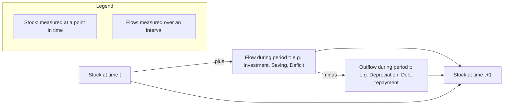

## Stocks Versus Flows in Economic Variables

### Definitions

A **stock** is an economic quantity measured at a specific point in time — a snapshot value that exists independent of any time interval. A **flow** is an economic quantity measured over a period of time — it has no meaning without specifying the interval across which it is measured.

**Key Points**

- Stock variables answer the question "how much exists *at* this moment?"
- Flow variables answer the question "how much occurs *during* this period?"
- The distinction is one of the most fundamental organizing principles in macroeconomics and national accounting, and confusing the two is a common analytical error.

### The Canonical Analogy: The Bathtub

A standard pedagogical device for the stock-flow distinction is a bathtub filling with water:

- The **stock** is the amount of water currently in the tub, measured in a unit like liters — a single number valid at one instant.
- The **inflow** (water entering from the tap) and **outflow** (water leaving through the drain) are **flows**, measured in liters *per minute* — meaningless without a time dimension.
- The stock at any future moment equals the initial stock plus the cumulative net flow (inflow minus outflow) since that starting point.

This generalizes to the core **stock-flow accounting identity**:

$$\text{Stock}_{t+1} = \text{Stock}_t + \text{Flow}_t$$

where $\text{Flow}_t$ is the net addition to the stock occurring during period $t$.

### Core Examples in Macroeconomics

| Flow Variable | Corresponding Stock Variable |
| --- | --- |
| Income (per year, per month) | Wealth (at a point in time) |
| Investment (spending on capital goods per year) | Capital stock (existing at a point in time) |
| Saving (per period, the unspent portion of income) | Accumulated savings / net worth |
| Government budget deficit (per fiscal year) | National debt (accumulated at a point in time) |
| New borrowing / new lending (per period) | Outstanding debt (at a point in time) |
| Net exports / current account balance (per period) | Net international investment position (accumulated) |
| Change in inventories (per period) | Inventory stock (at a point in time) |
| Births and deaths (per period) | Population (at a point in time) |
| Unemployment inflows/outflows (hires, separations per period) | Number of unemployed persons (at a point in time) |

**Example**: A government runs a budget deficit (a flow) of $500 billion in a given fiscal year. If the national debt (a stock) stood at $20 trillion at the start of that year, it will stand at approximately $20.5 trillion at the end of the year — the flow (deficit) is the change that connects one period's stock to the next period's stock.

### Investment and Capital: The Central Macroeconomic Case

The relationship between investment (a flow) and the capital stock (a stock) is one of the most heavily used stock-flow relationships in macroeconomic theory, particularly in growth models.

$$K_{t+1} = K_t + I_t - \delta K_t$$

where $K_t$ is the capital stock at the start of period $t$, $I_t$ is gross investment during period $t$ (a flow), and $\delta$ is the depreciation rate (the fraction of the existing capital stock that wears out or becomes obsolete during the period).

This can be rewritten to isolate **net investment**:

$$I_t^{net} = I_t - \delta K_t = K_{t+1} - K_t$$

**Key Points**

- **Gross investment** is total spending on new capital goods during a period (a flow).
- **Depreciation** (or capital consumption) is the portion of the existing capital stock used up or worn out during the period (a flow, since it is measured per period, even though it reduces a stock).
- **Net investment** is gross investment minus depreciation — the actual net addition to the capital stock during the period.
- If net investment is positive, the capital stock grows over time; if negative, the capital stock shrinks (the economy is "consuming" more capital than it replaces).

This relationship is central to the Solow growth model and other capital-accumulation frameworks, where the evolution of the capital stock over time — driven by the flow of investment relative to depreciation — determines the economy's long-run productive capacity.

### Common Points of Confusion

[Inference] Several recurring errors in applying macroeconomic concepts stem from conflating stocks and flows:

- **GDP is a flow, not a stock.** Gross Domestic Product measures the value of output produced *during* a period (e.g., a quarter or a year); it is meaningless to speak of "the GDP" at a single instant without specifying a period. This is why GDP is always reported as "GDP for the year 2025" or "GDP for Q2," analogous to income.
- **National debt is a stock; the budget deficit is a flow.** A government can run a budget deficit (flow) even while its total debt (stock) is falling, if it is paying down debt faster than the deficit implies through other means, though this is unusual; more commonly, confusing "the deficit" with "the debt" leads to misinterpreting how quickly government indebtedness is changing.
- **Wealth is a stock; saving and income are flows.** An individual's wealth (net worth) is a stock existing at a point in time; it changes because of the flow of saving (the unspent portion of the flow of income) each period, as well as capital gains or losses on existing assets.
- **Unemployment is typically reported as a stock (number of people unemployed at a point in time), but its dynamics are driven by flows** — the rate at which people become unemployed (job separations) and the rate at which unemployed people find jobs (job findings). This stock-flow framework underlies modern labor market analysis (e.g., the "flow approach" to unemployment).

### The Stock-Flow Consistency Principle

A model or accounting framework is described as **stock-flow consistent** if every flow variable is correctly linked to the stock(s) it affects, and every stock evolves only through the flows explicitly specified in the model — meaning there is no unexplained appearance or disappearance of stocks (sometimes informally called "black holes" in modeling).

[Inference] This principle has become an explicit methodological standard in a branch of macroeconomic modeling known as **Stock-Flow Consistent (SFC) modeling**, associated particularly with post-Keynesian economists such as Wynne Godley, which insists that every financial flow in the economy (e.g., government borrowing) must correspond to an equal and opposite flow elsewhere (e.g., private sector or foreign sector lending), and that all resulting stocks (debts, assets) must be tracked consistently across sectors over time. This differs from some other modeling traditions (e.g., certain DSGE models) that may focus primarily on flow equilibrium conditions without fully tracking the resulting evolution of sectoral balance sheets.

### Stock-Flow Relationships Across Macroeconomic Sectors

The circular flow of income model (covered separately) is fundamentally a *flow* diagram — but each sector in that model also has associated *stocks* that accumulate from those flows:

| Sector | Key Flow(s) | Resulting Stock(s) |
| --- | --- | --- |
| Households | Income, consumption, saving | Wealth, net worth, financial assets |
| Firms | Investment, revenue, profit | Capital stock, retained earnings, corporate debt |
| Government | Spending, tax revenue, budget deficit/surplus | Public debt |
| Foreign sector | Exports, imports, net capital flows | Net international investment position |
| Financial sector | Lending, borrowing, deposits (flows per period) | Outstanding loans, deposit balances (stocks) |

### Formal Notation and the Time-Subscript Convention

By convention in macroeconomic notation:

- Stock variables are typically dated at the **start** (or end) of a period and represent a level: $K_t$, $W_t$ (wealth), $D_t$ (debt).
- Flow variables are dated **during** a period and represent a rate or total accumulated over that interval: $I_t$, $Y_t$, $S_t$.

This convention is why growth models typically write the capital accumulation equation with $K_t$ (stock, start of period) and $I_t$ (flow, during period) combining to determine $K_{t+1}$ (stock, start of next period) — the flow is the bridge connecting consecutive stock observations.

### Illustration: Bathtub Model of Stocks and Flows (svg_diagram)

<svg xmlns="http://www.w3.org/2000/svg" viewBox="0 0 700 400">
<text x="350" y="26" text-anchor="middle" font-size="17" font-weight="bold" fill="#1a1a1a">Bathtub Model of Stocks and Flows (svg_diagram)</text>
<rect x="220" y="80" width="20" height="60" fill="#2c5f8a" />
<text x="180" y="70" text-anchor="middle" font-size="12" fill="#2c5f8a">Inflow (Investment)</text>
<text x="180" y="85" text-anchor="middle" font-size="10" fill="#555">liters / minute</text>
<rect x="180" y="140" width="240" height="160" rx="8" fill="none" stroke="#333" stroke-width="3" />
<rect x="184" y="200" width="232" height="96" fill="#7fb3d5" opacity="0.7" />
<text x="300" y="255" text-anchor="middle" font-size="14" font-weight="bold" fill="#1a1a1a">STOCK</text>
<text x="300" y="272" text-anchor="middle" font-size="12" fill="#1a1a1a">(Capital / Wealth)</text>
<text x="300" y="287" text-anchor="middle" font-size="10" fill="#333">measured in liters</text>
<rect x="440" y="255" width="20" height="45" fill="#b03a3a" />
<text x="500" y="245" text-anchor="middle" font-size="12" fill="#b03a3a">Outflow (Depreciation)</text>
<text x="500" y="260" text-anchor="middle" font-size="10" fill="#555">liters / minute</text>

<text x="300" y="340" text-anchor="middle" font-size="12" fill="`#1a1a1a`" font-style="italic">Stock(t+1) = Stock(t) + Inflow(t) − Outflow(t)</text>

</svg>

### Analytical Importance

**Key Points**

- Stock-flow reasoning is essential for correctly interpreting macroeconomic news and data releases: a rising deficit (flow) does not necessarily imply a rapidly rising debt-to-GDP ratio (stock relative to a flow) if GDP is growing proportionally fast; a positive net investment flow implies capital stock growth, while a negative one implies capital stock decline.
- The distinction underlies key macroeconomic ratios, many of which compare a stock to a flow — e.g., the **debt-to-GDP ratio** (stock of debt relative to a flow of annual output) or the **capital-output ratio** (stock of capital relative to a flow of annual output) — both widely used indicators in growth and fiscal sustainability analysis.
- [Inference] Failure to maintain stock-flow consistency in economic models or policy analysis can produce internally contradictory or misleading conclusions — for example, projecting a flow of government spending without correspondingly tracking its cumulative effect on the stock of public debt.

**Related Topics**

- Capital accumulation and the Solow growth model
- Government debt dynamics and the debt-to-GDP ratio
- Depreciation, gross investment, and net investment
- Stock-Flow Consistent (SFC) modeling in post-Keynesian economics
- Flow approach to unemployment (job separations and job findings)
- National balance sheets and sectoral financial accounts
- Wealth accumulation and the life-cycle hypothesis
- Balance of payments and the net international investment position
- National income accounting identities