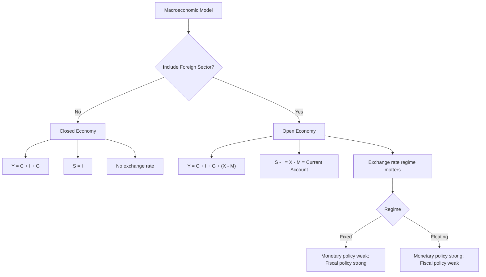

## Closed Versus Open Economy Frameworks

### Definitions

A **closed economy** is a theoretical or analytical framework in which an economy is modeled as having no interaction with the rest of the world — no trade in goods and services, no cross-border capital flows, and no exchange rate to consider. An **open economy** framework explicitly incorporates interactions with the rest of the world: exports, imports, and international capital movements.

**Key Points**

- No real-world economy is literally closed; the closed-economy assumption is a simplifying modeling device used to isolate domestic mechanisms before adding international complexity.
- The distinction determines which variables and identities must be included in a macroeconomic model, and materially changes how policy transmits through the economy.
- Very large, relatively self-contained economies (historically, sometimes the United States or the world economy taken as a whole) are sometimes treated as approximately closed for certain analytical purposes, though this is always a simplification.

### The National Income Identity: Closed vs. Open

**Closed economy** national income identity:

$$Y = C + I + G$$

where $Y$ is aggregate output/income, $C$ is consumption, $I$ is investment, and $G$ is government spending. All output produced domestically is either consumed, invested, or purchased by government — there is no leakage to or injection from abroad.

**Open economy** national income identity:

$$Y = C + I + G + (X - M)$$

where $X$ is exports and $M$ is imports, and $(X - M)$ is **net exports** (equivalently, the trade balance). This term can be positive (a trade surplus, where the country sells more abroad than it buys) or negative (a trade deficit).

**Example**: If a closed-economy model predicts that a $100 billion increase in government spending raises output by $250 billion (via a spending multiplier of 2.5), the same fiscal expansion in an open-economy model is typically predicted to raise output by less, because part of the additional income is spent on imports rather than domestically produced goods — this "import leakage" reduces the effective size of the multiplier.

### The Saving-Investment Identity: Closed vs. Open

In a **closed economy**, aggregate saving must equal aggregate investment:

$$S = I$$

since all resources not consumed (saved) must be absorbed by domestic investment — there is no other outlet.

In an **open economy**, saving need not equal domestic investment, because the difference can be absorbed by (or supplied from) international capital flows:

$$S - I = X - M = CA$$

where $CA$ is the **current account balance**. This identity reveals that:

- A **current account surplus** ($X > M$) implies domestic saving exceeds domestic investment, with the excess saving effectively lent to the rest of the world (net foreign lending).
- A **current account deficit** ($X < M$) implies domestic investment exceeds domestic saving, with the shortfall financed by borrowing from (or investment inflows from) the rest of the world (net foreign borrowing).

[Inference] This identity is one of the most important open-economy relationships in macroeconomics because it directly links a country's trade balance to its domestic saving and investment behavior, showing that persistent trade deficits are mathematically equivalent to a country investing more than it saves domestically, financed by capital inflows from abroad — a framing that shifts policy discussion from "trade competitiveness" alone toward domestic saving and investment determinants as well.

### New Variables Introduced by Open-Economy Analysis

| Variable/Concept | Definition | Role |
| --- | --- | --- |
| Exchange rate | Price of one currency in terms of another | Determines relative prices of domestic vs. foreign goods and assets |
| Net exports ($X - M$) | Exports minus imports of goods and services | Additional component of aggregate demand |
| Current account | Trade balance plus net income and net transfers from abroad | Broadest flow measure of a country's transactions with the rest of the world |
| Capital/financial account | Net flow of financial assets between domestic and foreign residents | Mirror image of the current account under balance of payments accounting |
| Net international investment position | Stock of a country's foreign assets minus foreign liabilities | Open-economy analog of national wealth |
| Interest rate parity | Condition linking domestic and foreign interest rates via expected exchange rate changes | Governs international capital flow behavior |
| Purchasing power parity (PPP) | Condition linking exchange rates to relative price levels | Long-run theory of exchange rate determination |

### Exchange Rate Regimes and Their Macroeconomic Implications

Open-economy models must specify an exchange rate regime, which fundamentally alters how monetary and fiscal policy operate:

- **Fixed (pegged) exchange rate**: The central bank commits to maintaining the currency's value at (or near) a specified level relative to another currency or basket, typically by buying/selling foreign reserves.
- **Floating (flexible) exchange rate**: The exchange rate is determined by market supply and demand for the currency, with no official target level maintained by the central bank.
- **Managed float**: A hybrid regime where the exchange rate floats but the central bank intervenes periodically to influence its level or volatility.

[Inference] The choice of exchange rate regime interacts with the well-known "impossible trinity" (or trilemma) in open-economy macroeconomics, which holds that a country cannot simultaneously maintain (1) a fixed exchange rate, (2) free capital mobility, and (3) independent monetary policy — at most two of the three can be sustained together, a constraint with significant implications for the policy autonomy available to different economies depending on their institutional choices.

### The Mundell-Fleming Model: Open-Economy IS-LM

The standard analytical bridge between closed and open economy short-run macroeconomic models is the **Mundell-Fleming model**, an extension of the closed-economy IS-LM framework that adds an open-economy equilibrium condition (often called the BP or balance-of-payments curve) representing external balance, and explicitly incorporates the exchange rate.

**Key Points**

- Under **floating exchange rates with high capital mobility**, monetary policy becomes highly effective at influencing output (an expansionary monetary policy depreciates the currency, boosting net exports and reinforcing the output expansion), while fiscal policy becomes relatively less effective (fiscal expansion raises interest rates, attracting capital inflows that appreciate the currency and crowd out net exports, partially offsetting the fiscal stimulus).
- Under **fixed exchange rates with high capital mobility**, this reverses: monetary policy loses effectiveness (the central bank must adjust the money supply to defend the peg, neutralizing any independent monetary action), while fiscal policy becomes relatively more effective (fiscal expansion raises interest rates, attracting capital inflows that the central bank must offset by expanding the money supply to maintain the peg, reinforcing rather than crowding out the fiscal expansion).

[Inference] These predictions represent stylized, canonical results from the standard Mundell-Fleming framework under specific assumptions (perfect capital mobility, small open economy, static price level); real-world policy effectiveness can differ depending on the degree of capital mobility, the credibility of the exchange rate regime, and other structural features not captured in the baseline model.

### Illustration: Closed vs. Open Economy Circular Flow Comparison (svg_diagram)

<svg viewBox="0 0 780 380" xmlns="http://www.w3.org/2000/svg">
<text x="390" y="26" text-anchor="middle" font-size="17" font-weight="bold" fill="#1a1a1a">Closed vs. Open Economy Circular Flow Comparison (svg_diagram)</text>

<text x="190" y="55" text-anchor="middle" font-size="13" font-weight="bold" fill="`#2c5f8a`">Closed Economy</text>

<rect x="90" y="80" width="200" height="45" rx="6" fill="`#2c5f8a`"/>

<text x="190" y="107" text-anchor="middle" font-size="12" fill="#fff">Households</text>

<rect x="90" y="200" width="200" height="45" rx="6" fill="`#3b7d3b`"/>

<text x="190" y="227" text-anchor="middle" font-size="12" fill="#fff">Firms & Government</text>

<line x1="290" y1="95" x2="290" y2="215" stroke="#555" stroke-width="1.5"/>

<line x1="90" y1="215" x2="90" y2="95" stroke="#555" stroke-width="1.5"/>

<text x="190" y="290" text-anchor="middle" font-size="11" fill="#555">Closed loop: Y = C + I + G</text>

<text x="190" y="308" text-anchor="middle" font-size="11" fill="#555">No leakage to / from abroad</text>

<text x="590" y="55" text-anchor="middle" font-size="13" font-weight="bold" fill="`#8a4b2c`">Open Economy</text>

<rect x="490" y="80" width="200" height="45" rx="6" fill="`#2c5f8a`"/>

<text x="590" y="107" text-anchor="middle" font-size="12" fill="#fff">Households</text>

<rect x="490" y="200" width="200" height="45" rx="6" fill="`#3b7d3b`"/>

<text x="590" y="227" text-anchor="middle" font-size="12" fill="#fff">Firms & Government</text>

<line x1="690" y1="95" x2="690" y2="215" stroke="#555" stroke-width="1.5"/>

<line x1="490" y1="215" x2="490" y2="95" stroke="#555" stroke-width="1.5"/>

<rect x="740" y="140" width="30" height="45" rx="4" fill="#c07a2c" opacity="0.001"/>
<ellipse cx="740" cy="160" rx="30" ry="30" fill="#c07a2c"/>
<text x="740" y="164" text-anchor="middle" font-size="10" fill="#fff">ROW</text>
<line x1="690" y1="150" x2="712" y2="150" stroke="#b03a3a" stroke-width="1.5"/>
<line x1="712" y1="170" x2="690" y2="170" stroke="#3b7d3b" stroke-width="1.5"/>
<text x="590" y="290" text-anchor="middle" font-size="11" fill="#555">Open loop: Y = C + I + G + (X-M)</text>
<text x="590" y="308" text-anchor="middle" font-size="11" fill="#555">Leakage (M) / Injection (X) with ROW</text>
</svg>

### Practical Uses of the Closed-Economy Simplification

**Key Points**

- Introductory macroeconomic pedagogy typically begins with closed-economy models (basic Keynesian cross, closed-economy IS-LM) to isolate core domestic mechanisms — the multiplier, the interaction of goods and money markets — before introducing the added complexity of exchange rates and capital flows.
- Some large, relatively diversified economies are sometimes approximated as "closed" for certain purposes because trade constitutes a smaller share of GDP relative to smaller, more trade-dependent economies, though [Inference] the appropriateness of this approximation varies significantly by country and by the specific question being analyzed, and is increasingly questioned given the scale of global financial integration even for large economies.
- For small open economies (a common analytical category in international macroeconomics), the closed-economy assumption is generally considered a poor approximation, since trade and capital flows constitute a large share of economic activity and domestic interest rates are often assumed to be pinned to world interest rates (the "small open economy" assumption).

**Related Topics**

- Mundell-Fleming model (open-economy IS-LM)
- The impossible trinity (trilemma) of open-economy macroeconomics
- Exchange rate regimes: fixed, floating, and managed float
- Balance of payments accounting: current account and capital/financial account
- Purchasing power parity and interest rate parity
- Net international investment position
- Small open economy models
- Twin deficits hypothesis (fiscal deficit and current account deficit)
- International capital mobility and its policy implications
- Real exchange rate and terms of trade