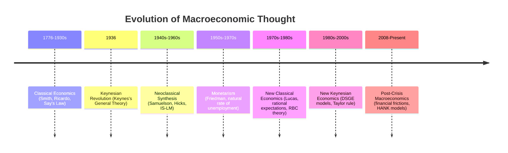
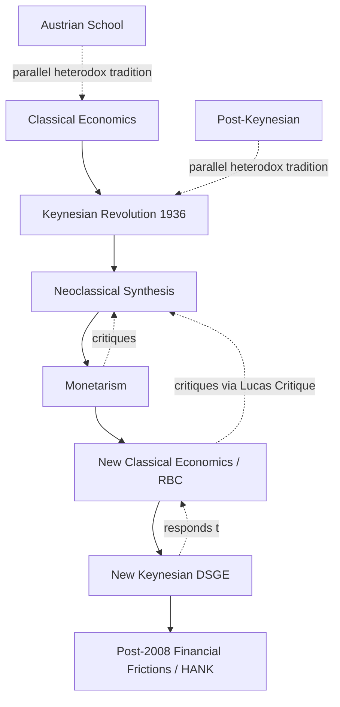

## History of Macroeconomic Thought Overview

### Overview

Macroeconomics as a distinct field of systematic study is comparatively young — most historians of economic thought date its emergence to the 1930s, in response to the Great Depression — but the underlying questions it addresses (the causes of economic crises, the determinants of national wealth, the role of money) have antecedents stretching back centuries. This overview traces the major schools of macroeconomic thought chronologically, highlighting their central claims, key figures, and the historical circumstances that shaped them.

### Pre-Keynesian Classical Economics (18th–early 20th century)

Before the 1930s, mainstream economic thought on aggregate outcomes was dominated by what later came to be called **Classical economics**, associated with figures such as Adam Smith, David Ricardo, Jean-Baptiste Say, and later Alfred Marshall and Arthur Cecil Pigou.

**Key Points**

- **Say's Law**, often summarized as "supply creates its own demand," held that the very act of producing goods generates income sufficient to purchase those goods, implying that general overproduction (a persistent shortfall of aggregate demand) could not occur for extended periods.
- Classical economists generally believed that markets, including labor markets, were self-correcting: if unemployment arose, flexible wages would fall until labor demand and supply cleared, restoring full employment relatively quickly.
- Money was viewed largely through the **Quantity Theory of Money**, which held that the price level was proportional to the money supply, with money essentially "neutral" with respect to real output in the long run — money determined nominal variables (prices) but not real variables (output, employment).
- Economic downturns were generally viewed as temporary adjustment processes that self-correcting markets would resolve without need for active government intervention.

### The Keynesian Revolution (1930s–1940s)

The prolonged and severe unemployment of the Great Depression posed a direct empirical challenge to the Classical view that markets would rapidly self-correct. **John Maynard Keynes**, in his 1936 work *The General Theory of Employment, Interest and Money*, provided both a theoretical framework and a policy rationale that reshaped the field.

**Key Points**

- Keynes argued that aggregate demand — not aggregate supply — was the primary driver of output and employment in the short run, particularly when the economy operated below full capacity.
- He challenged Say's Law, arguing that a general deficiency of aggregate demand could persist, leading to an equilibrium with involuntary unemployment that would not self-correct through wage and price adjustment alone, at least not within a socially or politically tolerable timeframe.
- Keynes emphasized the role of expectations, uncertainty, and "animal spirits" in driving investment decisions, and argued that private investment could be volatile and insufficient to sustain full employment.
- The policy implication was that active government intervention — particularly fiscal policy (government spending and taxation) — could and should be used to manage aggregate demand and stabilize output and employment, a major departure from the largely laissez-faire Classical prescription.
- **John Hicks** and others subsequently formalized Keynes's ideas into the **IS-LM model**, a graphical and mathematical framework representing simultaneous equilibrium in the goods market (IS curve) and money market (LM curve) — this became the dominant pedagogical and analytical tool of "Keynesian" macroeconomics for decades.

### The Neoclassical Synthesis (1940s–1960s)

Following Keynes, economists including **Paul Samuelson** and **John Hicks** worked to integrate Keynesian short-run analysis with Classical long-run analysis into what became known as the **Neoclassical Synthesis**.

[Inference] This synthesis held, broadly, that Keynesian mechanisms (sticky wages/prices, demand-driven output) governed the short run, while Classical mechanisms (flexible prices, supply-side determinants of output) governed the long run — a division of labor between the two traditions that dominated mainstream macroeconomic teaching and policy through the 1960s, and which underlies the continuing convention in many textbooks of treating short-run and long-run macroeconomics as somewhat distinct analytical domains.

During this period, the **Phillips Curve** — an empirical relationship observed by A.W. Phillips (1958) between wage inflation and unemployment, later reformulated in terms of price inflation and unemployment — became a central applied tool, appearing to offer policymakers a stable menu of trade-offs between inflation and unemployment that could be exploited through demand management.

### Monetarism (1950s–1970s)

**Milton Friedman** and the **Chicago School** developed **Monetarism** as a significant challenge to Keynesian orthodoxy, re-emphasizing the role of the money supply in driving aggregate economic outcomes.

**Key Points**

- Monetarists argued that changes in the money supply were the primary driver of nominal GDP and, in the long run, of the price level, reviving and refining the Quantity Theory of Money tradition.
- Friedman argued that monetary policy operates with "long and variable lags," making discretionary fine-tuning of the economy by policymakers difficult and potentially destabilizing; he advocated instead for a stable, rules-based approach to monetary policy (e.g., a constant money supply growth rate rule).
- Friedman and **Edmund Phelps**, working independently, introduced the concept of the **natural rate of unemployment** (also called the non-accelerating inflation rate of unemployment, or NAIRU), arguing that any attempt to hold unemployment below this natural rate through sustained demand stimulus would only generate accelerating inflation, not a permanent reduction in unemployment — directly challenging the notion of a stable, exploitable Phillips curve trade-off.
- The **stagflation** of the 1970s (simultaneous high inflation and high unemployment) in many advanced economies was widely interpreted at the time as empirical vindication of the Monetarist critique of the Keynesian-era Phillips curve trade-off, and contributed significantly to the erosion of confidence in Neoclassical Synthesis Keynesianism.

### The Rational Expectations Revolution and New Classical Economics (1970s–1980s)

**Robert Lucas**, along with **Thomas Sargent**, **Robert Barro**, and others, developed **New Classical economics**, which incorporated the **rational expectations hypothesis** — the assumption that economic agents form expectations about the future using all available information efficiently, without systematic forecasting errors — into macroeconomic modeling.

**Key Points**

- The **Lucas critique** (1976) argued that historically estimated reduced-form macroeconomic relationships are not policy-invariant, since they embed the expectations formed under the historical policy regime; this became a foundational methodological argument for building macroeconomic models with explicit microfoundations.
- New Classical economists argued that if expectations are rational and markets clear continuously (prices and wages adjust freely), then *anticipated* systematic monetary policy could have no effect on real output or employment — only unanticipated ("surprise") policy could have real effects, and even those effects would be short-lived. This is sometimes called the **policy ineffectiveness proposition**.
- This period also saw the emergence of **Real Business Cycle (RBC) theory** (associated with Finn Kydland and Edward Prescott), which explained business cycle fluctuations as the efficient response of a fully microfounded, market-clearing economy to real (non-monetary) shocks, particularly technology/productivity shocks — a striking departure from the demand-driven, market-failure-based explanations of Keynesian theory.

### New Keynesian Economics (1980s–2000s)

In response to New Classical challenges, a new generation of economists including **Gregory Mankiw**, **Olivier Blanchard**, **Michael Woodford**, and others developed **New Keynesian economics**, which sought to retain core Keynesian insights (the real effects of demand shocks, a role for stabilization policy) while adopting the methodological rigor of rational expectations and explicit microfoundations demanded by the New Classical critique.

**Key Points**

- New Keynesian models explain **nominal rigidities** (sticky prices and wages) as the rational outcome of microeconomic frictions — such as **menu costs** (small costs of changing posted prices) or staggered wage/price-setting contracts — rather than simply assuming stickiness by fiat.
- With these rigidities embedded in otherwise rational-expectations, microfounded models, New Keynesian theory shows that monetary policy can have real short-run effects on output and employment, restoring a rationale for active stabilization policy within a framework methodologically acceptable to the New Classical critique.
- This synthesis produced the **New Keynesian DSGE (Dynamic Stochastic General Equilibrium) model**, which became — and largely remains — the dominant workhorse framework in academic macroeconomics and at many central banks for policy analysis and forecasting, incorporating optimizing households and firms, nominal rigidities, and a monetary policy rule (often a **Taylor rule** relating the policy interest rate to inflation and output gaps).

### Heterodox and Alternative Traditions

Alongside the mainstream lineage above, several heterodox traditions have persisted and, at various points, gained renewed attention:

- **Post-Keynesian economics**, associated with figures such as Hyman Minsky and (later) Wynne Godley, emphasizes fundamental uncertainty, the instability of financial markets (Minsky's "financial instability hypothesis"), and endogenous money (the view that the money supply responds to credit demand rather than being exogenously set by the central bank).
- **Austrian School economics**, associated with Friedrich Hayek and Ludwig von Mises, emphasizes the role of central bank credit expansion in generating unsustainable investment booms (malinvestment) that necessarily lead to subsequent recessions ("Austrian Business Cycle Theory"), and is generally skeptical of discretionary government intervention.
- **Modern Monetary Theory (MMT)**, a more recent heterodox development, emphasizes the operational realities of fiat currency-issuing governments and argues that conventional constraints on government deficit spending are less binding than commonly assumed, though [Unverified] its claims and policy implications remain actively and substantially disputed within the broader economics profession.

### The 2008 Financial Crisis and Its Influence

[Inference] The 2008 global financial crisis and subsequent recession prompted significant methodological reflection within mainstream macroeconomics, as many standard pre-crisis DSGE models had not incorporated a meaningful financial sector or the possibility of financial-system-driven crises, and were widely seen as having limited ability to anticipate or explain the severity of the downturn. This spurred substantial research incorporating financial frictions, banking sectors, and heterogeneous agents into mainstream macroeconomic models (including the heterogeneous-agent New Keynesian, or HANK, literature), representing an ongoing evolution of the field rather than a settled endpoint.

Note: the diagram above uses a Mermaid `timeline` structure for conceptual clarity; it remains within the required plaintext-fenced block per formatting rules.

### Illustration: Branching Schools of Macroeconomic Thought (svg_diagram)

<svg xmlns="http://www.w3.org/2000/svg" viewBox="0 0 780 420">
<text x="390" y="26" text-anchor="middle" font-size="16" font-weight="bold" fill="#1a1a1a">Branching Schools of Macroeconomic Thought (svg_diagram)</text>
<rect x="310" y="50" width="160" height="40" rx="6" fill="#555" />
<text x="390" y="75" text-anchor="middle" font-size="12" fill="#fff">Classical Economics</text>
<line x1="390" y1="90" x2="390" y2="120" stroke="#555" stroke-width="1.5" />
<rect x="300" y="120" width="180" height="40" rx="6" fill="#2c5f8a" />
<text x="390" y="145" text-anchor="middle" font-size="12" fill="#fff">Keynesian Revolution</text>
<line x1="390" y1="160" x2="390" y2="190" stroke="#555" stroke-width="1.5" />
<rect x="290" y="190" width="200" height="40" rx="6" fill="#2c5f8a" />
<text x="390" y="215" text-anchor="middle" font-size="12" fill="#fff">Neoclassical Synthesis</text>
<line x1="390" y1="230" x2="200" y2="260" stroke="#555" stroke-width="1.5" />
<line x1="390" y1="230" x2="580" y2="260" stroke="#555" stroke-width="1.5" />
<rect x="110" y="260" width="180" height="40" rx="6" fill="#8a4b2c" />
<text x="200" y="285" text-anchor="middle" font-size="12" fill="#fff">Monetarism</text>
<rect x="490" y="260" width="180" height="40" rx="6" fill="#6a3b8a" />
<text x="580" y="285" text-anchor="middle" font-size="12" fill="#fff">New Classical / RBC</text>
<line x1="200" y1="300" x2="390" y2="330" stroke="#555" stroke-width="1.5" />
<line x1="580" y1="300" x2="390" y2="330" stroke="#555" stroke-width="1.5" />
<rect x="290" y="330" width="200" height="40" rx="6" fill="#3b7d3b" />
<text x="390" y="355" text-anchor="middle" font-size="12" fill="#fff">New Keynesian DSGE</text>
<line x1="390" y1="370" x2="390" y2="400" stroke="#555" stroke-width="1.5" />
<text x="390" y="400" text-anchor="middle" font-size="11" fill="#555">Post-2008: Financial Frictions, HANK</text>
</svg>

### Summary of Key Debates Across Schools

**Key Points**

- **Do markets self-correct quickly?** Classical/New Classical: largely yes. Keynesian/New Keynesian: no, at least not within a policy-relevant timeframe, due to nominal rigidities.
- **Is money neutral?** Classical/Monetarist (long run): yes. Keynesian/New Keynesian (short run): no, due to sticky prices/wages.
- **Should policy be rules-based or discretionary?** Monetarist/New Classical: rules-based, given lags and credibility concerns. Keynesian: greater scope for discretionary countercyclical policy.
- **What drives business cycles?** RBC theory: real supply-side shocks (technology). Keynesian/New Keynesian: demand shocks interacting with nominal rigidities; Post-Keynesian: endogenous financial instability.
- [Inference] No single school has achieved unchallenged dominance; contemporary mainstream macroeconomics is generally understood as a synthesis incorporating rational expectations, microfoundations, and nominal rigidities (the New Keynesian DSGE tradition), while active research and policy debate continue to draw on insights from Monetarist, New Classical, Post-Keynesian, and other traditions depending on the question at hand.

**Related Topics**

- Say's Law and the Classical full-employment equilibrium
- Keynes's General Theory and the multiplier effect
- IS-LM model and the Neoclassical Synthesis
- Phillips Curve and the natural rate of unemployment (NAIRU)
- Rational expectations hypothesis and the Lucas critique
- Real Business Cycle (RBC) theory
- New Keynesian nominal rigidities: menu costs and staggered contracts
- Taylor rule and modern monetary policy frameworks
- Post-Keynesian economics and Minsky's financial instability hypothesis
- Modern Monetary Theory (MMT) and its critiques
- Austrian Business Cycle Theory