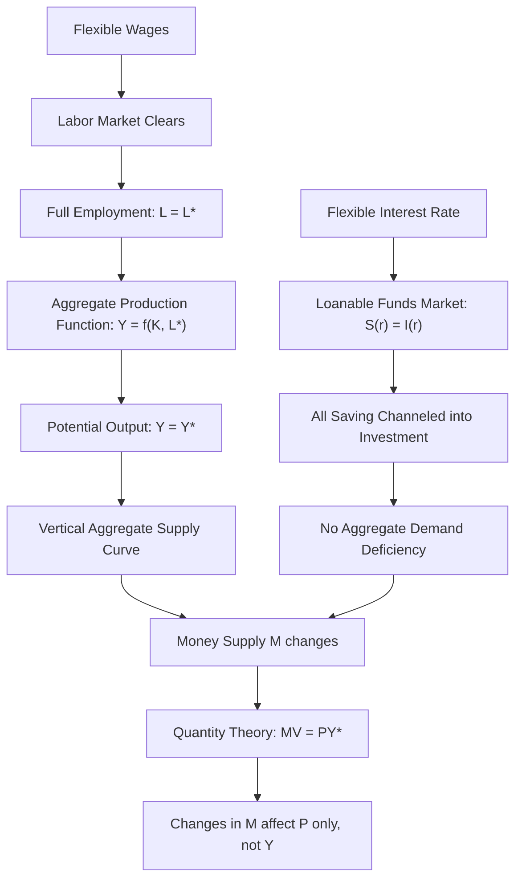

## Classical Economics and Say's Law

### Overview

Classical economics refers to the body of economic thought dominant from roughly the late 18th century through the early 20th century, associated with figures including Adam Smith, David Ricardo, Thomas Malthus, John Stuart Mill, and later refined by Alfred Marshall and Arthur Cecil Pigou. At its core lies a view of the macroeconomy as fundamentally self-regulating: flexible prices, wages, and interest rates were believed to ensure that markets — including the labor market and the market for loanable funds — clear continuously, keeping the economy at or near full employment except for brief, self-correcting disturbances. **Say's Law** is the specific proposition most closely associated with the Classical rejection of the possibility of persistent, economy-wide demand deficiency.

### Say's Law: Statement and Interpretation

Say's Law is commonly summarized by the phrase "**supply creates its own demand**," attributed to the French economist **Jean-Baptiste Say** (1767–1832), though the precise phrasing and its interpretation have been subjects of extensive historical debate among economists and historians of thought.

**Core logic**: When a firm produces goods, it must pay for the factors of production used (wages to labor, rent to landowners, interest to capital owners, profit to entrepreneurs). These factor payments constitute income for the households who receive them. Because the total value of output produced necessarily generates an equal total value of income, and because rational agents will eventually spend that income (whether immediately on consumption or indirectly through saving that finances investment), the very act of producing goods and services simultaneously creates the purchasing power needed to buy them.

**Key Points**

- Say's Law implies that a general glut — a simultaneous, economy-wide excess supply of goods in every market at once — is logically impossible in a well-functioning economy, though a temporary excess supply in *particular* markets (offset by excess demand in others) was generally acknowledged as possible.
- The proposition does not deny that recessions or downturns can occur; rather, it denies that they can be caused by, or persist due to, a general deficiency of aggregate demand relative to the economy's productive capacity.
- If Say's Law holds, then the primary constraint on an economy's output is its productive capacity (supply-side factors: labor, capital, technology) rather than the level of spending (demand-side factors) — a view directly opposed to the later Keynesian emphasis on aggregate demand as a binding short-run constraint.

### The Role of Saving in Classical Theory

A crucial link in the Classical argument is the treatment of **saving**. Classical economists argued that saving does not represent "leaked" or lost purchasing power that reduces aggregate demand; instead, saving is simply income not spent on consumption, which becomes available as **loanable funds** to finance investment.

The **loanable funds market** — governed by a flexible interest rate — was seen as the mechanism ensuring that saving and investment always adjust to equality:

$$S(r) = I(r)$$

where $S$ is aggregate saving (an increasing function of the interest rate $r$) and $I$ is aggregate investment (a decreasing function of $r$). If households wish to save more than firms wish to invest at the prevailing interest rate, the interest rate falls, discouraging saving and encouraging investment until the two are brought back into equality — ensuring that all income, whether consumed or saved, ultimately translates into spending somewhere in the economy (either consumption spending or investment spending).

[Inference] This mechanism is central to why Classical economists did not view the "leakage" of saving from the circular flow as a threat to aggregate demand: as long as the interest rate is free to adjust, saving is automatically and fully channeled into investment spending, preserving the equality of aggregate output and aggregate expenditure implied by Say's Law.

### The Labor Market and Full Employment

Classical macroeconomics extended the logic of flexible-price market clearing to the labor market. If the real wage is flexible, any unemployment arising from a temporary shock (e.g., a shift in labor demand) will be eliminated as the real wage adjusts downward, restoring equilibrium between labor supply and labor demand at full employment.

**Key Points**

- Involuntary unemployment — workers willing to work at the prevailing wage but unable to find employment — was generally viewed by Classical economists as, at most, a short-lived phenomenon arising from frictions or wage rigidities (e.g., minimum wage laws, union bargaining power) that prevented the labor market from clearing, rather than as an inherent, persistent feature of a market economy.
- The Classical labor market model is often depicted with a standard supply-and-demand diagram, where labor demand slopes downward (reflecting diminishing marginal product of labor) and labor supply slopes upward (reflecting the trade-off between work and leisure), with the intersection determining the market-clearing real wage and level of employment.
- Because full employment was assumed to be the "normal" state, the total output of the economy was largely determined by supply-side factors: the size of the labor force, the capital stock, and the state of technology — captured in an aggregate production function such as $Y = f(K, L)$.

### Classical Aggregate Supply and the Quantity Theory of Money

Given flexible wages and prices, Classical theory implies a **vertical aggregate supply curve** at the full-employment (potential) level of output, $Y^*$: regardless of the price level, the economy's real output is determined by its productive capacity, not by aggregate demand.

$$Y = Y^*$$

Combined with the **Quantity Theory of Money**, expressed in the equation of exchange:

$$MV = PY$$

where $M$ is the money supply, $V$ is the velocity of money (assumed relatively stable), $P$ is the price level, and $Y$ is real output (fixed at $Y^*$ by supply-side factors) — an increase in the money supply, holding $V$ and $Y^*$ fixed, translates entirely into a proportional increase in the price level $P$, with no effect on real output. This is the doctrine of the **neutrality of money**: money affects nominal variables but not real variables.

**Example**: If the money supply doubles while velocity and real output remain unchanged, the Quantity Theory predicts the price level will also approximately double — a purely nominal change with no effect on the real quantity of goods and services produced or consumed.

### Diagrammatic Summary of the Classical Model

### Illustration: Classical Vertical Aggregate Supply (svg_diagram)

<svg xmlns="http://www.w3.org/2000/svg" viewBox="0 0 620 420">
<text x="310" y="26" text-anchor="middle" font-size="16" font-weight="bold" fill="#1a1a1a">Classical Vertical Aggregate Supply (svg_diagram)</text>
<line x1="80" y1="360" x2="560" y2="360" stroke="#333" stroke-width="2" />
<line x1="80" y1="360" x2="80" y2="60" stroke="#333" stroke-width="2" />
<text x="560" y="380" text-anchor="middle" font-size="12" fill="#333">Real Output (Y)</text>
<text x="45" y="60" text-anchor="middle" font-size="12" fill="#333">Price</text>
<text x="45" y="75" text-anchor="middle" font-size="12" fill="#333">Level (P)</text>
<line x1="320" y1="360" x2="320" y2="70" stroke="#2c5f8a" stroke-width="3" />
<text x="320" y="55" text-anchor="middle" font-size="12" fill="#2c5f8a">Classical AS (vertical)</text>
<text x="320" y="385" text-anchor="middle" font-size="12" fill="#2c5f8a">Y* (Potential Output)</text>
<path d="M 150 130 Q 300 250 500 320" stroke="#8a4b2c" stroke-width="2" fill="none" />
<text x="500" y="335" text-anchor="middle" font-size="11" fill="#8a4b2c">AD1</text>
<path d="M 150 200 Q 300 320 500 390" stroke="#3b7d3b" stroke-width="2" fill="none" stroke-dasharray="6,4" />
<text x="500" y="405" text-anchor="middle" font-size="11" fill="#3b7d3b">AD2 (after money supply increase)</text>
<circle cx="320" cy="245" r="4" fill="#b03a3a" />
<circle cx="320" cy="180" r="4" fill="#b03a3a" />
<text x="345" y="180" font-size="11" fill="#b03a3a">Higher P</text>
<text x="345" y="248" font-size="11" fill="#b03a3a">Lower P</text>

<text x="310" y="410" text-anchor="middle" font-size="11" fill="#555" font-style="italic">Shifts in AD change P only; Y remains at Y*</text>

</svg>

### The "Overproduction" Debate: Malthus, Ricardo, and Say

[Inference] Not all Classical economists agreed unreservedly with Say's Law in its strongest form. **Thomas Malthus** argued, in debates with Ricardo and Say during the early 19th century, that a general glut of goods could occur if landlords and capitalists chose to save excessively relative to available profitable investment opportunities, potentially leading to a shortfall of demand — an argument sometimes viewed by later historians of thought as an early, if underdeveloped, anticipation of demand-deficiency concerns later central to Keynesian theory. However, Malthus's position was a minority view within Classical economics at the time, and the dominant Ricardian/Say tradition rejected the possibility of a persistent general glut, a position that remained largely dominant in mainstream economic theory until the 1930s.

### Policy Implications of Classical Theory

**Key Points**

- Because markets were believed to self-correct, Classical economists generally advocated for minimal government intervention in the economy — a broadly **laissez-faire** policy stance, though this was not absolute and varied among individual Classical economists on specific issues (e.g., public goods, infrastructure).
- Government budget deficits were often viewed with suspicion, since government borrowing to finance spending was thought to simply "crowd out" an equivalent amount of private investment by competing for the same pool of loanable funds, given a fixed level of saving and a fully employed economy — leaving total output unaffected but shifting its composition from private investment toward government spending.
- Monetary policy, under the Quantity Theory framework, was understood to determine the price level but not real economic activity, limiting its role (in Classical theory) to maintaining price stability rather than actively managing output or employment.

### Legacy and Relation to Later Macroeconomic Thought

[Inference] The Classical framework and Say's Law were directly and explicitly targeted by John Maynard Keynes in his 1936 *General Theory*, which argued that Say's Law did not hold in practice — that aggregate demand could fall short of the economy's productive capacity for extended periods, generating persistent involuntary unemployment that flexible wages would not, in practice, quickly correct. This critique launched the Keynesian Revolution and reoriented mainstream macroeconomics toward demand-side analysis for several decades, though Classical-style reasoning about long-run supply-side determination of output was later revived and reintegrated (in modified, microfounded forms) within New Classical economics, Real Business Cycle theory, and the long-run components of New Keynesian models — meaning Classical ideas about flexible-price market clearing remain influential in contemporary macroeconomic theory, particularly for analyzing long-run growth and potential output, even though few mainstream economists today accept Say's Law in its strongest original form as a description of short-run dynamics.

**Related Topics**

- Say's Law and the "general glut" controversy (Malthus vs. Ricardo/Say)
- Loanable funds theory and the determination of the interest rate
- Quantity Theory of Money and the neutrality of money
- Classical labor market model and flexible wage adjustment
- The Keynesian critique of Say's Law
- Aggregate production function and potential output
- Crowding out of private investment by government borrowing
- Real Business Cycle theory as a modern descendant of Classical supply-side analysis
- History of the "underconsumption" debates in classical political economy