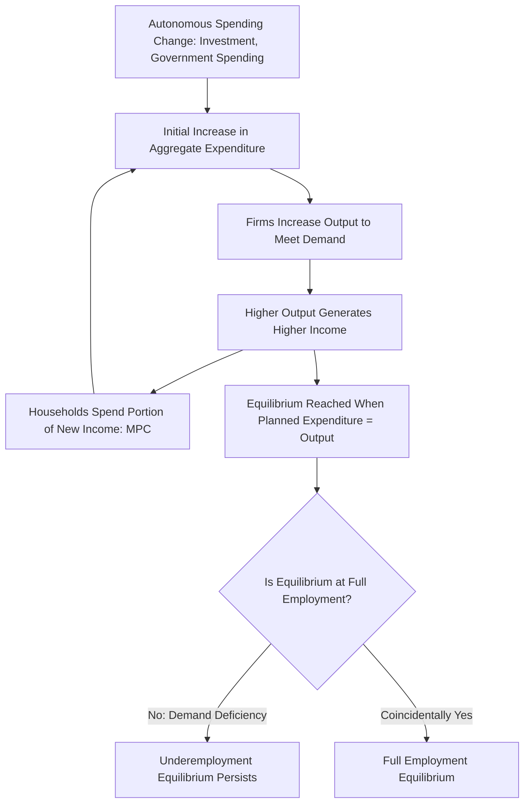

## Keynesian Revolution and Its Critique of Classical Theory

### Overview

The Keynesian Revolution refers to the transformation of macroeconomic thought initiated by **John Maynard Keynes**, most fully articulated in his 1936 work *The General Theory of Employment, Interest and Money*. Written against the backdrop of the Great Depression — a period of prolonged, severe unemployment that Classical theory struggled to explain or resolve — Keynes's work directly challenged the core propositions of Classical economics, particularly Say's Law and the presumption of automatic full-employment equilibrium, and established aggregate demand as the central object of short-run macroeconomic analysis.

### Historical Context

By the early 1930s, unemployment in many advanced economies had reached extraordinarily high levels (in the United States, unemployment exceeded 20% at points during the Depression) and remained elevated for years, not the brief adjustment period that Classical theory would predict. [Inference] This sustained, mass unemployment represented a severe empirical anomaly for the Classical view that flexible wages would rapidly restore full employment, creating intellectual space and urgency for an alternative theoretical framework — one that Keynes supplied.

### Keynes's Central Critique of Say's Law

Keynes directly challenged the Classical proposition that "supply creates its own demand." He argued that there was no automatic mechanism ensuring that the income generated by production would be fully spent — either on consumption or, via the loanable funds market, on investment.

**Key Points**

- Keynes argued that **saving and investment decisions are made by different agents for different reasons** (households save based on income and psychological/precautionary motives; firms invest based on expected future profitability and "animal spirits" — a term Keynes used for non-rational, sentiment-driven confidence), and there is no automatic mechanism (such as a perfectly flexible interest rate) guaranteeing that these two independently determined flows will be equal at the full-employment level of income.
- If desired saving exceeds desired investment at full employment, the resulting shortfall in aggregate demand would not necessarily be resolved by a falling interest rate (as the Classical loanable funds theory assumed); instead, Keynes argued, the economy could settle into equilibrium at a lower level of output and employment, with unemployment persisting because the interest rate mechanism was, in his view, too weak or unreliable to restore full-employment saving-investment balance.
- Keynes reversed the Classical causal direction: rather than the interest rate adjusting to equate a *fixed* level of saving with investment, Keynes argued that it is primarily the level of **income** that adjusts to bring saving and investment into equality — if investment falls short of saving at full employment, income (and thus saving, since saving depends on income) falls until the two are once again equal, but potentially at a level of output well below full employment.

### The Concept of Effective Demand

Keynes introduced the concept of **effective demand** — the level of aggregate demand at which the economy actually settles in equilibrium, which need not correspond to the full-employment level of output.

**Key Points**

- Aggregate output and employment are determined by the point at which aggregate expenditure (consumption plus investment, in a simplified closed economy) equals aggregate output — but this equilibrium can occur at a level of output below the economy's full productive capacity, resulting in an **underemployment equilibrium**.
- This was a direct rejection of the Classical vertical aggregate supply curve fixed at potential output; in Keynes's framework, output could remain persistently below potential if aggregate demand were insufficient, since there is no automatic force pushing the economy back to full employment in the short run.

### The Consumption Function and the Multiplier

A central building block of Keynes's theory is the **consumption function**, relating aggregate consumption to aggregate (disposable) income:

$$C = a + bY_d$$

where $a$ is autonomous consumption (consumption that occurs even at zero income), $b$ is the **marginal propensity to consume (MPC)** — the fraction of an additional unit of income spent on consumption — and $Y_d$ is disposable income.

Combined with the goods-market equilibrium condition (in a simple closed economy, $Y = C + I + G$), this consumption function generates the **Keynesian multiplier**: an initial change in autonomous spending (investment, government spending) produces a larger final change in equilibrium output, because each round of new spending generates new income, part of which is re-spent, generating further rounds of spending.

$$\Delta Y = \frac{1}{1 - b} \times \Delta A$$

where $\Delta A$ is the initial change in autonomous spending and $\frac{1}{1-b}$ is the **spending multiplier**.

**Example**: If the marginal propensity to consume is 0.75, the multiplier is $\frac{1}{1 - 0.75} = 4$. A $50 billion increase in government spending would, in this simplified model, be predicted to raise equilibrium output by $200 billion, as each round of new income generates further rounds of consumption spending.

### The Keynesian Cross Diagram

Keynes's income-expenditure framework is commonly depicted using the **Keynesian cross**, plotting aggregate planned expenditure against aggregate income, with equilibrium occurring where planned expenditure equals actual output (the 45-degree line).

### Illustration: Keynesian Cross Diagram (svg_diagram)

<svg xmlns="http://www.w3.org/2000/svg" viewBox="0 0 620 420">
<text x="310" y="26" text-anchor="middle" font-size="16" font-weight="bold" fill="#1a1a1a">Keynesian Cross Diagram (svg_diagram)</text>
<line x1="80" y1="360" x2="560" y2="360" stroke="#333" stroke-width="2" />
<line x1="80" y1="360" x2="80" y2="60" stroke="#333" stroke-width="2" />
<text x="560" y="380" text-anchor="middle" font-size="12" fill="#333">Income / Output (Y)</text>
<text x="45" y="55" text-anchor="middle" font-size="12" fill="#333">Planned</text>
<text x="45" y="70" text-anchor="middle" font-size="12" fill="#333">Expenditure</text>
<line x1="80" y1="360" x2="500" y2="80" stroke="#999" stroke-width="1.5" stroke-dasharray="4,4" />
<text x="500" y="70" text-anchor="middle" font-size="11" fill="#999">45° line (E = Y)</text>
<line x1="80" y1="270" x2="500" y2="150" stroke="#2c5f8a" stroke-width="2.5" />
<text x="500" y="140" text-anchor="middle" font-size="11" fill="#2c5f8a">Planned Expenditure: E = C + I + G</text>
<circle cx="290" cy="213" r="5" fill="#b03a3a" />
<line x1="290" y1="213" x2="290" y2="360" stroke="#b03a3a" stroke-width="1.5" stroke-dasharray="3,3" />
<text x="290" y="378" text-anchor="middle" font-size="11" fill="#b03a3a">Equilibrium Y</text>
<line x1="400" y1="360" x2="400" y2="60" stroke="#3b7d3b" stroke-width="1.5" stroke-dasharray="3,3" />
<text x="400" y="55" text-anchor="middle" font-size="11" fill="#3b7d3b">Full-Employment Y*</text>

<text x="345" y="395" text-anchor="middle" font-size="11" fill="#555" font-style="italic">Gap between Equilibrium Y and Y* = Recessionary Gap</text>

</svg>

### The Recessionary Gap and the Role of Fiscal Policy

The gap between the equilibrium level of output determined by aggregate expenditure and the full-employment level of output is termed the **recessionary gap** (or output gap, when output falls short of potential). Keynes argued that this gap could persist indefinitely without active intervention, since there was no strong automatic mechanism pulling the economy back to full employment within a socially acceptable timeframe.

**Key Points**

- Keynes's central policy prescription was that government could and should use **fiscal policy** — direct government spending, or tax changes to influence private spending — to close a recessionary gap by directly boosting aggregate demand, rather than relying on wage and price flexibility (which Keynes viewed as slow, unreliable, and potentially even counterproductive, since falling wages could reduce aggregate income and demand further, a phenomenon sometimes called **debt-deflation** dynamics, later elaborated by Irving Fisher).
- This represented a fundamental break from the Classical laissez-faire policy stance: rather than government being a source of "crowding out" that displaced an otherwise fixed level of private activity, Keynes argued that in conditions of underemployment (unused resources and idle labor), government spending could increase *total* output and employment without necessarily displacing private activity one-for-one.
- Keynes's framework provided the intellectual foundation for **countercyclical fiscal policy** — deliberately running budget deficits during downturns to stimulate demand, and (in principle) budget surpluses during booms to restrain excess demand — a policy approach subsequently adopted, in varying degrees, by many governments in the mid-20th century.

### Liquidity Preference and the Theory of Interest

Keynes also offered an alternative theory of interest rate determination, the **liquidity preference theory**, contrasting with the Classical loanable funds theory. Keynes argued that the interest rate is determined by the supply and demand for money (a stock, held for transactions, precautionary, and speculative motives) rather than solely by the balance of saving and investment (flows).

[Inference] This reformulation matters for the Keynesian critique of Classical theory because it implies the interest rate might not fall enough (or fall at all, in the extreme case of a "liquidity trap," where interest rates are so low that money and short-term bonds become near-perfect substitutes) to equate saving and investment at full employment, reinforcing Keynes's argument that the interest rate mechanism could not be relied upon to restore full employment automatically.

### Sticky Wages and Prices

A key element distinguishing Keynesian from Classical analysis is the assumption (or, in later New Keynesian theory, the derived result) that nominal wages and prices are **"sticky"** — slow to adjust downward, particularly in the short run — due to factors such as long-term labor contracts, menu costs of changing prices, social norms against nominal wage cuts, and coordination problems among price-setters.

**Key Points**

- If wages and prices were perfectly and instantaneously flexible, as Classical theory assumed, then an excess supply of labor (unemployment) would drive nominal wages down until the labor market cleared, restoring full employment.
- Keynes argued that in practice, nominal wages are downwardly rigid, especially in the short run, meaning that unemployment could persist as an equilibrium outcome, rather than being rapidly eliminated by falling wages.
- This sticky-wage/sticky-price assumption became the central mechanism later formalized by New Keynesian economists as a microfounded explanation for why monetary and fiscal policy can have real short-run effects on output and employment.

### Summary Comparison: Classical vs. Keynesian Views

| Dimension | Classical View | Keynesian View |
| --- | --- | --- |
| Say's Law | Holds: supply creates its own demand | Rejected: demand deficiency possible |
| Wages/prices | Flexible; markets clear quickly | Sticky, at least in the short run |
| Full employment | The normal, self-restoring state | One possible outcome among many; underemployment equilibrium possible |
| Interest rate role | Equates saving and investment (loanable funds) | Determined by liquidity preference (money supply and demand) |
| Role of government | Minimal (laissez-faire); crowding out concerns | Active countercyclical fiscal policy to manage demand |
| Cause of recessions | Temporary supply-side disturbances | Aggregate demand deficiency |
| Time horizon emphasis | Long run | Short run ("In the long run we are all dead" — Keynes's famous remark on the limited usefulness of long-run analysis for addressing immediate unemployment) |

### Legacy and Immediate Influence

**Key Points**

- Keynes's work directly shaped the policy response to the Great Depression and, more prominently, post-World War II macroeconomic policy across much of the advanced industrial world, which broadly embraced active fiscal (and later monetary) demand management.
- **John Hicks**, in a 1937 paper, formalized Keynes's verbal arguments into the mathematical/graphical **IS-LM model**, which became the standard analytical vehicle for teaching and applying "Keynesian" macroeconomics for subsequent decades, feeding into the Neoclassical Synthesis that dominated macroeconomics through the 1960s.
- [Inference] The Keynesian Revolution did not permanently settle the debate between demand-side and supply-side views of the macroeconomy; subsequent decades saw significant Monetarist, New Classical, and Real Business Cycle challenges to core Keynesian propositions, followed by the New Keynesian synthesis that sought to preserve Keynesian real-effects conclusions while adopting more rigorous, microfounded methodology — meaning the Keynesian Revolution is best understood as the opening chapter of an ongoing, evolving debate rather than a final, closed theoretical resolution.

**Related Topics**

- Say's Law and Classical full-employment theory
- The Keynesian multiplier and the marginal propensity to consume
- IS-LM model (Hicks's formalization of Keynes)
- Liquidity preference theory and the liquidity trap
- Sticky wages and prices; menu costs
- Neoclassical Synthesis
- Monetarist and New Classical critiques of Keynesian economics
- New Keynesian economics and microfounded nominal rigidities
- Debt-deflation theory (Irving Fisher)
- Countercyclical fiscal policy and automatic stabilizers