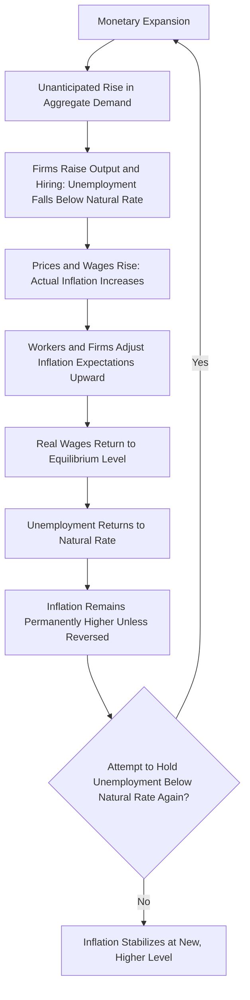

## Monetarism and the Quantity Theory Revival

### Overview

Monetarism is a school of macroeconomic thought, most closely associated with **Milton Friedman** and the **Chicago School**, that rose to prominence from the 1950s through the 1970s as a systematic challenge to the demand-management orthodoxy of Neoclassical Synthesis Keynesianism. Monetarism reasserted the centrality of the money supply in driving nominal economic outcomes, reviving and refining the older **Quantity Theory of Money** tradition with new theoretical rigor and, notably, extensive empirical and historical evidence.

### The Quantity Theory of Money: Foundations

The Quantity Theory of Money predates Monetarism by centuries, with roots traceable to early modern economists and later formalized by figures such as **Irving Fisher**. Its modern algebraic expression is the **equation of exchange**:

$$MV = PY$$

where:

- $M$ = the money supply
- $V$ = the velocity of money (the average number of times a unit of currency is spent on final goods and services in a given period)
- $P$ = the price level
- $Y$ = real output (real GDP)

This equation is an accounting identity by construction (total spending, $MV$, must equal total nominal transactions, $PY$), but the Quantity Theory becomes a substantive economic *theory* — rather than a mere identity — when combined with additional assumptions:

1. Velocity ($V$) is relatively stable, or at least predictable, in the short-to-medium run.
2. Real output ($Y$) is determined independently by supply-side factors (labor, capital, technology) and is not, in the long run, affected by the money supply — i.e., **money is neutral** in the long run.

Under these assumptions, changes in the money supply $M$ translate, in the long run, primarily into changes in the price level $P$, with limited or no lasting effect on real output.

### Friedman's Restatement of the Quantity Theory

**Milton Friedman**, in his 1956 essay "The Quantity Theory of Money: A Restatement," reformulated the classical Quantity Theory as a theory of the **demand for money**, rather than treating velocity as a fixed mechanical constant. Friedman argued that the demand for real money balances is a stable function of a small number of variables — primarily permanent income, and to a lesser extent interest rates and expected inflation — making velocity predictable (though not literally constant) and therefore making the relationship between money supply growth and nominal income growth reliable enough to serve as a basis for policy.

[Inference] This restatement was significant because it recast the Quantity Theory not as a rigid mechanical identity but as a testable economic theory grounded in a stable money-demand function, positioning Monetarism as offering rigorous microeconomic-style reasoning about money demand comparable in ambition to Keynesian consumption-function theorizing about aggregate demand.

### Core Monetarist Propositions

**Key Points**

- **Inflation is fundamentally a monetary phenomenon.** Friedman's famous dictum — "inflation is always and everywhere a monetary phenomenon" — holds that sustained inflation cannot occur without, and is ultimately caused by, growth in the money supply exceeding the growth of real output.
- **Money supply changes are the primary driver of nominal GDP fluctuations**, and, importantly, changes in the money supply were argued to have significant *real* short-run effects on output and employment (unlike the pure long-run neutrality result), operating with a lag before their effects fully show up in prices.
- **Monetary policy operates with "long and variable lags."** Friedman argued that the time between a change in monetary policy and its effect on the economy is both lengthy and unpredictable in duration, making it very difficult for policymakers to fine-tune the economy through discretionary, real-time adjustments to the money supply without risking destabilizing the economy further (e.g., stimulating an economy that has already begun to recover on its own, worsening a subsequent boom-bust cycle).
- **Rules over discretion.** Because of these lags and the risk of policy error, Friedman advocated for **rules-based monetary policy** rather than discretionary fine-tuning — most famously proposing a **constant money supply growth rate rule** (sometimes called the "k-percent rule"), under which the central bank would commit to growing the money supply at a fixed, pre-announced rate regardless of short-run economic conditions, in order to provide a predictable nominal anchor and avoid policy-induced instability.

### Historical and Empirical Foundations

A major pillar of Monetarism's influence was empirical and historical, most prominently Friedman and Anna Schwartz's *A Monetary History of the United States, 1867–1960* (1963), which argued that monetary policy errors — specifically, a severe contraction of the money supply by the Federal Reserve — were a primary cause of the severity and duration of the Great Depression, rather than viewing the Depression purely as a failure of aggregate demand requiring fiscal remedy as emphasized in Keynesian accounts.

[Inference] This reinterpretation of the Depression's causes was significant for the broader Monetarist-Keynesian debate, because it shifted analytical and policy attention toward the role of the central bank and monetary policy as a potential cause of (and cure for) severe downturns, somewhat independently of the fiscal-policy-centered Keynesian narrative, though most subsequent scholarship treats both monetary contraction and demand-side factors as having contributed to the Depression's severity to varying degrees, a matter still subject to ongoing historical and economic research.

### The Natural Rate of Unemployment and the Monetarist Critique of the Phillips Curve

One of Monetarism's most influential theoretical contributions was the challenge to the **Phillips Curve** — the empirically observed inverse relationship between inflation and unemployment that had suggested a stable, policy-exploitable trade-off during the 1950s–60s.

Friedman (1968) and, independently, **Edmund Phelps**, argued that any such trade-off could only be temporary. They introduced the concept of the **natural rate of unemployment** (later generalized as the **NAIRU**, or non-accelerating inflation rate of unemployment): the unemployment rate consistent with stable inflation, determined by structural and frictional features of the labor market rather than by monetary policy.

**Key Points**

- If policymakers attempt to hold unemployment below the natural rate through sustained monetary expansion, workers and firms will initially be fooled by rising prices into supplying more labor and output (since real wages appear, temporarily, more favorable than they are), reducing measured unemployment below its natural rate.
- However, once workers and firms adjust their **inflation expectations** upward to reflect the higher actual inflation, the temporary output/employment gains disappear, and unemployment returns to its natural rate — but now at a permanently higher rate of inflation.
- Repeating this process to hold unemployment persistently below the natural rate would require *continuously accelerating* inflation, not merely a one-time jump — hence "non-accelerating inflation rate of unemployment."
- This implies that the long-run Phillips Curve is **vertical** at the natural rate of unemployment: in the long run, there is no trade-off between inflation and unemployment; monetary policy can influence the inflation rate but not the sustainable long-run unemployment rate.

### Illustration: Short-Run vs. Long-Run Phillips Curve (svg_diagram)

<svg xmlns="http://www.w3.org/2000/svg" viewBox="0 0 640 420">
<text x="320" y="26" text-anchor="middle" font-size="16" font-weight="bold" fill="#1a1a1a">Short-Run vs. Long-Run Phillips Curve (svg_diagram)</text>
<line x1="90" y1="360" x2="580" y2="360" stroke="#333" stroke-width="2" />
<line x1="90" y1="360" x2="90" y2="60" stroke="#333" stroke-width="2" />
<text x="580" y="380" text-anchor="middle" font-size="12" fill="#333">Unemployment Rate</text>
<text x="55" y="55" text-anchor="middle" font-size="12" fill="#333">Inflation</text>
<text x="55" y="70" text-anchor="middle" font-size="12" fill="#333">Rate</text>
<line x1="330" y1="360" x2="330" y2="70" stroke="#b03a3a" stroke-width="2.5" />
<text x="330" y="55" text-anchor="middle" font-size="12" fill="#b03a3a">Long-Run Phillips Curve (vertical at natural rate)</text>
<text x="330" y="385" text-anchor="middle" font-size="11" fill="#b03a3a">Natural Rate of Unemployment</text>
<path d="M 150 150 Q 330 250 500 320" stroke="#2c5f8a" stroke-width="2" fill="none" />
<text x="180" y="140" text-anchor="middle" font-size="11" fill="#2c5f8a">SRPC (low expected inflation)</text>
<path d="M 150 90 Q 330 190 500 260" stroke="#3b7d3b" stroke-width="2" fill="none" stroke-dasharray="6,4" />
<text x="180" y="80" text-anchor="middle" font-size="11" fill="#3b7d3b">SRPC (higher expected inflation)</text>
<circle cx="330" cy="228" r="4" fill="#000" />
<circle cx="330" cy="168" r="4" fill="#000" />
<line x1="330" y1="228" x2="330" y2="168" stroke="#000" stroke-width="1" stroke-dasharray="2,2" />
<text x="360" y="200" font-size="10" fill="#000">Vertical shift as expectations adjust</text>
</svg>

### Policy Prescriptions and Their Influence

**Key Points**

- Monetarism's rules-based prescription (steady, predictable money supply growth) directly influenced central bank practice in several countries during the late 1970s and early 1980s, most notably the U.S. Federal Reserve under **Paul Volcker**, which adopted explicit monetary targeting as part of its strategy to combat the high inflation of the era, contributing to the disinflation of the early 1980s (albeit at the cost of a severe recession).
- [Inference] Monetarist ideas also influenced the broader intellectual shift toward central bank independence and a primary focus on price stability as the main objective of monetary policy, features that remain embedded in the mandates of many contemporary central banks, even as strict money-supply-growth targeting itself was later largely abandoned in practice.
- The experience of the 1970s–1980s revealed practical difficulties with strict monetarist rules: the relationship between measured money supply aggregates and nominal income (i.e., velocity) proved less stable in practice than Monetarist theory had assumed, particularly as financial innovation altered the behavior of monetary aggregates — a development that contributed to most central banks shifting toward interest-rate-based policy frameworks (e.g., inflation targeting via a policy interest rate) rather than direct money supply targets from the 1990s onward.

### Monetarism's Relationship to Later Macroeconomic Schools

[Inference] Monetarism served as an important intellectual bridge between Keynesian orthodoxy and the subsequent New Classical revolution: both Monetarism and New Classical economics shared skepticism toward activist, discretionary demand-management policy and emphasized the limits of policymakers' ability to systematically improve on market outcomes, but New Classical economics went further by incorporating rational expectations and arguing that even monetary policy's short-run real effects (which Monetarism had acknowledged) could be undermined if policy changes were fully anticipated by rational agents — a distinction sometimes summarized as Monetarism accepting short-run non-neutrality of money due to imperfect information/adaptive expectations, while New Classical economics under rational expectations argued that only *unanticipated* monetary policy could have real effects at all.

### Summary Comparison: Monetarism vs. Keynesian Orthodoxy (Pre-1970s)

| Dimension | Keynesian (Neoclassical Synthesis) View | Monetarist View |
| --- | --- | --- |
| Primary driver of nominal income | Aggregate demand (fiscal and monetary) | Money supply growth |
| Inflation causes | Multiple: demand-pull, cost-push, structural factors | Fundamentally monetary in origin |
| Phillips Curve | Stable, exploitable long-run trade-off | Vertical in the long run at the natural rate |
| Preferred policy tool | Fiscal policy (active demand management) | Monetary policy (steady, rules-based) |
| Policy approach | Discretionary fine-tuning | Rules over discretion |
| View of the Great Depression | Primarily a failure of aggregate demand | Substantially a monetary policy failure |

**Related Topics**

- Quantity Theory of Money and the equation of exchange
- Friedman and Schwartz's *A Monetary History of the United States*
- Natural rate of unemployment and NAIRU
- Phillips Curve: short-run vs. long-run
- Adaptive expectations vs. rational expectations
- Rules vs. discretion in monetary policy design
- Central bank independence and inflation targeting
- Velocity of money and its stability
- New Classical economics and the rational expectations revolution
- Paul Volcker and the 1979–1982 disinflation