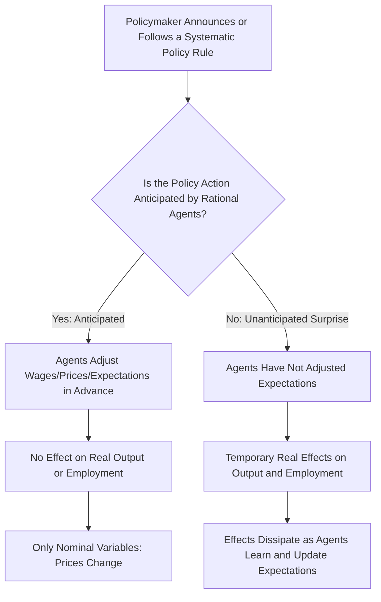

## New Classical Economics and Rational Expectations

### Overview

New Classical economics emerged in the 1970s as a rigorous, mathematically formal challenge to both Keynesian orthodoxy and, in certain respects, to Monetarism, built around a single foundational methodological commitment: that economic agents form expectations about the future **rationally**, using all available information efficiently, and that markets clear continuously through flexible prices and wages. Associated principally with **Robert Lucas**, **Thomas Sargent**, **Robert Barro**, and **Neil Wallace**, New Classical economics reintroduced Classical-style market-clearing assumptions into a technically sophisticated, dynamic, microfounded framework, fundamentally reshaping the methodology of macroeconomics.

### The Rational Expectations Hypothesis

The **rational expectations hypothesis (REH)**, originally proposed by **John Muth** (1961) in the context of microeconomic price theory and later imported into macroeconomics by Lucas, holds that agents' subjective expectations about future economic variables are, on average, consistent with the true underlying probability distribution of those variables — that is, agents do not make *systematic* forecasting errors, and their expectations fully incorporate all publicly available, relevant information, including their understanding of how the economy and policy actually work.

**Key Points**

- Rational expectations does not imply perfect foresight; agents can and do make forecasting errors, but these errors are assumed to be random and unpredictable (unbiased), not systematically repeated in the same direction.
- This contrasts with earlier **adaptive expectations** models (used, for example, in early Monetarist and Phillips Curve analysis), in which agents form expectations by extrapolating from past experience (e.g., expected inflation equals a weighted average of past observed inflation), which can generate persistent, systematic forecasting errors if the underlying economic environment changes.
- Formally, under rational expectations, the expectation of a variable $X_{t+1}$ formed at time $t$, denoted $E_t[X_{t+1}]$, satisfies:

$$X_{t+1} = E_t[X_{t+1}] + \varepsilon_{t+1}$$

where $\varepsilon_{t+1}$ is a random forecast error with an expected value of zero and is uncorrelated with information available at time $t$ — meaning agents cannot systematically improve their forecasts using information they already possess.

### The Lucas Critique

Perhaps the single most influential methodological contribution of New Classical economics is the **Lucas critique**, presented in Robert Lucas's 1976 paper "Econometric Policy Evaluation: A Critique."

**Key Points**

- The Lucas critique argues that the parameters of empirically estimated macroeconomic relationships (such as a Phillips Curve or a consumption function estimated on historical data) are not structural, policy-invariant constants; rather, they reflect the optimal decision rules of rational agents *given the specific policy regime that prevailed when the data were generated*.
- If policymakers use such a historically estimated relationship to predict the effects of a *new*, different policy, the prediction will generally be unreliable, because rational agents will adjust their behavior (and their expectations) in response to the new policy regime itself — causing the previously estimated relationship to shift or break down.
- **Example**: Suppose historical data show a stable Phillips Curve trade-off, seemingly suggesting that policymakers could permanently lower unemployment by tolerating a bit more inflation. If a central bank tries to systematically exploit this apparent trade-off through sustained monetary expansion, rational agents will come to expect the resulting higher inflation, adjusting wage and price-setting behavior accordingly — causing the previously observed trade-off to disappear, exactly as the New Classical (and Monetarist) natural-rate analysis predicts.
- The critique's broader methodological implication was that only models built from "deep," policy-invariant structural parameters — describing preferences, technology, and market constraints, derived from individual optimization — could reliably be used to evaluate the effects of policy changes that have no historical precedent. This became a major impetus for the shift toward microfounded macroeconomic modeling across the discipline, not only within New Classical economics itself.

### The Policy Ineffectiveness Proposition

Combining rational expectations with continuously clearing markets produces one of New Classical economics's most striking and controversial results: the **policy ineffectiveness proposition**, developed primarily by **Thomas Sargent** and **Neil Wallace** (1975, 1976).

**Key Points**

- If agents form expectations rationally and if wages and prices are fully flexible, then any **systematic, anticipated** monetary policy action — one that follows a rule or pattern agents can predict — will be fully incorporated into wage and price expectations *before* it takes effect, and will therefore have no effect on real variables such as output and employment; it will affect only nominal variables (prices).
- Only **unanticipated ("surprise") policy actions** — deviations from an expected rule that agents could not have predicted — can have real short-run effects on output and employment, and even these effects are inherently temporary, since agents will incorporate the new information into their expectations going forward.
- This result directly challenged the Keynesian (and, to a lesser extent, Monetarist) presumption that systematic countercyclical demand management could reliably and repeatedly stabilize output and employment — if agents rationally anticipate a systematic stabilization policy, its real effects are neutralized by construction.

### The Lucas Aggregate Supply Function

Lucas formalized the idea that only unanticipated price-level changes affect real output through the **Lucas "surprise" aggregate supply function**, commonly expressed in a simplified form as:

$$Y_t = Y^* + \alpha (P_t - E_{t-1}[P_t])$$

where $Y_t$ is actual output, $Y^*$ is the natural (potential) level of output, $P_t$ is the actual price level, $E_{t-1}[P_t]$ is the expectation of the price level formed in the previous period, and $\alpha > 0$ is a sensitivity parameter.

**Key Points**

- Output deviates from its natural level only in response to the *unanticipated* component of the price level, $(P_t - E_{t-1}[P_t])$; if the price level turns out exactly as expected, output remains at $Y^*$ regardless of the actual level of prices.
- This equation elegantly formalizes the policy ineffectiveness proposition: since rational agents cannot be systematically fooled by policy actions they can anticipate, only genuinely unexpected shocks (including unexpected policy shifts) generate real output effects.
- [Inference] Because unanticipated price changes are, by construction, unpredictable and transitory, this framework implies that any real effects of demand-side (including monetary) policy are inherently short-lived and cannot be systematically or repeatedly exploited by policymakers over time.

### Real Business Cycle (RBC) Theory

New Classical economics's emphasis on continuously clearing markets and rational, optimizing agents was extended into a full theory of business cycles by **Finn Kydland** and **Edward Prescott**, in what became known as **Real Business Cycle (RBC) theory**.

**Key Points**

- RBC theory explains business cycle fluctuations (booms and recessions) as the efficient, market-clearing response of rational agents to **real** (non-monetary) shocks — most centrally, **total factor productivity (technology) shocks** — rather than as market failures or demand deficiencies requiring correction.
- In RBC models, a positive technology shock raises the marginal product of labor and capital, leading rational agents to voluntarily choose to work and invest more during the temporarily more productive period (an intertemporal substitution of labor and consumption), generating an economic expansion; a negative shock produces the reverse.
- Because fluctuations in RBC theory arise from agents' *optimal* responses to real shocks in a fully competitive, market-clearing economy, they are interpreted as **efficient** outcomes — not as problems calling for government stabilization policy, a conclusion sharply at odds with the Keynesian view of recessions as demand-driven market failures.
- [Inference] RBC theory represented, in some respects, the most extreme form of the New Classical program, essentially reviving a fully Classical, supply-side interpretation of business cycles using modern dynamic stochastic general equilibrium (DSGE) mathematical methods — methods that were subsequently adopted, in modified form, even by New Keynesian economists who reached very different substantive conclusions about the causes of business cycles and the desirability of stabilization policy.

### Methodological Legacy: Microfoundations and DSGE Modeling

**Key Points**

- Beyond its specific substantive conclusions (many of which remain disputed), New Classical economics's most enduring legacy is arguably methodological: it established that macroeconomic models should be built from the explicit optimization problems of individual households and firms (microfoundations), with model parameters interpreted as structural (representing preferences and technology) rather than as purely statistical, reduced-form estimates.
- This methodological standard — dynamic, stochastic, general equilibrium (DSGE) modeling with rational expectations — became, and largely remains, the dominant technical framework across mainstream macroeconomics, adopted by New Keynesian economists (who add nominal rigidities to an otherwise New Classical-style framework) as much as by RBC theorists.
- [Inference] In this sense, even schools of macroeconomic thought that reject New Classical policy conclusions (e.g., New Keynesian economists, who argue that monetary policy *can* have systematic real effects due to nominal rigidities) largely accept the New Classical methodological insistence on rational expectations and explicit microfoundations as the appropriate standard for rigorous macroeconomic modeling — representing a significant and lasting shift in how the discipline as a whole approaches model-building, regardless of ongoing substantive disagreements.

### Illustration: New Classical Model Architecture (svg_diagram)

<svg xmlns="http://www.w3.org/2000/svg" viewBox="0 0 700 380">
<text x="350" y="26" text-anchor="middle" font-size="16" font-weight="bold" fill="#1a1a1a">New Classical Model Architecture (svg_diagram)</text>
<rect x="60" y="60" width="220" height="50" rx="6" fill="#2c5f8a" />
<text x="170" y="90" text-anchor="middle" font-size="12" fill="#fff">Rational Expectations</text>
<rect x="420" y="60" width="220" height="50" rx="6" fill="#3b7d3b" />
<text x="530" y="90" text-anchor="middle" font-size="12" fill="#fff">Continuous Market Clearing</text>
<line x1="170" y1="110" x2="350" y2="160" stroke="#555" stroke-width="1.5" />
<line x1="530" y1="110" x2="350" y2="160" stroke="#555" stroke-width="1.5" />
<rect x="240" y="160" width="220" height="50" rx="6" fill="#6a3b8a" />
<text x="350" y="190" text-anchor="middle" font-size="12" fill="#fff">Microfounded General Equilibrium</text>
<line x1="350" y1="210" x2="350" y2="240" stroke="#555" stroke-width="1.5" />
<rect x="240" y="240" width="220" height="50" rx="6" fill="#8a4b2c" />
<text x="350" y="270" text-anchor="middle" font-size="12" fill="#8a4b2c" fill-opacity="0" />
<text x="350" y="270" text-anchor="middle" font-size="12" fill="#fff">Policy Ineffectiveness Proposition</text>
<line x1="350" y1="290" x2="200" y2="330" stroke="#555" stroke-width="1.5" />
<line x1="350" y1="290" x2="500" y2="330" stroke="#555" stroke-width="1.5" />
<rect x="100" y="330" width="200" height="40" rx="6" fill="#b03a3a" />
<text x="200" y="355" text-anchor="middle" font-size="11" fill="#fff">Only Surprises Matter (Monetary)</text>
<rect x="400" y="330" width="200" height="40" rx="6" fill="#c07a2c" />
<text x="500" y="355" text-anchor="middle" font-size="11" fill="#fff">Real Shocks Drive Cycles (RBC)</text>
</svg>

### Critiques and Limitations of New Classical Economics

[Inference] New Classical economics has faced sustained criticism on several fronts, which contributed to the subsequent development of New Keynesian economics as a partial counter-response:

- **Empirical challenges**: Critics argued that the policy ineffectiveness proposition and RBC theory struggled to explain the apparent persistence and severity of real-world recessions (including sustained periods of high unemployment) using only unanticipated shocks or technology-driven fluctuations, particularly given that measured productivity often appears to *fall* during recessions rather than serving as their primary cause, which some viewed as more consistent with demand-driven explanations.
- **The continuous market-clearing assumption**: Many economists found the assumption of instantaneously flexible wages and prices empirically implausible, given extensive evidence of nominal rigidities (e.g., infrequent price adjustment, downward wage rigidity) in actual labor and product markets — a critique that directly motivated the New Keynesian program of building nominal rigidities into an otherwise New Classical-style, rational-expectations, microfounded model.
- [Unverified] The relative empirical success of New Classical/RBC models versus New Keynesian models in explaining specific historical episodes (e.g., the 2008 financial crisis) remains a subject of active debate and technical dispute among macroeconomists, without full consensus on the matter.

**Related Topics**

- Lucas critique and the case for structural/microfounded models
- Policy ineffectiveness proposition (Sargent and Wallace)
- Real Business Cycle (RBC) theory and technology shocks
- Rational expectations vs. adaptive expectations
- New Keynesian economics and nominal rigidities
- Dynamic Stochastic General Equilibrium (DSGE) modeling
- Natural rate of unemployment and the vertical long-run Phillips Curve
- Time inconsistency and the credibility of monetary policy (Kydland and Prescott)
- Intertemporal substitution of labor
- Monetarism as a precursor to New Classical economics