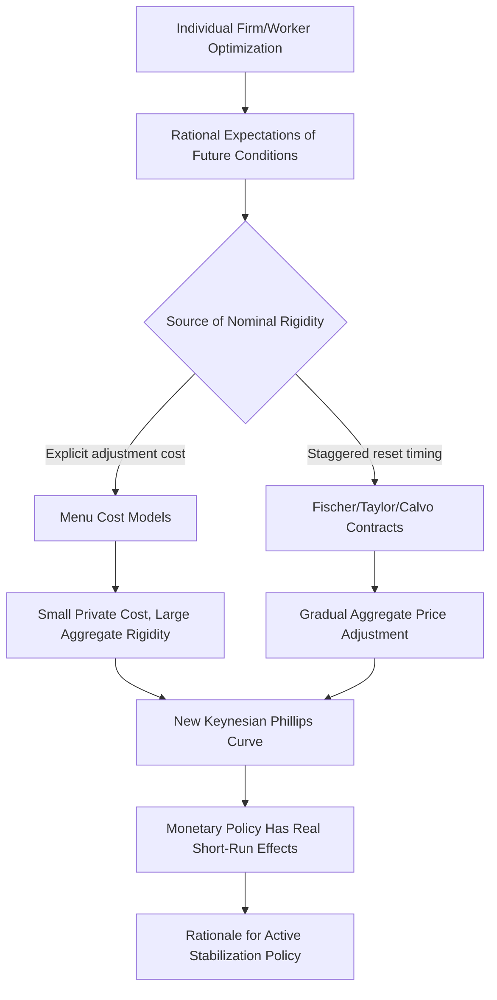

## New Keynesian Economics and Price Rigidities

### Overview

New Keynesian economics emerged in the 1980s and 1990s as a response to the New Classical challenge, seeking to retain the core Keynesian conclusion — that aggregate demand shocks and stabilization policy can have meaningful, systematic real effects on output and employment — while adopting the methodological rigor demanded by New Classical critics: rational expectations and explicit microfoundations. Associated with economists including **N. Gregory Mankiw**, **Olivier Blanchard**, **George Akerlof**, **Michael Woodford**, **Julio Rotemberg**, and others, New Keynesian economics is distinguished by its explanation of **nominal rigidities** — sticky prices and wages — as rational, optimizing responses to microeconomic frictions, rather than as arbitrary or ad hoc assumptions.

### The Central Problem: Answering the Lucas Critique Without Abandoning Keynesian Conclusions

The Lucas critique and the policy ineffectiveness proposition had argued that if agents form rational expectations and markets clear continuously, systematic monetary policy cannot have real effects on output. New Keynesian economists accepted the rational expectations methodology but rejected the assumption of continuous market clearing, arguing instead that **nominal prices and wages adjust slowly**, for reasons that are themselves the rational, optimizing response of individual price- and wage-setters to genuine microeconomic costs and frictions.

**Key Points**

- If prices and wages are sticky, then even a fully anticipated change in the money supply or aggregate demand cannot be instantly absorbed through price adjustment; some of the adjustment must instead occur through changes in real output and employment, at least in the short run.
- This restores a meaningful role for monetary (and fiscal) policy in stabilizing output, but does so within a framework that satisfies the New Classical demand for microfounded, rational-expectations-consistent modeling — rather than simply asserting stickiness as an unexplained assumption, as earlier Keynesian models had often done.

### Menu Costs: Microfounding Price Stickiness

One of the most influential New Keynesian explanations for price stickiness is the theory of **menu costs**, developed by economists including **N. Gregory Mankiw** and **Julio Rotemberg**.

**Key Points**

- A **menu cost** is any small cost a firm incurs when changing its posted price — the literal cost of reprinting a menu (the term's namesake), but more broadly encompassing costs such as updating price tags, renegotiating contracts, informing customers, or simply the managerial time and attention required to decide on and implement a price change.
- Menu cost theory shows that even very small per-firm costs of price adjustment can generate substantial **aggregate** price stickiness and correspondingly large real effects from nominal demand shocks — a result sometimes summarized as "small individual costs, large aggregate consequences," because a firm's private incentive to adjust its price in response to a small shock may be very weak (the firm loses little profit by leaving its price temporarily "wrong"), even though the *aggregate* consequence of many firms simultaneously failing to adjust can be a significant deviation of aggregate output from its natural level.
- [Inference] This asymmetry between small private costs of inaction and potentially large social costs of aggregate price rigidity is a key theoretical insight distinguishing New Keynesian menu-cost models from a naive view that price stickiness must require large adjustment costs to be economically significant.

### Staggered Price and Wage Setting

A second major class of New Keynesian models explains aggregate price stickiness not through explicit costs of changing prices, but through the **staggered timing** of individual price- or wage-setting decisions across different firms or workers in the economy.

**Key Points**

- **Fischer contracts** (Stanley Fischer, 1977) and **Taylor contracts** (John Taylor, 1979, 1980) model wage- or price-setting as occurring under multi-period contracts that are negotiated or reset only periodically, and — crucially — at different times for different firms or unions (staggered rather than synchronized).
- Because not all prices or wages reset simultaneously, the aggregate price level adjusts only gradually even if each individual price-setter is behaving optimally given the information and constraints available at their particular reset date; a firm setting a price today must consider that its price will remain fixed for some time, and so bases its decision partly on expectations of future economic conditions, not just current conditions.
- This staggering mechanism generates persistent, gradual aggregate price adjustment even though no single firm is assumed to face an explicit "cost" of changing its price — stickiness emerges from the *coordination structure* of price-setting across the economy, rather than from individual adjustment costs.
- The **Calvo pricing model** (Guillermo Calvo, 1983) is the most widely used modern formalization of staggered pricing in New Keynesian DSGE models: in each period, a random fraction of firms is assumed to have the opportunity to reset their price (with the probability of resetting typically treated as fixed and exogenous), while the remaining firms keep their prices unchanged — a stylized but highly tractable device for generating gradual aggregate price adjustment.

### The New Keynesian Phillips Curve

Combining a model of staggered or Calvo-style price-setting with rational expectations yields the **New Keynesian Phillips Curve (NKPC)**, a forward-looking relationship between current inflation and expected future inflation, along with a measure of real economic activity (commonly the output gap or real marginal cost):

$$\pi_t = \beta E_t[\pi_{t+1}] + \kappa x_t$$

where $\pi_t$ is current inflation, $E_t[\pi_{t+1}]$ is expected inflation next period, $\beta$ is a discount factor, $x_t$ is a measure of real economic slack (e.g., the output gap or real marginal cost), and $\kappa$ is a coefficient reflecting the degree of price stickiness (a smaller $\kappa$ implies stickier prices and a flatter curve).

**Key Points**

- Unlike the older, purely backward-looking (adaptive-expectations) Phillips Curve, the NKPC is explicitly **forward-looking**: current inflation depends on *expected future* inflation, because firms that reset prices today must consider how long their price will remain fixed and what economic conditions will prevail during that period.
- This forward-looking structure is derived directly from the optimization problem of price-setting firms under Calvo-style staggered pricing, giving the NKPC clear microfoundations, in contrast to the largely reduced-form, backward-looking Phillips Curve of earlier Keynesian and Monetarist analysis.
- [Inference] The NKPC has been influential in modern monetary policy analysis but has also faced significant empirical challenges — in particular, some studies have found that inflation dynamics appear to depend more on lagged (past) inflation than the purely forward-looking NKPC predicts, motivating "hybrid" versions of the curve that include both forward-looking and backward-looking (inertial) inflation terms; the degree to which any particular specification best fits observed inflation dynamics remains an actively researched empirical question.

### Illustration: Sources of Nominal Rigidity in New Keynesian Models (svg_diagram)

<svg xmlns="http://www.w3.org/2000/svg" viewBox="0 0 700 380">
<text x="350" y="26" text-anchor="middle" font-size="16" font-weight="bold" fill="#1a1a1a">Sources of Nominal Rigidity in New Keynesian Models (svg_diagram)</text>
<rect x="270" y="50" width="160" height="45" rx="6" fill="#555" />
<text x="350" y="78" text-anchor="middle" font-size="12" fill="#fff">Nominal Rigidity</text>
<line x1="350" y1="95" x2="180" y2="140" stroke="#555" stroke-width="1.5" />
<line x1="350" y1="95" x2="520" y2="140" stroke="#555" stroke-width="1.5" />
<rect x="80" y="140" width="200" height="45" rx="6" fill="#2c5f8a" />
<text x="180" y="168" text-anchor="middle" font-size="12" fill="#fff">Menu Cost Models</text>
<rect x="420" y="140" width="200" height="45" rx="6" fill="#3b7d3b" />
<text x="520" y="168" text-anchor="middle" font-size="12" fill="#fff">Staggered Contract Models</text>
<line x1="180" y1="185" x2="180" y2="220" stroke="#555" stroke-width="1.5" />
<rect x="80" y="220" width="200" height="45" rx="6" fill="#e8e8e8" stroke="#999" />
<text x="180" y="248" text-anchor="middle" font-size="11" fill="#1a1a1a">Cost of changing price</text>
<line x1="520" y1="185" x2="440" y2="220" stroke="#555" stroke-width="1.5" />
<line x1="520" y1="185" x2="600" y2="220" stroke="#555" stroke-width="1.5" />
<rect x="360" y="220" width="160" height="45" rx="6" fill="#e8e8e8" stroke="#999" />
<text x="440" y="248" text-anchor="middle" font-size="11" fill="#1a1a1a">Fischer/Taylor</text>
<rect x="530" y="220" width="140" height="45" rx="6" fill="#e8e8e8" stroke="#999" />
<text x="600" y="248" text-anchor="middle" font-size="11" fill="#1a1a1a">Calvo pricing</text>
<line x1="180" y1="265" x2="350" y2="310" stroke="#555" stroke-width="1.5" />
<line x1="440" y1="265" x2="350" y2="310" stroke="#555" stroke-width="1.5" />
<line x1="600" y1="265" x2="350" y2="310" stroke="#555" stroke-width="1.5" />
<rect x="220" y="310" width="260" height="45" rx="6" fill="#8a4b2c" />
<text x="350" y="338" text-anchor="middle" font-size="12" fill="#fff">New Keynesian Phillips Curve</text>
</svg>

### Wage Rigidity: Efficiency Wages and Implicit Contracts

Alongside price stickiness, New Keynesian economists developed microfounded explanations for **wage rigidity** — the observed reluctance of nominal (and sometimes real) wages to fall, even during periods of high unemployment.

**Key Points**

- **Efficiency wage theory** (associated with George Akerlof, Janet Yellen, and others) argues that firms may rationally choose to pay wages above the market-clearing level because higher wages improve worker productivity, effort, morale, or retention, or reduce costly turnover and shirking — meaning firms do not always cut wages in response to unemployment, even though doing so would, in a purely Classical model, restore labor market clearing.
- **Implicit contract theory** suggests that firms and workers implicitly agree to smooth wages over time (insuring workers against income volatility) in exchange for firms retaining flexibility in employment levels, meaning wages may remain stable even as economic conditions and labor demand fluctuate.
- **Insider-outsider models** suggest that "insider" workers (already employed, often unionized or otherwise possessing bargaining power) can negotiate wages that do not fully account for the interests of "outsider" unemployed workers seeking jobs, contributing to wage rigidity and persistent unemployment.

### The New Keynesian DSGE Model: Synthesis

The mature form of New Keynesian theory is embodied in the **New Keynesian DSGE (Dynamic Stochastic General Equilibrium) model**, which combines:

1. Optimizing households (choosing consumption, labor supply, and saving) under rational expectations, as in New Classical/RBC models.
2. Optimizing firms operating under monopolistic competition (rather than perfect competition), which gives individual firms some pricing power and makes the concept of a firm-level "price-setting decision" meaningful in the first place.
3. Nominal rigidities (via menu costs, Calvo pricing, or similar mechanisms), generating a New Keynesian Phillips Curve.
4. A monetary policy rule, most commonly a **Taylor rule**, specifying how the central bank sets its policy interest rate in response to deviations of inflation from target and output from potential.

**Key Points**

- This three-equation core — an IS-type equation (aggregate demand), the New Keynesian Phillips Curve (aggregate supply/inflation dynamics), and a monetary policy rule — forms the basic skeleton of most modern New Keynesian models used for both academic research and central bank policy analysis.
- Because the model is built from explicit microfoundations with rational expectations, it is designed to be robust to the Lucas critique, allowing (in principle) meaningful evaluation of alternative monetary policy rules — a central use case for such models at central banks.
- [Inference] The New Keynesian DSGE framework has become the dominant workhorse model in mainstream academic and central bank macroeconomics since the 1990s, though it has also faced substantial post-2008 criticism for its limited ability, in standard specifications, to incorporate financial-sector frictions and generate financial crises endogenously — criticism that has spurred significant extensions of the framework (e.g., incorporating banking sectors, collateral constraints, and heterogeneous agents) rather than its wholesale abandonment.

### Summary: New Keynesian vs. New Classical

| Dimension | New Classical / RBC | New Keynesian |
| --- | --- | --- |
| Expectations | Rational | Rational |
| Microfoundations | Yes | Yes |
| Market clearing | Continuous (flexible prices/wages) | Sluggish (sticky prices/wages) |
| Source of business cycles | Real (technology) shocks | Demand shocks interacting with nominal rigidities |
| Effect of anticipated monetary policy | None (policy ineffectiveness) | Can have real effects due to stickiness |
| View of recessions | Efficient market responses | Market failures; involuntary output/employment losses |
| Case for stabilization policy | Weak or none | Present, though subject to lags, uncertainty, and credibility concerns |

**Related Topics**

- Menu cost models and the aggregate consequences of small price-adjustment costs
- Calvo pricing and staggered contract models (Fischer, Taylor)
- New Keynesian Phillips Curve: forward-looking inflation dynamics
- Efficiency wage theory and insider-outsider models
- Taylor rule and monetary policy design
- Monopolistic competition in macroeconomic models
- Three-equation New Keynesian model (IS, NKPC, policy rule)
- Post-2008 extensions: financial frictions and banking in DSGE models
- Rational expectations and the Lucas critique
- Hybrid Phillips Curve specifications and inflation persistence