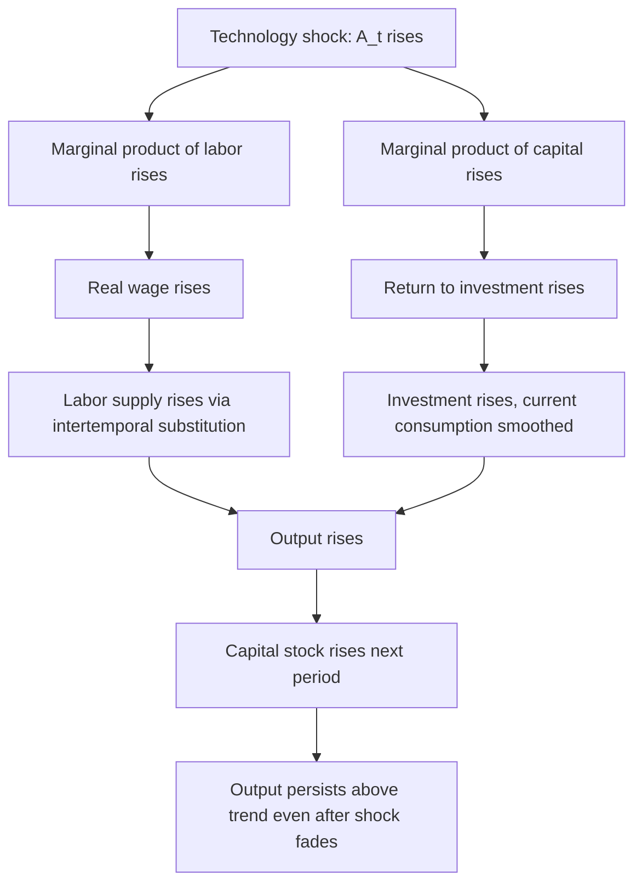
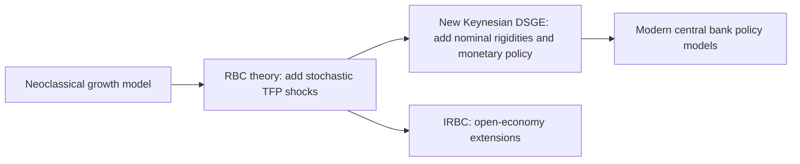

## Real Business Cycle Theory

### Overview and Historical Origins

Real Business Cycle (RBC) theory is a macroeconomic framework that explains business cycle fluctuations—the recurring expansions and contractions in aggregate economic activity—as the efficient, optimal response of rational agents to real (non-monetary) shocks, primarily shocks to technology and productivity. The theory emerged from the New Classical school of macroeconomics in the early 1980s, developed principally by Finn Kydland and Edward Prescott, whose 1982 paper "Time to Build and Aggregate Fluctuations" is considered the foundational work. Kydland and Prescott were awarded the Nobel Memorial Prize in Economic Sciences in 2004 largely for this contribution.

RBC theory arose as a direct challenge to Keynesian business cycle theory, which attributes fluctuations to demand-side shocks, nominal rigidities (sticky wages and prices), and market failures requiring government intervention. RBC theorists instead argued that business cycles could be understood as equilibrium phenomena—outcomes of a competitive, frictionless economy responding optimally to real disturbances, with no market failure, no involuntary unemployment, and no need for stabilization policy.

### Core Theoretical Claims

**Key Points**

- Business cycles are driven primarily by real supply-side shocks, especially total factor productivity (TFP) shocks, rather than monetary or demand-side shocks.
- Markets clear continuously; prices and wages are fully flexible.
- Agents (households and firms) are rational optimizers with rational expectations.
- Observed fluctuations in output, employment, consumption, and investment represent the economy's efficient response to shocks, not a deviation from an efficient outcome.
- Money is largely neutral; it plays no meaningful causal role in generating real fluctuations.
- Government stabilization policy is unnecessary or even harmful, since the economy is already at (or near) its efficient outcome.

This last claim is the theory's most controversial: unemployment during a recession under RBC is treated as voluntary and efficient—workers optimally choosing to substitute leisure for labor when the real wage (reflecting current low productivity) is temporarily lower, expecting to work more when future productivity and wages are expected to be higher. This is termed the **intertemporal substitution of labor**.

### The Basic RBC Model Structure

The canonical RBC model builds on the neoclassical (Ramsey-Cass-Koopmans) growth model, adding stochastic productivity shocks. The representative agent framework has several core components:

**1. Representative Household**

The household maximizes expected lifetime utility over consumption $C_t$ and leisure $1 - N_t$ (where $N_t$ is labor supplied):

$$E_0 \sum_{t=0}^{\infty} \beta^t U(C_t, 1 - N_t)$$

where $\beta \in (0,1)$ is the subjective discount factor and $U(\cdot)$ is a period utility function, typically assumed separable and satisfying standard concavity conditions.

**2. Production Technology**

A representative firm produces output using a Cobb-Douglas production function subject to a stochastic productivity term:

$$Y_t = A_t K_t^{\alpha} N_t^{1-\alpha}$$

where $Y_t$ is output, $K_t$ is capital, $N_t$ is labor, $\alpha \in (0,1)$ is capital's share of income, and $A_t$ is total factor productivity (TFP), the exogenous "technology shock."

**3. The Technology Shock Process**

$A_t$ is typically modeled as following a first-order autoregressive process in logs:

$$\ln A_t = \rho \ln A_{t-1} + \varepsilon_t$$

where $\rho \in (0,1)$ captures persistence and $\varepsilon_t$ is an i.i.d. innovation, often assumed normally distributed with mean zero. The persistence parameter $\rho$ is critical: it determines how long a shock's effects propagate through the economy.

**4. Capital Accumulation**

$$K_{t+1} = (1-\delta)K_t + I_t$$

where $\delta$ is the depreciation rate and $I_t$ is investment.

**5. Resource Constraint**

$$Y_t = C_t + I_t$$

(In models without government, or $Y_t = C_t + I_t + G_t$ when government spending shocks are included.)

**6. Equilibrium**

The competitive equilibrium coincides with the solution to a social planner's problem maximizing household utility subject to the resource and capital accumulation constraints—a direct consequence of the First Welfare Theorem holding in this frictionless environment. This is what permits RBC modelers to compute equilibrium allocations by solving a planner's optimization problem rather than a decentralized market equilibrium, substantially simplifying the mathematics.

### The Transmission Mechanism

**Key Points**

1. A positive TFP shock ($\varepsilon_t > 0$) raises the marginal product of both labor and capital.
2. Higher marginal product of labor raises the real wage, inducing households to supply more labor (intertemporal substitution: work more now while wages are temporarily high).
3. Higher marginal product of capital raises the return to investment, inducing higher current investment and lower current consumption (consumption smoothing means the extra output is partly saved).
4. Output, employment, investment, and consumption all rise together, and this comovement is a key stylized business cycle fact the model attempts to replicate.
5. The persistence of the shock ($\rho$) combined with capital accumulation dynamics generates output persistence beyond the life of the shock itself—capital built during the boom continues to raise output for several periods after the shock has faded.

The following diagram summarizes the causal chain from shock to aggregate outcomes:

### Calibration and Quantitative Methodology

RBC theory introduced a distinctive methodology to macroeconomics: **calibration**, as opposed to traditional econometric estimation. Rather than statistically estimating parameters from macro time series, Kydland and Prescott calibrated model parameters (such as $\alpha$, $\beta$, $\delta$) using values drawn from microeconomic studies, national income accounting ratios (e.g., capital's share of output, the investment-output ratio), and steady-state growth facts.

**Standard Calibration Approach**

- $\alpha$ (capital share) is set to match the labor share of national income (roughly 0.64–0.70 in developed economies, so $\alpha \approx 0.30$–$0.36$).
- $\beta$ is set so the model's steady-state real interest rate matches historical averages (e.g., $\beta \approx 0.96$–$0.99$ annually).
- $\delta$ is set to match observed depreciation rates of the capital stock (often around 0.025 quarterly or 0.10 annually).
- $\rho$ and the standard deviation of $\varepsilon_t$ are estimated from Solow-residual-based measures of TFP.

Once calibrated, the model is solved (via log-linearization or other numerical techniques around the steady state) and simulated repeatedly. The resulting artificial time series for output, consumption, investment, and hours worked are compared to actual data using **second moments**—standard deviations, relative volatilities, and cross-correlations—rather than formal hypothesis tests. A model is judged successful if its simulated moments approximate real-world business cycle statistics (the "stylized facts"), such as:

- Investment being more volatile than output.
- Consumption being less volatile than output.
- Hours worked and output being strongly procyclical.
- Real wages being mildly procyclical.

**[Inference]** This moment-matching approach is widely characterized in the literature as a deliberate methodological departure from testing statistical null hypotheses, prioritizing a model's ability to replicate qualitative and quantitative business cycle regularities.

### The Solow Residual and Measuring "Technology Shocks"

TFP shocks in RBC models are typically operationalized empirically via the **Solow residual**:

$$\ln A_t = \ln Y_t - \alpha \ln K_t - (1-\alpha) \ln N_t$$

This is the portion of output growth not explained by measured growth in capital and labor inputs. RBC proponents interpret this residual as a measure of exogenous technological change. This interpretation has been one of the most heavily criticized aspects of the theory (see Critiques below), since the Solow residual also picks up changes in labor effort, capacity utilization, measurement error, and other non-technological factors.

### Key Extensions to the Basic Model

**Indivisible Labor (Hansen, 1985)**

Gary Hansen's extension introduced indivisible labor—workers either work a fixed number of hours or do not work at all, with employment determined via lotteries—to help the model generate larger fluctuations in total hours worked relative to fluctuations in the real wage, better matching the empirically low elasticity of wages relative to hours over the cycle.

**Government Spending Shocks**

Extensions incorporate stochastic government purchases $G_t$ as an additional real shock, since increased government spending (financed by non-distortionary lump-sum taxes, in the simplest versions) creates a negative wealth effect that induces households to work more, generating output and employment comovements from a purely fiscal, non-technological source.

**Home Production**

Models incorporating a home production sector (time allocated to non-market household production) help address the intertemporal substitution puzzle by providing an additional margin of substitution between market work, home work, and leisure.

**Variable Capital Utilization**

Allowing firms to vary the intensity of capital utilization (not just the capital stock) amplifies the propagation of shocks and helps address the "unrealistically large" technology shocks the basic model sometimes requires to match observed output volatility.

**International RBC (IRBC) Models**

Extensions to open-economy settings examine cross-country comovements, terms-of-trade shocks, and international risk-sharing, forming a bridge to modern open-economy DSGE modeling.

### RBC Theory in the Broader DSGE Lineage

RBC theory is historically and methodologically the direct ancestor of modern **Dynamic Stochastic General Equilibrium (DSGE)** models. The core RBC framework—optimizing agents, rational expectations, stochastic shocks, general equilibrium, numerical solution and simulation methods—was subsequently adopted by New Keynesian economists, who added nominal rigidities (sticky prices via Calvo pricing, sticky wages, monopolistic competition) and monetary policy rules (e.g., Taylor rules) onto the RBC skeleton. This produced the New Keynesian DSGE models that dominate contemporary central bank macroeconomic modeling. In this sense, RBC theory's *methodology* achieved lasting influence even as many of its specific *substantive conclusions* (frictionless markets, policy irrelevance) were rejected or heavily modified by the mainstream that followed it.

### Major Critiques of RBC Theory

**Key Points**

1. **The nature of technology shocks.** Critics question whether large, negative technology shocks (implying that firms actively "forget" production knowledge) are a plausible driver of recessions. Identifying genuine recessionary episodes with negative TFP shocks strains credibility for many observers.
2. **The Solow residual is contaminated.** Since the residual also reflects variable factor utilization, labor hoarding, and measurement error, using it directly as a measure of technology is criticized as circular or biased—much of the "technology shock" may actually be endogenous to the business cycle rather than a cause of it.
3. **Weak intertemporal labor supply elasticity.** Microeconomic estimates of the elasticity of labor supply with respect to temporary wage changes are generally much smaller than what basic RBC models require to generate realistic employment volatility. This is often called the "employment volatility puzzle."
4. **Monetary non-neutrality.** A large empirical literature finds that monetary policy shocks have significant, persistent real effects on output and employment—inconsistent with the RBC claim that money is neutral and irrelevant to real fluctuations.
5. **Nominal rigidities are empirically well-documented.** Extensive microeconomic evidence on sticky prices and wages (e.g., infrequent price adjustment documented in retail scanner data studies) undermines the RBC assumption of continuous, frictionless market clearing.
6. **Treatment of unemployment as voluntary.** Many economists find it implausible that large-scale unemployment during severe recessions (e.g., the Great Depression, the 2008 financial crisis) reflects workers' voluntary intertemporal leisure choices rather than involuntary job loss and demand shortfalls.
7. **Calibration versus estimation debate.** Critics (particularly from more traditional econometric traditions) have argued that calibration allows modelers to sidestep formal statistical testing and goodness-of-fit criteria, making it harder to reject the theory even when its quantitative predictions are questionable.

**[Unverified]** The relative weight different economists place on each of these critiques varies considerably across the profession and has shifted over time, particularly after the 2008 financial crisis renewed interest in financial-sector shocks and demand-side frictions as competing explanations of severe downturns.

### Numerical Example: A Simplified Two-Period Illustration

Consider a stylized (non-dynamic) illustration of the labor supply response mechanism. Suppose a worker's period utility is:

$$U(C, N) = \ln C - \frac{N^{1+\varphi}}{1+\varphi}$$

where $\varphi > 0$ governs the inverse elasticity of labor supply. The worker's static labor supply condition, from the intratemporal first-order condition (marginal rate of substitution equals the real wage $w$), yields:

$$N^{\varphi} = \frac{w}{C}$$

so that $N = (w/C)^{1/\varphi}$. If a positive TFP shock raises the real wage $w$ from 1.0 to 1.2 (a 20% increase) while consumption $C$ only rises modestly, say from 1.0 to 1.05 (because agents smooth consumption over time), and $\varphi = 2$:

$$N_{\text{before}} = (1.0/1.0)^{0.5} = 1.0$$

$$N_{\text{after}} = (1.2/1.05)^{0.5} \approx (1.143)^{0.5} \approx 1.069$$

Labor supply rises by roughly 6.9%, illustrating how a temporary wage increase (from a temporary productivity shock) induces higher labor supply relative to a permanent wage increase of the same size, since with a permanent change consumption would rise proportionally with the wage, dampening the labor supply response. **[Inference]** This numerical example is a simplified illustration of the underlying mechanism rather than a calibrated model result from any specific published paper.

### Illustrative Diagram: Impulse Response Pattern

The following SVG sketches the typical qualitative impulse-response pattern of output following a one-time positive TFP shock in a standard RBC model: a sharp initial rise followed by a gradual, hump-shaped decay back toward trend, driven by capital accumulation dynamics.

<svg xmlns="http://www.w3.org/2000/svg" viewBox="0 0 640 340" font-family="sans-serif">
<text x="320" y="24" text-anchor="middle" font-size="16" font-weight="bold">Output Impulse Response to a TFP Shock (svg_diagram)</text>
<line x1="60" y1="280" x2="600" y2="280" stroke="black" stroke-width="1.5" />
<line x1="60" y1="280" x2="60" y2="50" stroke="black" stroke-width="1.5" />
<text x="330" y="315" text-anchor="middle" font-size="13">Time (quarters after shock)</text>
<text x="25" y="165" text-anchor="middle" font-size="13" transform="rotate(-90 25 165)">% Deviation from trend</text>
<line x1="60" y1="280" x2="600" y2="280" stroke="#999" stroke-width="1" stroke-dasharray="4,4" />
<path d="M 60 280 L 100 120 L 140 100 L 180 105 L 220 118 L 280 145 L 340 170 L 400 195 L 460 220 L 520 245 L 580 268 L 600 275" fill="none" stroke="#1a5fb4" stroke-width="3" />
<circle cx="100" cy="120" r="4" fill="#1a5fb4" />
<text x="100" y="105" text-anchor="middle" font-size="11">Shock hits</text>
<text x="140" y="88" text-anchor="middle" font-size="11">Peak output</text>
<path d="M 60 280 L 100 260 L 160 210 L 220 190 L 280 195 L 340 210 L 400 230 L 460 248 L 520 262 L 580 272 L 600 276" fill="none" stroke="#c01c28" stroke-width="2.5" stroke-dasharray="6,3" />
<text x="480" y="238" font-size="11" fill="#c01c28">Investment/Capital effect</text>
<text x="470" y="120" font-size="11" fill="#1a5fb4">Output</text>
<rect x="440" y="55" width="14" height="14" fill="#1a5fb4" />
<text x="460" y="66" font-size="11">Output response</text>
<rect x="440" y="75" width="14" height="14" fill="#c01c28" />
<text x="460" y="86" font-size="11">Capital-driven persistence</text>
</svg>

### Stylized Facts RBC Models Attempt to Match

| Variable | Empirical Regularity | RBC Model Prediction |
| --- | --- | --- |
| Consumption | Less volatile than output | Matches well (consumption smoothing) |
| Investment | Substantially more volatile than output | Matches reasonably well |
| Hours worked | Strongly procyclical, roughly as volatile as output | Basic model underpredicts volatility |
| Real wage | Mildly procyclical | Basic model often overpredicts wage volatility relative to hours |
| Productivity (output/hour) | Procyclical | Matches directly, since TFP is the driving shock |

**[Unverified]** Exact quantitative moment comparisons vary across studies, datasets, sample periods, and model specifications; the table reflects commonly cited qualitative patterns in the RBC literature rather than a single canonical numerical benchmark.

### Policy Implications

A distinctive and controversial implication of pure RBC theory is that **countercyclical stabilization policy is unnecessary and potentially welfare-reducing**, because:

- Observed fluctuations already represent the (constrained) Pareto-optimal response to shocks (via the equivalence between the competitive equilibrium and the social planner's solution).
- There is no market failure to correct—no externalities, no nominal rigidities, no coordination failures in the baseline model.
- Attempts by fiscal or monetary authorities to "smooth" cycles could distort optimal intertemporal decisions and reduce welfare.

This conclusion sits in sharp contrast to Keynesian and New Keynesian frameworks, where nominal rigidities and demand shortfalls create genuine welfare losses that policy can, in principle, mitigate—one reason RBC theory remains one of the more ideologically and methodologically contested areas of modern macroeconomics.

### Related Topics

- Solow Growth Model and the neoclassical growth framework
- New Keynesian DSGE models and nominal rigidities (Calvo pricing, Taylor rules)
- The Solow residual and total factor productivity measurement
- Kydland and Prescott's "Time to Build and Aggregate Fluctuations" (1982)
- Calibration versus econometric estimation in macroeconomic modeling
- Intertemporal substitution of labor and its microeconomic evidence
- Hansen's indivisible labor model and employment lotteries
- Real versus nominal shocks in business cycle theory
- Monetary neutrality and non-neutrality debates
- Log-linearization and numerical solution methods for DSGE models
- International Real Business Cycle (IRBC) models and open-economy extensions
- The Great Recession and financial-friction extensions to DSGE models (e.g., financial accelerator models)