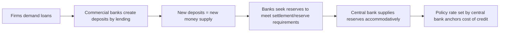
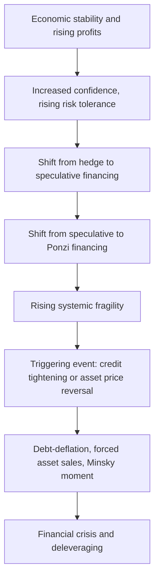

## Post-Keynesian and Heterodox Perspectives

### Overview and Position within Macroeconomics

Post-Keynesian and heterodox economics comprise a family of theoretical traditions that reject core assumptions of mainstream (neoclassical and New Keynesian) macroeconomics—particularly the reliance on rational optimizing representative agents, market-clearing equilibrium, and the neutrality (or near-neutrality) of money—in favor of frameworks emphasizing fundamental uncertainty, historical time, the primacy of aggregate demand, institutional structures, and the endogeneity of money. These traditions trace their intellectual lineage primarily to John Maynard Keynes's *General Theory* (1936), but interpret and extend Keynes's insights in ways that diverge sharply from the "neoclassical synthesis" and New Keynesian mainstream that came to dominate textbook macroeconomics after World War II.

"Heterodox economics" is a broader umbrella term encompassing Post-Keynesian economics alongside other non-mainstream schools—Institutionalist, Marxian, Sraffian/Neo-Ricardian, Feminist, Ecological, and Austrian economics (though Austrian economics is sometimes treated as a separate heterodox tradition with its own distinct methodological commitments). This entry focuses primarily on Post-Keynesian economics as the most macroeconomically developed heterodox school, with reference to adjacent traditions where relevant.

### Historical Origins and Key Figures

Post-Keynesian economics developed from the 1950s–1970s, largely in response to what its founders viewed as a mainstream misreading of Keynes. Key contributors include:

- **Joan Robinson** — a direct student and colleague of Keynes at Cambridge; critic of the "bastard Keynesianism" of the neoclassical synthesis; central figure in the Cambridge capital controversies.
- **Michał Kalecki** — a Polish economist who independently developed a theory of effective demand, business cycles, and income distribution paralleling (and in some respects predating) Keynes; his work on markup pricing and the "degree of monopoly" heavily influences Post-Keynesian price theory.
- **Nicholas Kaldor** — contributed theories of growth, distribution, and cumulative causation.
- **Paul Davidson** — a leading American Post-Keynesian, emphasizing fundamental uncertainty and the non-neutrality of money; founder of the *Journal of Post Keynesian Economics*.
- **Hyman Minsky** — developed the Financial Instability Hypothesis, explaining endogenous financial crises arising from the normal functioning of capitalist credit systems; his work saw a major resurgence in attention following the 2008 global financial crisis (the term "Minsky moment" entered mainstream financial commentary).
- **Sidney Weintraub** — contributed to Post-Keynesian price and distribution theory.

**[Unverified]** The precise boundaries of who counts as "Post-Keynesian" versus adjacent traditions (Sraffian, Kaleckian) are contested within the heterodox literature itself, and different survey sources categorize contributors somewhat differently.

### Core Methodological and Theoretical Commitments

**Key Points**

1. **Fundamental (ontological) uncertainty**, not merely calculable risk. Post-Keynesians distinguish sharply between *risk* (quantifiable via probability distributions) and true *uncertainty* (Knightian uncertainty), where the future is not just unknown but is not yet determined and cannot be reduced to a known probability distribution. This is drawn directly from Keynes's discussion of long-term expectations in Chapter 12 of the *General Theory* and from his earlier *Treatise on Probability*.
2. **Historical time, not logical time.** Economic processes unfold irreversibly through calendar time; decisions made today shape and constrain the possibility set available tomorrow (path dependence), in contrast to the reversible, timeless equilibrium constructs common in neoclassical models.
3. **The principle of effective demand.** Aggregate output and employment are determined by aggregate demand, not by the supply-side conditions of labor markets. There is no automatic tendency for a market economy to gravitate toward full employment equilibrium.
4. **Endogenous money.** The money supply is not exogenously set by a central bank via a fixed money multiplier, but is created endogenously in response to the demand for credit from the banking system—loans create deposits, reversing the conventional textbook causality. This directly challenges monetarist and mainstream New Keynesian treatments of money supply determination.
5. **Non-neutrality of money in the long run.** Money and financial factors are not a mere "veil" over real economic activity; monetary and financial variables have persistent real effects on output, investment, and growth.
6. **Rejection of the representative agent and methodological individualism as the sole foundation.** Heterodox approaches typically emphasize class, institutions, power relations, and aggregate behavioral regularities rather than deriving macroeconomic outcomes solely from a single optimizing agent's intertemporal choices.
7. **Path dependence and cumulative causation**, particularly in Kaldorian growth theory, where initial advantages (e.g., in a region's or country's export base) can generate self-reinforcing divergence rather than convergence.
8. **Administered/markup pricing**, following Kalecki: firms in imperfectly competitive markets set prices as a markup over prime (variable) costs, reflecting their "degree of monopoly" power, rather than prices being determined purely by marginal-cost equilibrium conditions in competitive markets.

### The Principle of Effective Demand in Detail

Post-Keynesian macroeconomics places the determination of output and employment through aggregate demand at its analytical core, extending Keynes's original insight beyond the short-run, fixed-capacity framework of the *General Theory* into models of long-run growth (see the section on Growth Theory below). The basic short-run relationship can be expressed via the Kaleckian/Keynesian goods-market equilibrium condition:

$$Y = C(Y) + I + G + (X - M)$$

where $Y$ is output/income, $C(Y)$ is consumption as a function of income, $I$ is investment (treated as substantially autonomous and driven by long-term expectations rather than current interest rates alone), $G$ is government spending, and $(X-M)$ is net exports. Unlike in loanable-funds or classical frameworks, **investment drives saving**, not the reverse: an increase in investment raises income, which generates the additional saving required to finance it (the Keynesian "paradox" that saving is a residual, not a prior constraint on investment).

### Fundamental Uncertainty and Investment Behavior

A defining Post-Keynesian claim is that private investment decisions are governed less by calculable expected returns than by **long-term expectations ("animal spirits")** formed under conditions of genuine uncertainty about an unknowable future. Because businesses cannot compute a well-defined probability distribution over future demand, technology, and profitability decades into the future, investment is volatile and prone to sudden revisions in sentiment—providing a demand-side, psychologically and institutionally grounded explanation for business cycle instability that does not require any exogenous real shock (contrast with RBC theory, where cycles originate from productivity shocks).

**[Inference]** This emphasis on animal spirits as a primary driver of investment volatility is a widely cited hallmark of Post-Keynesian macro-dynamics, though the degree of emphasis on psychological versus institutional/financial determinants of investment varies across individual Post-Keynesian authors.

### Endogenous Money and Horizontalism versus Structuralism

Post-Keynesian monetary theory holds that commercial banks create money by extending loans, with reserves supplied afterward by the central bank to accommodate the resulting demand for settlement balances—reversing the "money multiplier" story taught in introductory textbooks in which the central bank sets a monetary base that banks then multiply through lending. Within Post-Keynesian monetary theory there is an internal debate:

- **Horizontalist view** (associated with Basil Moore): the central bank supplies reserves passively, essentially horizontally, at its administered policy interest rate, fully accommodating bank demand for reserves; the money supply curve is horizontal at the policy rate rather than upward sloping.
- **Structuralist view**: the central bank is not perfectly accommodating; liquidity preference and the increasing cost/difficulty of obtaining additional reserves as credit expansion continues introduce some upward slope and constraints, giving banks and financial markets more independent structural influence over credit conditions.

### Minsky's Financial Instability Hypothesis

Hyman Minsky's Financial Instability Hypothesis (FIH) argues that stability itself is destabilizing: prolonged periods of economic calm and rising profitability lead firms, households, and banks to progressively take on riskier financing structures, producing endogenous fragility that eventually triggers a financial crisis, even in the absence of any external shock. Minsky classified borrowing units into three financing postures:

1. **Hedge finance** — cash flows from operations are sufficient to cover both principal and interest payments on debt.
2. **Speculative finance** — cash flows cover interest payments but not principal, requiring debt to be rolled over.
3. **Ponzi finance** — cash flows are insufficient even to cover interest payments, requiring either asset sales or new borrowing to service existing debt, betting on continued asset price appreciation.

As an economy expands, competitive pressure and rising confidence progressively shift the composition of financing from hedge toward speculative and Ponzi structures ("the euphoric economy"), increasing systemic fragility until a triggering event (a credit tightening, an asset price reversal, or a Minsky moment) precipitates a debt-deflation crisis and abrupt deleveraging. **[Unverified]** The FIH's applicability as a direct explanatory account of the 2007–2008 global financial crisis is widely asserted in both academic and financial-press commentary, though this remains a matter of ongoing interpretive and empirical debate among economists rather than a settled consensus finding.

### Kaleckian Pricing and Income Distribution

Michał Kalecki's markup pricing theory holds that firms operating with excess capacity and market power set prices as a markup over unit prime (direct) costs:

$$P = (1 + \mu) \cdot \text{AVC}$$

where $P$ is price, $\mu$ is the markup rate (reflecting the firm's "degree of monopoly," influenced by industry concentration, the strength of trade unions, advertising, and the ratio of overhead to prime costs), and AVC is average variable cost. This pricing framework has direct distributional implications: a higher aggregate markup shifts functional income distribution toward profits and away from wages, and because Post-Keynesians typically assume workers have a higher marginal propensity to consume out of income than capital owners (profit recipients), shifts in distribution feed back into the level of aggregate demand.

This generates the **Kaleckian/Post-Keynesian growth models' central distinction between "wage-led" and "profit-led" demand regimes**:

- In a **wage-led** regime, a rise in the wage share increases aggregate demand and output, because the consumption-boosting effect of higher wages outweighs any negative effect on investment from lower profit margins.
- In a **profit-led** regime, a rise in the profit share increases aggregate demand and output, because higher profits stimulate investment more than the loss of wage income depresses consumption.

Which regime characterizes a given economy is treated as an empirical question dependent on the responsiveness of investment to profitability, the marginal propensities to consume of different income classes, and the openness of the economy to trade (since higher wage costs can also harm export competitiveness), rather than as a matter determined a priori by theory.

### Post-Keynesian Growth Theory

Post-Keynesian growth theory extends the principle of effective demand to the long run, in contrast to the mainstream Solow-Swan model, where long-run growth is determined by exogenous technological progress and the economy converges to a supply-determined steady state regardless of demand conditions. Key contributions include:

- **The Cambridge growth models (Kaldor, Robinson, Pasinetti)**, which examine how income distribution between wages and profits adjusts to reconcile a given (often exogenously assumed, in the simplest versions) investment rate with the saving required to finance it, and which figured centrally in the Cambridge capital controversies (see below).
- **Kaldor's growth laws**, including the proposition that manufacturing growth drives overall productivity growth through increasing returns and learning effects (**Kaldor's first growth law**, sometimes called Verdoorn's Law when relating productivity growth to output growth), and models of **export-led cumulative causation**, in which regions or countries with an initial competitive advantage in exports experience self-reinforcing growth advantages over time, a mechanism in tension with neoclassical convergence predictions.
- **Demand-led growth models** (e.g., in the Kaleckian growth tradition associated with authors such as Amit Bhaduri and Stephen Marglin), where the long-run growth rate itself, not just short-run output, is determined by the interaction of investment behavior, income distribution, and capacity utilization, rather than by an exogenously given natural rate of growth.

### The Cambridge Capital Controversies

The Cambridge capital controversies (roughly 1950s–1970s) were a foundational debate between economists at Cambridge, UK (notably Joan Robinson, Piero Sraffa) and Cambridge, Massachusetts (notably Paul Samuelson, Robert Solow), concerning the theoretical validity of aggregating heterogeneous capital goods into a single scalar "capital" variable used in aggregate production functions (as in the Solow model and, later, RBC and DSGE models).

The Cambridge, UK side demonstrated the phenomenon of **capital reswitching** and **reverse capital deepening**—situations in which a given production technique can be the cost-minimizing choice at both high and low interest rates, with a different technique optimal at intermediate rates, and situations where a lower rate of profit is associated with a lower (not higher) capital-labor ratio. These results undermine the presumption, built into standard aggregate production function analysis, of a smooth, monotonic, inverse relationship between the interest rate (or profit rate) and the capital intensity of production—a relationship central to neoclassical marginal productivity theories of income distribution.

Samuelson conceded the theoretical validity of the reswitching results in a well-known 1966 symposium in the *Quarterly Journal of Economics*, while the practical and interpretive significance of the controversy for empirical applied macroeconomics remains **[Unverified]**—mainstream macroeconomics continued to widely use aggregate production functions in applied work, while heterodox economists regard this practice as resting on theoretically unsound foundations.

### Comparison with Mainstream (New Keynesian) Macroeconomics

| Dimension | Post-Keynesian / Heterodox | Mainstream (New Keynesian / DSGE) |
| --- | --- | --- |
| Uncertainty | Fundamental/Knightian uncertainty; no calculable probability distribution over the distant future | Rational expectations; agents form probabilistically well-defined expectations |
| Money supply | Endogenous; created by bank lending, accommodated by central bank | Largely exogenous or set via a policy rule/reaction function |
| Equilibrium concept | Path-dependent, historical time; no presumption of a unique, stable long-run equilibrium | Unique rational-expectations equilibrium, often with a well-defined steady state |
| Source of unemployment | Deficient effective demand; involuntary unemployment is a genuine equilibrium possibility | Nominal rigidities cause temporary deviations from a natural rate; RBC treats unemployment as largely voluntary |
| Investment | Driven by animal spirits/long-term expectations under uncertainty | Driven by optimizing responses to relative prices, interest rates, and expected returns (Tobin's Q, Euler equations) |
| Microfoundations | Skeptical of representative-agent microfoundations as the sole valid basis for macro theory; favors institutional, class-based, and behavioral analysis | Requires explicit optimization-based microfoundations (utility/profit maximization) |
| Policy stance | Active fiscal policy generally favored; skepticism toward relying primarily on monetary policy and interest-rate rules | Monetary policy (interest rate rules, inflation targeting) as primary stabilization tool; fiscal policy often secondary in New Keynesian models |

### Other Heterodox Traditions (Brief Comparative Notes)

- **Institutionalist economics** (Veblen, Commons, Ayres) emphasizes the role of evolving social institutions, legal frameworks, habits, and power structures in shaping economic behavior and outcomes, rejecting the idea of a fixed, universal "rational economic agent."
- **Marxian/Marxist economics** analyzes capitalism through the lens of class conflict, the labor theory of value, the tendency of the rate of profit to fall, and periodic crises of overaccumulation, offering its own distinct theory of cyclical and structural crisis rooted in the internal contradictions of capital accumulation.
- **Sraffian/Neo-Ricardian economics**, following Piero Sraffa's *Production of Commodities by Means of Commodities* (1960), reconstructs classical value and distribution theory without reliance on marginal utility or an aggregate capital variable, providing much of the technical apparatus used in the Cambridge capital controversies.
- **Ecological economics** incorporates biophysical constraints, thermodynamic limits, and the scale of the economy relative to ecological carrying capacity as central analytical categories, challenging the presumption of unlimited substitutability between natural and produced capital found in much neoclassical growth theory.
- **Feminist economics** examines the analytical and empirical significance of unpaid care work, gendered division of labor, and intra-household bargaining, critiquing the boundaries of what mainstream national accounts and models count as "economic" activity.
- **Austrian economics** (Mises, Hayek) is sometimes classified as heterodox given its rejection of mainstream mathematical general-equilibrium modeling and its emphasis on subjective value, entrepreneurial discovery, and (in its business cycle theory) monetary/credit distortions of the capital structure caused by central bank interest-rate manipulation—though its policy conclusions (minimal government intervention, skepticism of discretionary demand management) diverge sharply from Post-Keynesian policy activism.

### Policy Implications of Post-Keynesian Economics

**Key Points**

1. **Active fiscal policy** is generally favored as the primary countercyclical stabilization tool, reflecting the view that deficient aggregate demand (not supply-side rigidities alone) is the principal cause of unemployment and that fiscal multipliers can be substantial, especially when monetary policy is constrained (e.g., near the zero lower bound).
2. **Functional finance** (following Abba Lerner, an economist closely associated with these debates): government budgets should be managed to achieve full employment and price stability, rather than adhering to a fixed target for the budget balance as an end in itself.
3. **Incomes policies** are sometimes advocated as tools to manage inflation arising from distributional conflict (workers and firms both seeking to defend their real income shares) rather than relying solely on demand-restriction (interest rate hikes) to control inflation, which Post-Keynesians argue can generate unnecessary output and employment losses.
4. **Financial regulation** is emphasized as necessary and ongoing (rather than a one-time correction), given Minsky's view that financial fragility endogenously re-emerges during periods of stability and calm.
5. **Skepticism toward central bank independence as a sufficient stabilization framework**, given the endogenous money view that central banks cannot tightly control the money supply through quantity-based instruments and must instead be understood as setting price-based conditions (interest rates) that interact with an accommodating, credit-driven banking system.
6. Some Post-Keynesian-adjacent frameworks, notably **Modern Monetary Theory (MMT)**, extend endogenous money and functional finance arguments to claims about the fiscal space available to monetarily sovereign governments issuing debt in their own currency; MMT's precise relationship to core Post-Keynesian theory is itself a subject of internal debate among heterodox economists, with some Post-Keynesians embracing significant overlap and others critiquing specific MMT claims. **[Unverified]**

### Common Critiques of Post-Keynesian and Heterodox Economics (from the Mainstream)

For balance, it is useful to note criticisms mainstream economists commonly direct at Post-Keynesian and heterodox approaches:

1. **Lack of a single unified formal model.** Unlike the RBC/DSGE tradition, which offers a tightly specified, quantitatively simulate-able core model, Post-Keynesian economics is sometimes characterized as a looser family of verbal and partial-equilibrium models without a single canonical, fully specified general-equilibrium formalization, making rigorous cross-study comparison harder.
2. **Weaker connection to formal microfoundations.** Mainstream critics argue that rejecting representative-agent optimization removes a valuable discipline that forces internal consistency between individual behavior and aggregate outcomes.
3. **Perceived lower falsifiability/testability** of some claims (e.g., "animal spirits," fundamental uncertainty) relative to models generating sharp, testable quantitative predictions.

**[Unverified]** These are characterizations commonly made from a mainstream vantage point; Post-Keynesian economists dispute several of these characterizations directly, arguing, for instance, that their models are testable via econometric methods and that stock-flow consistent (SFC) modeling (see below) provides rigorous, fully specified quantitative macro models built on Post-Keynesian foundations.

### Stock-Flow Consistent (SFC) Modeling

A significant modern methodological contribution associated with Post-Keynesian economics (developed notably by Wynne Godley and Marc Lavoie) is **Stock-Flow Consistent modeling**, which builds macroeconomic models ensuring rigorous accounting consistency: every financial flow between sectors (households, firms, government, the banking sector, the rest of the world) has a corresponding source and destination, and every flow accumulates into a consistent stock (asset or liability) over time, with no "black holes." SFC models are used to simulate the dynamic interaction between the real economy and financial balance sheets, incorporating endogenous money and providing an explicit macroeconomic modeling framework as an alternative to representative-agent DSGE models. **[Unverified]** SFC models have gained increasing academic and some central-bank/policy-institution interest since the 2008 financial crisis as a complementary tool for analyzing balance-sheet and financial-stability dynamics, though the extent of their adoption relative to DSGE models in mainstream central bank practice varies considerably by institution.

### Related Topics

- Keynes's *General Theory* and the principle of effective demand
- The Cambridge capital controversies and capital reswitching
- Minsky's Financial Instability Hypothesis and the 2008 global financial crisis
- Endogenous money theory: horizontalism versus structuralism
- Kaleckian markup pricing and functional income distribution
- Wage-led versus profit-led growth regimes
- Kaldor's growth laws and export-led cumulative causation
- Stock-Flow Consistent (SFC) macroeconomic modeling
- Modern Monetary Theory (MMT) and functional finance
- Institutionalist, Marxian, Sraffian, ecological, and feminist economics as adjacent heterodox traditions
- Comparison with Real Business Cycle theory and New Keynesian DSGE models
- Debt-deflation theory (Irving Fisher) as a precursor to Minsky's framework