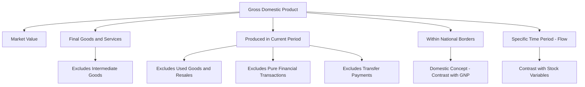

## Gross Domestic Product: Concept and Definition

### Definition

Gross Domestic Product (GDP) is the total market value of all final goods and services produced within a country's borders during a specific time period, typically a quarter or a year.

The formal definition rests on four essential components, each of which excludes specific categories of economic activity:

- **Market value**: Goods and services are valued at their market prices, which allows heterogeneous outputs (cars, haircuts, wheat, software) to be aggregated into a single monetary figure.
- **Final goods and services**: Only goods and services purchased by the end user are counted. This avoids double-counting.
- **Produced**: GDP measures current production only. Transactions involving existing assets (used cars, previously built houses, secondhand goods) are excluded, as are purely financial transactions (stock trades, bond purchases).
- **Within a country's borders**: GDP is a *domestic* concept, measuring output produced geographically within the country, regardless of who owns the factors of production. This distinguishes it from Gross National Product (GNP), which measures output by a country's nationals/residents regardless of location.
- **During a specific time period**: GDP is a *flow* variable, measured per unit of time (e.g., "$21 trillion for 2023"), unlike a *stock* variable which is measured at a point in time (e.g., national wealth).

### Key Points

- **Flow vs. Stock**: GDP measures a rate of production over an interval. National wealth, by contrast, is a stock — the accumulated value of assets at a given moment.
- **GDP vs. GNP/GNI**: GDP = production within borders. GNP (or Gross National Income, GNI) = production by nationally-owned factors of production, wherever located.

  $$GNP = GDP + \text{Net Factor Income from Abroad}$$

  Net Factor Income from Abroad (NFIA) is income earned by domestic residents/firms from foreign assets, minus income earned by foreign residents/firms from domestic assets.
- **Nominal vs. Real GDP**: Nominal GDP values output at current-year prices. Real GDP values output at constant (base-year) prices, removing the effect of price-level changes and isolating changes in physical output.

  $$\text{Real GDP} = \frac{\text{Nominal GDP}}{\text{GDP Deflator}} \times 100$$
- **GDP is an aggregate, not a welfare measure**: GDP does not directly capture leisure, non-market production (unpaid household labor, volunteer work), the underground/informal economy, environmental degradation, or distributional equity.

### The Double-Counting Problem and "Final Goods"

The final-goods restriction exists specifically to prevent double-counting. Consider a simplified production chain:

| Stage | Good | Sale Value | Value Added |
| --- | --- | --- | --- |
| 1 | Farmer sells wheat to miller | $1.00 | $1.00 |
| 2 | Miller sells flour to baker | $2.50 | $1.50 |
| 3 | Baker sells bread to consumer | $4.00 | $1.50 |
| **Total (naive sum)** |  | **$7.50** |  |
| **Correct GDP contribution** |  |  | **$4.00** |

Summing every transaction ($7.50) overstates output because intermediate goods (wheat, flour) are embedded in the final good's price (bread). Two equivalent methods correct for this:

1. **Final goods method**: Count only the market value of the final good sold to the end user ($4.00, the bread).
2. **Value-added method**: Sum the value added at each stage of production ($1.00 + $1.50 + $1.50 = $4.00).

Both methods yield identical results and this equivalence is the basis for the **value-added approach** used in national income accounting to cross-check GDP estimates derived from expenditure or income data.

### What GDP Excludes

- **Intermediate goods**: Inputs consumed in producing other goods within the same period (e.g., flour used by the baker in the same year).
- **Used/secondhand goods**: A used car sale is not new production; only the dealer's or broker's service margin (if any) counts.
- **Purely financial transactions**: Buying stocks, bonds, or other securities is an exchange of existing assets/claims, not production. (Brokerage fees, being a service, *are* counted.)
- **Transfer payments**: Government payments with no corresponding production, such as unemployment benefits, Social Security, or welfare payments. These redistribute income rather than compensate for output.
- **Non-market production**: Unpaid domestic labor (childcare, cooking, cleaning performed within a household), volunteer work, and do-it-yourself home improvement.
- **Underground/informal economy**: Unreported cash transactions, illegal activity, and barter — excluded not by definition but by measurement limitation. [Inference] Some countries incorporate statistical adjustments to estimate informal-economy contributions, though methodologies and coverage vary significantly.
- **Gifts and inheritances**: No production occurs; these are transfers of existing wealth or income.

### Illustrative Diagram: Structure of the GDP Concept

### Why GDP Uses Market Prices

Market prices serve as the common unit of measurement that allows the aggregation of physically dissimilar goods and services — a ton of steel, a legal consultation, a concert ticket — into one figure. This makes market prices useful, but also embeds two well-known limitations:

- **Non-market activity has no price** and is therefore invisible to GDP (household production, leisure).
- **Prices don't fully capture externalities**: environmental costs of production (e.g., pollution) that are not priced into the market transaction are not subtracted from GDP, even though they represent a real welfare cost.

### The Three Approaches to Measuring GDP (Conceptual Overview)

GDP can be computed via three theoretically equivalent approaches, each measuring the same aggregate from a different vantage point in the circular flow of income:

1. **Expenditure Approach**: Sums spending on final goods and services.

   $$GDP = C + I + G + (X - M)$$
2. **Income Approach**: Sums all income earned in producing that output (wages, rents, interest, profits) plus adjustments (indirect taxes, depreciation).
3. **Value-Added (Production) Approach**: Sums the value added at each stage of production across all industries.

[Note: Each of these approaches, along with their respective components, is treated in depth in dedicated syllabus items within this chapter. This item covers only the conceptual and definitional foundation of GDP itself.]

### Common Points of Confusion

- **GDP vs. GNP is about ownership, not location of spending.** A Filipino OFW's income earned in Japan contributes to Philippine GNP but Japanese GDP, since it is production occurring within Japan's borders by a non-national.
- **"Gross" refers to no deduction for depreciation** (consumption of fixed capital). Net Domestic Product (NDP) = GDP − Depreciation.

  $$NDP = GDP - \text{Depreciation (Capital Consumption Allowance)}$$
- **GDP counts production, not sales.** Unsold inventory produced during the period is still counted in GDP (recorded as inventory investment, a component of $I$), because production — not the completed sale — is the triggering event.
- **A high GDP does not imply high living standards** on its own; per-capita measures (GDP ÷ population) and purchasing power parity (PPP) adjustments are needed for meaningful cross-country welfare comparisons. [Inference] The relationship between GDP and welfare is a normative and empirical debate that extends beyond the strict accounting definition.

### Example

A country produces only two things in a year: 100 tons of steel sold to a construction firm (an intermediate good, used entirely in producing a building), and 1 building sold to a homeowner for $500,000.

- Naive sum of transactions would double-count the steel embedded in the building's price.
- Correct GDP contribution = $500,000 (the final good only), since the steel's value is already embedded in the building's final sale price.

If, instead, 20 tons of that steel were exported unused to another country for $50,000, that steel is now a *final good* from the exporting country's perspective (it left the domestic economy without further domestic processing), and its value is added separately as an export ($X$).

**Related Topics**

- Expenditure approach to GDP (C + I + G + (X − M))
- Income approach to GDP and factor payments
- Value-added approach and avoiding double-counting in practice
- Nominal GDP, Real GDP, and the GDP Deflator
- GDP per capita and Purchasing Power Parity (PPP) adjustments
- Limitations of GDP as a welfare measure (Green GDP, Human Development Index, Genuine Progress Indicator)
- Net Domestic Product and depreciation/capital consumption allowance
- Circular flow of income model