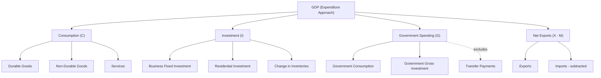

## Expenditure Approach to GDP Measurement

### Definition

The expenditure approach measures GDP by summing all spending on final goods and services produced within a country's borders during a given period. It views GDP from the demand side of the circular flow of income — every dollar spent on a final good is, by definition, a dollar of value produced.

The core identity is:

$$GDP = C + I + G + (X - M)$$

where $C$ = personal consumption expenditure, $I$ = gross private domestic investment, $G$ = government consumption and gross investment, $X$ = exports of goods and services, and $M$ = imports of goods and services.

### Key Points

- The expenditure approach is the most commonly reported GDP measure in national accounts (e.g., U.S. BEA, Philippine PSA) because expenditure data is readily collected from surveys of households, firms, and government budgets.
- Each component captures spending by a distinct sector of the economy: households ($C$), firms ($I$), government ($G$), and the foreign sector ($X - M$).
- Only spending on **final** goods and services counts; intermediate purchases by firms are excluded to avoid double-counting (see value-added approach).
- The expenditure approach is theoretically equivalent to the income approach and the value-added approach — all three yield the same GDP figure, since total spending on output must equal total income generated by producing that output.

### Component 1: Personal Consumption Expenditure ($C$)

$C$ is spending by households on final goods and services, and is typically the largest component of GDP in most economies (often 55-70%).

Subcategories:

- **Durable goods**: Goods with a useful life exceeding roughly three years (vehicles, appliances, furniture).
- **Non-durable goods**: Goods consumed quickly (food, clothing, fuel).
- **Services**: The largest and fastest-growing subcategory in most modern economies (healthcare, education, financial services, housing rentals, transportation).

[Note: Owner-occupied housing is treated specially — national accounts impute an "owner's equivalent rent," estimating what a homeowner would pay to rent their own home, and count this imputed value as part of $C$ (specifically, housing services). This is necessary because the housing service is genuinely consumed each period, even without a cash transaction.]

### Component 2: Gross Private Domestic Investment ($I$)

$I$ measures spending by firms (and households, for new housing) on capital that will be used to produce future output. This is the **economic** definition of investment, distinct from the everyday/financial usage.

Subcategories:

- **Business fixed investment**: Spending on machinery, equipment, tools, and structures (factories, offices) used in production.
- **Residential investment**: Construction of new housing units. (This is the *only* household spending that counts as investment rather than consumption.)
- **Changes in business inventories**: The net change in the stock of unsold goods held by firms. This is included because inventory buildup represents goods that were *produced* in the current period, even if not yet sold.

**Critical distinction**: Buying stocks, bonds, or other financial securities is **not** investment in the GDP sense — it is a transfer of ownership of existing financial claims, not the creation of new productive capital. Colloquial/financial "investing" (buying shares) is excluded from $I$.

$$I = I_{fixed,business} + I_{residential} + \Delta \text{Inventories}$$

**Gross vs. Net investment**:

$$I_{gross} = I_{net} + \text{Depreciation}$$

Net investment reflects the actual growth in the economy's capital stock; gross investment includes replacement of worn-out capital.

### Component 3: Government Consumption and Gross Investment ($G$)

$G$ includes government spending on final goods and services — salaries of public employees, purchases of military equipment, public infrastructure construction, and public school operations.

**Critical exclusion — Transfer payments**: Government spending on Social Security, unemployment benefits, pensions, and welfare payments is **excluded** from $G$, because these are transfers of purchasing power with no corresponding current production. Including them would misrepresent transfers as production.

$$G = G_{consumption} + G_{investment}$$

[Inference] The precise boundary between what counts as a "final" government purchase versus an input consumed in producing another public service is a recognized measurement challenge in national accounting, since many government services (defense, administration) lack market prices and are conventionally valued at their cost of production.

### Component 4: Net Exports ($X - M$)

$$NX = X - M$$

- **Exports ($X$)**: Value of domestically produced goods and services sold to foreign buyers. These are added because that production occurred domestically, regardless of who consumes it.
- **Imports ($M$)**: Value of foreign-produced goods and services purchased domestically. These are **subtracted** — not because foreign production is undesirable, but because import spending is already embedded within $C$, $I$, and $G$ (e.g., a household buying an imported television counts that purchase in $C$), and must be netted out since it does not reflect domestic production.

$NX$ can be positive (trade surplus) or negative (trade deficit).

### Worked Numerical Example

Given the following data for a hypothetical economy (in billions):

| Item | Value |
| --- | --- |
| Household spending on goods and services | 600 |
| Business spending on machinery and structures | 150 |
| Change in business inventories | +10 |
| New residential construction | 40 |
| Government purchases of goods and services | 200 |
| Government transfer payments (Social Security) | 80 |
| Exports | 120 |
| Imports | 90 |

**Calculation**:

$$C = 600$$

$$I = 150 + 10 + 40 = 200$$

$$G = 200 \quad \text{(transfer payments of 80 are excluded)}$$

$$NX = 120 - 90 = 30$$

$$GDP = 600 + 200 + 200 + 30 = 1{,}030$$

### Illustrative Diagram: Expenditure Approach Structure

### Common Points of Confusion

- **Transfer payments are not government spending in the GDP sense.** They redistribute income without corresponding current output, so they belong to neither $G$ nor GDP directly (though the recipient's subsequent spending, if any, may show up in $C$).
- **Stock/bond purchases are not $I$.** Financial investment ≠ economic investment. Only spending that adds to the physical or residential capital stock counts.
- **Imports are subtracted, not because foreign goods "hurt" GDP**, but purely as an accounting correction: import spending is already counted inside $C$, $I$, or $G$ and must be removed to isolate domestic production.
- **Inventory changes can be negative.** If firms sell more than they produce, drawing down inventories, $\Delta \text{Inventories}$ is negative and reduces $I$ (and thus GDP) for that period, even though total sales were high.
- **Used goods and secondhand sales** are excluded regardless of which component they'd otherwise fall under, since no new production occurred in the current period.

### Relationship to Other Approaches

The expenditure approach must, in principle, yield the same total as the income approach and the value-added approach, since total expenditure on final output equals total income generated by that output equals the sum of value added across all production stages. In practice, national statistical agencies report a small **statistical discrepancy** between expenditure-based and income-based GDP estimates due to data collection timing, sampling, and measurement error. [Inference] The magnitude and treatment of this discrepancy varies by country and reporting period, and is typically published alongside official GDP releases.

**Related Topics**

- Income approach to GDP and factor payments
- Value-added approach and the production method
- Gross Domestic Product concept and definition
- Nominal GDP, Real GDP, and the GDP Deflator
- Components of aggregate demand in the Keynesian model
- Marginal propensity to consume/save and the multiplier effect
- Balance of payments and net exports
- Government budget deficit vs. national debt (contrast with transfer payments)