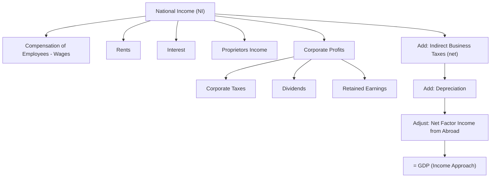

## Income Approach to GDP Measurement

### Definition

The income approach measures GDP by summing all income earned by factors of production (labor, capital, land, entrepreneurship) in the process of producing final goods and services, plus non-income charges against output. It views GDP from the supply side of the circular flow: every dollar spent on final output (expenditure approach) must simultaneously accrue as income to some factor of production, since a firm's revenue is exhaustively distributed as wages, rent, interest, profit, taxes, or depreciation.

The general identity is:

$$GDP = \text{National Income} + \text{Indirect Business Taxes} + \text{Depreciation} + \text{Net Factor Income Adjustments} + \text{Statistical Discrepancy}$$

where National Income (NI) itself is the sum of the primary factor payments detailed below.

### Key Points

- The income approach starts from **National Income (NI)** — the sum of all factor payments — and then adds back items that are part of GDP's market-price valuation but are not factor income.
- The core factor-income categories correspond to the four factors of production: wages (labor), rent (land), interest (capital), and profit (entrepreneurship).
- Two major categories of "non-income" charges must be added to National Income to reconcile it with GDP: **indirect business taxes** (part of market price but not anyone's income) and **depreciation/capital consumption allowance** (a cost of production that is not distributed as income to any factor).
- The income approach is theoretically identical to the expenditure approach; both must sum to the same GDP figure, differing in practice only by a **statistical discrepancy** arising from data collection differences.

### Component 1: Compensation of Employees (Wages)

The payment to labor for its contribution to production. This is typically the **largest single component** of national income in most economies (often 55-65%).

Includes:

- Wages and salaries (before tax withholding)
- Employer-paid benefits: health insurance contributions, pension contributions
- Employer contributions to social insurance programs (e.g., SSS/PhilHealth in the Philippines; Social Security/Medicare in the U.S.)

### Component 2: Rents

Income earned by owners of land and other natural resources for their use in production, including imputed rent on owner-occupied structures used for business purposes. In modern accounting, this category is often small relative to other components, as much "rental" income from real estate is folded into proprietors' income or corporate profits depending on ownership structure.

### Component 3: Interest

Net interest income received by households and businesses for supplying capital (loanable funds) to firms, excluding interest on government debt (treated as a transfer, not a payment for current productive services, since government borrowing does not directly correspond to output produced by the lender) and purely personal loan interest between individuals.

### Component 4: Profits

Profit is typically split into two categories reflecting different organizational forms:

- **Proprietors' income**: Net income of unincorporated businesses — sole proprietorships and partnerships. This is a hybrid category, as it combines returns to the owner's labor, capital, and entrepreneurial risk-taking without a clean separation.
- **Corporate profits**: Net income of incorporated businesses, conventionally subdivided into:
  - Corporate income taxes (paid to government)
  - Dividends (distributed to shareholders)
  - Undistributed/retained corporate profits (reinvested in the firm)

$$\text{Corporate Profits} = \text{Corporate Taxes} + \text{Dividends} + \text{Retained Earnings}$$

### Summing to National Income

$$NI = \text{Compensation of Employees} + \text{Rents} + \text{Interest} + \text{Proprietors' Income} + \text{Corporate Profits}$$

National Income represents the total income earned by a country's factors of production, valued at **factor cost** — i.e., before indirect taxes are added to market prices.

### From National Income to GDP: The Adjustment Items

National Income must be adjusted upward to reconcile factor-cost income with the market-price valuation used in GDP.

**1. Indirect Business Taxes (less subsidies)**

Taxes such as sales tax, excise tax, and value-added tax (VAT) are embedded in the market price a consumer pays, but they are collected by government and are **not income to any factor of production**. They must be added to National Income to arrive at market-price GDP. Government subsidies to businesses work in the opposite direction and are subtracted.

$$\text{Net Indirect Business Taxes} = \text{Indirect Taxes} - \text{Subsidies}$$

**2. Depreciation (Consumption of Fixed Capital)**

Depreciation represents the wearing-out of capital equipment during production. It is a genuine cost that reduces a firm's true economic profit, but it is **not paid out to any factor as income** — it is retained internally to eventually replace worn capital. Since GDP is a **gross** measure (see [[gross-domestic-product-concept]]), depreciation must be added back.

$$NI + \text{Depreciation} = GNP \text{ (factor-cost basis, before adjusting for foreign income)}$$

**3. Net Factor Income from Abroad (NFIA)**

Since National Income (as conventionally compiled) reflects income earned by a country's *nationals*, and GDP is a *domestic* (geographic) concept, this term must be subtracted to convert from a national to a domestic basis:

$$GDP = NI + \text{Indirect Business Taxes (net)} + \text{Depreciation} - NFIA + \text{Statistical Discrepancy}$$

[Inference] The exact placement and sign convention of the NFIA adjustment, and whether it is applied when moving from NI to GNP versus GNP to GDP, varies slightly across textbook treatments and national statistical methodologies; students should follow their specific curriculum's convention.

### Illustrative Diagram: Income Approach Structure

### Worked Numerical Example

Given the following data for a hypothetical economy (in billions):

| Item | Value |
| --- | --- |
| Compensation of employees | 500 |
| Rents | 20 |
| Interest | 40 |
| Proprietors' income | 60 |
| Corporate profits | 100 |
| Indirect business taxes | 70 |
| Subsidies | 5 |
| Depreciation | 90 |
| Net factor income from abroad | 15 |
| Statistical discrepancy | 0 |

**Calculation**:

$$NI = 500 + 20 + 40 + 60 + 100 = 720$$

$$\text{Net Indirect Business Taxes} = 70 - 5 = 65$$

$$GDP = 720 + 65 + 90 - 15 = 860$$

### Common Points of Confusion

- **Transfer payments (Social Security, unemployment benefits) are not part of National Income.** They are not payments for current productive services and must be excluded from the income-side sum, just as they are excluded from $G$ in the expenditure approach.
- **Indirect business taxes are not "income" to anyone** — they are a wedge between what the consumer pays (market price) and what factors actually receive (factor cost), which is precisely why they must be added when moving from a factor-cost total to a market-price total.
- **Depreciation is not distributed to a factor of production**, unlike wages, rent, interest, and profit. This is why it appears as a separate addition rather than a subcategory of profit.
- **Capital gains from asset appreciation** (e.g., a rising stock or land value) are **not** part of National Income or GDP, since they do not reflect current production — only realized income from newly rendered productive services counts.
- **"Interest" in national accounts excludes interest on government bonds**, on the convention that government borrowing is not compensation for a current productive service in the same sense as private lending for capital investment. [Inference] Some accounting frameworks handle government interest differently depending on whether it is classified as a transfer versus imputed financial service; conventions vary by system (e.g., UN SNA vs. national practice).

### Relationship to Other Approaches

The income approach, expenditure approach, and value-added approach are three lenses on the same underlying economic flow and must be numerically equivalent in principle: total spending on output = total income generated by output = sum of value added in production. National statistical agencies typically publish a small **statistical discrepancy** to reconcile the expenditure-based and income-based estimates, reflecting differences in underlying data sources rather than a true economic gap.

**Related Topics**

- Expenditure approach to GDP measurement
- Value-added approach and the production method
- Gross Domestic Product concept and definition
- National Income, Personal Income, and Disposable Personal Income (the NI-to-DPI chain)
- GDP at factor cost vs. GDP at market price
- Net Domestic Product and depreciation/capital consumption allowance
- Circular flow of income model
- Functional distribution of income (factor shares)