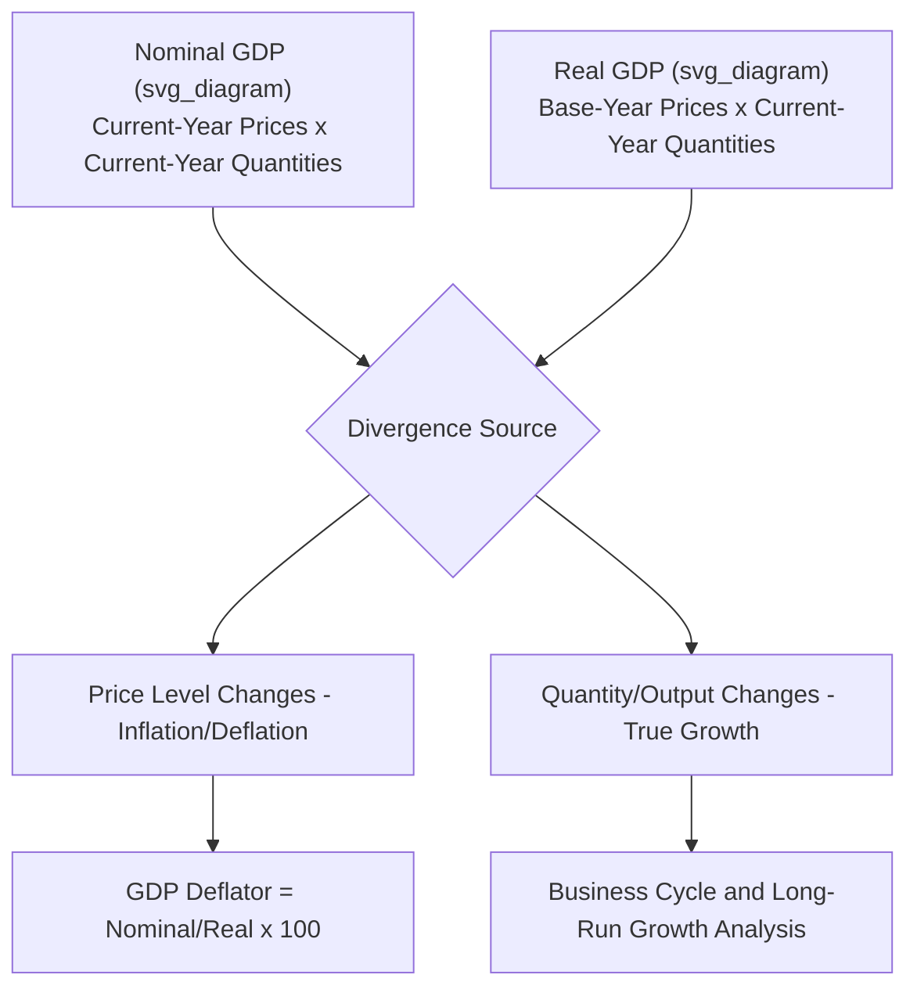

## Nominal versus Real GDP

### Definition

**Nominal GDP** values all final goods and services produced in a period at the market prices **prevailing during that same period** (current-year prices). **Real GDP** values that same physical output using the prices of a fixed **base year**, holding prices constant across time. The distinction isolates changes in the *quantity* of output from changes in the *price level*, since nominal GDP can rise even when physical production is flat or falling, purely because prices rose.

$$\text{Nominal GDP}_t = \sum_i P_{i,t} \times Q_{i,t}$$

$$\text{Real GDP}_t = \sum_i P_{i,base} \times Q_{i,t}$$

where $P_{i,t}$ is the price of good $i$ in period $t$, $Q_{i,t}$ is the quantity of good $i$ produced in period $t$, and $P_{i,base}$ is the price of good $i$ in the fixed base year.

### Key Points

- Nominal GDP changes for **two reasons**: changes in output (quantity) and changes in prices (inflation/deflation). Real GDP changes for **one reason only**: changes in output.
- Real GDP is the appropriate measure for tracking genuine economic growth, business cycle fluctuations, and living-standard changes over time, since it strips out the purely monetary effect of inflation.
- In the base year itself, nominal GDP and real GDP are, by construction, **identical**, since current-year prices and base-year prices coincide.
- The **GDP Deflator** is the price index implicitly derived from the ratio of nominal to real GDP, and is distinct from the Consumer Price Index (CPI) in coverage and construction.

### The GDP Deflator

The GDP deflator is the broadest price index available, since it covers *all* goods and services produced domestically (not just a fixed consumer basket).

$$\text{GDP Deflator} = \frac{\text{Nominal GDP}}{\text{Real GDP}} \times 100$$

Rearranging gives the standard formula for computing real GDP from nominal GDP when the deflator is known:

$$\text{Real GDP} = \frac{\text{Nominal GDP}}{\text{GDP Deflator}} \times 100$$

The GDP deflator in the base year always equals exactly 100, since nominal and real GDP coincide there.

### Worked Numerical Example: Simple Two-Good Economy

Consider an economy producing only apples and phones, with Year 1 as the base year.

| Year | Apples: Price | Apples: Qty | Phones: Price | Phones: Qty |
| --- | --- | --- | --- | --- |
| 1 (base) | $1 | 100 | $500 | 10 |
| 2 | $1.20 | 110 | $550 | 12 |

**Nominal GDP**:

$$\text{Nominal GDP}_1 = (1 \times 100) + (500 \times 10) = 100 + 5{,}000 = 5{,}100$$

$$\text{Nominal GDP}_2 = (1.20 \times 110) + (550 \times 12) = 132 + 6{,}600 = 6{,}732$$

**Real GDP** (both years valued at Year 1 prices):

$$\text{Real GDP}_1 = (1 \times 100) + (500 \times 10) = 5{,}100$$

$$\text{Real GDP}_2 = (1 \times 110) + (500 \times 12) = 110 + 6{,}000 = 6{,}110$$

**GDP Deflator and Growth Rates**:

$$\text{GDP Deflator}_2 = \frac{6{,}732}{6{,}110} \times 100 \approx 110.18$$

$$\text{Nominal GDP Growth} = \frac{6{,}732 - 5{,}100}{5{,}100} \times 100 \approx 32.0\%$$

$$\text{Real GDP Growth} = \frac{6{,}110 - 5{,}100}{5{,}100} \times 100 \approx 19.8\%$$

The gap between the 32.0% nominal growth rate and the 19.8% real growth rate (roughly 10.2 percentage points, consistent with the ~10.18% deflator increase) reflects pure price inflation, not any additional real production.

### Illustrative Diagram: Nominal vs. Real GDP Divergence

### Constructing Real GDP: Base-Year Method vs. Chain-Weighting

**Fixed base-year method**: Real GDP is computed using a single, unchanging base year's prices for all subsequent years. This is conceptually simple but suffers from **substitution bias** over time: as relative prices shift (e.g., electronics get cheaper, consumers buy more of them), a distant base year's price weights increasingly misrepresent current consumption patterns, distorting growth estimates the further removed the current year is from the base year.

**Chain-weighted (chain-linked) method**: Modern national accounts (including the U.S. BEA since 1996 and most countries following the UN System of National Accounts) use chain-weighting, which computes growth rates using *adjacent-year* price weights and links them together into an index, updating the effective price weights every year. This substantially reduces substitution bias relative to a fixed, aging base year.

[Inference] The specific chain-weighting methodology (e.g., Fisher ideal index vs. Laspeyres/Paasche variants) and its exact computational formula vary by country and are a matter of applied statistical technique beyond the core conceptual distinction between nominal and real GDP; students should consult their national statistical agency's methodology notes for country-specific detail.

### Real GDP and Business Cycle Analysis

Real GDP (not nominal GDP) is the standard variable used to:

- Define a **recession** (commonly, though not universally, associated with two or more consecutive quarters of declining real GDP).
- Compute **real GDP growth rate**, the headline figure for economic performance reported by governments and central banks.
- Calculate **Real GDP per capita**, dividing real GDP by population, used as a rough proxy for average material living standards over time (adjusting for both inflation and population growth).

$$\text{Real GDP per capita} = \frac{\text{Real GDP}}{\text{Population}}$$

### GDP Deflator vs. Consumer Price Index (CPI)

Though both measure price-level changes, they differ in scope and construction, a frequent point of confusion:

| Feature | GDP Deflator | CPI |
| --- | --- | --- |
| Coverage | All domestically produced final goods/services | Fixed basket of goods/services purchased by a typical urban consumer |
| Imported goods | Excluded (only domestic production) | Included (consumers buy imports too) |
| Basket weights | Changes every year (reflects current production mix) | Fixed basket, updated only periodically |
| Capital goods (e.g., machinery) | Included (part of $I$) | Excluded (not purchased by typical consumers) |

[Inference] Because the GDP deflator's weights update continuously while CPI uses a periodically fixed basket, the two indices can diverge meaningfully in periods of significant relative price shifts (e.g., sharp oil price swings), and neither is strictly "more correct" — they serve different analytical purposes.

### Common Points of Confusion

- **A rising nominal GDP does not necessarily mean the economy is growing.** If all the increase is due to price inflation with flat or falling real output, real GDP — the true growth indicator — may be stagnant or declining.
- **The base year is a reference point, not automatically "correct."** Choosing a different base year changes the level of real GDP reported for other years (under the fixed-base method) but should not change the calculated *growth rates* materially under chain-weighting.
- **Real GDP is not the same as "real income" or welfare.** It corrects for price-level changes only; it does not adjust for population growth (use real GDP per capita for that), income distribution, non-market production, or externalities (see limitations discussed under GDP concept and definition).
- **The GDP deflator is not published as a survey-based index like CPI** — it is *derived* residually from the ratio of independently estimated nominal and real GDP, making it an implicit rather than a directly constructed price index.

**Related Topics**

- Gross Domestic Product concept and definition
- GDP deflator vs. Consumer Price Index (CPI) construction
- Chain-weighted vs. fixed-base index number methods
- Real GDP per capita and cross-country living-standard comparisons
- Business cycle phases and recession dating
- Inflation measurement and the inflation rate formula
- Purchasing Power Parity (PPP) adjustments to GDP
- Potential GDP and the output gap