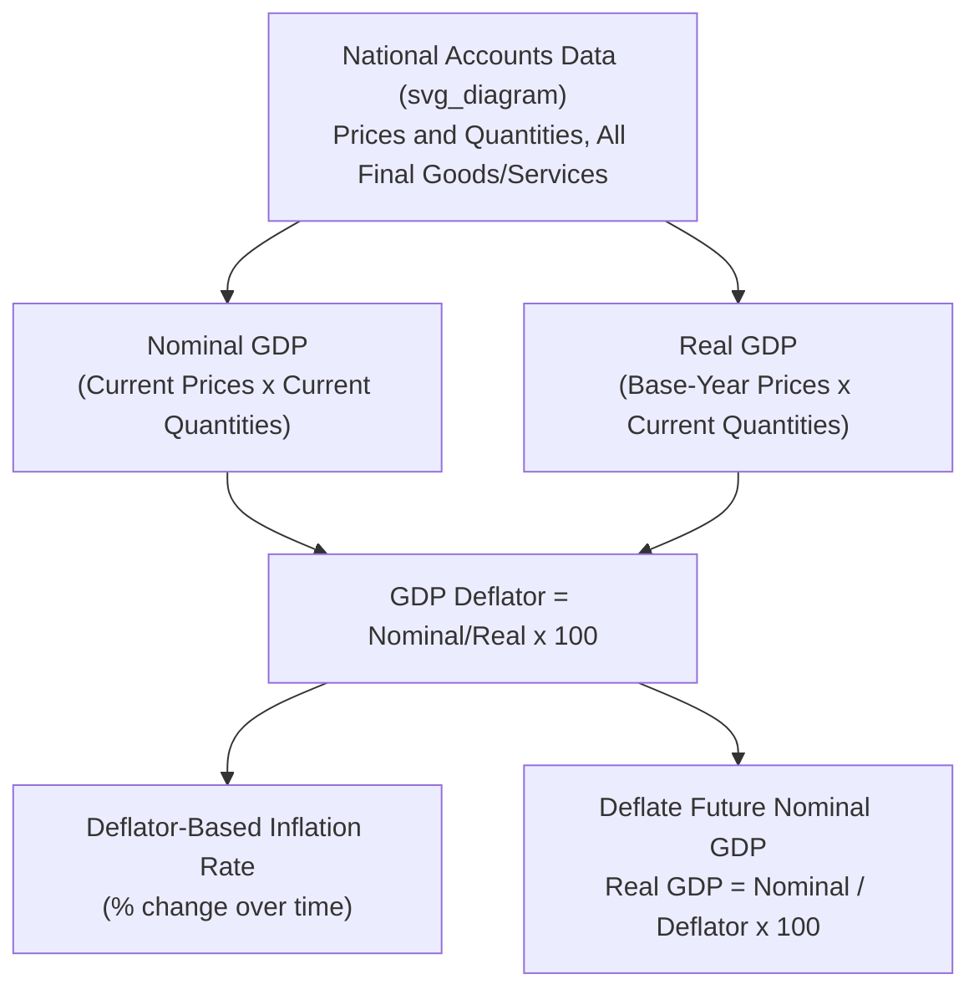

## GDP Deflator Construction and Interpretation

### Definition

The GDP Deflator is an **implicit price index** that measures the average change in prices of all final goods and services produced domestically, constructed as the ratio of nominal GDP to real GDP for a given period. Unlike directly surveyed price indices, it is not built by pricing a fixed basket of goods — it is derived residually from two independently estimated national accounts aggregates.

$$\text{GDP Deflator}_t = \frac{\text{Nominal GDP}_t}{\text{Real GDP}_t} \times 100$$

By construction, the GDP deflator equals exactly 100 in the base year, since nominal and real GDP coincide there.

### Key Points

- The GDP deflator is the **broadest** available price index for an economy, since its coverage automatically matches whatever goods and services are counted in GDP — consumption, investment, government spending, and net exports — rather than a fixed, pre-selected basket.
- It is called "implicit" because it is not directly measured through a price survey; it emerges mathematically once nominal and real GDP are separately estimated.
- Because its component weights are the actual current-period output mix (in a chain-weighted system), the GDP deflator is effectively a **Paasche-type index** in spirit — it uses current-year quantities as weights — in contrast to CPI, which conventionally uses a fixed base-period basket (a Laspeyres-type index).
- The GDP deflator is the standard tool for converting nominal GDP figures across time into real (inflation-adjusted) terms, and vice versa.

### Formal Construction

Given the underlying price/quantity data for all final goods and services in the economy:

$$\text{Nominal GDP}_t = \sum_i P_{i,t} Q_{i,t} \qquad \text{Real GDP}_t = \sum_i P_{i,base} Q_{i,t}$$

$$\text{GDP Deflator}_t = \frac{\sum_i P_{i,t} Q_{i,t}}{\sum_i P_{i,base} Q_{i,t}} \times 100$$

This is structurally a **Paasche price index formula**, since the quantities used in both the numerator and denominator are the current period's ($t$) quantities — only the prices differ (current vs. base year). This is the key structural fact that separates it from the CPI's Laspeyres-style construction, where quantities are instead fixed at base-period levels.

### Worked Numerical Example

Using the same two-good economy as in Nominal versus Real GDP (Year 1 = base year):

| Year | Apples: Price | Apples: Qty | Phones: Price | Phones: Qty |
| --- | --- | --- | --- | --- |
| 1 (base) | $1.00 | 100 | $500 | 10 |
| 2 | $1.20 | 110 | $550 | 12 |

$$\text{Nominal GDP}_2 = (1.20)(110) + (550)(12) = 132 + 6{,}600 = 6{,}732$$

$$\text{Real GDP}_2 = (1.00)(110) + (500)(12) = 110 + 6{,}000 = 6{,}110$$

$$\text{GDP Deflator}_2 = \frac{6{,}732}{6{,}110} \times 100 \approx 110.18$$

**Interpretation**: The average price level of domestically produced final goods and services in Year 2 is approximately 10.18% higher than in the base year (Year 1).

### Deriving the Inflation Rate from the Deflator

The percentage change in the GDP deflator between two periods gives the **GDP deflator-based inflation rate**, one of several available economy-wide inflation measures:

$$\text{Inflation Rate}_{t} = \frac{\text{GDP Deflator}_t - \text{GDP Deflator}_{t-1}}{\text{GDP Deflator}_{t-1}} \times 100$$

**Example**: If the GDP deflator moves from 110.18 (Year 2) to 118.00 (Year 3):

$$\text{Inflation Rate} = \frac{118.00 - 110.18}{110.18} \times 100 \approx 7.10\%$$

### Recovering Real GDP from Reported Nominal GDP and Deflator

Rearranging the core formula gives the standard method for deflating a nominal series:

$$\text{Real GDP} = \frac{\text{Nominal GDP}}{\text{GDP Deflator}} \times 100$$

**Example**: If Nominal GDP in Year 3 is $7,500 and the GDP deflator is 118.00:

$$\text{Real GDP}_3 = \frac{7{,}500}{118.00} \times 100 \approx 6{,}356$$

### Illustrative Diagram: Deflator Derivation and Use

### Chain-Weighting and the Modern GDP Deflator

Most contemporary national accounts (following the UN System of National Accounts, and the U.S. BEA methodology since 1996) do not use a single fixed base year indefinitely. Instead, they compute a **chain-type GDP deflator**, which links together period-to-period price changes computed using adjacent-year weights, rather than weights from an increasingly distant fixed base year.

This chain-weighting substantially reduces two forms of index bias:

- **Substitution bias**: A fixed-base Paasche-style index tends to *understate* true inflation over time as consumers/producers substitute toward relatively cheaper goods, since it uses current (post-substitution) quantities but compares them to base-year prices that no longer reflect the current relative price structure.
- **New product/quality bias**: A distant fixed base year cannot reflect the price/quantity structure of goods that did not exist in that year (e.g., smartphones relative to a 1990s base year), which chain-weighting mitigates by continuously updating the weight basis.

[Inference] The precise chain-linking formula (commonly a Fisher ideal index, which averages Laspeyres and Paasche measures) and its exact bias-correction properties are a matter of applied index-number theory; the core exam-relevant takeaway is that chain-weighting keeps the deflator's implicit quantity weights current rather than frozen at a single historical point.

### GDP Deflator vs. Consumer Price Index (CPI): Key Differences

| Feature | GDP Deflator | CPI |
| --- | --- | --- |
| Index type (conceptually) | Paasche-style (current-period quantity weights) | Laspeyres-style (fixed base-period quantity weights) |
| Goods covered | All final goods/services produced **domestically** | Fixed basket bought by a typical **urban consumer** |
| Imported consumer goods | Excluded (deflator only prices domestic output) | Included (consumers buy imports) |
| Capital goods (machinery, structures) | Included (part of $I$) | Excluded |
| Government output | Included (valued at cost) | Excluded |
| Basket updates | Effectively continuous, under chain-weighting | Periodic (e.g., every several years) |

**Practical consequence**: A sharp rise in the price of imported oil raises CPI (since consumers buy gasoline, an import-derived good) more directly and immediately than it raises the GDP deflator (since imported goods are not part of domestic production, though domestically produced goods that use oil as an input are indirectly affected through production costs).

### Common Points of Confusion

- **The GDP deflator is not directly "measured" via a price survey** the way CPI is; it is *computed* after the fact from independently estimated nominal and real GDP. This makes it available only with the lag associated with full GDP estimation, whereas CPI can be published more frequently and quickly from ongoing price surveys.
- **A Paasche-style index (like the un-chained GDP deflator) tends to understate inflation**, while a Laspeyres-style index (like a fixed-basket CPI) tends to overstate it, both due to substitution bias operating in opposite directions — a standard result in index number theory. [Inference] The direction and magnitude of this bias depends on the extent of actual substitution behavior in the economy being measured, and is a generalization rather than a guaranteed result in every specific case.
- **The GDP deflator excludes imported goods entirely**, so it is not necessarily a good real-time indicator of the price pressures actually facing households, who spend on both domestic and imported goods. CPI is generally the more relevant deflator for household cost-of-living purposes.
- **The deflator can behave counterintuitively** in specific edge cases, such as when a country's terms of trade shift significantly (e.g., a large rise in export commodity prices with roughly stable domestic consumer prices) — since exports are included in GDP but the deflator does not distinguish between price changes driven by domestic demand versus international export prices.

**Related Topics**

- Nominal versus real GDP
- Consumer Price Index (CPI) construction and the inflation basket
- Chain-weighted vs. fixed-base index number methods (Laspeyres, Paasche, Fisher)
- Measuring inflation: CPI, WPI/PPI, and GDP deflator compared
- Gross Domestic Product concept and definition
- Real GDP per capita and living-standard comparisons
- Terms of trade and its effect on national income measures