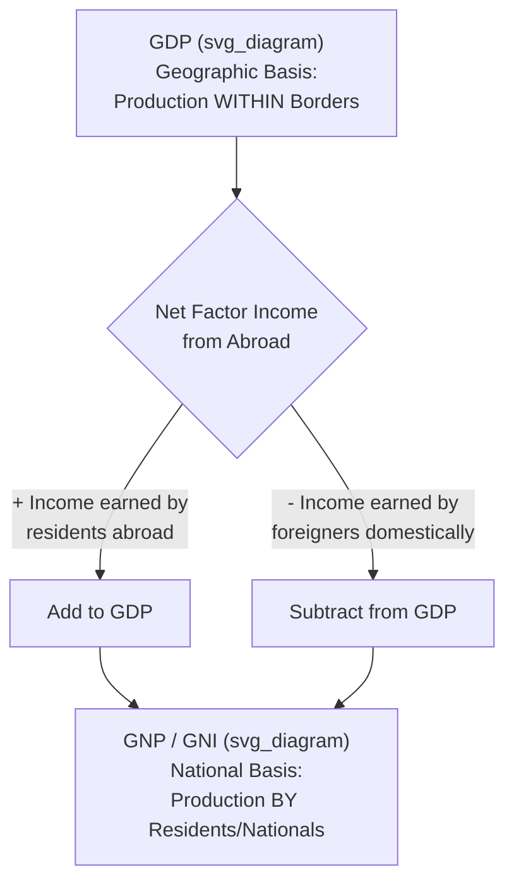

## Gross National Product and Gross National Income

### Definition

**Gross National Product (GNP)** measures the total market value of all final goods and services produced by the **factors of production owned by a country's residents/nationals**, regardless of whether that production occurs domestically or abroad. **Gross National Income (GNI)** is the modern, functionally equivalent successor term used in most contemporary national accounting systems (including the UN System of National Accounts), emphasizing the income-based measurement of the same underlying concept.

GNP/GNI contrasts directly with GDP's **domestic** (geographic) basis by instead applying a **national** (ownership) basis. The relationship is:

$$GNP \text{ (or } GNI\text{)} = GDP + \text{Net Factor Income from Abroad (NFIA)}$$

### Key Points

- **GDP is geographic**: it counts production occurring *within* a country's borders, regardless of who owns the producing factors.
- **GNP/GNI is national**: it counts production *by* a country's own nationally-owned factors of production, regardless of where in the world that production physically occurs.
- **GNI has largely replaced GNP terminology** in modern national accounts (UN SNA, World Bank, IMF), reflecting a shift toward emphasizing the income-received perspective; the two terms measure conceptually the same aggregate and are often used interchangeably in introductory treatments, though technical distinctions can exist in specific measurement conventions. [Inference] The degree to which GNP and GNI are treated as strictly identical versus subtly distinct varies by textbook and accounting authority; students should follow their specific curriculum's convention.
- The gap between GDP and GNP/GNI for any given country depends entirely on the size and direction of its **Net Factor Income from Abroad**.

### Net Factor Income from Abroad (NFIA)

NFIA is the central adjustment term linking GDP to GNP/GNI:

$$NFIA = \text{Factor Income Earned by Residents Abroad} - \text{Factor Income Earned by Non-Residents Domestically}$$

Factor income here refers to compensation for labor, capital, and entrepreneurship — wages, profits, dividends, interest, and rent — flowing across borders, **not** goods and services trade (which is already captured in $X$ and $M$ within GDP).

**Sign interpretation**:

- $NFIA > 0$: The country's residents earn more from their factors abroad than foreigners earn from factors located domestically. In this case, $GNP > GDP$.
- $NFIA < 0$: The country's residents earn less abroad than foreigners earn domestically. In this case, $GNP < GDP$.

[Inference] Countries with large stocks of overseas labor (e.g., significant overseas foreign worker remittance economies) or substantial foreign investment holdings tend to show a positive NFIA and thus GNP figures noticeably above GDP; countries that are net recipients of foreign direct investment, with substantial profit repatriation by foreign-owned firms operating domestically, tend to show the opposite pattern. The specific magnitude for any given country in any given year is an empirical matter requiring current data rather than a fixed structural fact.

### Worked Numerical Example

Consider a hypothetical country with the following data (in billions):

| Item | Value |
| --- | --- |
| GDP | 1,000 |
| Income earned by this country's nationals working/investing abroad | 80 |
| Income earned by foreign nationals/firms operating within this country | 45 |

$$NFIA = 80 - 45 = 35$$

$$GNP = GDP + NFIA = 1{,}000 + 35 = 1{,}035$$

In this example, GNP exceeds GDP because the country's residents earn more in factor income from abroad than foreigners earn domestically.

### Illustrative Example: Overseas Worker Remittances

A classic illustrative case for economies with significant labor migration: a Filipino nurse working in the United Kingdom.

- Her salary is earned through labor performed **within UK borders** → it contributes to **UK GDP** (production occurring domestically in the UK, regardless of the worker's nationality).
- Her salary is earned **by a Philippine national** → it contributes to **Philippine GNP/GNI** (income accruing to a Philippine resident/national, regardless of where the underlying work took place).

This example illustrates precisely why the GDP/GNP distinction matters for countries with substantial numbers of citizens working abroad: their GNP can exceed their GDP even though none of that specific labor activity occurred on domestic soil.

### Illustrative Diagram: GDP-to-GNP Relationship

### GNP/GNI and Related National Accounting Aggregates

GNP/GNI serves as the starting point for a further chain of national accounting measures used to move from a gross national output measure toward disposable income available to households:

$$NNP \text{ (Net National Product)} = GNP - \text{Depreciation}$$

$$NI \text{ (National Income)} = NNP - \text{Net Indirect Business Taxes}$$

[Note: The subsequent derivation from National Income to Personal Income and Disposable Personal Income — involving adjustments for retained corporate earnings, corporate taxes, social insurance contributions, and transfer payments — is treated as a dedicated syllabus item in this chapter.]

### GNP/GNI per Capita and International Comparisons

$$GNI \text{ per capita} = \frac{GNI}{Population}$$

GNI per capita is widely used by international institutions (notably the **World Bank**, which uses it as the primary basis for its country income classification system — low-income, lower-middle-income, upper-middle-income, and high-income) as a broad proxy for a country's average income level, since it captures income accruing to residents rather than merely geographic production.

[Inference] The World Bank's specific income-classification thresholds are revised periodically (typically annually) and are subject to change; any specific dollar threshold cited should be verified against the current-year classification if precision matters for a given application.

### Common Points of Confusion

- **"Gross" in GNP still refers to no deduction for depreciation** — exactly as with GDP. Depreciation must still be subtracted separately to reach Net National Product.
- **NFIA is about factor income, not trade in goods and services.** It should not be confused with net exports ($X - M$), which is already fully embedded within GDP itself. NFIA captures cross-border *income flows* (wages, profits, interest, dividends), while net exports captures cross-border *goods and services* flows.
- **A country can have negative NFIA and still have healthy or growing GDP.** These are separate dimensions — NFIA reflects the ownership structure of a country's economy (how much is foreign-owned versus how much income its own nationals earn overseas), not the country's productive capacity itself.
- **GNP and GNI are conceptually the same aggregate**, generally used interchangeably at the introductory level, though "GNI" has become the preferred and more commonly used term in current international statistical practice (World Bank, IMF, UN SNA).
- **Remittances sent home by overseas workers are, strictly speaking, a personal transfer of already-earned income**, distinct from the underlying NFIA/GNP adjustment itself, which occurs at the point the income is *earned* abroad — the subsequent transfer of funds back to the home country is a secondary financial flow, not a second instance of production or income generation. [Inference] Precise national accounting treatment of remittance flows (as current transfers within the balance of payments, distinct from primary factor income/NFIA) can be a subtle point that varies in how thoroughly it is covered across different curricula.

**Related Topics**

- Gross Domestic Product concept and definition
- Net National Product and depreciation
- National Income, Personal Income, and Disposable Personal Income
- Balance of payments: current account vs. financial account
- Remittances and their role in developing economies
- World Bank income classification and GNI per capita
- Foreign direct investment and profit repatriation