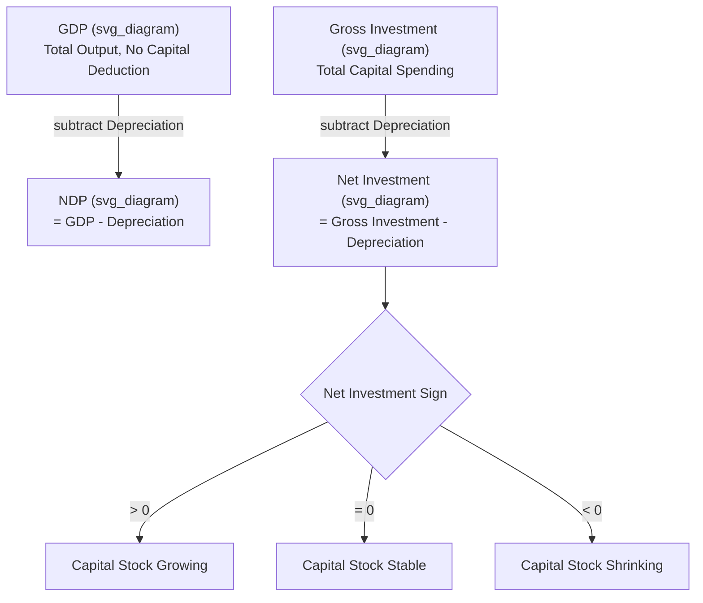

## Net Domestic Product and Depreciation

### Definition

**Net Domestic Product (NDP)** measures GDP after subtracting **depreciation** (also called the **Consumption of Fixed Capital**, or capital consumption allowance) — the estimated value of capital equipment, structures, and infrastructure that wore out or became obsolete during the period of production. NDP represents the value of output the economy can consume or invest while still maintaining its existing capital stock intact, unlike GDP, which makes no such adjustment.

$$NDP = GDP - \text{Depreciation}$$

### Key Points

- **"Gross" measures (GDP, GNP) do not subtract depreciation**; **"Net" measures (NDP, NNP) do**. This gross/net distinction is one of the most fundamental organizing conventions in national income accounting.
- Depreciation represents capital **consumed** in production — machines wearing out, buildings deteriorating, vehicles aging — and is a genuine economic cost, even though it does not correspond to a cash payment made to any factor of production.
- NDP is arguably a more accurate measure of an economy's **sustainable** output than GDP, since a portion of gross output must be reinvested merely to replace worn-out capital before any *net* addition to productive capacity or consumption is possible.
- Depreciation is also central to the **income approach** to GDP, where it appears as an addition needed to reconcile National Income (a net, factor-cost concept) back up to GDP (a gross, market-price concept).

### Understanding Depreciation (Consumption of Fixed Capital)

Depreciation in the national accounting sense refers to the wearing out, using up, or obsolescence of the economy's stock of **fixed capital** — plant, machinery, equipment, and structures — during the production process. It is conceptually distinct from several related but different ideas:

- **Not the same as accounting depreciation on a firm's tax return**, which follows specific statutory schedules (e.g., straight-line, accelerated) that may not reflect true economic wear.
- **Not the same as a decline in asset market value** due to demand shifts (e.g., a house losing market value due to a neighborhood decline is not "depreciation" in this sense; it is a capital loss, not consumption of the physical asset itself).
- **Estimated, not directly observed**, since actual physical wear is difficult to measure precisely; statistical agencies use standardized methods (e.g., the perpetual inventory method, applying assumed service lives to categories of capital assets) to estimate it. [Inference] The specific estimation methodology and assumed asset service lives vary by country and by the particular national statistical agency's practices.

### Gross vs. Net Investment: The Direct Link to Depreciation

Depreciation connects directly to the investment component ($I$) of the expenditure approach:

$$I_{gross} = I_{net} + \text{Depreciation}$$

- **Gross investment** ($I_{gross}$) is total spending on new capital goods during the period — the figure counted in GDP.
- **Net investment** ($I_{net}$) is gross investment minus depreciation, representing the actual *increase* in the economy's capital stock.

$$I_{net} = I_{gross} - \text{Depreciation}$$

**Three possible scenarios**:

| Condition | Interpretation |
| --- | --- |
| $I_{net} > 0$ | Capital stock is growing; new investment exceeds worn-out capital |
| $I_{net} = 0$ | Capital stock is stable; new investment exactly replaces worn-out capital |
| $I_{net} < 0$ | Capital stock is shrinking; investment fails to keep pace with capital consumption ("capital consumption exceeds capital formation") |

This is directly relevant to long-run growth analysis: an economy can show positive $I_{gross}$ (and therefore contribute positively to GDP) while still experiencing a **declining** productive capacity, if depreciation exceeds gross investment.

### Worked Numerical Example

Given the following data for a hypothetical economy (in billions):

| Item | Value |
| --- | --- |
| GDP | 1,200 |
| Gross private domestic investment | 220 |
| Depreciation (Consumption of Fixed Capital) | 150 |

**NDP calculation**:

$$NDP = GDP - \text{Depreciation} = 1{,}200 - 150 = 1{,}050$$

**Net investment calculation**:

$$I_{net} = I_{gross} - \text{Depreciation} = 220 - 150 = 70$$

In this example, the economy's capital stock is growing ($I_{net} = 70 > 0$), and NDP (1,050) is meaningfully below GDP (1,200), reflecting the substantial share of gross output that had to be redirected merely to replace worn-out capital.

### Illustrative Diagram: Gross-to-Net Relationship

### Depreciation's Role in the Income Approach

As detailed in the income approach to GDP, National Income (NI) is a **net, factor-cost** concept — it sums only payments actually received by factors of production (wages, rent, interest, profit). Depreciation is **not** paid out to any factor, so it must be **added back** to move from NI up to a gross, market-price measure like GDP:

$$GDP = NI + \text{Net Indirect Business Taxes} + \text{Depreciation} - NFIA \text{ (adjustment)}$$

This is the same depreciation figure used in the NDP calculation, applied in the opposite direction (subtracted to go from gross to net; added to go from net/factor-cost to gross/market-price).

### Why NDP Is Less Commonly Reported Than GDP

Despite its conceptual appeal as a more accurate "sustainable output" measure, NDP is reported and used far less frequently than GDP in headline economic statistics and media reporting, for several practical reasons:

- **Depreciation is inherently an estimate**, not a directly observed market transaction, making it subject to greater measurement uncertainty and methodological revision than the more directly observable components of GDP.
- **International comparability is weaker**, since different countries may apply different assumptions about asset service lives and depreciation schedules. [Inference] The degree of cross-country divergence in depreciation estimation methodology is a recognized limitation in comparative national accounting, though its practical magnitude varies by country pair and asset composition.
- **GDP has become the entrenched conventional benchmark** for cross-country and historical comparison, business cycle dating, and policy communication, making it the default headline figure even though NDP is, in principle, the more economically meaningful measure of an economy's net productive contribution.

### Common Points of Confusion

- **Depreciation is not the same as inflation or a fall in the deflator.** Depreciation concerns the physical wearing out/obsolescence of capital goods; it is unrelated to changes in the general price level.
- **Depreciation reduces NDP relative to GDP, but it does not reduce nominal spending figures like $C$ or $G$.** It applies specifically as a deduction related to the economy's capital stock and appears explicitly within the investment component's gross/net distinction.
- **"Net" in NDP refers exclusively to the depreciation deduction**, not to any other adjustment (such as removing indirect taxes, which is a separate step used when moving toward National Income, not NDP).
- **A country with high gross investment is not necessarily building up its capital stock quickly** — the more informative figure is net investment, since a high level of gross investment can simply be offsetting an equally high level of depreciation.

**Related Topics**

- Gross Domestic Product concept and definition
- Income approach to GDP measurement
- Gross National Product and Gross National Income
- Net National Product and National Income derivation
- Capital stock, capital formation, and long-run economic growth
- Perpetual inventory method and depreciation estimation
- Sustainable development and "green" national accounting adjustments