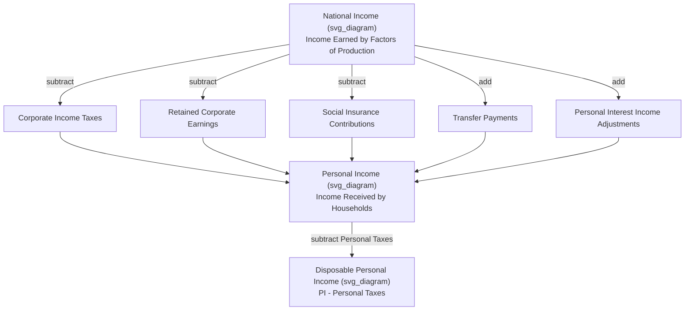

## Personal Income and Disposable Income

### Definition

**Personal Income (PI)** is the total income actually **received** by households and individuals from all sources, before personal taxes are paid. **Disposable Personal Income (DPI)**, also called **Disposable Income (DI)**, is Personal Income after the deduction of personal taxes — the income households actually have available to spend or save.

$$DPI = PI - \text{Personal Taxes}$$

Both measures sit at the end of a chain of national accounting aggregates that begins with GDP and moves progressively toward the income actually available to, and used by, households — a chain critical for understanding consumer spending behavior, savings rates, and the transmission of national output into household welfare.

### Key Points

- **Personal Income differs from National Income** because National Income includes income *earned* by factors of production (including corporate profits not distributed to shareholders), while Personal Income includes only income actually *received* by households, including certain payments (transfer payments) that do not correspond to any current factor contribution.
- The derivation from National Income to Personal Income requires **subtracting** income earned but not received by households, and **adding** income received but not earned in the current period.
- **Disposable Personal Income is the direct determinant of household consumption and saving decisions** in most macroeconomic models (e.g., the Keynesian consumption function), making it a critical bridge concept between national output and behavioral economic theory.
- This entire chain (GNP → NNP → NI → PI → DPI) represents progressively "closer to the household" measures of economic value, each requiring specific, well-defined adjustments.

### From National Income to Personal Income: The Full Derivation

Starting from National Income (NI), the following adjustments yield Personal Income:

$$PI = NI - \text{Corporate Income Taxes} - \text{Retained Corporate Earnings (Undistributed Profits)} - \text{Social Insurance Contributions} + \text{Transfer Payments} + \text{Personal Interest Income Adjustments}$$

**Items subtracted** (income earned by factors but not received by households):

- **Corporate income taxes**: Paid by corporations to government; never reaches shareholders or households directly.
- **Undistributed/retained corporate profits**: Profit the corporation reinvests internally rather than distributing as dividends; belongs to the corporation's income in NI but is not received by any individual household.
- **Social insurance contributions (payroll taxes)**: The employee and employer portions of contributions to programs such as Social Security, Medicare (U.S.), or SSS/PhilHealth/Pag-IBIG (Philippines); these are earned as part of labor compensation in NI but are not received as spendable income by the household at the time they are withheld.

**Items added** (income received by households but not earned as current factor payments):

- **Transfer payments**: Government payments such as Social Security benefits, unemployment insurance, and welfare payments, plus business transfer payments (e.g., corporate charitable donations, uncollectible consumer debt written off). These are received by households but do not correspond to a current productive contribution, and were therefore correctly excluded from National Income and GDP.
- **Personal interest income adjustments**: Certain interest receipts by households (e.g., interest on government bonds, which was excluded from National Income's "interest" component) are added back here, since households do actually receive this income even though it was not counted as a factor payment for current production.

### Illustrative Diagram: National Income to Personal Income

### From Personal Income to Disposable Personal Income

The final step deducts direct personal taxes owed by households to government:

$$DPI = PI - \text{Personal Taxes (Income Tax, Property Tax, etc.)}$$

DPI represents the pool of income households can allocate between two, and only two, uses:

$$DPI = C + S$$

where $C$ is personal consumption expenditure and $S$ is personal saving. This identity is the foundation of the **Keynesian consumption function** and the concepts of the marginal propensity to consume (MPC) and marginal propensity to save (MPS).

$$MPC = \frac{\Delta C}{\Delta DPI} \qquad MPS = \frac{\Delta S}{\Delta DPI} \qquad MPC + MPS = 1$$

### Worked Numerical Example

Given the following data for a hypothetical economy (in billions):

| Item | Value |
| --- | --- |
| National Income | 720 |
| Corporate income taxes | 30 |
| Retained corporate earnings | 25 |
| Social insurance contributions | 60 |
| Transfer payments | 90 |
| Personal interest income adjustment | 5 |
| Personal taxes | 110 |

**Personal Income calculation**:

$$PI = 720 - 30 - 25 - 60 + 90 + 5 = 700$$

**Disposable Personal Income calculation**:

$$DPI = PI - \text{Personal Taxes} = 700 - 110 = 590$$

If households in this economy spend $540 billion on consumption:

$$S = DPI - C = 590 - 540 = 50$$

### Personal Saving Rate

A commonly reported derived statistic is the **personal saving rate**, the share of disposable income that is saved rather than spent:

$$\text{Personal Saving Rate} = \frac{S}{DPI} \times 100$$

Using the example above:

$$\text{Personal Saving Rate} = \frac{50}{590} \times 100 \approx 8.47\%$$

[Inference] Personal saving rates vary substantially across countries and over time due to demographic structure, social safety net design, cultural saving norms, credit availability, and interest rate environments; no single "normal" rate applies universally, and current-period figures should be checked against up-to-date national statistics rather than assumed from historical patterns.

### Common Points of Confusion

- **Personal Income is not the same as wages/salary income alone.** It includes transfer payments, dividends received, rental income received directly by individuals, and personal interest income — a broader concept than "earnings from work."
- **Retained corporate earnings are subtracted precisely because they are *not* received by the household**, even though the shareholder technically "owns" that share of the retained profit in an economic sense; only actually distributed dividends count as received income for PI purposes.
- **Transfer payments are correctly excluded from GDP, GNP, and National Income, but correctly included in Personal Income**, since PI is specifically measuring income *received* by households, regardless of whether that income corresponds to current productive activity.
- **Social insurance contributions are subtracted at the PI stage, not the NI stage**, since they are counted as part of an employee's total compensation (and thus part of NI) even though the employee does not directly receive that withheld portion as spendable income.
- **DPI, not GDP or National Income, is the correct base for analyzing household consumption behavior** in most introductory macroeconomic models, since it reflects the actual after-tax income households have on hand to allocate between spending and saving.

**Related Topics**

- Gross National Product and Gross National Income
- Net domestic product and depreciation
- National Income derivation and factor payments
- Keynesian consumption function and the multiplier effect
- Marginal propensity to consume and marginal propensity to save
- Personal saving rate and cross-country comparisons
- Transfer payments and social insurance programs
- Circular flow of income model