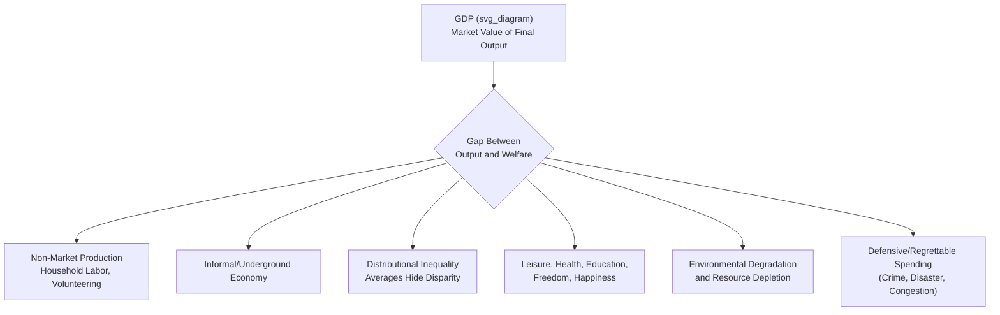

## Limitations of GDP as a Welfare Measure

### Definition

GDP is a measure of the **market value of final output produced** within an economy over a period; it was never designed, and is not well-suited, to serve as a comprehensive measure of **economic welfare** or quality of life. Welfare — the overall well-being of a population — depends on many dimensions of human experience that GDP either omits entirely, values imperfectly, or actively treats as a positive contribution despite representing a genuine social cost. This distinction between "output produced" and "welfare experienced" is a foundational critique in national income accounting.

### Key Points

- GDP measures **production**, not **well-being**; the two are correlated but not identical, and the gap between them can be economically and socially significant.
- Simon Kuznets, the economist largely credited with developing modern national income accounting in the 1930s, himself cautioned against equating national income growth with welfare improvement — a caveat frequently noted in the historical literature on this topic.
- The limitations fall into several distinct categories: **omitted non-market activity**, **distributional blindness**, **quality-of-life omissions**, **environmental and depletion costs**, and **compositional/defensive-expenditure issues**.
- Several alternative and supplementary measures (Human Development Index, Genuine Progress Indicator, Green GDP, and others) have been developed specifically to address one or more of these gaps, though none has displaced GDP as the dominant headline economic statistic.

### Limitation 1: Non-Market and Household Production

GDP counts only transactions occurring through observable markets. Significant categories of genuinely valuable production are excluded because no market transaction records them:

- **Unpaid household labor**: childcare, cooking, cleaning, and home maintenance performed by household members. [Inference] This category is sometimes cited as economically substantial relative to measured GDP in some studies, though precise magnitude estimates depend heavily on the valuation methodology used (e.g., opportunity-cost wages vs. replacement-cost wages) and vary by country and time period.
- **Volunteer work and unpaid community service.**
- **Subsistence production**: food grown and directly consumed by the producing household, particularly significant in developing and rural economies, where a meaningful share of real economic activity may occur entirely outside formal, recorded markets.

A direct illustrative anomaly: if a person marries their household cook (and the cook subsequently stops being paid for now-unpaid domestic labor), measured GDP *falls*, even though the identical physical activity (cooking, cleaning) continues to occur.

### Limitation 2: The Underground/Informal Economy

Illegal transactions (drug trafficking, unlicensed gambling) and unreported legal transactions (cash-based work to avoid taxation, informal-sector trade) are, by definition, difficult for statistical agencies to observe and are therefore substantially underrepresented in official GDP figures. [Inference] The scale of underground/informal economic activity varies enormously by country, and current-period estimates for any specific country should be checked against up-to-date research rather than assumed from general priors.

### Limitation 3: Distributional Blindness

GDP is an **aggregate** figure; it says nothing about **how output is distributed** across the population. Two countries (or the same country at two different times) can report identical GDP or GDP per capita while having vastly different levels of income inequality, and therefore vastly different implications for overall population welfare.

- **GDP per capita is only an average**, calculated as $\frac{GDP}{Population}$, and can rise even while the median citizen's actual living standard stagnates or declines, if income gains are concentrated among a small share of the population.
- Complementary distributional measures — the **Gini coefficient**, the **Lorenz curve**, and **median (rather than mean) income** — are needed to assess how broadly GDP growth translates into improved welfare across the population.

### Limitation 4: Quality-of-Life and Non-Economic Dimensions

GDP does not directly capture several dimensions widely regarded as central to genuine well-being:

- **Leisure time**: An economy where citizens work 70-hour weeks to produce a given GDP is not obviously "better off" in welfare terms than one producing the same GDP with 40-hour weeks, yet GDP treats both identically, since leisure has no market price and is not counted as either output or a cost.
- **Health outcomes**: Life expectancy, disease burden, and access to healthcare are not directly reflected, though *spending* on healthcare (a market transaction) does count positively toward GDP regardless of whether health outcomes actually improve.
- **Education and literacy.**
- **Political freedom, safety, and social cohesion.**
- **Subjective well-being/happiness**, increasingly studied directly through survey-based metrics (e.g., the World Happiness Report), which frequently show only partial correlation with GDP per capita rankings across countries.

### Limitation 5: Environmental Degradation and Resource Depletion

GDP treats environmental costs asymmetrically and, in several specific ways, perversely:

- **Pollution and environmental damage are not subtracted** from GDP, even though they represent a genuine reduction in societal welfare and, often, future productive capacity (e.g., through health costs, reduced agricultural yields, or climate-related damage).
- **Cleanup spending is counted positively.** If a factory pollutes a river and a separate firm is then paid to clean it up, both the original polluting production *and* the cleanup expenditure add positively to GDP — the accounting treats an environmental harm and its remediation as two separate contributions to output, rather than a cost and an offsetting correction.
- **Depletion of natural resources (non-renewable resources, deforestation, overfishing) is not deducted** as a reduction in the nation's natural capital stock, even though depleting a finite resource base reduces the economy's capacity for future production — GDP treats resource extraction purely as current-period output, with no adjustment for the corresponding decline in the remaining stock.

### Limitation 6: Defensive and Regrettable Expenditures

Certain categories of spending are counted as positive contributions to GDP despite arguably representing responses to problems rather than genuine welfare improvements:

- **Spending to counteract crime, disaster, or conflict** (e.g., private security spending, military expenditure, disaster reconstruction) increases GDP, even though a society experiencing *less* crime or disaster requiring such spending in the first place would generally be considered better off.
- **Increased traffic congestion leading to higher fuel consumption** raises GDP (more fuel purchased) despite representing lost time and reduced quality of life for commuters.

This category is sometimes referred to in the literature as **"defensive expenditures"** — spending incurred to defend against or repair a negative condition, rather than spending that directly represents an improvement in welfare.

### Illustrative Diagram: GDP-Welfare Gap

### Alternative and Supplementary Measures

Various indices have been developed to address one or more of GDP's welfare-measurement gaps, each targeting specific limitations rather than replacing GDP outright:

| Measure | Primary Focus | Addresses |
| --- | --- | --- |
| **Human Development Index (HDI)** | Combines income, life expectancy, and education into a composite index (UNDP) | Health and education omissions |
| **Genuine Progress Indicator (GPI)** | Adjusts GDP-like spending data for income distribution, environmental costs, and non-market work | Distribution, environment, defensive expenditures |
| **Green GDP** | Deducts estimated environmental degradation and resource depletion costs from conventional GDP | Environmental degradation |
| **Gini Coefficient / Lorenz Curve** | Measures income/wealth inequality directly | Distributional blindness |
| **World Happiness Report / Subjective Well-Being Surveys** | Direct self-reported life satisfaction | Quality-of-life omissions |
| **Gross National Happiness (Bhutan)** | National policy framework explicitly prioritizing well-being dimensions beyond output | Broad-based alternative to output-centric measurement |

[Inference] None of these alternative measures has achieved the universal adoption, standardization, or cross-country comparability of GDP, and each carries its own methodological debates (e.g., how to weight HDI's component dimensions, how to monetize environmental damage for Green GDP); they are best understood as complements that illuminate specific blind spots rather than as fully validated replacements.

### Common Points of Confusion

- **These limitations do not mean GDP is a "bad" or "useless" statistic.** GDP remains highly useful and appropriate for its actual intended purpose — measuring the scale of market production and tracking output/business-cycle fluctuations — the critique is specifically about its adequacy as a **welfare** measure, a different and broader concept.
- **A rising GDP does not guarantee rising welfare**, but the two are also not unrelated — higher GDP generally does provide more resources potentially available for improving health, education, and living standards, even though it does not guarantee such improvements actually occur or are distributed broadly.
- **"GDP doesn't count happiness" is a reasonable shorthand, but the underlying critique is more structurally precise**: it is not merely that GDP omits subjective feelings, but that it specifically double-counts remediation spending, ignores non-market production, and treats resource depletion and inequality as invisible.
- **Green GDP and similar environmental adjustments are conceptually straightforward but empirically difficult**, since assigning a reliable monetary value to environmental damage, ecosystem services, or resource depletion involves significant estimation challenges and remains an active area of methodological development, rather than a settled, standardized practice adopted uniformly across countries. [Inference] The specific state of adoption and standardization of Green GDP accounting is evolving and should be checked against current sources if precision on any particular country's practice is required.

**Related Topics**

- Gross Domestic Product concept and definition
- Human Development Index (HDI) construction
- Genuine Progress Indicator and Green GDP methodologies
- Gini coefficient and Lorenz curve for measuring inequality
- Real GDP per capita and cross-country living-standard comparisons
- Underground/informal economy measurement challenges
- Sustainable development and natural capital accounting
- Subjective well-being and happiness economics