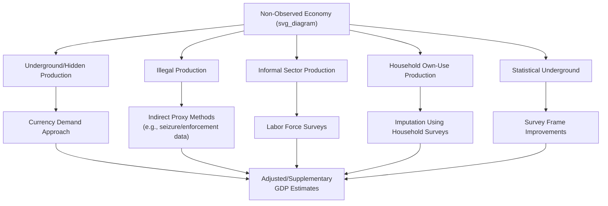

## Underground Economy and Informal Sector Measurement

### Definition

The **underground economy** (also called the shadow, hidden, or non-observed economy) refers to economic activity that is deliberately concealed from public authorities to avoid taxation, regulation, or detection of illegality. The **informal sector** is a related but distinct concept, referring to economic units — typically small-scale, often unregistered — that operate outside formal legal and regulatory structures, frequently not out of intent to deceive authorities but due to structural barriers to formalization (registration costs, limited access to credit, low literacy, or the nature of subsistence livelihoods). Both categories are, to varying degrees, **underrepresented in official GDP statistics**, creating a persistent measurement gap between recorded and actual economic activity.

### Key Points

- The underground economy and informal sector are conceptually distinct, though they overlap substantially in practice and are often treated together in introductory discussions of GDP's measurement limitations.
- Statistical agencies (national statistics offices, IMF, World Bank, OECD) devote considerable methodological effort to **estimating** the size of these unmeasured sectors and, where feasible, incorporating adjustments into official GDP figures — full observation is not achievable by definition, since concealment is often the defining characteristic.
- The relative importance of informal/underground activity varies enormously across countries, generally (though not universally) correlating with a country's level of economic development, regulatory burden, and tax administration capacity.
- This topic connects directly to the broader discussion of GDP's limitations as a measure of true economic activity and welfare (see Limitations of GDP as a welfare measure).

### Categorizing the Non-Observed Economy

The System of National Accounts (SNA) framework, followed by most national statistical agencies, conventionally decomposes the "non-observed economy" into several distinct components, each requiring different measurement strategies:

| Category | Description | Example |
| --- | --- | --- |
| **Underground/hidden production** | Legal production activities deliberately concealed to evade taxes, social contributions, or labor regulations | A restaurant that under-reports cash sales to reduce tax liability |
| **Illegal production** | Production of goods/services that are themselves prohibited by law | Illegal drug production and trafficking, unlicensed gambling |
| **Informal sector production** | Production by unincorporated, typically unregistered small-scale units, often for subsistence or survival rather than tax evasion | A street vendor operating without business registration; small-scale subsistence farming |
| **Household production for own final use** | Goods and services produced and consumed by the same household | Growing vegetables in a home garden for the family's own consumption |
| **Statistical underground** | Activity missed due to deficiencies in data collection, not deliberate concealment | Unregistered new businesses not yet captured in survey sampling frames |

[Inference] The precise boundaries and terminology of this classification can vary somewhat between international frameworks (UN SNA, ILO informal sector definitions) and specific national statistical practices; the categories above represent a standard conceptual synthesis rather than a single universally identical taxonomy.

### Why This Activity Is Undercounted in GDP

- **Deliberate concealment**: By definition, participants in the underground economy actively avoid the record-keeping (invoices, tax filings, business registration) that statistical agencies typically rely upon to observe economic activity.
- **Illegality**: Illegal production is, by its nature, not voluntarily reported, and direct survey methods are largely ineffective for measuring it, requiring instead indirect estimation techniques.
- **Structural informality**: Informal-sector participants may not conceal activity out of evasive intent, but simply exist outside the surveys, registries, and tax systems statistical agencies use as their primary data sources, meaning they are missed even without any deliberate deception.
- **Cash-based transactions**: A high reliance on cash rather than traceable electronic/banking transactions makes informal and underground activity structurally harder to detect through financial-record-based estimation methods.

### Methods Used to Estimate the Underground Economy

Because the underground economy resists direct observation, statistical agencies and researchers rely on **indirect estimation methods**, each with distinct strengths, limitations, and underlying assumptions:

- **Discrepancy methods**: Comparing independently collected data sources that should theoretically match if no concealment occurred — for example, comparing income-approach GDP against expenditure-approach GDP, or comparing reported household income against reported household expenditure; a persistent, unexplained gap can suggest hidden activity.
- **Monetary methods (e.g., currency demand approach)**: Since underground transactions are heavily cash-based (to avoid a traceable paper trail), unusually high demand for physical currency relative to what standard monetary models would predict (based on interest rates, income, and payment technology) is used as an indirect proxy for the scale of concealed activity. [Inference] Currency-demand-based estimates are widely used but are also widely debated in the academic literature regarding their sensitivity to model specification and underlying assumptions.
- **Labor market discrepancy approach**: Comparing the officially recorded labor force participation rate against actual/surveyed labor force participation (e.g., through household labor force surveys that ask about work status directly, potentially capturing informal employment missed by employer-based records).
- **Physical input methods**: Using observable physical indicators correlated with production (e.g., electricity consumption) to infer a plausible level of total production, then comparing that implied level against officially recorded GDP to estimate an unrecorded gap.
- **Survey-based direct estimation**: Specialized household or enterprise surveys specifically designed to elicit (often anonymously) information about informal economic activity, income, or employment.
- **Multiple Indicators Multiple Causes (MIMIC) models**: A structural statistical modeling approach that treats the underground economy as an unobserved ("latent") variable, estimated jointly from multiple observable causes (tax burden, regulatory intensity) and multiple observable indicators (currency demand, labor force participation, GDP growth).

### Illustrative Diagram: Non-Observed Economy Estimation

### Consequences of Underground/Informal Economic Activity

- **Understated GDP**: Official GDP figures likely understate true production to varying degrees, with the magnitude highly country- and time-specific rather than following a fixed universal pattern.
- **Reduced government revenue**: Tax evasion embedded within underground economic activity directly reduces available public revenue, potentially constraining public service provision and infrastructure investment.
- **Distorted policy indicators**: Unemployment rates, poverty rates, and inequality measures can all be affected if informal employment and income are systematically undercounted, potentially leading to inaccurate assessments of an economy's true labor market and distributional conditions.
- **Weakened social protection coverage**: Workers in the informal sector typically lack access to formal labor protections, social insurance contributions, and associated benefits, a significant welfare and policy concern distinct from, but related to, the pure measurement problem.
- **International comparability challenges**: Since the scale of underground/informal activity, and the sophistication of methods used to estimate and incorporate it into official statistics, both vary substantially by country, cross-country GDP comparisons carry an additional layer of uncertainty beyond standard exchange-rate or PPP conversion issues.

### Policy and Statistical Responses

- **Formalization incentives**: Simplified business registration, reduced compliance costs, and targeted tax incentives aimed at encouraging informal-sector units to formalize.
- **Improved statistical methodology**: Ongoing refinement of national accounts practices (following UN SNA and IMF guidance) to explicitly incorporate non-observed economy adjustments into official GDP estimates, rather than treating GDP as representing only formally observed transactions.
- **Digital payment expansion**: [Inference] The growth of electronic and mobile payment systems in many economies is frequently cited as a factor that may reduce the relative scale of cash-based underground activity over time by increasing transaction traceability, though this remains an evolving empirical question rather than an established, uniformly observed outcome across all contexts.

### Common Points of Confusion

- **"Underground economy" and "informal sector" are often used interchangeably in casual discussion but are conceptually distinct**: the underground economy specifically implies deliberate concealment (often of otherwise-legal activity, to evade tax/regulation), while the informal sector more broadly captures unregistered economic units regardless of evasive intent.
- **Illegal activity (e.g., drug trafficking) is a subset of, not synonymous with, the broader underground/non-observed economy.** Much underground activity involves entirely legal goods and services (e.g., an unlicensed but legitimate home-repair contractor) that are simply unreported for tax purposes.
- **Estimating the underground economy is inherently imprecise** — every indirect method (currency demand, MIMIC models, discrepancy methods) rests on modeling assumptions that can be challenged, meaning published estimates should generally be treated as informed approximations rather than precise measurements, and often vary meaningfully depending on which estimation method is used.
- **A large informal sector does not necessarily indicate a "failing" economy.** In many developing economies, the informal sector provides a critical livelihood and employment function, even as it simultaneously poses genuine challenges for tax revenue, worker protections, and national accounting accuracy.

**Related Topics**

- Limitations of GDP as a welfare measure
- Gross Domestic Product concept and definition
- Tax evasion and tax administration capacity
- Labor force participation rate and unemployment measurement
- Currency demand approach and MIMIC modeling techniques
- Informal employment and social protection policy
- Purchasing Power Parity (PPP) and cross-country GDP comparison challenges