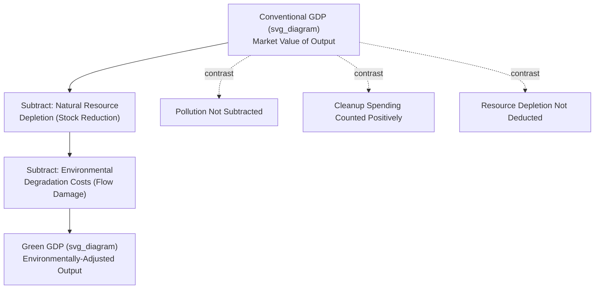

## Green GDP and Environmental Accounting

### Definition

**Green GDP** is an adjusted measure of Gross Domestic Product that deducts the estimated monetary value of environmental degradation and natural resource depletion incurred during production, aiming to reflect a more ecologically accurate picture of an economy's genuinely sustainable output. **Environmental accounting** (also called environmental-economic accounting or natural capital accounting) is the broader statistical framework — encompassing Green GDP as one specific application — that systematically records the stocks and flows of natural resources and environmental quality alongside conventional economic accounts.

$$\text{Green GDP} = GDP - \text{Environmental Degradation Costs} - \text{Natural Resource Depletion Costs}$$

### Key Points

- Green GDP directly addresses one of the specific limitations of conventional GDP as a welfare measure: the asymmetric treatment of environmental costs, where pollution and resource depletion are not subtracted, and pollution cleanup spending is counted as a positive addition to output.
- The most widely referenced international methodological framework for environmental accounting is the **UN System of Environmental-Economic Accounting (SEEA)**, developed as a satellite system that complements, rather than replaces, the conventional System of National Accounts (SNA) used to compute standard GDP.
- Green GDP has **not** displaced conventional GDP as the primary headline economic statistic in any major economy, largely due to significant methodological and political challenges in monetizing environmental damage consistently and credibly.
- The concept sits within a broader family of "beyond GDP" initiatives (alongside the Genuine Progress Indicator, Human Development Index, and others) that attempt to correct or supplement GDP's welfare-measurement blind spots.

### Components of the Green GDP Adjustment

**1. Natural Resource Depletion**

Conventional GDP counts the extraction and sale of non-renewable resources (oil, minerals, timber beyond sustainable regrowth rates) entirely as current-period output, with no corresponding deduction for the reduction in the remaining natural capital stock. Green GDP treats resource extraction analogously to the depreciation of produced (physical) capital in the Net Domestic Product framework: just as machinery wears out and must be deducted to move from GDP to NDP, natural capital is "used up" and should, in principle, be deducted analogously.

$$\text{Adjusted Output} = \text{Gross Extraction Value} - \text{Depletion of Natural Capital Stock}$$

**2. Environmental Degradation**

This captures the estimated cost of pollution, ecosystem damage, and other negative environmental externalities generated during production but not reflected in market prices — for example, the health costs of air pollution, the loss of agricultural productivity from soil degradation, or damage to fisheries from water pollution. Unlike resource depletion (reduction of a stock), degradation more commonly refers to a **flow** of ongoing environmental damage generated by current production activity.

**3. Defensive Expenditure Reclassification**

Some environmental accounting frameworks additionally propose reclassifying certain "defensive" environmental expenditures (spending specifically to prevent or remediate environmental harm, such as pollution-control equipment or cleanup operations) as intermediate consumption rather than final output, on the reasoning that such spending exists only to offset a harm rather than to produce genuine additional welfare. [Inference] This particular reclassification is among the more methodologically and conceptually contested elements of environmental accounting proposals, and its treatment varies across different Green GDP frameworks rather than following a single settled convention.

### Illustrative Diagram: Conventional GDP to Green GDP

### The UN System of Environmental-Economic Accounting (SEEA)

The SEEA, developed and maintained under the UN Statistics Division, is the internationally recognized statistical standard for organizing environmental-economic data in a manner consistent with conventional national accounts. It is structured as a **satellite account** — a supplementary accounting framework maintained alongside, rather than replacing, the core System of National Accounts (SNA) used to compute standard GDP.

The SEEA framework comprises several components:

- **SEEA Central Framework**: Covers physical and monetary flows of natural resources (energy, water, minerals, timber, fish) and their use in the economy, along with the generation of pollution and waste.
- **SEEA Ecosystem Accounting**: A more recently developed extension focused on measuring ecosystem extent, condition, and the flow of ecosystem services (e.g., carbon sequestration, water filtration, pollination) into the economy — adopted as an international statistical standard by the UN Statistical Commission in 2021.

[Inference] Given the pace of ongoing methodological development in this specific area (particularly ecosystem accounting), the precise technical details of current SEEA implementation guidance should be verified against the UN Statistics Division's current published materials if precision is required for a specific application.

### Notable National Attempts and Challenges: China's Green GDP Experience

China's government launched a prominent **Green GDP accounting initiative** in the early-to-mid 2000s, attempting to produce an officially adjusted GDP figure incorporating environmental costs. [Unverified] Historical media and academic reporting on this initiative widely describes it as having been discontinued or significantly scaled back within a few years of its launch, reportedly due to a combination of methodological difficulties in credibly monetizing environmental damage and political resistance from provincial governments concerned about the effect of environmentally-adjusted growth figures on their reported economic performance rankings. Given that this initiative dates to the training-data period and its current status may have evolved, this specific historical detail should be verified via current search if precision on China's present environmental accounting practices is required.

This episode is frequently cited in the economics literature as illustrative of the **practical and political challenges** facing Green GDP implementation more broadly: even where the conceptual case for environmental adjustment is well-accepted, credible monetary valuation of environmental damage and political acceptance of a lower "adjusted" growth figure have proven to be substantial barriers to widespread adoption as an official headline statistic.

### Methodological Challenges in Valuing Environmental Costs

Constructing a credible Green GDP figure requires assigning monetary values to environmental phenomena that typically have no direct market price, a task facing several well-recognized difficulties:

- **Valuing non-market ecosystem services**: Techniques such as contingent valuation (surveying willingness to pay), hedonic pricing (inferring value from related market prices, e.g., property values near clean vs. polluted areas), and travel cost methods are used, but each carries significant methodological uncertainty and is sensitive to specific modeling assumptions.
- **Determining sustainable extraction/depletion rates**: Establishing what counts as "excess" depletion (beyond a sustainable rate) for renewable resources (fisheries, forests) requires ecological modeling assumptions that can be genuinely contested.
- **Attributing damage to specific economic activities**: Environmental harm often has diffuse, cumulative, and cross-border sources (e.g., climate change), making it difficult to attribute a precise share of the damage to a single country's or industry's current-period production.
- **Political sensitivity**: An officially adjusted GDP figure that shows meaningfully slower "true" growth once environmental costs are deducted can create political incentives against full transparency or adoption, as illustrated by the China Green GDP episode above.

### Common Points of Confusion

- **Green GDP is not the same as "green growth" or "sustainable development" as broad policy concepts.** Green GDP is specifically a proposed *accounting adjustment* to the GDP statistic itself; green growth and sustainable development are broader policy and development frameworks that may or may not rely on a formal Green GDP measure.
- **The SEEA is a satellite account, not a replacement for conventional GDP.** Countries that maintain SEEA-consistent environmental accounts generally continue to report standard, unadjusted GDP as their primary headline statistic, using environmental accounts as a supplementary analytical tool rather than a substitute.
- **Green GDP addresses environmental costs specifically** — it is a narrower corrective than the Genuine Progress Indicator, which additionally attempts to adjust for income distribution and non-market household production alongside environmental factors.
- **The absence of widespread Green GDP adoption does not reflect a lack of conceptual consensus that GDP mistreats environmental costs** — the critique itself (discussed under Limitations of GDP as a welfare measure) is broadly accepted in the economics profession; the barrier to adoption is primarily methodological (reliable monetary valuation) and political, rather than a disagreement about whether the underlying problem is real.

**Related Topics**

- Limitations of GDP as a welfare measure
- Gross Domestic Product concept and definition
- Net domestic product and depreciation (analogous stock-depletion logic)
- Genuine Progress Indicator and Human Development Index
- UN System of Environmental-Economic Accounting (SEEA)
- Natural capital and ecosystem services valuation
- Sustainable development and climate change economics