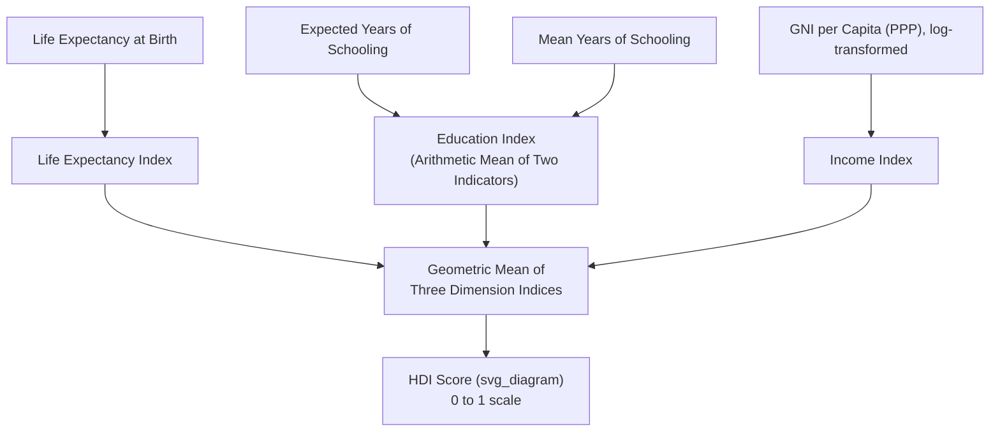

## Human Development Index and Alternative Wellbeing Measures

### Definition

The **Human Development Index (HDI)** is a composite statistic developed by the United Nations Development Programme (UNDP) that summarizes a country's average achievement across three basic dimensions of human development — a long and healthy life, access to knowledge, and a decent standard of living — combined into a single score ranging from 0 to 1. It was created specifically as a direct response to the limitations of GDP/GNI per capita as a standalone welfare measure, reflecting the view, associated with economists Mahbub ul Haq and Amartya Sen, that development should be evaluated in terms of the expansion of people's capabilities and freedoms rather than income alone. The United Nations Development Programme (UNDP) introduced the Human Development Index (HDI) in 1990, inspired by the works of Dr. Mahbub ul Haq and Amartya Sen, with Dr. Haq arguing that development should expand people's choices and freedoms, not just increase national income.

### Key Points

- The HDI is a composite summary of a country's average achievement in three basic dimensions of human development – health (life expectancy), knowledge (schooling) and material wellbeing (GNI per capita) – combined through a geometric mean into a single 0-to-1 score. [ourworldindata](https://ourworldindata.org/grapher/human-development-index?year=1980)
- A higher HDI implies longer, healthier lives, better education and higher command over resources; however, it does not capture inequality, sustainability or subjective wellbeing. [ourworldindata](https://ourworldindata.org/grapher/human-development-index?year=1980)
- The HDI explicitly incorporates GNI per capita rather than plain GDP per capita, embedding the national-income (ownership) concept discussed under Gross National Product and Gross National Income directly into its income dimension.
- Since its introduction, UNDP has developed several **complementary indices** to address specific limitations of the core HDI itself, most notably regarding inequality and gender disparities.

### The Three Dimensions and Their Indicators

The Human Development Index is a summary measure of average achievement in three basic dimensions of human development: a long and healthy life (measured by life expectancy at birth); access to knowledge (measured by expected years of schooling for children and mean years of schooling for adults); and a decent standard of living (measured by Gross National Income (GNI) per capita, adjusted for purchasing-power parity).

| Dimension | Indicator(s) | Sub-Index |
| --- | --- | --- |
| Health | Life expectancy at birth | Life Expectancy Index |
| Knowledge | Expected years of schooling + mean years of schooling | Education Index |
| Standard of living | GNI per capita (PPP-adjusted) | Income Index |

### Calculation Methodology

The HDI construction proceeds in two steps. First, minimum and maximum values ("goalposts") are established for each indicator to convert them into indices ranging from 0 to 1, representing "natural zeros" and "aspirational targets" that standardize the component indicators. The dimension index formula is: [uni-bremen](https://seth.informatik.uni-bremen.de/wesis/wiki/index.php/Human_Development_Index)

$$\text{Dimension Index} = \frac{\text{Actual Value} - \text{Minimum Value}}{\text{Maximum Value} - \text{Minimum Value}}$$

For the education dimension, this formula is applied to each of the two education indicators (expected and mean years of schooling), and the arithmetic mean of the resulting two indices is taken. [uni-bremen](https://seth.informatik.uni-bremen.de/wesis/wiki/index.php/Human_Development_Index)

For the income dimension, because the transformation from income to capabilities is assumed to be concave — each additional dollar of income has a diminishing impact on expanding capabilities — the natural logarithm of the actual, minimum, and maximum income values is used rather than the raw GNI per capita figure: [uni-bremen](https://seth.informatik.uni-bremen.de/wesis/wiki/index.php/Human_Development_Index)

$$\text{Income Index} = \frac{\ln(\text{GNI per capita}) - \ln(\text{Min})}{\ln(\text{Max}) - \ln(\text{Min})}$$

The second step aggregates the three dimensions using a geometric mean rather than a simple arithmetic average: [uni-bremen](https://seth.informatik.uni-bremen.de/wesis/wiki/index.php/Human_Development_Index)

$$HDI = \sqrt[3]{\text{Life Expectancy Index} \times \text{Education Index} \times \text{Income Index}}$$

The use of a **geometric mean** (rather than an arithmetic mean) is a deliberate methodological choice: it penalizes imbalanced performance across dimensions more heavily than an arithmetic mean would, meaning a country cannot fully compensate for very poor performance in one dimension (e.g., health) purely through strong performance in another (e.g., income) — a low score in any single dimension pulls the overall geometric-mean HDI down disproportionately.

### HDI Classification Tiers

The United Nations Development Programme (UNDP) categorizes countries into four groups based on HDI values: Very High Human Development (0.800 and above), High Human Development (0.700–0.799), Medium Human Development (0.550–0.699), and Low Human Development (below 0.550).

**Illustrative example** ([Unverified] — figures drawn from a specific reported edition of the Human Development Report and subject to annual revision): India's HDI value was reported at 0.685 (rank 130 of 193 countries), classified as Medium Human Development, with life expectancy at 72.0 years, expected schooling of 13.0 years, mean schooling of 6.9 years, and GNI per capita of $9,046 (2021 PPP). [Note: HDI values, ranks, and underlying indicators are revised in each annual Human Development Report; current-year figures for any specific country should be verified against the latest UNDP release rather than assumed from a prior year's data.] [anantamias](https://anantamias.com/hdi-rank-of-india-2026/?pdf=1)

### Illustrative Diagram: HDI Construction

### UNDP's Complementary Indices Addressing HDI's Own Limitations

To overcome the Human Development Index's limitations, UNDP introduced several related indices: the Inequality-adjusted HDI (IHDI), which adjusts HDI based on inequality levels in each dimension; the Gender Development Index (GDI), which compares HDI values for men and women; the Gender Inequality Index (GII), which measures gender-based disadvantages in health, empowerment, and labor; and the Multidimensional Poverty Index (MPI), which measures overlapping deprivations in health, education, and living standards.

- **Inequality-adjusted HDI (IHDI)**: Discounts each dimension's index value for the level of inequality present within that dimension's distribution across the population; the "loss" between HDI and IHDI is itself a reported statistic indicating how much inequality reduces effective human development. In the India example above, the IHDI was reported at 0.475 against an HDI of 0.685, representing a substantial reported loss to inequality. [anantamias](https://anantamias.com/hdi-rank-of-india-2026/?pdf=1)
- **Gender Development Index (GDI)** and **Gender Inequality Index (GII)**: Address the HDI's blindness to within-country gender disparities, since a national-average HDI can mask substantially different outcomes for men and women.
- **Multidimensional Poverty Index (MPI)**: Shifts focus from national averages to overlapping individual-level deprivations across health, education, and living standards, offering a poverty-focused lens distinct from HDI's average-achievement framing.

### Other Alternative Wellbeing Measures Beyond HDI

Building on the broader family of "beyond GDP" measures introduced under Limitations of GDP as a welfare measure:

- **Genuine Progress Indicator (GPI)**: Adjusts a GDP-like spending baseline for income distribution, environmental costs, and non-market household production, offering a monetized single-figure alternative distinct from HDI's non-monetary composite approach.
- **Gini Coefficient / Lorenz Curve**: Measures income or wealth inequality directly, often used alongside HDI/IHDI rather than as a standalone development index.
- **World Happiness Report**: Ranks countries using direct survey-based subjective well-being (life satisfaction) data, capturing a dimension (subjective happiness) that HDI does not attempt to measure.
- **Gross National Happiness (Bhutan)**: A national policy framework explicitly prioritizing well-being dimensions (psychological wellbeing, health, education, culture, governance, community vitality, ecological diversity, living standards) beyond a single income-centric or even HDI-style composite metric.
- **OECD Better Life Index**: A multidimensional framework allowing users to weight different wellbeing dimensions (housing, income, jobs, community, education, environment, civic engagement, health, life satisfaction, safety, work-life balance) according to their own priorities, rather than imposing a single fixed aggregation like HDI's geometric mean.

### Common Points of Confusion

- **HDI still uses an income measure (GNI per capita) as one-third of its composite** — it does not abandon income as relevant to development, but rather supplements it with health and education dimensions and caps its influence through the diminishing-returns (logarithmic) transformation and the geometric-mean aggregation method.
- **A high HDI does not mean a country has low inequality.** HDI does not capture inequality, sustainability or subjective wellbeing — this is precisely why the Inequality-adjusted HDI (IHDI) exists as a separate, complementary statistic rather than being automatically embedded in the standard HDI figure. [ourworldindata](https://ourworldindata.org/grapher/human-development-index?year=1980)
- **HDI is a national-average measure**, and like GDP/GNI per capita, it can mask substantial within-country variation across regions, gender, ethnicity, or socioeconomic groups — a limitation directly analogous to GDP's own distributional blindness.
- **The geometric mean aggregation is a deliberate design choice, not an arbitrary statistical convention.** It was specifically adopted (replacing an earlier arithmetic-mean version of the index) to ensure poor performance in any one dimension cannot be fully offset by strong performance in another, better reflecting the idea that health, education, and income are not perfectly substitutable components of human development.
- **HDI figures and country rankings are revised annually** and depend on which edition of the Human Development Report is referenced; any specific numeric value or ranking should be checked against the current UNDP release rather than treated as a fixed, unchanging fact.

**Related Topics**

- Limitations of GDP as a welfare measure
- Gross National Product and Gross National Income
- Genuine Progress Indicator and Green GDP methodologies
- Gini coefficient and Lorenz curve for measuring inequality
- Multidimensional Poverty Index and poverty measurement
- World Happiness Report and subjective wellbeing economics
- Purchasing Power Parity (PPP) and cross-country income comparison