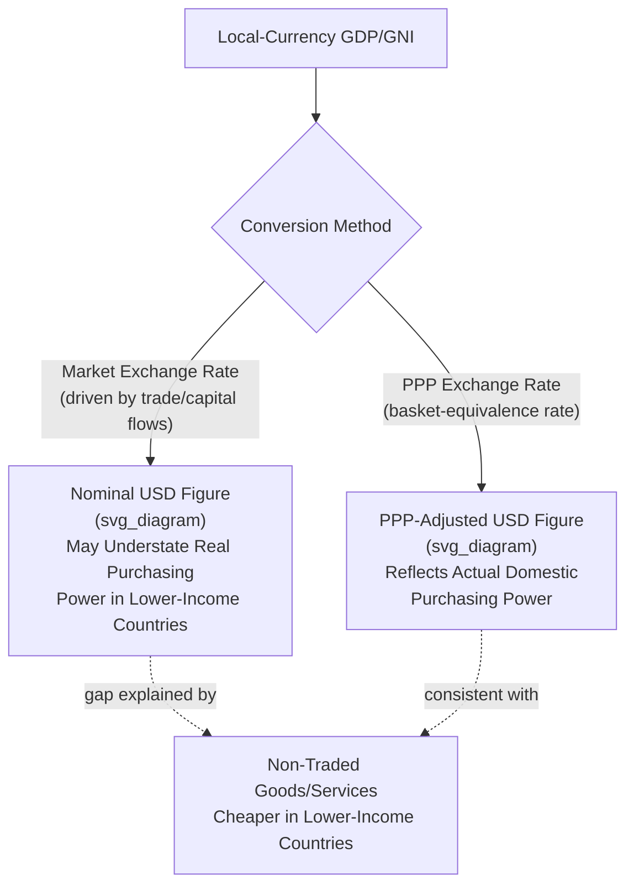

## International Comparisons and Purchasing Power Parity Adjustments

### Definition

**Purchasing Power Parity (PPP)** is an exchange-rate concept and adjustment methodology used to compare economic output, income, and living standards across countries in a way that accounts for differences in the local cost of goods and services, rather than relying solely on market (nominal) exchange rates. A **PPP exchange rate** is defined as the rate at which one currency would need to be converted into another to purchase an identical basket of goods and services in each country — distinct from the **market/nominal exchange rate**, which is determined by currency trading, capital flows, trade balances, and speculative activity, and can diverge substantially from a basket-equivalence rate.

$$PPP_{Rate} = \frac{\text{Price of Basket in Currency A}}{\text{Price of Identical Basket in Currency B}}$$

### Key Points

- International comparisons of GDP, GNI, and living standards using **market exchange rates** can be significantly misleading, since market rates reflect currency trading dynamics rather than the actual domestic purchasing power of a currency for goods and services *within* that country.
- **PPP-adjusted figures** are the standard methodology used by major international bodies (World Bank, IMF, UNDP) for cross-country living-standard comparisons, including the GNI-per-capita figure embedded in the Human Development Index.
- The fundamental reason market exchange rates distort comparisons: **non-traded goods and services** (haircuts, housing, local transportation, domestic labor) are typically much cheaper in lower-income countries relative to their prices in higher-income countries, a pattern that market exchange rates — driven mainly by traded-goods and financial-flow dynamics — do not capture.
- PPP adjustments are constructed using large-scale international price surveys, most notably the **International Comparison Program (ICP)**, coordinated globally and involving national statistical agencies collecting comparable price data across countries.

### Why Market Exchange Rates Distort Cross-Country Comparisons

Market exchange rates are determined primarily by the supply and demand for currencies in foreign exchange markets — driven by trade flows, capital flows, interest rate differentials, and speculative activity — rather than by the relative cost of a representative basket of goods and services within each country.

**The core distortion**: many goods and services, particularly labor-intensive services and non-traded goods (a haircut, a restaurant meal, domestic transportation, housing rent), are not bought and sold across borders and therefore do not directly influence the exchange rate. These non-traded items tend to be considerably cheaper in lower-income countries (reflecting lower relative wage levels), meaning that converting a lower-income country's GDP into a common currency at the **market** exchange rate systematically **understates** the actual real purchasing power and living standard that income provides domestically.

This phenomenon is closely related to the **Balassa-Samuelson effect**, which provides a theoretical explanation for why price levels (and thus the market-exchange-rate-to-PPP-rate ratio) tend to be systematically lower in lower-income countries: productivity differences are typically much larger between countries in the *traded goods* sector than in the *non-traded services* sector, which — combined with the tendency for wages to be relatively uniform across sectors within a country — pushes relative non-traded goods prices down in lower-productivity (lower-income) economies. [Inference] The Balassa-Samuelson effect is a well-established theoretical framework in international economics, but its precise empirical magnitude and applicability can vary across specific country pairs and time periods.

### Worked Numerical Example: Nominal vs. PPP Exchange Rate Comparison

Consider two hypothetical countries, and a representative basket of goods and services costing:

| Country | Basket Cost (Local Currency) | Market Exchange Rate (to USD) | GDP per Capita (Local Currency) |
| --- | --- | --- | --- |
| Country A (USD reference) | $100 | 1.00 (base) | $50,000 |
| Country B | 3,000 units | 60 units per USD | 900,000 units |

**Nominal (market exchange rate) conversion**:

$$GDP_{per\ capita,B}^{nominal} = \frac{900{,}000}{60} = \$15{,}000$$

**PPP exchange rate** (based on the equivalent basket cost):

$$PPP_{Rate} = \frac{3{,}000 \text{ units}}{\$100} = 30 \text{ units per USD}$$

**PPP-adjusted conversion**:

$$GDP_{per\ capita,B}^{PPP} = \frac{900{,}000}{30} = \$30{,}000$$

In this example, the nominal exchange-rate conversion ($15,000) understates Country B's real purchasing power by half relative to the PPP-adjusted figure ($30,000), because the market exchange rate (60 units/USD) values Country B's currency at only half of what its actual domestic purchasing power over an identical basket would imply (30 units/USD).

### Illustrative Diagram: Market Exchange Rate vs. PPP Comparison

### The International Comparison Program (ICP)

The construction of credible PPP conversion factors requires systematically collected, internationally comparable price data — a large-scale statistical undertaking coordinated through the **International Comparison Program (ICP)**, a global statistical partnership involving national statistical offices, regional development banks, and international agencies (with the World Bank serving as the global coordinator).

The ICP methodology involves:

- **Defining a common basket** of hundreds of closely specified, comparable goods and services (food items, housing, healthcare, education, government services, capital goods) intended to represent typical consumption and investment patterns across widely varying economies.
- **Collecting local-currency prices** for these specified items across participating countries through coordinated national price surveys.
- **Computing PPP conversion factors** for each country relative to a reference currency (typically the US dollar), using index-number aggregation methods (analogous in spirit to the index-number challenges discussed under GDP deflator construction) to combine price ratios across the many basket items into a single overall PPP rate.

[Inference] The specific reference-year cycle and precise index-aggregation formula used by the ICP (e.g., particular variants of multilateral index methods such as the EKS or GEKS method) are technical statistical details that have evolved across ICP rounds; current-cycle specifics should be verified against the World Bank's ICP documentation if precision is required.

### Applications of PPP Adjustment in Macroeconomic Analysis

- **Cross-country GDP and GNI per capita rankings**: The World Bank and IMF publish both nominal (market-exchange-rate) and PPP-adjusted GDP rankings; a country's relative global ranking can differ substantially between the two measures, particularly for economies with large gaps between traded and non-traded goods price levels.
- **Human Development Index construction**: As discussed under Human Development Index and alternative wellbeing measures, the HDI's income dimension explicitly uses PPP-adjusted GNI per capita, precisely to avoid the market-exchange-rate distortion when comparing living standards across countries with very different price levels.
- **World Bank income classification thresholds**: While the World Bank's country income classification (low-income, lower-middle-income, upper-middle-income, high-income) is conventionally based on GNI per capita using the **Atlas method** (a specific smoothing methodology for exchange-rate conversion, distinct from full PPP adjustment), PPP-based GNI figures are commonly reported alongside Atlas-method figures for comparative analytical purposes. [Inference] The Atlas method and PPP adjustment are related but methodologically distinct exchange-rate-conversion approaches, and the specific classification thresholds and methodology are revised periodically; current-year specifics should be checked against the World Bank's latest published classification if precision matters.
- **Poverty line comparisons**: International poverty lines (e.g., the World Bank's international poverty line) are set and applied using PPP-adjusted values specifically so that the poverty threshold reflects comparable real purchasing power across countries with very different price levels and currencies.

### Common Points of Confusion

- **PPP-adjusted GDP is not "real GDP" in the same sense as inflation-adjusted real GDP.** PPP adjustment addresses **cross-country** price-level differences at a point in time; real GDP (as discussed under Nominal versus real GDP) addresses **cross-time** price-level differences (inflation) within a single country. The two adjustments serve different purposes and are not substitutes for one another, though both can, in principle, be applied together (PPP-adjusted real GDP).
- **A country's PPP-adjusted GDP is typically higher than its nominal (market-exchange-rate) GDP for lower-income countries**, and can be lower for some higher-income countries with relatively high domestic price levels, reflecting the systematic relationship described by the Balassa-Samuelson effect — this is not a universal rule for every country pair, but a general empirical tendency.
- **PPP adjustment does not eliminate all cross-country comparison challenges.** Differences in the quality, availability, and consumption relevance of specific basket items across vastly different economies (e.g., comparing housing costs between a dense urban economy and a large rural economy) remain a genuine methodological challenge even within the PPP framework itself.
- **"PPP" as used in long-run exchange rate theory (the Purchasing Power Parity theory of exchange rate determination) is a related but distinct concept** from the PPP conversion factors used for cross-country GDP/GNI comparison discussed here; the former is a theory about what determines exchange rate movements over time, while the latter is a statistical adjustment methodology for a specific point-in-time comparison — the two share the underlying "basket equivalence" logic but serve different analytical purposes.

**Related Topics**

- Nominal versus real GDP
- Gross National Product and Gross National Income
- Human Development Index and alternative wellbeing measures
- Balassa-Samuelson effect and traded vs. non-traded goods
- World Bank income classification and GNI per capita
- Exchange rate determination theories
- International Comparison Program (ICP) methodology
- Global poverty measurement and international poverty lines