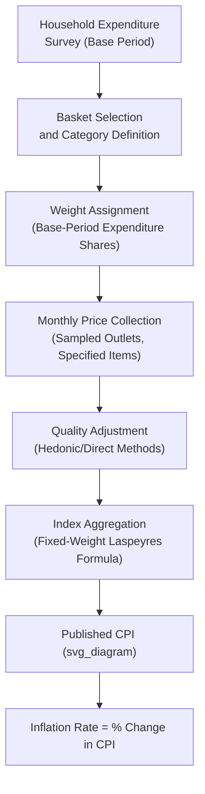

## Consumer Price Index Construction and Methodology

### Definition

The **Consumer Price Index (CPI)** is a statistical measure of the average change over time in the prices paid by urban consumers for a fixed market basket of goods and services. Unlike the GDP deflator, which is derived implicitly from national output data, the CPI is constructed **directly** through ongoing price surveys of a pre-specified basket of consumer goods and services, making it a **Laspeyres-type index**: it uses **fixed base-period quantities** as weights, applied to the prices of each subsequent period.

$$CPI_t = \frac{\sum_i P_{i,t} \times Q_{i,base}}{\sum_i P_{i,base} \times Q_{i,base}} \times 100$$

where $P_{i,t}$ is the price of good $i$ in the current period, $P_{i,base}$ is its price in the base period, and $Q_{i,base}$ is the fixed base-period quantity (weight) for good $i$.

### Key Points

- CPI is constructed using **fixed base-period basket weights**, in contrast to the GDP deflator's continuously updated (current-period) weights, making CPI a Laspeyres-style index and the GDP deflator a Paasche-style index.
- CPI measures price changes for **consumer** goods and services specifically, including imported consumer goods, but excludes capital goods, government services, and export goods — a narrower and differently composed basket than the one implicitly underlying the GDP deflator.
- The CPI is the most widely used and reported inflation indicator for policy purposes (monetary policy targeting, wage/pension indexation, cost-of-living adjustments), owing to its timely, direct, survey-based construction.
- Constructing a credible CPI requires several sequential methodological stages: basket selection, weight assignment, price collection, quality adjustment, and index aggregation.

### Stage 1: Basket Selection

National statistical agencies define a representative "market basket" of goods and services intended to reflect typical consumption patterns of the target population (commonly urban households, though some countries construct broader or multiple population-specific indices). The basket is organized into major categories, commonly including:

- Food and beverages
- Housing (rent, utilities, household maintenance)
- Apparel
- Transportation (vehicles, fuel, public transit)
- Medical care
- Recreation
- Education and communication
- Other goods and services

The specific basket composition is periodically revised (typically through household expenditure surveys conducted every several years) to reflect evolving consumption patterns, incorporating new products and phasing out obsolete ones.

### Stage 2: Weight Assignment

Each item and category in the basket is assigned a **weight** reflecting its share of total expenditure by the reference population during the base period, derived from household expenditure/budget surveys.

$$w_i = \frac{P_{i,base} \times Q_{i,base}}{\sum_j P_{j,base} \times Q_{j,base}}$$

Categories consuming a larger share of a typical household's budget (e.g., housing, food) receive proportionally larger weights, meaning price changes in these categories have a correspondingly larger effect on the overall index value than price changes in smaller-weighted categories.

### Stage 3: Price Collection

Prices for the specific, closely defined items within the basket are collected at regular intervals (commonly monthly) from a sample of retail outlets, service providers, and, increasingly, online sources, across a representative sample of geographic locations. This requires:

- **Outlet sampling**: Selecting a representative sample of stores/providers across different regions and outlet types (supermarkets, specialty stores, online retailers).
- **Item specification**: Precisely defining each priced item (brand, size, model, specification) to ensure like-for-like price comparison over time.
- **Sampling rotation**: Periodically updating the specific outlets and item specifications sampled to maintain representativeness as retail patterns evolve.

### Stage 4: Quality Adjustment

A central and technically challenging aspect of CPI construction is distinguishing a **genuine price change** from a **quality change** in the underlying good — since consumer goods evolve over time (e.g., a new smartphone model with improved features replacing an older model), a naive price comparison between an old and new product version would conflate pure price inflation with the value of quality improvement.

- **Hedonic quality adjustment**: A statistical technique that estimates the portion of an observed price difference attributable to measurable changes in product characteristics/features, isolating the "pure price" component from the "quality" component. Commonly applied to categories with frequent, well-documented technological change (e.g., computers, other electronics, vehicles).
- **Direct/indirect quality adjustment methods**: Alternative approaches used when hedonic modeling is impractical, involving analyst judgment or linked-price substitution methods when a product is discontinued and replaced by a similar successor.

[Inference] The specific quality-adjustment methodology and its treatment across different product categories varies by national statistical agency, and is among the more methodologically contested aspects of CPI construction, with ongoing debate in the economics literature about whether such adjustments adequately capture consumer welfare changes.

### Stage 5: Index Aggregation

Individual item price relatives are aggregated up through the basket's category structure, ultimately producing the single, headline CPI figure, typically calculated as a fixed-weight (Laspeyres-type) aggregation as shown in the core formula above, though many statistical agencies now supplement the primary published CPI with alternative index formulas (discussed below) to address specific known biases.

### Illustrative Diagram: CPI Construction Pipeline

### Deriving the Inflation Rate from CPI

$$\text{Inflation Rate}_t = \frac{CPI_t - CPI_{t-1}}{CPI_{t-1}} \times 100$$

**Worked example**: If CPI in Year 1 (base year) equals 100 and CPI in Year 2 equals 106.5:

$$\text{Inflation Rate} = \frac{106.5 - 100}{100} \times 100 = 6.5\%$$

### Known Biases in Fixed-Basket (Laspeyres-Style) CPI Construction

Because standard CPI uses **fixed base-period quantities** as weights, several well-documented biases arise, motivating both methodological refinements and the practice of consulting multiple inflation measures:

- **Substitution bias**: As relative prices change over time, consumers rationally substitute toward relatively cheaper goods within a category (e.g., from beef to chicken if beef prices rise disproportionately). A fixed-basket index does not capture this substitution, and consequently tends to **overstate** the true cost-of-living increase, since it assumes consumers continue purchasing the original (now relatively more expensive) base-period quantities.
- **New product bias**: New products are typically introduced into the basket only after some delay (following the periodic basket-revision cycle), meaning the initial period of often-declining prices for a genuinely new product/category is not captured in the index.
- **Quality change bias**: Despite hedonic and other quality-adjustment techniques, imperfect quality adjustment can still cause a portion of a price change that reflects genuine quality improvement to be misclassified as pure inflation (or vice versa).
- **Outlet substitution bias**: Consumers may shift purchases toward lower-price retail formats (e.g., large discount retailers, online marketplaces) over time; if the sampled outlet mix does not adequately track this shift, the index can overstate inflation relative to consumers' actual realized purchasing costs.

### Alternative Index Formulas Used to Mitigate Bias

- **Chained CPI**: Updates the basket weights more frequently (e.g., using a formula that incorporates both current and prior-period spending patterns, akin in spirit to the chain-weighting approach discussed under the GDP deflator), specifically to reduce substitution bias relative to a CPI with an infrequently revised fixed basket. [Inference] The specific chained-CPI formula and its adoption as either a primary or supplementary published measure varies by country; some national statistical agencies (e.g., the U.S. Bureau of Labor Statistics with its Chained CPI-U) publish it as a supplementary series alongside the traditional fixed-weight headline CPI rather than as the sole official inflation measure.
- **Core CPI**: Excludes typically volatile categories — most commonly food and energy prices — to provide a measure of underlying, longer-term inflationary trends less distorted by short-term price shocks (e.g., a temporary oil price spike or a weather-driven food price shock). Core CPI is widely used by central banks as an input into monetary policy decisions, precisely because headline CPI's volatility from food/energy shocks can obscure underlying inflation momentum.

### CPI vs. GDP Deflator: A Direct Comparison

| Feature | CPI | GDP Deflator |
| --- | --- | --- |
| Index type | Laspeyres-style (fixed base-period weights) | Paasche-style (current-period weights) |
| Construction method | Direct price survey of a defined basket | Implicit (derived from Nominal GDP ÷ Real GDP) |
| Goods covered | Consumer goods/services only (incl. imports) | All domestically produced final goods/services |
| Imported consumer goods | Included | Excluded |
| Capital goods | Excluded | Included (part of investment, $I$) |
| Government output | Excluded | Included |
| Reporting frequency/timeliness | Generally faster/more frequent, since based on ongoing surveys | Generally slower, tied to the full national accounts estimation cycle |
| Primary use case | Cost-of-living adjustments, headline inflation reporting, wage/pension indexation | Broadest available economy-wide price-level measure; used to deflate nominal GDP |

### Common Points of Confusion

- **CPI is not the same thing as "the cost of living."** CPI is a specific, methodologically defined price index for a fixed basket; the true cost of living for any individual household can differ from headline CPI movements depending on that household's actual, potentially very different, consumption pattern relative to the standardized survey basket.
- **A rising CPI does not necessarily mean every price is rising** — it reflects the weighted-average movement across the entire basket; some component prices can fall even as the aggregate CPI rises, if other, more heavily weighted components rise faster.
- **Core CPI excluding food and energy is not "the real inflation rate" in some absolute sense** — it is a specific analytical tool designed to filter out short-term volatility for policy purposes; headline CPI (including food and energy) remains the more comprehensive and directly experienced cost-of-living measure for households.
- **Substitution bias causes standard fixed-weight CPI to generally overstate true cost-of-living increases**, a well-established result in index-number theory, though the practical magnitude of this overstatement is empirically estimated and can vary by country, time period, and the specific basket-revision frequency in use. [Inference] Specific numerical estimates of this bias's magnitude for any given country/period should be verified against current research rather than assumed from a fixed historical figure.

**Related Topics**

- GDP deflator construction and interpretation
- Nominal versus real GDP
- Chain-weighted vs. fixed-base index number methods (Laspeyres, Paasche, Fisher)
- Core inflation and monetary policy targeting
- Hedonic pricing and quality adjustment methods
- Wage and pension indexation using CPI
- Inflation, deflation, and disinflation distinguished