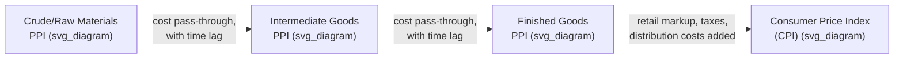

## Producer Price Index and Its Uses

### Definition

The **Producer Price Index (PPI)** is a family of indices that measures the average change over time in the **selling prices received by domestic producers** for their output, capturing price changes at earlier stages of the production and distribution chain than the Consumer Price Index. Unlike CPI, which measures prices **paid by consumers** (inclusive of retail markups, taxes, and distribution costs), PPI measures prices **received by producers** at the point of first commercial transaction, before the good passes through subsequent distribution, retail, and taxation stages.

$$PPI_t = \frac{\sum_i P_{i,t}^{producer} \times Q_{i,base}}{\sum_i P_{i,base}^{producer} \times Q_{i,base}} \times 100$$

using a fixed-weight (Laspeyres-style) construction analogous in form to the CPI, but applied to producer-received prices rather than consumer-paid prices.

### Key Points

- PPI is often referred to as a measure of **wholesale prices** or, in some countries' terminology, the **Wholesale Price Index (WPI)**, though the specific scope, stage-of-production coverage, and terminology can differ meaningfully between countries. [Inference] The precise relationship between "PPI" and "WPI" terminology and coverage varies by country's statistical tradition; students should consult their national statistical agency's specific definitions rather than assume the terms are perfectly interchangeable across all countries.
- PPI is widely regarded as a **leading indicator** of future consumer price inflation, since producer-level price changes for inputs and intermediate goods typically precede, and are often at least partially passed through to, downstream consumer prices with some time lag.
- Unlike CPI, which is strictly a single-stage (final consumer purchase) index, PPI is often constructed with a **multi-stage structure**, separately tracking prices at different points along the production chain — from crude/raw materials, through intermediate goods, to finished goods.
- PPI excludes taxes, transportation costs, and retail/wholesale trade margins that are added *after* the point of production, whereas CPI, measuring the final consumer transaction, necessarily includes these downstream additions.

### Structure: Stage-of-Processing Classification

A key structural feature distinguishing PPI from CPI is its common organization by **stage of processing**, allowing analysts to trace how a price shock propagates through the production chain over time:

| Stage | Description | Example |
| --- | --- | --- |
| **Crude/raw materials** | Unprocessed inputs, largely commodities | Crude oil, raw agricultural products, unprocessed metals |
| **Intermediate goods** | Partially processed goods used as inputs by other producers | Refined petroleum products, semi-finished steel, flour |
| **Finished goods** | Goods ready for sale to final demand (either consumers or as capital equipment) | Finished consumer products, capital equipment |

This stage-of-processing structure is analytically valuable because it allows observation of a price shock's **transmission path**: a rise in crude material prices (e.g., an oil price spike) is expected, other things equal, to feed through to intermediate goods prices before eventually reaching finished-goods prices and, ultimately, consumer prices (CPI) with some further lag — although the degree and speed of pass-through varies by industry, competitive conditions, and the extent to which producers absorb versus pass on cost increases.

### PPI as a Leading Indicator of Consumer Inflation

Because producers set prices based partly on their own input costs, changes in the PPI — particularly at the intermediate and crude materials stages — are commonly monitored by economists, central banks, and market analysts as an early signal of potential future movements in consumer-level inflation (CPI). This transmission mechanism operates through the standard **cost-push** channel: rising input costs increase producers' cost of production, which producers may pass through, fully or partially, to the prices they charge downstream, eventually reaching the retail/consumer level.

[Inference] The reliability, magnitude, and speed of this PPI-to-CPI predictive relationship is a subject of ongoing empirical macroeconomic research, and the pass-through relationship can vary substantially depending on the specific industry, the prevailing competitive/market structure, exchange rate conditions (for economies reliant on imported inputs), and the broader macroeconomic environment (e.g., firms' pricing power varies across the business cycle) — it should be treated as a generally useful but imperfect and context-dependent leading indicator rather than a mechanically precise predictive rule.

### Illustrative Diagram: PPI Stage-of-Processing Transmission

### PPI vs. CPI: Key Structural Differences

| Feature | PPI | CPI |
| --- | --- | --- |
| Price point measured | Prices received by producers (first commercial sale) | Prices paid by final consumers (point of retail purchase) |
| Taxes and distribution costs | Excluded | Included |
| Stage-of-processing structure | Explicitly multi-stage (crude, intermediate, finished) | Single-stage (final consumer purchase only) |
| Coverage of goods | Domestically produced goods; can include goods not sold directly to consumers (capital equipment, intermediate inputs) | Consumer-purchased goods and services only, including imports |
| Services coverage | Historically more limited/gradually expanded in many countries' PPI frameworks | Comprehensive services coverage is a long-standing, core component |
| Typical analytical use | Leading indicator of cost-push inflationary pressure; input for producer/business decision-making and contract escalation clauses | Primary headline inflation measure for monetary policy, wage indexation, and cost-of-living adjustment |

### Uses of the Producer Price Index

- **Leading indicator for monetary policy**: Central banks monitor PPI, particularly at earlier processing stages, as one input among many for anticipating future consumer inflation pressures and informing policy rate decisions.
- **Contract escalation clauses**: Many commercial and government contracts (particularly long-term supply and construction contracts) include price-escalation clauses indexed to specific PPI components, allowing contracted prices to adjust in line with input cost changes over the life of the contract.
- **Deflating industry-level output and productivity statistics**: Industry-specific PPI components are used to convert nominal industry-level output/revenue figures into real (volume) terms, analogous to how the GDP deflator converts aggregate nominal GDP into real GDP, but at a more granular, industry-specific level.
- **Business cost and margin analysis**: Firms and analysts use PPI data at different stages of processing to assess whether input cost pressures are being absorbed (margin compression) or passed through (price increases) at various points in a supply chain.
- **International trade competitiveness analysis**: Comparing PPI trends across countries can provide insight into relative changes in production costs, which relate to export competitiveness, though this requires careful interpretation alongside exchange rate movements.

### Worked Illustrative Example: PPI-to-CPI Transmission

Suppose crude oil prices (a raw materials PPI component) rise sharply due to a global supply disruption. Consider a simplified illustrative transmission:

1. **Month 1**: Crude materials PPI rises sharply as oil prices spike.
2. **Month 2-3**: Intermediate goods PPI (e.g., refined fuel, petrochemical-based inputs, transportation-cost-sensitive intermediate goods) begins rising as producers pass through higher input costs.
3. **Month 3-5**: Finished goods PPI rises as manufacturers incorporating these intermediate inputs adjust their own selling prices.
4. **Month 4-6**: CPI begins reflecting the increase, both directly (fuel/energy component of the consumer basket) and indirectly (finished goods and services with fuel/petrochemical-linked cost structures).

[Note: This is a stylized illustrative sequence intended to demonstrate the general transmission-path logic underlying the PPI's stage-of-processing structure. The precise timing, magnitude, and degree of pass-through in any real-world episode depend on specific market conditions, competitive dynamics, and monetary/fiscal policy responses, and should not be treated as a fixed, universally applicable lag structure.]

### Common Points of Confusion

- **PPI does not measure "prices paid by businesses for their inputs" in the same sense CPI measures consumer purchases** — PPI specifically measures the prices *producers receive* for their output at first sale, though the intermediate-goods stage of PPI is closely related to (and often used as a proxy for) input cost pressures facing downstream producers.
- **A rise in PPI does not automatically or fully translate into an equivalent rise in CPI.** Pass-through is frequently partial (firms may absorb some cost increases into reduced profit margins, particularly in highly competitive markets) and occurs with a variable time lag rather than a fixed, predictable one.
- **PPI and WPI terminology and precise scope differ across countries**, and the specific historical or current name used by a given country's statistical agency should not be assumed to imply an identical methodology or coverage to another country's PPI/WPI.
- **PPI excludes the retail markup, transportation, and tax components that make up a substantial part of the final consumer price** — this is precisely why PPI and CPI can, and regularly do, show different rates of change over the same period, even for closely related goods.

**Related Topics**

- Consumer Price Index construction and methodology
- GDP deflator construction and interpretation
- Cost-push vs. demand-pull inflation
- Inflation transmission mechanisms and monetary policy response
- Contract price escalation and indexation practices
- Industry-level real output and productivity measurement