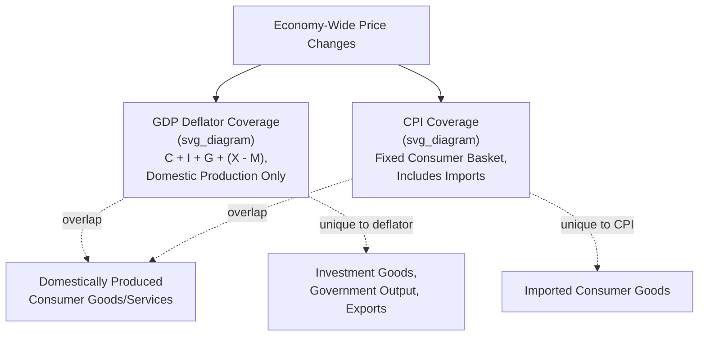

## GDP Deflator versus CPI Comparison

### Definition

The **GDP Deflator** and the **Consumer Price Index (CPI)** are the two most commonly referenced broad price-level indices in macroeconomics, but they are constructed using fundamentally different methodologies, cover different sets of goods and services, and are consequently suited to different analytical purposes. This item synthesizes the direct comparison between the two, building on the individual constructions detailed under GDP deflator construction and interpretation and Consumer Price Index construction and methodology.

$$\text{GDP Deflator}_t = \frac{\text{Nominal GDP}_t}{\text{Real GDP}_t} \times 100 \qquad \qquad CPI_t = \frac{\sum_i P_{i,t} \times Q_{i,base}}{\sum_i P_{i,base} \times Q_{i,base}} \times 100$$

### Key Points

- The GDP deflator is an **implicit, Paasche-style** index (current-period quantity weights) derived residually from national accounts data; the CPI is a **directly surveyed, Laspeyres-style** index (fixed base-period quantity weights) built from ongoing retail price collection.
- The two indices differ in **coverage**: the GDP deflator includes all domestically produced final goods and services (consumption, investment, government, net exports) but excludes imports; the CPI includes only consumer-purchased goods and services, but explicitly includes imported consumer goods while excluding capital goods and government output.
- Because of these structural differences, the GDP deflator and CPI can, and regularly do, report **different inflation rates over the same period**, sometimes diverging meaningfully depending on which specific goods are driving price changes (e.g., oil prices, which are imported in many economies).
- Neither index is unconditionally "more accurate" than the other — each is well-suited to specific, different analytical purposes, and macroeconomists typically consult both (along with the PPI) for a fuller picture of inflationary dynamics.

### Side-by-Side Structural Comparison

| Feature | GDP Deflator | CPI |
| --- | --- | --- |
| Index type | Paasche-style (current-period quantity weights) | Laspeyres-style (fixed base-period quantity weights) |
| Construction method | Implicit — derived from Nominal GDP ÷ Real GDP | Direct — surveyed prices of a defined, fixed basket |
| Goods/services covered | All domestically produced final output: $C + I + G + (X - M)$ | Fixed consumer basket only |
| Imported consumer goods | **Excluded** (deflator only reflects domestic production) | **Included** (consumers directly purchase imports) |
| Capital goods (machinery, equipment) | **Included** (part of investment, $I$) | **Excluded** (not part of typical consumer purchases) |
| Government output/services | **Included** (valued at cost of production) | **Excluded** |
| Basket weight updates | Effectively continuous under chain-weighting (reflects current output composition) | Periodic (revised only every several years in most countries) |
| Publication timeliness | Generally slower, tied to full national accounts estimation | Generally faster, based on ongoing monthly/periodic surveys |
| Substitution bias direction | Tends to slightly **understate** inflation (Paasche-style bias) | Tends to slightly **overstate** inflation (Laspeyres-style substitution bias) |
| Typical primary use | Deflating nominal GDP into real GDP; broadest available economy-wide price gauge | Headline inflation reporting, monetary policy targets, wage/pension/benefit indexation |

### Illustrative Diagram: Coverage Overlap and Divergence

### Why the Two Indices Diverge: Concrete Mechanisms

**1. Imported goods create opposite-direction sensitivity.** A rise in the price of imported oil raises CPI relatively directly (since consumers purchase gasoline, an imported-derived good, as part of the fixed basket), but does not directly raise the GDP deflator, since imports are not part of domestic production. The GDP deflator is affected only indirectly, to the extent that higher imported oil costs raise the *production cost* (and thus market price) of domestically produced goods and services that use oil as an input.

**2. Investment and government spending shifts affect only the deflator.** A surge in business investment spending on machinery, or an increase in government infrastructure spending, affects the GDP deflator directly (since $I$ and $G$ are both part of GDP) but has no direct effect on CPI, since neither capital goods nor most government output are part of the consumer basket.

**3. Substitution behavior affects the two indices in opposite directions.** Because CPI's fixed-basket (Laspeyres) construction does not allow the weights to adjust as consumers substitute toward relatively cheaper goods, it tends to overstate true cost-of-living increases over time. The GDP deflator's current-period-weighted (Paasche) construction, by contrast, tends to understate true inflation, since it implicitly assumes the current period's post-substitution consumption pattern also applied in the base period.

### Worked Numerical Example: A Divergence Scenario

Consider an economy where imported oil prices rise sharply, but where the government simultaneously reduces infrastructure spending and businesses cut back investment in machinery (e.g., during an economic slowdown):

| Component | Effect | Impact on CPI | Impact on GDP Deflator |
| --- | --- | --- | --- |
| Rising imported oil price (consumer fuel purchases) | Direct increase in consumer basket price | Strong upward pressure | No direct effect (import excluded); only indirect effect via domestic production costs |
| Falling government infrastructure spending | Reduced share of a lower-priced or stable-priced GDP component | No effect (government spending not in CPI basket) | Downward compositional effect on average price level, depending on relative price movements |
| Falling business investment in machinery | Reduced weight on investment goods in GDP | No effect (capital goods not in CPI basket) | Downward compositional effect, depending on machinery price trends |

**Interpretation**: In this scenario, CPI could show a **noticeably higher** measured inflation rate than the GDP deflator over the same period, since the oil-price shock disproportionately affects the CPI's consumer-import-inclusive basket while being only partially/indirectly reflected in the deflator, whose measured composition is simultaneously shifting away from investment and government spending. [Note: This is an illustrative directional scenario intended to demonstrate the underlying mechanism; the actual magnitude and even direction of divergence in any specific real-world period depends on the relative size, timing, and interaction of all simultaneous price and compositional changes across the whole economy.]

### Which Index Should Be Used for Which Purpose?

- **For monetary policy inflation targeting and headline "cost of living" reporting**: CPI (or a variant, such as core CPI) is generally preferred, since it directly reflects the price changes actually experienced by consumers in their day-to-day purchasing, including imported goods that materially affect household budgets.
- **For deflating nominal GDP into real GDP, or gauging the broadest possible economy-wide price level**: The GDP deflator is the conceptually appropriate choice, since its coverage automatically matches the full scope of GDP itself, including investment, government, and trade components that CPI does not capture.
- **For wage, pension, and benefit indexation (cost-of-living adjustments)**: CPI is the near-universal standard, since these adjustments are specifically intended to preserve a household's real purchasing power over a defined consumer basket.
- **For understanding underlying producer/business cost pressures as a potential leading indicator**: Neither the deflator nor CPI alone is sufficient; the Producer Price Index (PPI) is generally the more directly relevant tool for this specific purpose, given its focus on prices received by producers at earlier stages of the production chain.

### Common Points of Confusion

- **Neither index is "the" correct measure of inflation in some absolute sense** — they are two different, valid statistical constructs measuring price change over two different (though overlapping) baskets of goods and services, each fit for different specific analytical purposes.
- **A divergence between CPI and GDP deflator growth rates is not evidence that one index is "wrong."** Divergence is an expected and normal consequence of their differing coverage and weighting methodology, particularly during periods of significant relative price shifts (e.g., sharp swings in commodity/import prices, or major shifts in the investment/consumption/government spending mix).
- **The direction of substitution bias differs between the two index types** — Laspeyres-style CPI tends to overstate inflation, while Paasche-style GDP deflator tends to understate it — a standard result in index number theory, though the actual empirical magnitude of each bias in any specific period and country is a matter for applied research rather than a fixed universal constant. [Inference] This directional tendency is a well-established theoretical property of the two index types, but real-world national statistical agencies increasingly use chain-weighted variants of both indices specifically to mitigate these respective biases, which can narrow (though not necessarily eliminate) the practical divergence between them.
- **CPI is not a subset of the GDP deflator, nor vice versa.** The two baskets overlap substantially (domestically produced consumer goods and services) but each also contains categories entirely excluded from the other (imports for CPI; investment, government, and export goods for the deflator).

**Related Topics**

- GDP deflator construction and interpretation
- Consumer Price Index construction and methodology
- Producer Price Index and its uses
- Nominal versus real GDP
- Chain-weighted vs. fixed-base index number methods (Laspeyres, Paasche, Fisher)
- Core inflation and monetary policy targeting
- Inflation, deflation, and disinflation distinguished