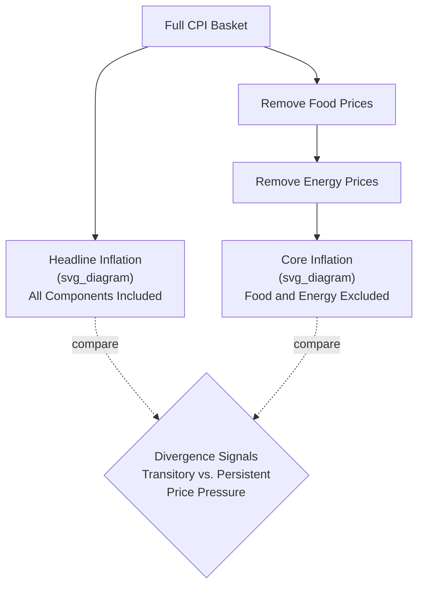

## Core Inflation versus Headline Inflation

### Definition

**Headline inflation** is the standard, unadjusted measure of inflation calculated from the complete Consumer Price Index (or other broad price index), including all component categories. **Core inflation** is a derived measure that **excludes specific, historically volatile components** — most commonly food and energy prices — from the price index before calculating the inflation rate, in an effort to isolate the more persistent, underlying trend in price movements from short-term, often supply-driven, fluctuations.

$$\text{Headline Inflation}_t = \frac{CPI_t - CPI_{t-1}}{CPI_{t-1}} \times 100$$

$$\text{Core Inflation}_t = \frac{CPI_{ex\text{-}food\text{-}energy,t} - CPI_{ex\text{-}food\text{-}energy,t-1}}{CPI_{ex\text{-}food\text{-}energy,t-1}} \times 100$$

### Key Points

- The exclusion of food and energy is motivated by the empirical observation that these categories exhibit substantially **higher price volatility** than most other components, driven by factors (weather events, geopolitical supply shocks, seasonal agricultural cycles, OPEC production decisions) that are often transitory and unrelated to broader, sustained inflationary or disinflationary momentum in the economy.
- Core inflation is widely used by **central banks** as a primary or supplementary input for monetary policy decisions, precisely because it is intended to better reflect the underlying inflation trend that monetary policy can meaningfully influence, filtering out noise from shocks that monetary policy cannot directly address.
- Headline inflation remains the more comprehensive and directly experienced measure of the actual cost-of-living change facing households, since food and energy are genuine, often substantial, components of real household budgets.
- Beyond the standard food-and-energy exclusion, several **alternative core/trimmed measures** exist, each using a different statistical technique to isolate the persistent component of inflation.

### Why Food and Energy Are Excluded

Food and energy prices are subject to several sources of volatility distinct from the broader, more persistent inflationary forces (aggregate demand pressure, wage growth, inflation expectations) that headline inflation also reflects:

- **Energy prices**: Highly sensitive to global supply disruptions (geopolitical conflict, OPEC production quotas, refinery outages), weather-driven demand spikes (extreme heat or cold), and speculative commodity market activity — often producing sharp, short-lived price swings that reverse within months rather than persisting.
- **Food prices**: Sensitive to weather events (droughts, floods) affecting crop yields, seasonal agricultural cycles, and specific commodity supply shocks (e.g., disease outbreaks affecting livestock) — again often transitory in nature relative to underlying demand-driven inflation trends.

By excluding these two categories, core inflation aims to provide a clearer signal of the inflation trend driven by more persistent, demand-side, and expectations-driven forces — the type of inflation that monetary policy (through interest rate adjustments affecting aggregate demand) is generally understood to have meaningful influence over, in contrast to a supply-driven agricultural or energy price shock that monetary policy cannot directly reverse.

### Illustrative Diagram: Headline vs. Core Inflation Construction

### Worked Numerical Example

Consider a simplified CPI basket with the following category weights and price changes over one year:

| Category | Weight | Price Change |
| --- | --- | --- |
| Food | 15% | +12.0% |
| Energy | 8% | +25.0% |
| All other goods/services | 77% | +2.5% |

**Headline inflation** (weighted average across all categories):

$$\text{Headline} = (0.15)(12.0) + (0.08)(25.0) + (0.77)(2.5)$$

$$= 1.80 + 2.00 + 1.925 = 5.725\%$$

**Core inflation** (excluding food and energy; re-weighting the remaining 77% to represent 100% of the core basket):

$$\text{Core} = \frac{0.77}{0.77} \times 2.5\% = 2.5\%$$

**Interpretation**: In this example, headline inflation (5.73%) substantially exceeds core inflation (2.5%), signaling that the elevated headline figure is being driven predominantly by volatile food and energy price spikes rather than by a broad-based, persistent increase in prices across the wider economy. A central bank observing this pattern might reasonably conclude that aggressive monetary tightening is less warranted than the headline figure alone would suggest, since food and energy shocks are generally outside the direct influence of interest rate policy and may prove transitory.

### Alternative "Core" and Trimmed-Mean Measures

Beyond the standard food-and-energy exclusion, statistical agencies and central banks have developed several alternative techniques to isolate persistent inflation, each addressing specific limitations of the simple exclusion method:

- **Trimmed-mean CPI**: Rather than excluding a fixed, predetermined set of categories (food and energy) regardless of their actual behavior in a given period, this method calculates inflation using only the "middle" portion of the distribution of individual component price changes, symmetrically trimming away a specified percentage of the most extreme price increases and decreases each period — allowing the excluded volatile components to shift dynamically depending on which categories are actually behaving erratically in that specific period, rather than always excluding the same two fixed categories.
- **Weighted median CPI**: Uses the price change of the component sitting at the exact weighted midpoint of the distribution of all component price changes as the inflation estimate, which is, by construction, highly robust to extreme outlier values in either direction.
- **Sticky-price CPI**: Constructed using only the subset of goods and services whose prices change relatively infrequently (as opposed to "flexible-price" goods that reprice often), on the theoretical rationale that infrequently-adjusted prices better reflect firms' expectations about future, longer-run inflation conditions.

[Inference] The specific methodology, availability, and relative emphasis placed on these alternative core measures (trimmed-mean, weighted median, sticky-price) varies considerably by country and by the specific central bank or statistical agency; not all countries publish all of these measures, and their relative reliability as inflation-trend indicators is an active area of ongoing macroeconomic research rather than a fully settled question.

### Central Bank Use of Core Inflation in Monetary Policy

Many central banks operating under an **inflation-targeting** framework use a specific core inflation measure (rather than, or alongside, headline inflation) as their primary or supplementary reference for assessing whether current monetary policy stance is appropriately calibrated. The underlying rationale:

- Monetary policy operates with a **lag** and works primarily through influencing aggregate demand; it cannot directly address supply-side shocks to food or energy prices.
- Reacting aggressively to a transitory headline inflation spike driven by a temporary oil price shock risks unnecessarily tightening policy (raising interest rates, slowing economic activity) in response to a shock that would likely reverse on its own, without any explicit monetary intervention.
- Core inflation, by filtering out such transitory volatility, is viewed as a more reliable gauge of the underlying inflationary momentum that monetary policy actually has the tools to influence and should therefore be calibrated against.

[Inference] The specific inflation measure(s) formally targeted or referenced by any particular central bank, and the precise weight given to core versus headline figures in actual policy deliberations, differs across countries and monetary authorities, and can also evolve over time; current practice for any specific central bank should be verified against that institution's own published monetary policy framework documentation.

### Common Points of Confusion

- **Core inflation is not "the real inflation rate" while headline inflation is somehow "wrong."** Both are valid, purpose-built statistical constructs; headline inflation better reflects the actual cost-of-living change experienced by households (who do, in fact, buy food and energy), while core inflation better serves the specific analytical purpose of isolating underlying inflationary momentum for monetary policy calibration.
- **Excluding food and energy does not mean these categories are unimportant** — it is a deliberate simplification made specifically to filter out categories with disproportionate short-term volatility relative to their persistence as inflation signals, not a claim that food and energy spending is economically insignificant for households.
- **A large and persistent gap between core and headline inflation over an extended period can itself be an important signal** — for example, sustained large gaps may suggest either a prolonged supply-side shock (if headline consistently exceeds core) or that core measures are, in a specific episode, failing to capture a genuinely broadening inflationary trend that started in food/energy and is now spreading to other categories (second-round effects).
- **"Core" does not refer to a single, universally standardized methodology** — the simple food-and-energy exclusion, trimmed-mean, weighted median, and sticky-price approaches are distinct techniques that can, and sometimes do, produce meaningfully different core inflation estimates for the same underlying price data and time period.

**Related Topics**

- Consumer Price Index construction and methodology
- GDP deflator versus CPI comparison
- Inflation targeting and monetary policy frameworks
- Cost-push vs. demand-pull inflation
- Producer Price Index and its uses
- Inflation expectations and their role in wage/price setting
- Trimmed-mean and weighted median inflation measures