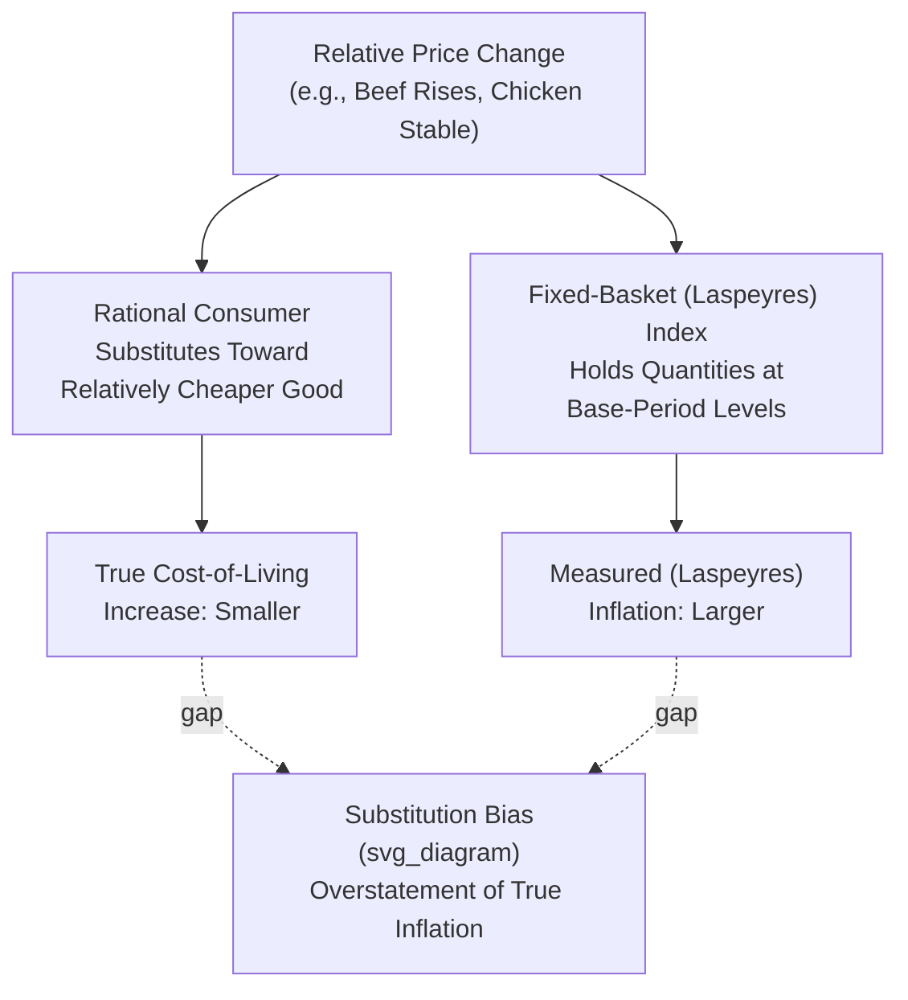

## Substitution Bias and Other Index Number Problems

### Definition

**Index number problems** refer to a family of well-established measurement biases that arise whenever a fixed-weight or otherwise imperfectly-updated price index is used to approximate true changes in the cost of living or the general price level over time. **Substitution bias** — the most prominent of these — arises specifically from using **fixed base-period quantities** as weights (as in the standard Laspeyres-style CPI), which fails to account for the fact that consumers rationally shift their purchasing patterns toward relatively cheaper goods as relative prices change, causing a fixed-basket index to systematically overstate the true increase in the cost of achieving a given standard of living.

### Key Points

- Substitution bias is a direct consequence of the **Laspeyres index formula's** structural assumption — that consumption quantities remain fixed at base-period levels — an assumption that becomes progressively less realistic the further removed the current period is from the base period.
- Beyond substitution bias, several **related index number problems** also cause measured inflation to diverge from a household's "true" cost-of-living change: new product bias, quality change bias, and outlet substitution bias.
- These issues are not unique to CPI; they are general problems in **index number theory** that arise whenever aggregating heterogeneous price changes into a single summary statistic, and analogous (though often oppositely-directed) issues affect other indices such as the GDP deflator.
- National statistical agencies have developed several methodological responses — chain-weighting, hedonic quality adjustment, and more frequent basket revisions — specifically to mitigate (though not fully eliminate) these biases.

### Substitution Bias: The Core Mechanism

Consider a simplified two-good economy (beef and chicken) where, due to a supply disruption, beef prices rise sharply while chicken prices remain stable. A **rational consumer**, seeking to maintain a given level of satisfaction (utility) at the lowest possible cost, will substitute away from the now-relatively-more-expensive beef toward the relatively cheaper chicken.

A **fixed-basket (Laspeyres) index**, however, continues to apply the **original base-period quantities** of beef and chicken when calculating the current-period cost of the basket — it does not allow the beef quantity to fall and the chicken quantity to rise in response to the changed relative prices. As a result:

$$\text{Laspeyres Index} = \frac{P_{beef,t} \times Q_{beef,base} + P_{chicken,t} \times Q_{chicken,base}}{P_{beef,base} \times Q_{beef,base} + P_{chicken,base} \times Q_{chicken,base}} \times 100$$

This calculation assumes the consumer continues buying the same (now more expensive) proportion of beef as before, even though real consumers would rationally reduce their beef purchases — causing the fixed-basket index to **overstate** how much more it actually costs the consumer to maintain their standard of living, since real households have a cheaper alternative (more chicken, less beef) available to them that the index does not reflect.

### Worked Numerical Example: Substitution Bias

Consider a simplified two-good basket, with beef prices rising sharply and chicken prices unchanged:

| Item | Base Period Price | Base Period Qty | Current Period Price |
| --- | --- | --- | --- |
| Beef | $5/lb | 10 lbs | $9/lb |
| Chicken | $3/lb | 10 lbs | $3/lb |

**Fixed-basket (Laspeyres) index calculation** (using base-period quantities throughout):

$$\text{Base Cost} = (5)(10) + (3)(10) = 50 + 30 = 80$$

$$\text{Current Cost (base quantities)} = (9)(10) + (3)(10) = 90 + 30 = 120$$

$$\text{Laspeyres Index} = \frac{120}{80} \times 100 = 150 \quad \Rightarrow \quad 50\% \text{ measured inflation}$$

**A substitution-adjusted scenario**: suppose a rational consumer, facing these new relative prices, shifts their consumption to 4 lbs of beef and 16 lbs of chicken (reducing beef, increasing chicken) while maintaining a comparable overall satisfaction level:

$$\text{Actual Current Cost (substituted quantities)} = (9)(4) + (3)(16) = 36 + 48 = 84$$

The consumer's **actual** cost increase, having substituted toward the relatively cheaper good, is only from $80 to $84 — a 5% increase — dramatically less than the 50% increase reported by the fixed-basket Laspeyres calculation. [Note: This example is deliberately stylized to make the mechanism clearly visible; real-world substitution responses and their precise magnitude depend on the specific goods involved, the availability of substitutes, and the elasticity of consumer demand, and would not typically produce a gap of this exact scale in practice.]

### Illustrative Diagram: Substitution Bias Mechanism

### Other Major Index Number Problems

**1. New Product Bias**

Genuinely new products (a novel category of good, such as a fundamentally new type of consumer electronic device) typically enter the CPI basket only after a delay, once the periodic basket-revision cycle catches up to include it. New products commonly experience a period of **rapidly falling prices** shortly after introduction (as production scales up and competition increases), and this early, often substantial, price decline is entirely missed by an index that only begins tracking the product after this initial phase.

**2. Quality Change Bias**

When a product's underlying quality or feature set improves over time (a new smartphone model with better specifications replacing an older model at a similar or higher nominal price), a portion of any observed price change reflects genuine quality improvement rather than pure inflation. If quality-adjustment techniques (such as hedonic pricing, discussed under CPI construction) fail to fully separate the quality-driven from the pure-price-driven component of the observed price change, the index can either overstate or understate true inflation, depending on the direction and adequacy of the specific adjustment applied.

**3. Outlet Substitution Bias**

Consumers may increasingly shift their purchases toward lower-price retail formats over time — for example, moving from traditional full-service retailers toward large-format discount retailers or online marketplaces offering the same or similar goods at systematically lower prices. If the index's sampled outlet mix does not adequately track this shift in *where* consumers actually shop, the index can overstate the price increases actually experienced by consumers who have access to, and increasingly use, these lower-cost purchasing channels.

### Index Number Problems Are Not Confined to CPI: The Opposite-Direction Case of the GDP Deflator

As discussed under GDP deflator versus CPI comparison, the GDP deflator's Paasche-style (current-period-weighted) construction produces an **opposite-direction** bias relative to CPI's Laspeyres-style substitution bias: a Paasche-style index tends to **understate** true inflation, since it implicitly assumes that the current period's already-substituted consumption pattern also applied in the base period, understating how much more expensive it would have been to purchase the base-period bundle at current prices.

| Index Type | Weighting | Substitution Bias Direction |
| --- | --- | --- |
| Laspeyres (e.g., standard CPI) | Fixed base-period quantities | Tends to **overstate** true inflation |
| Paasche (e.g., un-chained GDP deflator) | Current-period quantities | Tends to **understate** true inflation |
| Fisher Ideal Index | Geometric mean of Laspeyres and Paasche | Designed to substantially reduce, though not perfectly eliminate, both directional biases |

The **Fisher Ideal Index**, calculated as the geometric mean of the Laspeyres and Paasche indices for the same data, is often cited in index-number theory as a well-regarded compromise formula precisely because it splits the difference between the two opposing directional biases, and satisfies several desirable mathematical properties (such as time-reversal consistency) that neither pure Laspeyres nor pure Paasche formulas satisfy on their own.

$$\text{Fisher Ideal Index} = \sqrt{\text{Laspeyres Index} \times \text{Paasche Index}}$$

### Methodological Responses to Mitigate Index Number Problems

- **Chain-weighting**: Updates the effective quantity weights more frequently (using adjacent-period rather than a single distant fixed-period basket), substantially reducing substitution bias's cumulative magnitude over long time spans, as discussed under both the GDP deflator and CPI construction items.
- **More frequent basket revisions**: Shortening the interval between full basket/weight updates for CPI reduces the window during which substitution and new-product bias can accumulate.
- **Hedonic quality adjustment**: Directly targets quality change bias by statistically estimating and removing the quality-driven component of observed price changes for categories with well-documented, measurable characteristics (as discussed under CPI construction methodology).
- **Expanded outlet sampling**: Broadening and periodically updating the sample of retail outlets surveyed (including newer formats such as large discount chains and online retailers) to better track outlet substitution bias.

[Inference] The specific combination and intensity of these mitigation techniques actually implemented varies by country and statistical agency, and even with these mitigations, a residual degree of index number bias is generally understood to persist in most published price indices; the goal of these methodological refinements is bias reduction rather than complete elimination.

### Common Points of Confusion

- **Substitution bias does not mean CPI is "broken" or unreliable for all purposes** — it is a well-understood, quantifiable directional bias inherent to any fixed-weight index construction, and its existence is precisely why supplementary measures (chained CPI, Fisher-type indices) have been developed for contexts where minimizing this specific bias matters most.
- **Substitution bias and quality change bias are conceptually distinct problems**, even though both can cause a similar directional effect (index overstating true inflation) — substitution bias concerns *changing consumption quantities* in response to relative price changes, while quality bias concerns *inadequately separating* genuine price change from product improvement.
- **The Paasche/GDP deflator bias runs in the opposite direction from the Laspeyres/CPI bias**, meaning it would be incorrect to assume all index number problems push measured inflation in the same direction — the specific bias direction depends on which weighting convention (fixed base-period vs. current-period) the particular index uses.
- **The Fisher Ideal Index is a specific, named technical solution**, not merely a generic descriptive term for "a good index" — it has a precise mathematical definition (the geometric mean of the Laspeyres and Paasche indices for the same underlying data) and specific, provable desirable properties within index number theory.

**Related Topics**

- Consumer Price Index construction and methodology
- GDP deflator construction and interpretation
- GDP deflator versus CPI comparison
- Chain-weighted vs. fixed-base index number methods
- Core inflation versus headline inflation
- Hedonic pricing and quality adjustment methods
- Nominal versus real GDP