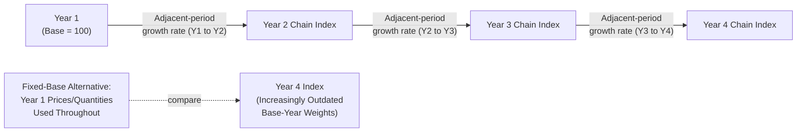
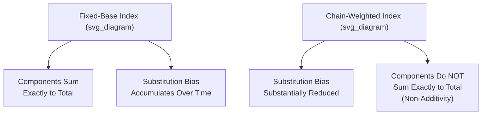

## Chain-Weighted Price Indices

### Definition

A **chain-weighted price index** (also called a **chain-linked index**) is a price/quantity index constructed by calculating growth rates using **adjacent-period** weights and then **linking** (multiplying together) these period-to-period growth rates into a continuous, cumulative index series — rather than measuring all periods' growth relative to a single, fixed, and increasingly distant base period. Chain-weighting is the primary methodological tool used by modern national accounting systems to substantially reduce the substitution bias and other index number problems inherent in fixed-base index construction.

$$\text{Chain Index}_t = \text{Chain Index}_{t-1} \times \left(\frac{\text{Index}_{t \text{ vs } t-1}}{100}\right)$$

where $\text{Index}_{t \text{ vs } t-1}$ is a period-to-period index (commonly Fisher or Laspeyres/Paasche-based) computed using only the two adjacent periods' own price and quantity data, rather than a distant fixed base year's data.

### Key Points

- Chain-weighting directly addresses the core problem identified under substitution bias and other index number problems: a fixed-base index's weights become progressively less representative of actual current consumption or production patterns the further the current period is from the base year.
- Under chain-weighting, the **effective weights update every period**, meaning the index always reflects a relatively *recent* (adjacent-period) composition of goods and services, rather than a composition frozen at one distant historical point.
- Most major national accounting systems, following the UN System of National Accounts, now use chain-weighted methodology for computing **Real GDP** and the associated **chain-type GDP deflator**, rather than a traditional single-fixed-base-year approach.
- Chain-weighting substantially **reduces**, but does not entirely **eliminate**, index number bias — some residual approximation issues remain, and chain-weighted indices introduce their own distinct technical complication: **non-additivity**.

### The Core Mechanism: Linking Period-to-Period Indices

Rather than computing every period's real output or price level directly against a single fixed base year (as in the traditional fixed-base approach), a chain index proceeds sequentially:

1. Compute a period-to-period index (often a Fisher Ideal Index, combining Laspeyres and Paasche formulas) comparing period $t$ to period $t-1$, using only these two adjacent periods' own price and quantity data.
2. **Link** this period-to-period growth rate onto the cumulative chain index value from the previous period, by multiplication.
3. Repeat this process forward through time, so the cumulative chain index for any given year reflects the compounded product of all the intervening adjacent-period growth rates, rather than a single direct comparison to a distant fixed base year.

This means the **quantity/price weights used to measure growth between any two adjacent periods always reflect data close in time to those two periods**, rather than data from an increasingly outdated single base year.

### Illustrative Diagram: Chain-Linking Mechanism

### Worked Numerical Illustration: Chain Index vs. Fixed-Base Index

Consider a simplified three-period sequence with the following period-to-period growth rates in real output, computed using each period's own adjacent-period weights:

| Period | Period-to-Period Growth Rate |
| --- | --- |
| Year 1 → Year 2 | +4.0% |
| Year 2 → Year 3 | +3.5% |
| Year 3 → Year 4 | +5.0% |

**Chain index calculation** (Year 1 = 100):

$$\text{Chain Index}_{Year\ 2} = 100 \times 1.040 = 104.00$$

$$\text{Chain Index}_{Year\ 3} = 104.00 \times 1.035 = 107.64$$

$$\text{Chain Index}_{Year\ 4} = 107.64 \times 1.050 = 113.02$$

Each step uses growth-rate information computed from data specific to that adjacent pair of years, rather than always re-referencing Year 1's original price/quantity structure — meaning the chain index for Year 4 reflects a composition much closer to Year 3's actual economic structure than a fixed-base Year-1-referenced index would.

[Note: This example presents the period-to-period growth rates as given inputs to illustrate the linking mechanism itself; in practice, each of these period-to-period growth rates would itself be computed from underlying, detailed price and quantity data for the relevant pair of adjacent years, commonly using a Fisher Ideal Index formula.]

### Why Chain-Weighting Reduces Substitution Bias

Recall from substitution bias and other index number problems that a **fixed-base Laspeyres index** overstates true inflation/growth measurement because it holds quantities fixed at an increasingly distant base period, ignoring the consumer or producer substitution that occurs as relative prices shift over time. Under chain-weighting:

- The **quantity weights are refreshed every single period**, meaning that at any given link in the chain, the weights being applied are close in time to the two periods actually being compared.
- This dramatically **shortens the window** over which relative-price-driven substitution can accumulate before the index's weights "catch up" to reflect it, compared to a fixed base year that might be a decade or more removed from the current period.
- [Inference] While chain-weighting substantially mitigates the *cumulative* substitution bias that builds up over long time spans under a fixed-base approach, it does not perfectly eliminate substitution bias within any single adjacent-period link, since some degree of substitution can still occur even within one period; the specific residual bias magnitude is a matter of ongoing applied index-number research rather than a fixed, quantifiable constant.

### The Trade-Off: Non-Additivity

Chain-weighted indices introduce a specific technical complication not present in fixed-base indices: **non-additivity**. In a fixed-base system, the real (constant-price) values of GDP's individual expenditure components ($C$, $I$, $G$, $NX$) sum exactly to real GDP, since all components share the same fixed base-year price weights. Under chain-weighting, because the effective price weights differ slightly from period to period and are only implicitly embedded in each period's own linking calculation, **the chain-weighted real values of individual GDP components generally do NOT sum exactly to chain-weighted real GDP**, particularly for periods further from the reference year.

$$\text{Chain-Weighted: } C_{real} + I_{real} + G_{real} + NX_{real} \neq GDP_{real} \text{ (generally, with a small residual)}$$

National statistical agencies handle this by publishing a specific **"residual"** line item in detailed national accounts tables to reconcile the sum of chain-weighted components with the separately chain-weighted GDP total, and by cautioning analysts against directly summing chain-weighted component series across widely separated time periods without accounting for this discrepancy.

### Illustrative Diagram: Additivity Trade-Off

### Chain-Weighting in Practice: National Accounts Applications

- **Chain-weighted Real GDP**: The standard modern approach (e.g., adopted by the U.S. Bureau of Economic Analysis since 1996, and widely followed internationally under UN System of National Accounts guidance) for computing real, inflation-adjusted GDP growth, replacing older fixed-base-year methodologies.
- **Chain-type GDP Deflator**: The corresponding chain-weighted price index derived alongside chain-weighted real GDP, providing a price-level measure whose implicit weights are similarly kept current rather than frozen at a single historical point.
- **Chained CPI**: As introduced under Consumer Price Index construction and Core inflation versus headline inflation, some countries publish a chained variant of the CPI specifically to address CPI's own Laspeyres-style substitution bias, generally as a supplementary measure alongside (rather than a full replacement for) the traditional, more frequently and immediately published fixed-weight headline CPI. [Inference] The specific chained-CPI variant's role (supplementary vs. primary official measure) and its particular publication lag relative to the standard CPI differ by country; current specifics should be checked against the relevant national statistical agency's publications.

### Common Points of Confusion

- **Chain-weighting is not the same as "chaining" in the informal, everyday sense of simply linking two numbers together** — it refers to a precise, formal index-number methodology involving adjacent-period-weighted growth rates multiplied sequentially over time.
- **A chain-weighted real GDP figure for a distant past year is not necessarily comparable to an old fixed-base real GDP figure for that same year computed under the previous methodology** — a change in methodology (e.g., a country's shift from fixed-base to chain-weighting) typically requires the entire historical real GDP series to be recalculated/revised under the new consistent methodology, since the two approaches are not simply rescaled versions of one another.
- **Chain-weighting reduces bias but introduces non-additivity — this is a genuine trade-off, not a "solved" problem.** Analysts working with detailed national accounts data must be aware that summing chain-weighted component series will generally not exactly reproduce the separately published chain-weighted total, particularly over longer time spans from the reference period.
- **Chain-weighting is conceptually distinct from, though related in spirit to, more frequent basket revisions in a fixed-weight index (like periodic CPI basket updates)** — chain-weighting updates the effective weights continuously (every period), whereas periodic basket revision updates the weights only at discrete, less frequent intervals, offering a less complete (though administratively simpler) mitigation of the same underlying substitution bias problem.

**Related Topics**

- Substitution bias and other index number problems
- Nominal versus real GDP
- GDP deflator construction and interpretation
- Consumer Price Index construction and methodology
- GDP deflator versus CPI comparison
- Fisher Ideal Index and Laspeyres/Paasche index formulas
- National accounts revisions and methodology changes