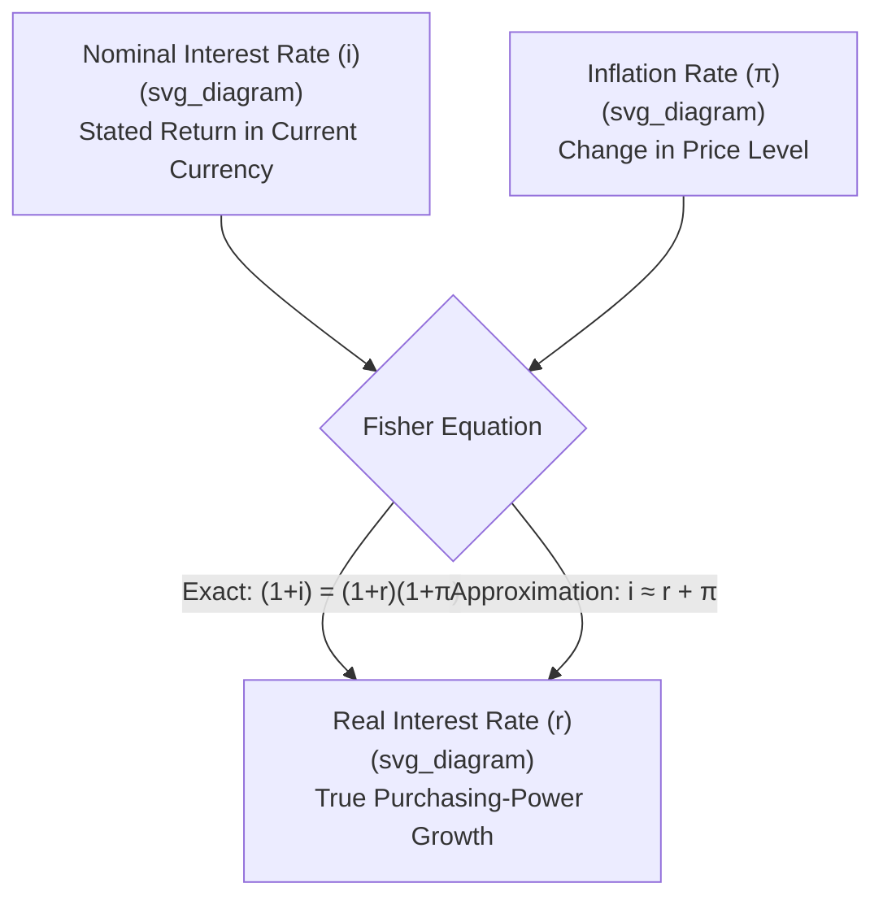

## Nominal versus Real Interest Rates and the Fisher Equation

### Definition

The **nominal interest rate** is the stated, observable rate of return on a loan or financial asset, measured in current-dollar (or current-currency) terms, without any adjustment for changes in purchasing power. The **real interest rate** is the nominal interest rate adjusted for expected or actual inflation, representing the true growth in **purchasing power** — the actual increase in the quantity of goods and services a saver or lender can command — that results from holding a given financial asset. The **Fisher equation**, named after economist Irving Fisher, formalizes the relationship between these two rates and the inflation rate.

$$\text{Exact Fisher Equation: } (1 + i) = (1 + r)(1 + \pi)$$

$$\text{Approximation (commonly used): } i \approx r + \pi$$

where $i$ is the nominal interest rate, $r$ is the real interest rate, and $\pi$ is the inflation rate (or expected inflation rate, depending on the specific application).

### Key Points

- The nominal interest rate is the rate actually quoted on savings accounts, bonds, and loans; the real interest rate is a **derived, calculated** concept representing the nominal rate's true purchasing-power effect once inflation is accounted for.
- The **approximate Fisher equation** ($i \approx r + \pi$) is a linear approximation that is reasonably accurate for relatively low rates of interest and inflation, but becomes progressively less precise as either $i$ or $\pi$ grows large, at which point the **exact Fisher equation** should be used instead.
- A critical distinction exists between the **ex-ante real interest rate** (calculated using *expected* inflation, relevant for decisions made *before* the fact) and the **ex-post real interest rate** (calculated using *actual, realized* inflation, relevant for evaluating outcomes *after* the fact) — these can differ substantially if actual inflation deviates from what was originally expected.
- The real interest rate, not the nominal rate, is the economically relevant variable for most saving, investment, and borrowing decisions, since it reflects the true growth (or erosion) of purchasing power over time.

### Deriving the Exact Fisher Equation

Consider an individual lending (or depositing) an amount of money for one period at nominal interest rate $i$. In nominal-dollar terms, the amount received at the end of the period is:

$$\text{Nominal Amount Received} = (1 + i) \times \text{Principal}$$

However, if the price level rises by the inflation rate $\pi$ over that same period, the **real** (purchasing-power-adjusted) value of that nominal amount is found by dividing by the price-level growth factor:

$$\text{Real Amount Received} = \frac{(1 + i) \times \text{Principal}}{(1 + \pi)}$$

By definition, the real interest rate $r$ is the rate that produces this same real growth in purchasing power directly:

$$(1 + r) = \frac{1 + i}{1 + \pi}$$

Rearranging gives the exact Fisher equation:

$$(1 + i) = (1 + r)(1 + \pi)$$

$$r = \frac{1 + i}{1 + \pi} - 1$$

### Deriving the Approximation

Expanding the exact equation $(1+i) = (1+r)(1+\pi)$ algebraically:

$$1 + i = 1 + r + \pi + r\pi$$

$$i = r + \pi + r\pi$$

When $r$ and $\pi$ are both relatively small (as is typical for most everyday interest rate and inflation levels), the cross-product term $r\pi$ becomes very small relative to $r$ and $\pi$ individually, and can be reasonably neglected, yielding the widely used linear approximation:

$$i \approx r + \pi \qquad \Longleftrightarrow \qquad r \approx i - \pi$$

### Worked Numerical Example: Exact vs. Approximate Fisher Equation

**Scenario with low rates**: Nominal interest rate $i = 5\%$, inflation rate $\pi = 2\%$.

**Approximation**:

$$r \approx i - \pi = 5\% - 2\% = 3.00\%$$

**Exact calculation**:

$$r = \frac{1 + 0.05}{1 + 0.02} - 1 = \frac{1.05}{1.02} - 1 = 1.0294 - 1 = 2.94\%$$

The approximation (3.00%) is very close to the exact value (2.94%) at these relatively low rates — a difference of only 0.06 percentage points.

**Scenario with high rates**: Nominal interest rate $i = 40\%$, inflation rate $\pi = 30\%$ (illustrating a high-inflation environment).

**Approximation**:

$$r \approx i - \pi = 40\% - 30\% = 10.00\%$$

**Exact calculation**:

$$r = \frac{1 + 0.40}{1 + 0.30} - 1 = \frac{1.40}{1.30} - 1 = 1.0769 - 1 = 7.69\%$$

Here, the approximation (10.00%) diverges substantially from the exact value (7.69%) — a difference of 2.31 percentage points — illustrating why the exact formula becomes necessary at higher rates of interest and inflation, such as those observed in high-inflation economies.

### Illustrative Diagram: Fisher Equation Relationship

### Ex-Ante vs. Ex-Post Real Interest Rates

This distinction is central to understanding how unexpected inflation redistributes real wealth between borrowers and lenders:

- **Ex-ante real interest rate**: Calculated using the *expected* inflation rate at the time a financial contract (loan, bond) is agreed upon. This is the rate relevant to a lender's or borrower's decision-making process *before* the outcome is known, since neither party can observe future actual inflation at the time of contracting.

$$r_{ex\text{-}ante} = i - \pi^{expected}$$

- **Ex-post real interest rate**: Calculated using the *actual, realized* inflation rate over the period the loan or asset was held. This reflects the *true* purchasing-power outcome actually experienced, evaluated *after* the fact.

$$r_{ex\text{-}post} = i - \pi^{actual}$$

**Why this distinction matters**: Since the nominal interest rate $i$ is typically fixed (or contractually specified) at the time a loan agreement is made, any deviation between actual and expected inflation directly redistributes real purchasing power between borrower and lender:

- If **actual inflation turns out higher than expected** ($\pi^{actual} > \pi^{expected}$): the ex-post real interest rate is **lower** than anticipated, benefiting **borrowers** (who repay their fixed nominal debt obligation with currency that has lost more purchasing power than originally expected) at the expense of **lenders** (who receive repayment in currency worth less than they had anticipated when agreeing to the loan terms).
- If **actual inflation turns out lower than expected** ($\pi^{actual} < \pi^{expected}$): the ex-post real interest rate is **higher** than anticipated, benefiting **lenders** at the expense of **borrowers**.

### Worked Numerical Example: Ex-Ante vs. Ex-Post Divergence

A bank issues a loan at a nominal interest rate of $i = 6\%$, based on an expected inflation rate of $\pi^{expected} = 3\%$.

$$r_{ex\text{-}ante} \approx 6\% - 3\% = 3\%$$

Suppose actual inflation over the loan period turns out to be $\pi^{actual} = 5\%$ (higher than expected):

$$r_{ex\text{-}post} \approx 6\% - 5\% = 1\%$$

The lender receives a real return of only about 1%, substantially lower than the anticipated 3% real return, because unexpectedly high inflation eroded more of the loan's real value than the lender had planned for when setting the nominal rate — a real transfer of purchasing power from the lender to the borrower.

### Applications and Importance

- **Savings and investment decisions**: Rational savers and investors care about the **real** return on their assets — the actual growth in purchasing power — not merely the nominal rate quoted, since a high nominal rate accompanied by even higher inflation can represent a **negative** real return, actually eroding purchasing power over time.
- **Monetary policy analysis**: Central banks and macroeconomists distinguish nominal policy interest rates from the real interest rate (nominal rate minus expected inflation) when assessing the actual degree of monetary tightness or looseness, since the same nominal policy rate can represent very different real conditions depending on prevailing inflation expectations.
- **Loan and bond contract design**: The ex-ante/ex-post distinction underlies the rationale for **inflation-indexed bonds** (such as U.S. Treasury Inflation-Protected Securities, or similar instruments in other countries), which explicitly adjust principal or coupon payments for actual realized inflation, specifically to protect both borrower and lender from unexpected inflation risk that a conventional fixed nominal-rate instrument does not address.
- **International interest rate comparisons**: Comparing nominal interest rates across countries with very different inflation environments can be misleading without converting to real terms, since a country with a high nominal interest rate may still offer a low or even negative real return if its inflation rate is correspondingly high.

### Common Points of Confusion

- **A high nominal interest rate does not necessarily mean a good real return.** If inflation is high enough, the real interest rate can be low or even **negative**, meaning a saver's purchasing power actually declines despite earning a positive nominal return — a critical distinction often overlooked in casual discussion of "high" or "low" interest rates.
- **The approximation $r \approx i - \pi$ is a simplification, not the formally exact relationship.** It works well at low rates but should be replaced with the exact Fisher equation $\left(r = \frac{1+i}{1+\pi} - 1\right)$ in high-inflation environments, where the neglected cross-product term becomes non-trivial.
- **Ex-ante and ex-post real rates are conceptually distinct and can differ substantially** — the ex-ante rate reflects a *forecast-based* real return relevant to decision-making, while the ex-post rate reflects the *actual, realized* outcome; conflating the two obscures how unexpected inflation redistributes real wealth between borrowers and lenders.
- **The Fisher equation describes an accounting/definitional relationship between nominal rates, real rates, and inflation — it is not, by itself, a theory of what determines the nominal interest rate.** A related but distinct proposition, the **Fisher effect** (or Fisher hypothesis), is the further economic claim that real interest rates tend to be relatively stable over the long run, such that changes in expected inflation are largely reflected one-for-one in changes to the nominal interest rate; this is a separate, more substantive economic hypothesis about the *behavior* of interest rates over time, distinct from the purely definitional Fisher equation itself. [Inference] The empirical validity and precise conditions under which the Fisher effect holds (full, partial, or no pass-through of expected inflation into nominal rates) is a matter of ongoing empirical debate in monetary economics, rather than a settled, universally confirmed relationship.

**Related Topics**

- Consumer Price Index construction and methodology
- GDP deflator versus CPI comparison
- Inflation targeting and monetary policy frameworks
- Inflation-indexed bonds and real return instruments
- Money supply, interest rates, and monetary policy transmission
- Loanable funds market and interest rate determination
- Core inflation versus headline inflation