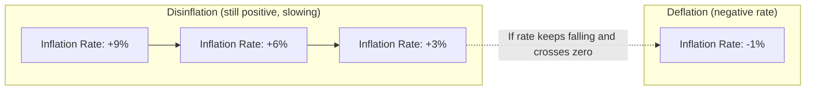
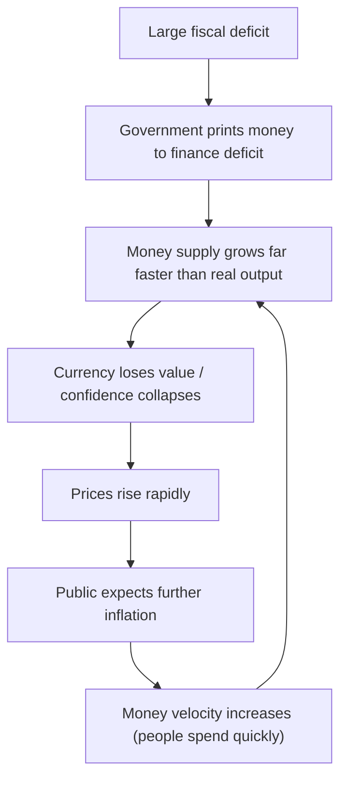

## Inflation, Disinflation, Deflation, and Hyperinflation Defined

### Overview

These four terms describe distinct dynamics of the *rate of change* in the general price level of an economy, not the price level itself. Confusing the level of prices with the direction or speed of change in that level is the single most common conceptual error at this stage of study. All four concepts are typically measured using a price index, most commonly the Consumer Price Index (CPI), the GDP deflator, or the Producer Price Index (PPI).

### Inflation

**Definition**

Inflation is a sustained increase in the general price level of goods and services in an economy over a period of time. Equivalently, it is a sustained decline in the purchasing power of a unit of currency.

**Key Points**

- Inflation refers to a *broad-based, persistent* rise in prices, not a one-time jump in the price of a single good.
- It is typically expressed as an annualized percentage rate.
- Inflation is measured using the percentage change in a price index between two periods.

**Formula**

The inflation rate between period $t-1$ and period $t$ is:

$$\pi_t = \frac{P_t - P_{t-1}}{P_{t-1}} \times 100\%$$

where $P_t$ is the price index level (e.g., CPI) in period $t$.

**Example**

If the CPI is 260 in Year 1 and 270 in Year 2:

$$\pi = \frac{270 - 260}{260} \times 100\% \approx 3.85\%$$

This means the general price level rose by approximately 3.85% year over year.

**Types of Inflation (by cause)**

- **Demand-pull inflation**: Aggregate demand grows faster than aggregate supply, pulling prices upward. Often associated with an overheating economy, expansionary fiscal/monetary policy, or a positive demand shock.
- **Cost-push inflation**: Rising input costs (wages, energy, raw materials) shift aggregate supply leftward, pushing prices up even without a corresponding rise in demand.
- **Built-in (wage-price spiral) inflation**: Adaptive expectations of continued inflation lead workers to demand higher wages, which raises firms' costs, which raises prices further, reinforcing the cycle.

**Types of Inflation (by severity)**

- **Creeping/moderate inflation**: Low, stable, single-digit annual rates (commonly cited as roughly 2–3% in advanced economies); generally considered consistent with healthy economic functioning and is the explicit target of many central banks. [Unverified: exact target bands vary by country and over time.]
- **Galloping (or "trotting") inflation**: Inflation in the double- or triple-digit range annually; erodes confidence in the currency and distorts saving/investment decisions.
- **Hyperinflation**: An extreme, runaway case, treated separately below.

### Disinflation

**Definition**

Disinflation is a *decrease in the rate* of inflation. Prices are still rising, but at a slower pace than before. Disinflation does **not** mean prices are falling — that is deflation.

**Key Points**

- Disinflation describes deceleration of a positive inflation rate; the price level continues to increase, just more slowly.
- It is often the deliberate outcome of contractionary monetary policy (e.g., central bank interest rate hikes) aimed at cooling an overheated economy.
- Disinflation can be a smooth "soft landing" or can be accompanied by rising unemployment (a cost frequently modeled via the Phillips Curve trade-off).

**Example**

| Year | Inflation Rate |
| --- | --- |
| Year 1 | 9% |
| Year 2 | 6% |
| Year 3 | 3% |

Here, prices are increasing every year (the index keeps rising), but the *rate* of increase is falling from 9% → 6% → 3%. This is disinflation, not deflation.

**Distinguishing Disinflation from Deflation**

### Deflation

**Definition**

Deflation is a sustained *decrease* in the general price level of goods and services over time — a negative inflation rate. It is the opposite of inflation, not merely a slowdown of it.

**Key Points**

- Deflation means the price index itself falls from one period to the next: $\pi_t < 0$.
- Purchasing power of currency *increases* under deflation — a given amount of money buys more goods over time.
- Deflation is often (though not always) associated with weak aggregate demand, economic contraction, or a debt crisis (see Debt-Deflation Theory).

**Formula**

Using the same inflation formula, deflation is simply the case where:

$$\pi_t = \frac{P_t - P_{t-1}}{P_{t-1}} \times 100\% < 0$$

**Example**

If the CPI falls from 260 to 255 year over year:

$$\pi = \frac{255 - 260}{260} \times 100\% \approx -1.92\%$$

**Why Deflation Is Considered Problematic**

- **Deflationary spiral risk**: Consumers may delay purchases anticipating further price declines, reducing current aggregate demand, which pressures firms to cut prices further, reinforcing the cycle.
- **Rising real debt burden**: Since debt contracts are typically fixed in nominal terms, deflation increases the *real* value of debt owed, straining borrowers (a core mechanism in Irving Fisher's debt-deflation theory).
- **Zero lower bound constraint**: Central banks may struggle to stimulate the economy through interest rate cuts once nominal rates approach zero, limiting conventional monetary policy tools. [Inference: the practical severity of this constraint is debated and depends on the availability of unconventional tools such as quantitative easing.]

**Deflation vs. Disinflation (Summary Table)**

| Feature | Disinflation | Deflation |
| --- | --- | --- |
| Direction of price level | Still rising | Falling |
| Inflation rate sign | Positive, but decreasing | Negative |
| Purchasing power trend | Still eroding (slower) | Increasing |
| Common cause | Tightening monetary policy | Demand collapse, debt crises |

### Hyperinflation

**Definition**

Hyperinflation is an extremely rapid, out-of-control escalation of inflation, typically defined by economists (following Phillip Cagan's 1956 classic threshold) as inflation exceeding 50% *per month*, which compounds to roughly 12,875% per year.

**Key Points**

- At 50% monthly inflation, the price level doubles roughly every 1.5 months.
- Hyperinflation is generally caused by a collapse in confidence in a currency, often triggered by a government financing large fiscal deficits by printing money (monetizing debt) rather than through taxation or borrowing.
- It is frequently accompanied by a **wage-price spiral** and a flight from the domestic currency into foreign currency, barter, or hard assets.

**Formula: Cagan's Threshold**

$$\pi_{monthly} \geq 50\%$$

Annualized equivalent (compounding monthly):

$$\pi_{annual} = \left[(1 + 0.50)^{12} - 1\right] \times 100\% \approx 12{,}875\%$$

**Historical Examples**

- **Weimar Germany (1921–1923)**: Prices doubled roughly every few days at the peak; reparations obligations and money printing are widely cited as central drivers.
- **Zimbabwe (2007–2009)**: Monthly inflation reportedly peaked in the hundreds of billions of percent by some estimates, culminating in the abandonment of the Zimbabwean dollar. [Unverified: precise peak figures vary substantially across sources due to measurement difficulty in extreme hyperinflation episodes.]
- **Hungary (1945–1946)**: Widely cited as the most severe hyperinflation recorded, with prices reportedly doubling roughly every 15 hours at the peak. [Unverified: exact figures depend on the historical source and estimation method used.]

**Mechanics of Hyperinflation**

**Consequences**

- **Erosion of savings**: Cash and fixed nominal assets become nearly worthless.
- **Menu costs increase sharply**: Firms must reprice goods extremely frequently, sometimes multiple times per day.
- **Shoe-leather costs**: Individuals spend excessive time and effort converting cash into goods or stable foreign currency to avoid holding depreciating money.
- **Breakdown of money's functions**: The domestic currency may cease to function effectively as a unit of account, store of value, or medium of exchange, prompting dollarization or barter.

### Comparative Summary

| Term | Price Level Direction | Inflation Rate | Typical Severity |
| --- | --- | --- | --- |
| Inflation | Rising | Positive | Low to high |
| Disinflation | Rising (more slowly) | Positive but falling | Moderate |
| Deflation | Falling | Negative | Low to moderate |
| Hyperinflation | Rising extremely rapidly | Very high positive (>50%/month, Cagan threshold) | Extreme |

### Illustrative Price-Level Paths

<svg xmlns="http://www.w3.org/2000/svg" viewBox="0 0 760 420" font-family="sans-serif">
<text x="380" y="24" text-anchor="middle" font-size="16" font-weight="bold" fill="#1a1a1a">Price Level Paths Over Time (svg_diagram)</text>
<line x1="70" y1="360" x2="720" y2="360" stroke="#333" stroke-width="1.5" />
<line x1="70" y1="360" x2="70" y2="50" stroke="#333" stroke-width="1.5" />
<text x="400" y="395" text-anchor="middle" font-size="12" fill="#333">Time</text>
<text x="30" y="200" text-anchor="middle" font-size="12" fill="#333" transform="rotate(-90 30 200)">Price Level</text>
<polyline points="70,300 170,270 270,245 370,225 470,208 570,193 670,180" fill="none" stroke="#2563eb" stroke-width="2.5" />
<text x="675" y="178" font-size="12" fill="#2563eb">Inflation (steady rise)</text>
<polyline points="70,300 170,250 270,215 370,195 470,182 570,175 670,172" fill="none" stroke="#f59e0b" stroke-width="2.5" />
<text x="675" y="170" font-size="12" fill="#f59e0b">Disinflation (rising, decelerating)</text>
<polyline points="70,300 170,310 270,322 370,335 470,345 570,352 670,357" fill="none" stroke="#16a34a" stroke-width="2.5" />
<text x="675" y="357" font-size="12" fill="#16a34a">Deflation (falling)</text>
<polyline points="70,300 120,295 170,280 220,240 270,150 320,60" fill="none" stroke="#dc2626" stroke-width="2.5" />
<text x="330" y="60" font-size="12" fill="#dc2626">Hyperinflation (explosive rise)</text>
</svg>

### Practical Example: Computing All Four from One Data Series

| Year | Price Index | Annual Inflation Rate | Classification |
| --- | --- | --- | --- |
| 1 | 100 | — | Base year |
| 2 | 108 | 8.0% | Inflation |
| 3 | 112 | 3.7% | Disinflation (rate fell from 8% to 3.7%) |
| 4 | 109 | -2.7% | Deflation |
| 5 | 5,000 | ~4,486% | Hyperinflation (extreme case) |

This single stylized series illustrates how an economy could theoretically pass through all four states, though in practice hyperinflation is a distinct structural breakdown rather than a typical stage in a normal business cycle.

### Measurement Caveats

- **Index choice matters**: CPI, GDP deflator, and PPI can yield different inflation readings for the same period due to differing baskets of goods and weighting methodologies.
- **Core vs. headline inflation**: Headline inflation includes volatile components like food and energy; core inflation excludes them to better reflect underlying trends. [Inference: whether core or headline is more "accurate" depends on the analytical purpose — short-term policy reaction versus long-term trend assessment.]
- **Behavior in real-world data may vary** from the idealized examples above due to base effects, seasonal adjustment methods, and revisions to historical index values.

**Next Steps**

- Core inflation vs. headline inflation
- The Consumer Price Index (CPI): construction and limitations
- GDP deflator vs. CPI as inflation measures
- The Phillips Curve and the inflation-unemployment trade-off
- Quantity Theory of Money ($MV = PQ$) and its link to inflation
- Causes of inflation: demand-pull vs. cost-push in depth
- Central bank inflation targeting frameworks
- Debt-deflation theory (Irving Fisher)
- Real vs. nominal interest rates (the Fisher equation)
- Case study: Weimar Germany and Zimbabwe hyperinflation episodes