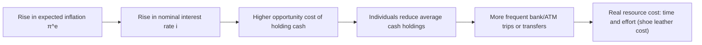
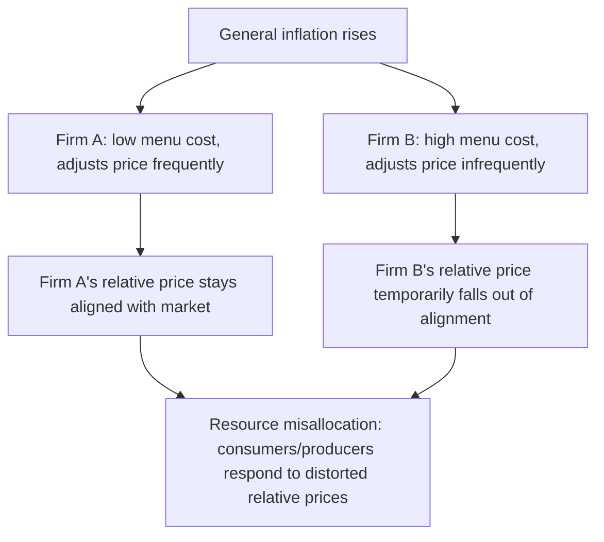

## Costs of Inflation: Shoe Leather and Menu Costs

### Overview

Even moderate, fully anticipated inflation imposes real resource costs on an economy, distinct from the redistributive effects of *unanticipated* inflation. Two of the most widely cited categories in this framework are **shoe leather costs** and **menu costs**. Both fall under the broader umbrella of "costs of inflation" that economists cite as reasons central banks pursue low and stable inflation rather than treating inflation as costless as long as it is predictable.

### Shoe Leather Costs

**Definition**

Shoe leather costs refer to the time, effort, and resources people expend to minimize their holdings of cash during periods of inflation, since holding cash becomes more costly as its purchasing power erodes. The term derives metaphorically from the wear on shoe leather caused by more frequent trips to the bank to withdraw smaller amounts of cash rather than holding larger cash balances.

**Mechanism**

- Inflation raises the opportunity cost of holding money, because money held in a wallet or non-interest-bearing account loses real value over time while interest-bearing assets do not.
- The nominal interest rate approximates the opportunity cost of holding cash, per the Fisher relationship:

$$i \approx r + \pi^e$$

where $i$ is the nominal interest rate, $r$ is the real interest rate, and $\pi^e$ is expected inflation.

- As expected inflation $\pi^e$ rises, $i$ rises, making it more costly to hold idle cash balances. Rational agents respond by reducing average cash holdings and instead making more frequent transfers between interest-bearing accounts and cash.

**Key Points**

- Shoe leather costs are a **real resource cost**: the time and effort spent on more frequent bank trips, ATM visits, or account transfers could otherwise be used productively (leisure, work, or other output-generating activity).
- They rise with the *level* and *unpredictability* of inflation, but are generally considered small in economies with low-to-moderate inflation and become significant primarily during high inflation or hyperinflation.
- Historically, the metaphor is often extended in modern contexts to include the time cost of managing money electronically — more frequent transfers between checking and money market accounts, or increased attention to portfolio rebalancing. [Inference: the specific magnitude of modern "shoe leather costs" via digital banking versus historical physical bank visits is not something formally measured in a single standardized way, and estimates vary by study.]

**Example**

Consider a worker paid monthly who, under stable low inflation, keeps most of their paycheck in a checking account and withdraws cash as needed. Under high inflation:

- The worker instead keeps only a small cash buffer and makes frequent transfers from an interest-bearing account to checking, or makes more frequent ATM withdrawals to hold cash for the shortest possible time before spending it.
- Each additional trip or transfer consumes time that has an opportunity cost — time not spent working, resting, or engaged in production — even though no line item in GDP directly captures this loss.

**Formal Economic Framing**

Shoe leather costs are typically modeled using **inventory-theoretic models of money demand** (e.g., the Baumol-Tobin model), where an individual optimally chooses how often to convert interest-bearing assets into cash by trading off:

1. The opportunity cost of holding cash (foregone interest, increasing with $i$)
2. The transaction cost of making a trip/transfer (a fixed cost per trip)

The optimal number of trips to the bank, $n^*$, rises with the interest rate $i$ (and thus with expected inflation $\pi^e$), which is the formal representation of "more shoe leather worn out."

$$n^* = \sqrt{\frac{iY}{2b}}$$

where $Y$ is total cash needs over the period and $b$ is the fixed cost per trip. As $i$ increases (driven by higher $\pi^e$), $n^*$ increases — more frequent trips, more shoe leather cost.

### Menu Costs

**Definition**

Menu costs are the real resource costs firms incur when changing the prices they charge, named for the literal cost of reprinting a restaurant menu, but generalized to any cost of updating posted or listed prices.

**Types of Menu Costs**

- **Physical costs**: Reprinting menus, catalogs, price tags, and signage.
- **Managerial/decision costs**: Time and effort spent deciding new prices, including analysis, negotiation, and internal approval processes.
- **Communication costs**: Informing customers, sales staff, and distributors of new prices.
- **Technological/systems costs**: Updating point-of-sale systems, e-commerce platforms, vending machines, and printed materials.
- **Customer relationship costs**: Potential loss of goodwill or perceived unfairness from customers reacting negatively to frequent price changes, which may cause firms to delay price adjustments even when their true costs have changed.

**Key Points**

- Menu costs cause firms to adjust prices *less frequently* than they otherwise would under continuous, frictionless price-setting.
- Because prices are "sticky" as a result of menu costs, when inflation rises, the *relative prices* of goods whose prices haven't recently been updated drift out of alignment with goods whose prices have been updated — this creates a **relative price distortion** cost, separate from the direct cost of physically changing price tags.
- Menu costs are central to **New Keynesian economics**, where sticky prices (arising partly from menu costs) explain why monetary policy can have real short-run effects on output and employment, in contrast to classical models with fully flexible prices.

**Example**

A restaurant that would ideally raise prices by 1% every month to keep pace with steady inflation might instead:

- Wait and raise prices by 12% once a year, to avoid the repeated cost of reprinting menus and the customer backlash from seeing frequent price changes.
- In the interim, the restaurant's *real* prices (nominal price adjusted for the price level) effectively fall throughout the year as general inflation erodes the fixed nominal price, until the next repricing event.

**Relative Price Distortion (Extended Cost)**

**Modern Considerations**

- With the growth of e-commerce and dynamic pricing algorithms, the physical cost component of menu costs (reprinting paper tags) has fallen substantially for many firms, since digital prices can be updated near-instantly and at low marginal cost.
- However, the **managerial, contractual, and customer-relationship components** of menu costs often persist regardless of the medium — firms still incur decision-making costs and risk of customer dissatisfaction from frequent visible price changes. [Inference: the degree to which digitalization has reduced *aggregate* menu costs economy-wide, versus merely shifting their composition, is debated in the literature and likely varies significantly by industry.]
- Some contracts (leases, wages, long-term supply agreements) are effectively "menu cost"-like in that renegotiation is costly, contributing to nominal wage and price stickiness over longer horizons.

### Comparative Summary

| Feature | Shoe Leather Costs | Menu Costs |
| --- | --- | --- |
| Who bears the cost | Individuals / money holders | Firms / price setters |
| Nature of cost | Time and effort managing cash holdings | Resources spent changing posted prices |
| Underlying driver | Opportunity cost of holding cash rises with $i$ | Physical/managerial/communication cost of repricing |
| Economic consequence | Reduced average cash balances, more frequent transactions | Sticky prices, relative price distortions |
| Relevant model | Baumol-Tobin inventory model of money demand | New Keynesian sticky-price models |
| Magnitude in low inflation | Generally considered small | Generally considered small |
| Magnitude in high/hyperinflation | Can become very large | Can become very large (extremely frequent repricing) |

### Broader Context: Why These Costs Matter for Policy

- Both costs illustrate that inflation is **not free even when perfectly anticipated** — a key rebuttal to the idea that only *unanticipated* inflation matters. This distinguishes these costs from redistribution effects (e.g., between debtors and creditors), which arise mainly from *unexpected* inflation.
- These costs help justify central bank preferences for **low, stable, and predictable inflation** rather than zero inflation or highly volatile inflation, since price stability reduces the frequency of costly adjustment while some economists argue a small positive inflation rate provides a buffer against deflation and can help nominal wages adjust downward de facto (via inflation eroding real wages) when direct nominal wage cuts are resisted by workers. [Inference: the specific "optimal" inflation rate balancing these considerations remains a subject of ongoing debate among macroeconomists and central banks.]
- Both cost categories tend to scale nonlinearly with the inflation rate — they are minor at low inflation but grow disproportionately large as inflation accelerates toward high or hyperinflationary levels, reinforcing why hyperinflation is considered so economically damaging.

**Next Steps**

- Baumol-Tobin model of money demand (formal derivation)
- New Keynesian sticky-price models and short-run non-neutrality of money
- Costs of unanticipated inflation: wealth redistribution between debtors and creditors
- Menu costs and price stickiness in e-commerce/dynamic pricing contexts
- Optimal inflation rate debate among central banks
- Fisher equation: nominal vs. real interest rates
- Inflation and its effect on long-term contracts and wage-setting
- Relative price variability and resource misallocation under inflation