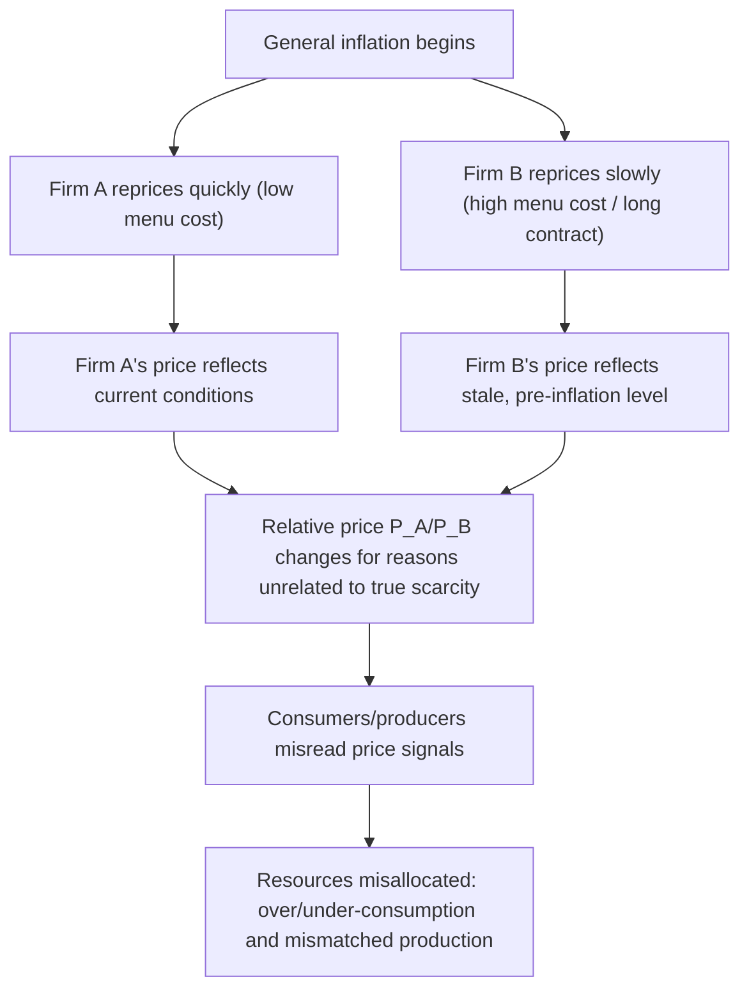
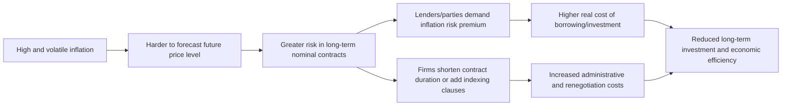

## Costs of Inflation: Relative Price Distortions and Uncertainty

### Overview

Beyond the direct resource costs of shoe leather and menu costs, inflation imposes economic costs by distorting the **relative price signals** that markets rely on for efficient resource allocation, and by injecting **uncertainty** into economic decision-making. These costs are considered particularly damaging because they undermine the core informational function of the price system itself, rather than simply imposing a direct transaction cost.

### Relative Price Distortions

**Definition**

Relative price distortion refers to inflation's tendency to cause the prices of different goods, services, and factors of production to change at different times and by different amounts, temporarily severing the link between *relative prices* and the true underlying *relative scarcity* or value of goods.

**Conceptual Foundation**

In a well-functioning market economy, relative prices — the price of one good expressed in terms of another — serve as signals that guide production and consumption decisions. A rise in the relative price of a good typically signals increased scarcity or demand, prompting producers to supply more and consumers to economize on its use.

$$\text{Relative Price of Good A} = \frac{P_A}{P_B}$$

Inflation disrupts this signal when the *general* price level rises unevenly across goods due to differing menu costs, contract lengths, and market structures, meaning not all prices adjust simultaneously or by proportional amounts.

**Mechanism**

- Firms and sectors differ in how frequently they can or choose to adjust prices, due to varying **menu costs**, contract structures, or market competitiveness.
- During inflation, firms that repriced recently reflect current market conditions, while firms that haven't repriced yet still reflect older, lower price levels.
- This creates **artificial dispersion in relative prices** that has nothing to do with genuine changes in scarcity, consumer preference, or production cost — it purely reflects the *timing* of when each firm last adjusted its price.
- Consumers and producers, unable to distinguish a "real" relative price signal from an "inflation-timing" artifact, may misallocate resources — for example, shifting purchases toward a good whose price has not yet risen (mistakenly interpreting it as newly cheaper in real terms), even though its underlying scarcity is unchanged.

**Example**

Consider two goods: restaurant meals (frequently repriced, low menu cost, digital ordering systems) and long-term apartment leases (repriced only annually due to contractual terms).

- Suppose annual inflation is running at 8%. Restaurant prices adjust upward almost continuously to track this.
- Apartment rents, fixed by a 12-month lease, remain unchanged for the duration of the lease term.
- Partway through the year, restaurant meals appear relatively more expensive compared to housing than they would in a zero-inflation environment — not because dining out has become intrinsically scarcer or more valued relative to housing, but purely because of the differing speed of price adjustment.
- A renter deciding between eating out more or renegotiating housing might make a decision based on this distorted relative price rather than true underlying preferences or scarcity, leading to a less efficient allocation of their spending than would occur under price stability.

**Consequences of Relative Price Distortion**

- **Misallocation of resources across sectors**: Capital and labor may flow toward sectors whose prices have artificially risen faster, rather than toward sectors of genuine higher marginal value.
- **Reduced informational efficiency of the price system**: Prices become "noisier" signals, requiring more effort by economic agents to filter out inflation-driven changes from genuine relative-value changes.
- **Tax and accounting distortions**: In some tax systems, nominal capital gains, depreciation allowances, and interest income/expenses are not adjusted for inflation, distorting effective relative after-tax returns across different types of investment. [Inference: the magnitude of this distortion is highly dependent on the specific tax code of a given country and whether inflation-indexing provisions exist.]

**Empirical Association**

Studies analyzing cross-country and cross-time data have generally found that **higher and more variable inflation is associated with greater relative price variability** — this relationship is one of the more consistently documented empirical regularities in the inflation literature, though the precise causal mechanisms and magnitudes vary across studies and time periods. [Unverified: specific elasticity estimates linking inflation levels to relative price variability differ substantially by study, dataset, and country.]

### Uncertainty Costs of Inflation

**Definition**

Inflation uncertainty refers to the increased unpredictability of the future price level and future inflation rate that tends to accompany higher and more volatile inflation, which raises the risk borne by anyone making decisions that depend on future prices, such as long-term contracts, investment, and savings.

**Mechanism**

- Low, stable inflation is relatively easy to forecast, allowing firms and households to form confident expectations $\pi^e$ and plan accordingly.
- Higher inflation tends to be accompanied by **greater inflation volatility** — a stylized empirical fact sometimes referred to as the **Friedman hypothesis** (named for Milton Friedman's argument that high inflation increases the variability and unpredictability of inflation itself). [Unverified: while widely cited, the strength and universality of this relationship is a subject of ongoing empirical debate across different economic contexts.]
- Greater unpredictability of future prices raises the **risk premium** that lenders, investors, and contracting parties demand to compensate for the added uncertainty, since the *real* value of any nominal payment (a bond coupon, a wage agreement, a long-term supply contract) becomes harder to forecast.

**Key Points**

- Inflation uncertainty discourages **long-term contracting and long-term investment**, since firms cannot confidently forecast real costs, real revenues, or real returns far into the future.
- It can raise the **real cost of borrowing**, since lenders may demand a higher inflation risk premium on top of the expected inflation rate to compensate for the possibility that realized inflation differs from expectations:

$$i = r + \pi^e + \rho$$

where $\rho$ represents a risk premium for inflation uncertainty, in addition to the standard Fisher equation components.

- Firms facing inflation uncertainty may shorten the duration of contracts (e.g., moving from annual to quarterly wage or price reviews), which itself imposes higher menu costs and administrative burden, compounding the direct resource costs discussed elsewhere.
- Inflation uncertainty can distort the *composition* of investment, pushing savers and firms toward assets perceived as inflation hedges (real estate, commodities, inflation-indexed securities) and away from long-duration fixed-nominal-return assets, potentially reducing the efficiency of capital allocation relative to a stable-price environment.

**Example**

Consider a firm deciding whether to sign a five-year fixed-price supply contract with a manufacturer:

- Under low and stable inflation (e.g., a credible 2% target), both parties can reasonably forecast real costs and real revenue over the contract's life, making a fixed nominal price contract low-risk for both sides.
- Under high and volatile inflation, neither party can confidently predict whether the fixed nominal price will be far too high or far too low in real terms by the contract's later years. This uncertainty may lead one or both parties to refuse a long-term fixed contract altogether, instead opting for shorter contracts, price-indexed clauses, or renegotiation triggers — all of which raise transaction costs and reduce planning stability compared to a world with low, predictable inflation.

### Comparative Summary

| Feature | Relative Price Distortion | Inflation Uncertainty |
| --- | --- | --- |
| Core mechanism | Uneven timing of price adjustment across firms/sectors | Unpredictability of future inflation rate |
| Primary cost | Misallocation of resources based on distorted signals | Risk premiums, reduced long-term contracting/investment |
| Root cause | Menu costs, contract length, market structure heterogeneity | Volatility and unpredictability of the inflation process itself |
| Who is most affected | Producers and consumers making allocation decisions | Lenders, borrowers, long-term contracting parties |
| Related theoretical link | New Keynesian sticky-price models | Friedman hypothesis; Fisher equation with risk premium |

### Why These Costs Are Considered Especially Significant

- Unlike shoe leather and menu costs, which are relatively straightforward and bounded resource costs, relative price distortion and uncertainty costs strike at the **efficiency of the price mechanism itself** — the core coordinating device of a market economy.
- These costs help explain why many economists and central banks emphasize not just low average inflation, but also **low inflation *volatility*** and strong **central bank credibility**, since a credible, transparent inflation target can anchor expectations and reduce uncertainty even if the inflation rate itself is nonzero.
- These costs are generally considered harder to quantify precisely than shoe leather or menu costs, since they involve indirect effects on resource allocation efficiency and investment behavior rather than directly observable transaction costs. [Inference: the overall welfare cost of relative price distortion and uncertainty, in aggregate, is difficult to measure with precision and estimates vary considerably across studies and modeling approaches.]

**Next Steps**

- Friedman hypothesis: inflation level and inflation variability
- Central bank credibility and inflation expectations anchoring
- Inflation-indexed contracts and securities (e.g., TIPS)
- New Keynesian Phillips Curve and price adjustment heterogeneity
- Tax system distortions under non-indexed nominal income/capital gains
- Menu costs and contract duration as complementary concepts
- Empirical studies on inflation and relative price variability
- Real vs. nominal interest rates and the inflation risk premium