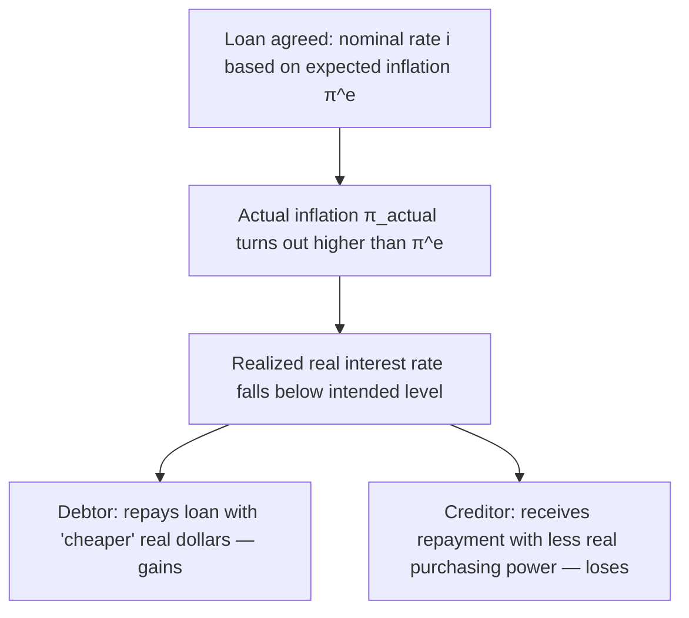

## Costs of Unanticipated Inflation on Debtors and Creditors

### Overview

Unanticipated inflation — inflation that turns out to be higher or lower than what borrowers and lenders expected when they entered a financial contract — produces a **redistribution of real wealth** between debtors and creditors. Unlike shoe leather costs, menu costs, or relative price distortion, this cost is not primarily about resources wasted through adjustment activity; it is about an unintended and arbitrary transfer of purchasing power that occurs because most debt contracts are written in **nominal** terms.

### Conceptual Foundation

**Nominal vs. Real Interest Rates**

The relationship between nominal interest rates, real interest rates, and inflation is captured by the Fisher equation:

$$i = r + \pi^e$$

where $i$ is the nominal interest rate agreed upon at the time of lending, $r$ is the real interest rate the lender intends to earn, and $\pi^e$ is the *expected* rate of inflation over the life of the loan.

The **realized real interest rate**, after the loan term concludes, is approximately:

$$r_{realized} \approx i - \pi_{actual}$$

where $\pi_{actual}$ is the inflation rate that actually occurred. When $\pi_{actual} \neq \pi^e$, the realized real return differs from what both parties expected, and one party gains at the other's expense.

**Key Points**

- If actual inflation *exceeds* expected inflation ($\pi_{actual} > \pi^e$), the realized real interest rate is *lower* than intended, benefiting debtors and harming creditors.
- If actual inflation *falls short of* expected inflation ($\pi_{actual} < \pi^e$), the realized real interest rate is *higher* than intended, benefiting creditors and harming debtors.
- This redistribution occurs **regardless of the level of inflation** — it is driven specifically by the *forecast error*, not by inflation itself. Perfectly anticipated inflation, fully built into the nominal interest rate at the time of contracting, causes no such redistribution.

### Case 1: Inflation Higher Than Expected (Benefits Debtors, Harms Creditors)

**Mechanism**

- A borrower and lender agree to a fixed nominal interest rate based on an inflation expectation $\pi^e$.
- If actual inflation $\pi_{actual}$ turns out higher than $\pi^e$, the dollars the debtor repays in the future are worth *less* in real purchasing power than both parties anticipated.
- The debtor effectively repays the loan "cheaper" in real terms, while the creditor receives repayment with less real purchasing power than expected.

**Example**

Suppose a bank lends $100,000 for one year at a nominal interest rate of 5%, based on an expected inflation rate of 2% (implying an expected real return of approximately 3%).

- The borrower agrees to repay $105,000 after one year.
- If actual inflation over the year turns out to be 6% instead of 2%:

$$r_{realized} \approx 5\% - 6\% = -1\%$$

- The lender's realized real return is approximately -1%, meaning the $105,000 repaid actually buys *less* in real goods and services than the original $100,000 loaned out. The lender has suffered a real loss, while the borrower has effectively benefited by repaying a debt whose real burden shrank due to unexpectedly high inflation.

### Case 2: Inflation Lower Than Expected (Benefits Creditors, Harms Debtors)

**Mechanism**

- If actual inflation turns out to be *lower* than what was built into the nominal interest rate, the dollars repaid by the debtor are worth *more* in real terms than either party anticipated.
- The creditor receives a higher real return than expected, while the debtor bears a real repayment burden larger than anticipated.

**Example**

Using the same $100,000 loan at 5% nominal interest, based on 2% expected inflation:

- If actual inflation turns out to be only 0.5% instead of 2%:

$$r_{realized} \approx 5\% - 0.5\% = 4.5\%$$

- The lender's realized real return of 4.5% exceeds the originally expected 3%, meaning the borrower is effectively repaying more in real terms than anticipated when the loan was made. The debtor bears a heavier real burden than expected, while the creditor benefits.

### Direction of Redistribution Summary

| Scenario | Realized Real Rate vs. Expected | Debtor | Creditor |
| --- | --- | --- | --- |
| $\pi_{actual} > \pi^e$ (inflation surprise) | Lower than expected | Gains (repays "cheaper" dollars) | Loses (receives less real value) |
| $\pi_{actual} < \pi^e$ (disinflation surprise) | Higher than expected | Loses (repays "costlier" dollars) | Gains (receives more real value) |
| $\pi_{actual} = \pi^e$ (fully anticipated) | Equal to expected | No redistribution | No redistribution |

### Who Is Typically Affected

**Debtors (Borrowers)**

- Individuals with mortgages, auto loans, student loans, or credit card balances at fixed nominal interest rates.
- Firms that have issued fixed-rate corporate bonds or taken out fixed-rate business loans.
- Governments that have issued fixed-rate nominal government bonds — a historically significant channel, since unexpected inflation can effectively reduce the real value of government debt, sometimes referred to as an implicit "inflation tax" on bondholders. [Inference: the extent to which governments have historically used unanticipated inflation deliberately as a debt-reduction tool, versus experiencing it as an unintended consequence of other policy choices, is debated among economic historians.]

**Creditors (Lenders)**

- Banks and financial institutions holding fixed-rate loans as assets.
- Bondholders holding long-term fixed-coupon bonds.
- Pension funds and insurance companies with long-duration fixed-income liabilities and assets, which can be especially exposed to unanticipated inflation given the long time horizons involved.
- Individual savers holding fixed-rate savings instruments, such as fixed-term deposits or fixed-rate annuities.

### Why This Cost Differs from Other Inflation Costs

| Feature | Redistribution Cost (Debtors/Creditors) | Shoe Leather / Menu Costs |
| --- | --- | --- |
| Occurs even with perfectly anticipated inflation? | No — requires a forecast *error* | Yes — occurs even under fully anticipated inflation |
| Nature of the cost | Wealth transfer between parties (zero-sum between them) | Real resource cost (deadweight loss to society) |
| Depends on | Difference between actual and expected inflation | Level of inflation itself |
| Net effect on society's total resources | No direct resource destruction — a transfer | Genuine loss of real resources (time, materials, effort) |

This distinction is important: the debtor-creditor redistribution effect is a **zero-sum transfer** between two private parties (what one loses, the other gains), whereas shoe leather and menu costs represent a **genuine reduction in society's total resources** (a deadweight loss), since the time and materials consumed are not transferred to anyone — they are simply used up in the adjustment process.

### Mitigating Mechanisms

- **Inflation-indexed securities**: Instruments such as Treasury Inflation-Protected Securities (TIPS) in the United States adjust their principal value based on realized inflation, insulating both parties from unanticipated inflation risk by design.
- **Variable/floating-rate loans**: Loans with interest rates that reset periodically based on a reference rate (which itself adjusts to reflect changing inflation expectations) reduce, though do not eliminate, the redistribution effect compared to long-term fixed-rate contracts.
- **Shorter contract duration**: Shorter-term loans and bonds are less exposed to the risk of a large cumulative forecast error, since inflation expectations are updated and re-embedded into pricing more frequently.
- **Inflation risk premiums**: As discussed in relation to inflation uncertainty, lenders may demand a risk premium on top of expected inflation to compensate for the possibility of an unanticipated inflation surprise, which shifts some of the *ex ante* risk compensation into the nominal rate itself, though it does not eliminate the *ex post* redistribution if the surprise still occurs.

### Broader Macroeconomic Implications

- Unanticipated inflation redistribution effects can influence the political economy of inflation, since debtor groups (which may include governments with large debt burdens) can face an incentive to prefer higher-than-expected inflation, while creditor groups (such as retirees relying on fixed-income assets) generally prefer lower and more predictable inflation. [Inference: the practical significance of this incentive in shaping actual policy outcomes is debated and varies by institutional context, particularly the degree of central bank independence.]
- This dynamic is one of the theoretical justifications for **central bank independence** from short-term political pressures, since elected governments (often net debtors) could otherwise have an incentive to tolerate higher inflation to erode the real value of public debt at the expense of creditors.
- The redistribution effect reinforces the broader case for **credible, transparent inflation targeting**, since well-anchored expectations reduce the frequency and magnitude of forecast errors, thereby reducing arbitrary wealth transfers between debtors and creditors.

**Next Steps**

- Fisher equation and the relationship between nominal and real interest rates
- Inflation-indexed securities (TIPS) and their design
- Central bank independence and the time-inconsistency problem in monetary policy
- Inflation as an implicit tax on government debt holders
- Fixed-rate vs. floating-rate debt instruments
- Pension funds, insurance liabilities, and long-duration inflation risk
- Political economy of inflation: debtor vs. creditor interests
- Expected vs. unexpected inflation and rational expectations theory