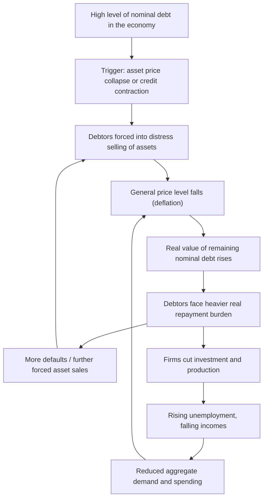
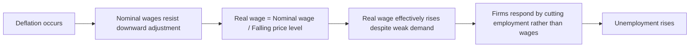

## Deflation Risks and Debt-Deflation Dynamics

### Overview

While inflation imposes costs through resource waste, distorted signals, and arbitrary redistribution, **deflation** — a sustained fall in the general price level — carries a distinct set of risks that can be equally or more damaging to macroeconomic stability. Central to this discussion is **Irving Fisher's debt-deflation theory**, developed in the aftermath of the Great Depression, which explains how falling prices can interact destructively with high levels of nominal debt to produce a self-reinforcing economic contraction.

### Why Deflation Is Risky

**Key Points**

- Deflation raises the **real value of debt**, since debt contracts are typically fixed in nominal terms while the price level (and often nominal incomes) fall.
- Deflation can trigger a **postponement of consumption and investment**, as households and firms rationally delay purchases in anticipation of even lower future prices.
- Deflation constrains **conventional monetary policy** by pushing real interest rates upward even when nominal rates approach the zero lower bound.
- Deflation increases the real burden of **fixed nominal wages** downward-adjustment resistance, contributing to unemployment if wages do not fall as quickly as prices.

### The Real Value of Debt Under Deflation

**Mechanism**

Most debt contracts — mortgages, corporate bonds, business loans — specify a fixed nominal repayment amount. The *real* burden of that debt depends on the price level at the time of repayment relative to when the debt was incurred.

$$\text{Real Debt Burden} = \frac{\text{Nominal Debt}}{P}$$

When the price level $P$ falls (deflation), the real debt burden **rises**, even though the nominal amount owed is unchanged.

**Example**

Suppose a firm borrows $1,000,000 to finance operations, at a time when the price index $P_0 = 100$.

- In real terms, this debt is equivalent to $\frac{1,000,000}{100} = 10,000$ "real units" of purchasing power.
- If the price level subsequently falls by 10% to $P_1 = 90$ due to deflation, the same nominal debt of $1,000,000 now represents:

$$\frac{1,000,000}{90} \approx 11{,}111 \text{ real units}$$

- The firm's real debt burden has risen by roughly 11%, even though it borrowed the same nominal amount and made no additional purchases. This occurs purely because deflation increased the purchasing-power equivalent of the fixed nominal repayment obligation.

### Fisher's Debt-Deflation Theory

**Definition**

Debt-deflation theory, formulated by economist Irving Fisher in 1933 following the Great Depression, describes a mechanism by which an initial episode of deflation, occurring alongside high levels of nominal debt, can trigger a self-reinforcing downward spiral of falling prices, debt distress, reduced spending, and further economic contraction.

**The Debt-Deflation Spiral**

According to Fisher's framework, the process typically unfolds as follows:

1. **Over-indebtedness**: The economy enters a period with historically high levels of nominal debt (often built up during a preceding credit boom or asset bubble).
2. **Trigger event**: A shock (such as an asset price collapse, bank failures, or a sharp reduction in credit availability) causes debtors to begin liquidating assets to repay debt or to avoid default.
3. **Distress selling**: Widespread simultaneous asset liquidation drives down asset prices and, eventually, the general price level.
4. **Falling price level**: As the general price level falls, the real value of remaining nominal debt *increases*, even as debtors' nominal incomes and asset values are falling.
5. **Rising real debt burden**: Debtors find their real debt burden growing heavier, despite (or because of) their efforts to reduce debt through asset sales.
6. **Further distress and defaults**: The rising real burden pushes more debtors toward default or further forced asset sales, deepening the initial price decline.
7. **Falling profits and output**: Firms facing debt distress cut investment and production; unemployment rises as firms retrench.
8. **Falling confidence and hoarding of cash**: Pessimism about the future spreads, and economic agents (both firms and households) increase precautionary cash holdings rather than spending or investing, which is itself deflationary as it reduces monetary velocity and aggregate demand further.
9. **Continued price declines**: The reduction in aggregate demand reinforces the original deflationary pressure, restarting the cycle at a lower price level.

**Key Insight: The Paradox of Debt Repayment**

A central and counterintuitive insight of Fisher's theory is that **the collective effort by debtors to reduce their debt burden can perversely increase the aggregate real debt burden** across the economy as a whole. As individual debtors sell assets to pay down debt, their combined selling pressure drives down the general price level, which increases the real value of the debt that remains outstanding economy-wide — undermining the very deleveraging effort that caused the price decline.

$$\text{Individual rational action (reduce debt)} \Rightarrow \text{Aggregate price decline} \Rightarrow \text{Higher real debt burden system-wide}$$

This dynamic is sometimes cited as a macroeconomic example of a **fallacy of composition** — an action that is rational for an individual debtor (selling assets to reduce debt) produces a collectively harmful outcome when undertaken simultaneously by many debtors across the economy. [Inference: while the theoretical mechanism is well established in macroeconomic literature, the empirical magnitude of this effect in any specific historical episode is subject to debate and depends on many concurrent factors.]

### Additional Deflation Risks

**Consumption and Investment Postponement**

- If consumers expect prices to be lower in the future, they have an incentive to delay purchases, particularly of durable goods, reducing current aggregate demand.
- Firms facing expectations of falling future prices for their output may similarly delay investment in new capacity, since the expected nominal (and possibly real) return on investment appears less attractive.
- This behavioral response can reinforce the demand-side weakness that may have initially caused the deflationary pressure, contributing to a self-fulfilling dynamic. [Inference: the strength of this postponement effect in practice is debated, as some empirical studies of historical deflationary episodes find more limited effects on consumer durable purchases than the simple theoretical prediction suggests.]

**The Zero Lower Bound (ZLB) Constraint**

- Central banks typically stimulate a weak economy by lowering nominal interest rates. However, nominal interest rates face a practical floor at or near zero, since holding physical cash (which yields a nominal return of 0%) becomes preferable to holding an asset with a negative nominal yield beyond a certain point.
- Under deflation, even a nominal interest rate of zero implies a **positive real interest rate**, since:

$$r = i - \pi_{actual}$$

If $i = 0$ and $\pi_{actual} < 0$ (deflation), then $r > 0$.

- A positive real interest rate during a demand-deficient recession can be counterproductive, as it discourages borrowing and investment precisely when stimulus is most needed, while conventional monetary policy has limited room to push nominal rates lower to compensate.
- Central banks facing this constraint have historically turned to **unconventional monetary policy tools**, such as quantitative easing (large-scale asset purchases) or negative interest rate policy in some cases, to attempt to provide further stimulus. [Inference: the effectiveness of these unconventional tools in fully substituting for conventional interest rate cuts remains an active area of research and debate.]

**Nominal Wage Rigidity**

- Empirical evidence and behavioral economic research suggest that workers and firms often resist explicit **nominal wage cuts**, even when real economic conditions would otherwise call for a reduction in real wages (a phenomenon sometimes called "downward nominal wage rigidity").
- Under moderate inflation, real wages can adjust downward gradually even without any nominal wage cut, simply because inflation erodes the real value of an unchanged nominal wage over time.
- Under deflation, this adjustment channel is unavailable — a fixed nominal wage combined with falling prices means the *real* wage is actually **rising**, not falling, even in a weak labor market. This can worsen unemployment, since firms facing weak demand and rising real labor costs may respond by laying off workers rather than cutting wages, given the resistance to nominal wage reductions.

### Historical Illustration: The Great Depression

- Fisher's debt-deflation theory was explicitly developed to explain the severity of the **Great Depression (1929–1939)** in the United States, during which the price level fell substantially over several years following the 1929 stock market crash, alongside widespread bank failures and business defaults.
- The interaction between high pre-crash debt levels (accumulated during the 1920s credit expansion) and the subsequent sharp deflation is widely cited by economic historians as a significant contributing factor to the depth and duration of the downturn, alongside other contributing factors such as banking panics and contractionary monetary policy responses at the time. [Unverified: the precise relative weighting of debt-deflation dynamics versus other contributing causes of the Great Depression's severity remains a subject of ongoing historical and economic debate.]
- Japan's prolonged period of low growth and mild deflation from the 1990s onward (sometimes referred to as Japan's "Lost Decade[s]") is also frequently cited in discussions of debt-deflation dynamics and the challenges of escaping a low-growth, low-inflation equilibrium, though the specific mechanisms and relative importance of debt overhang versus other structural factors in the Japanese case are also debated among economists. [Unverified: characterizations of the causes and severity of Japan's economic stagnation vary across different economic analyses.]

### Comparative Summary: Deflation Risk Channels

| Risk Channel | Mechanism | Consequence |
| --- | --- | --- |
| Debt-deflation spiral | Falling prices raise real value of fixed nominal debt | Rising defaults, distress selling, further price declines |
| Consumption/investment postponement | Expectation of future lower prices | Reduced current aggregate demand |
| Zero lower bound constraint | Nominal rates cannot fall enough to offset deflation | Real interest rates rise, limiting monetary stimulus |
| Nominal wage rigidity | Wages resist downward adjustment | Real wages rise unintentionally, worsening unemployment |

### Policy Implications

- The risks associated with debt-deflation dynamics are among the key reasons many central banks target a **positive (rather than zero) inflation rate**, providing a buffer against the risk of falling into outright deflation during adverse economic shocks.
- Policymakers facing signs of emerging debt-deflation dynamics may respond with aggressive monetary easing, fiscal stimulus, or targeted interventions in credit and banking markets to halt distress selling and stabilize asset prices, aiming to break the self-reinforcing cycle described by Fisher. [Inference: the specific optimal policy mix in any given debt-deflation episode depends heavily on the particular institutional and economic context, and remains a matter of active policy debate.]

**Next Steps**

- Irving Fisher's original 1933 debt-deflation theory in detail
- The Great Depression: monetary policy failures and banking panics
- Japan's "Lost Decade(s)" and prolonged low inflation/deflation
- Zero lower bound and unconventional monetary policy (quantitative easing)
- Downward nominal wage rigidity: theory and evidence
- Balance sheet recessions (Richard Koo's framework)
- Central bank inflation targeting as a buffer against deflation risk
- Asset price bubbles and their role in triggering debt-deflation episodes