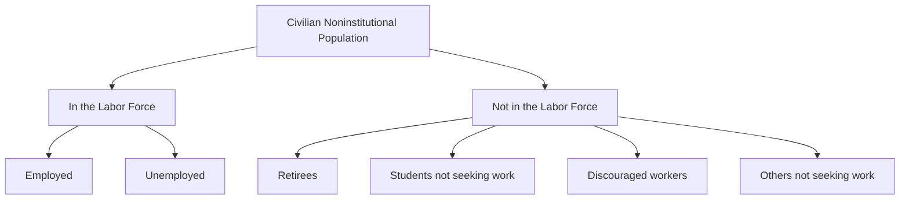

## Defining the Labor Force and Unemployment Rate

### Overview

Measuring unemployment requires precise definitions of who counts as part of the **labor force**, who is **employed**, and who is **unemployed**. These classifications, standardized primarily through frameworks like the U.S. Bureau of Labor Statistics (BLS) Current Population Survey (CPS) methodology, form the foundation for calculating the headline unemployment rate and related labor market indicators.

### The Working-Age Population

**Definition**

The starting point for labor force statistics is the **civilian noninstitutional population**, which includes all individuals of a specified working age (typically 16 years and older in the United States) who are not in the military, and not confined to institutions such as prisons, nursing homes, or long-term psychiatric facilities.

**Key Points**

- This population is divided into two mutually exclusive groups: those who are **in the labor force** and those who are **not in the labor force**.
- The age threshold and institutional exclusions vary somewhat by country, but the general structure of the classification framework is broadly similar internationally, often guided by International Labour Organization (ILO) standards. [Unverified: exact age thresholds and specific institutional exclusions differ by country's statistical agency.]

### The Labor Force

**Definition**

The labor force consists of all individuals in the civilian noninstitutional population who are classified as either **employed** or **unemployed**. Individuals who are neither employed nor actively seeking work are excluded from the labor force entirely, regardless of their age or capability to work.

$$\text{Labor Force} = \text{Employed} + \text{Unemployed}$$

**Employed**

An individual is classified as employed if, during the reference survey period (typically a specific reference week), they:

- Did any work at all for pay or profit, including part-time, temporary, or informal work, **or**
- Worked at least 15 hours in a family business or farm without direct pay, **or**
- Had a job but were temporarily absent from it due to illness, vacation, labor disputes, or similar reasons.

**Unemployed**

An individual is classified as unemployed if they meet **all three** of the following criteria during the reference period:

1. They did not have a job during the reference week.
2. They were available to work (i.e., capable of accepting a job if offered one).
3. They had actively searched for work at some point in the prior four weeks (e.g., submitting applications, contacting employers, attending interviews).

**Key Points**

- The active job search requirement is critical: an individual who wants a job but has **not** actively searched in the past four weeks is **not** counted as unemployed under standard definitions — they are instead classified as not in the labor force.
- Being on temporary layoff with an expectation of recall generally qualifies an individual as unemployed even without an active job search in the reference period, since they are considered to have maintained a job attachment.

### Not in the Labor Force

**Definition**

Individuals in the civilian noninstitutional population who are neither employed nor actively seeking work are classified as **not in the labor force**.

**Common Categories**

- Retirees
- Full-time students not seeking work
- Individuals engaged in full-time home or family care
- Individuals with a disability that prevents work-seeking
- **Discouraged workers**: individuals who want a job and are available to work, but have stopped actively searching because they believe no jobs are available for them, often due to prior unsuccessful search efforts or a perceived lack of suitable openings.

**Key Points**

- Discouraged workers are a particularly important subcategory, since they represent a form of hidden labor market slack that the headline unemployment rate does not capture, despite these individuals wanting employment.
- Broader measures of labor underutilization (such as the U-4, U-5, and U-6 measures used by the BLS) are designed specifically to capture discouraged workers and other marginally attached individuals who fall outside the standard labor force definition.

### The Unemployment Rate

**Definition**

The unemployment rate is the percentage of the labor force that is currently unemployed.

**Formula**

$$\text{Unemployment Rate} = \frac{\text{Number of Unemployed}}{\text{Labor Force}} \times 100\% = \frac{U}{E + U} \times 100\%$$

where $U$ is the number of unemployed individuals and $E$ is the number of employed individuals.

**Example**

Suppose an economy has the following civilian noninstitutional population breakdown:

| Category | Number of People |
| --- | --- |
| Employed | 155,000,000 |
| Unemployed | 8,000,000 |
| Not in labor force | 100,000,000 |

Labor force:

$$\text{Labor Force} = 155{,}000{,}000 + 8{,}000{,}000 = 163{,}000{,}000$$

Unemployment rate:

$$\text{Unemployment Rate} = \frac{8{,}000{,}000}{163{,}000{,}000} \times 100\% \approx 4.9\%$$

### Related Labor Market Ratios

**Labor Force Participation Rate**

**Definition**: The percentage of the civilian noninstitutional population that is in the labor force (either employed or unemployed).

$$\text{Labor Force Participation Rate} = \frac{\text{Labor Force}}{\text{Civilian Noninstitutional Population}} \times 100\%$$

**Example**: Using the data above, the civilian noninstitutional population is $163,000,000 + 100,000,000 = 263,000,000$.

$$\text{Participation Rate} = \frac{163{,}000{,}000}{263{,}000{,}000} \times 100\% \approx 62.0\%$$

**Employment-to-Population Ratio**

**Definition**: The percentage of the civilian noninstitutional population that is currently employed, regardless of labor force status classification nuances.

$$\text{Employment-to-Population Ratio} = \frac{\text{Employed}}{\text{Civilian Noninstitutional Population}} \times 100\%$$

**Example**:

$$\text{Employment-to-Population Ratio} = \frac{155{,}000{,}000}{263{,}000{,}000} \times 100\% \approx 58.9\%$$

**Key Points**

- The employment-to-population ratio is sometimes preferred by economists as a labor market indicator because it is not affected by definitional ambiguities around what counts as "actively seeking work," unlike the unemployment rate.
- All three measures (unemployment rate, participation rate, employment-to-population ratio) are typically tracked together to build a fuller picture of labor market health, since each can move independently of the others (e.g., unemployment rate can fall simply because discouraged workers exit the labor force, even without genuine employment growth).

### Broader (Alternative) Measures of Labor Underutilization

The BLS publishes several alternative unemployment measures (U-1 through U-6) that capture varying degrees of labor market slack beyond the official (U-3) unemployment rate:

| Measure | Description |
| --- | --- |
| U-1 | Persons unemployed 15 weeks or longer, as a percent of the labor force |
| U-2 | Job losers and persons who completed temporary jobs, as a percent of the labor force |
| U-3 | The official unemployment rate (standard definition described above) |
| U-4 | U-3 plus discouraged workers |
| U-5 | U-4 plus other marginally attached workers (want a job but haven't searched in 4 weeks for reasons beyond discouragement) |
| U-6 | U-5 plus part-time workers who want but cannot find full-time work ("involuntary part-time" or underemployed workers) |

**Key Points**

- U-6 is generally the broadest widely tracked measure and is typically higher than the official U-3 unemployment rate, since it captures forms of labor market slack the headline rate excludes by construction.
- The gap between U-3 and U-6 tends to widen during economic downturns, as discouragement and involuntary part-time work both tend to rise when job opportunities are scarce. [Inference: the precise magnitude of the U-3/U-6 gap at any given time is empirically observed rather than theoretically fixed, and varies across the business cycle.]

### Measurement Methodology Notes

- In the United States, labor force statistics are primarily derived from the **Current Population Survey (CPS)**, a monthly household survey conducted by the U.S. Census Bureau on behalf of the BLS, covering a sample of approximately 60,000 households. [Unverified: exact sample size may be periodically revised by the surveying agency.]
- Because the unemployment rate is based on survey sampling rather than a full census, published figures are subject to sampling error and are often revised in subsequent releases as more complete data becomes available.
- Other countries use analogous household labor force surveys, generally following International Labour Organization (ILO) guidelines, though specific methodological details (reference period length, age thresholds, treatment of certain worker categories) can differ across national statistical agencies. [Unverified: cross-country comparability of unemployment rates can be affected by these methodological differences.]

### Comparative Summary

| Concept | Formula | What It Captures |
| --- | --- | --- |
| Unemployment rate | $U / (E+U)$ | Share of labor force currently without work but seeking it |
| Labor force participation rate | $(E+U) / \text{Population}$ | Share of working-age population engaged in the labor market |
| Employment-to-population ratio | $E / \text{Population}$ | Share of working-age population currently employed |
| U-6 (broadest measure) | Expanded numerator including discouraged/marginally attached/involuntary part-time | Fuller picture of labor market slack |

**Next Steps**

- Types of unemployment: frictional, structural, cyclical, and seasonal
- The natural rate of unemployment and full employment
- Okun's Law: the relationship between unemployment and output
- Discouraged workers and hidden unemployment in depth
- The Phillips Curve and the unemployment-inflation trade-off
- Labor force participation trends and demographic shifts
- International comparisons of unemployment measurement methodology
- Duration of unemployment and long-term unemployment trends