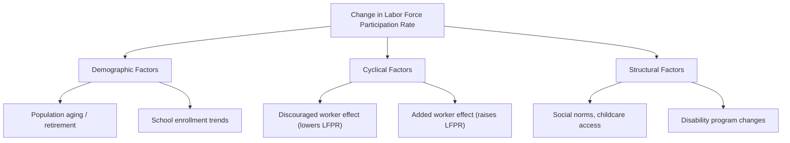
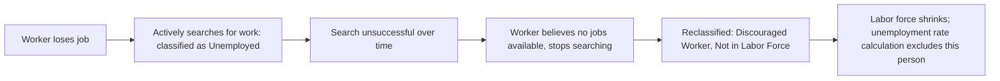

## Labor Force Participation Rate and Discouraged Workers

### Overview

The labor force participation rate measures the share of the working-age population that is economically active — either employed or actively seeking work — while discouraged workers represent a specific subgroup excluded from official labor force counts despite wanting employment. Together, these concepts reveal important limitations in how the headline unemployment rate captures true labor market conditions.

### Labor Force Participation Rate

**Definition**

The labor force participation rate (LFPR) is the percentage of the civilian noninstitutional population (typically ages 16 and older) that is classified as being in the labor force — meaning they are either employed or unemployed and actively seeking work.

**Formula**

$$\text{LFPR} = \frac{\text{Labor Force}}{\text{Civilian Noninstitutional Population}} \times 100\% = \frac{E + U}{\text{Population}} \times 100\%$$

where $E$ is the number employed and $U$ is the number unemployed.

**Example**

Consider an economy with the following figures:

| Category | Number of People |
| --- | --- |
| Employed ($E$) | 150,000,000 |
| Unemployed ($U$) | 7,000,000 |
| Not in labor force | 103,000,000 |

Civilian noninstitutional population $= 150,000,000 + 7,000,000 + 103,000,000 = 260,000,000$

$$\text{LFPR} = \frac{150{,}000{,}000 + 7{,}000{,}000}{260{,}000{,}000} \times 100\% \approx 60.4\%$$

**Key Points**

- The LFPR captures both employed and unemployed individuals, since both groups are, by definition, part of the labor force — the unemployed are simply those without a job but actively searching.
- A **falling** participation rate can reflect either a benign trend (e.g., an aging population with more retirees) or a concerning trend (e.g., rising discouragement due to a weak labor market), and distinguishing between these requires examining the underlying demographic and economic drivers rather than the headline number alone.
- LFPR varies systematically by demographic group, including age cohort, gender, and educational attainment, and long-run trends in these subgroup participation rates (such as the substantial rise in female labor force participation across many economies over recent decades) are important structural features of labor market analysis. [Unverified: specific historical participation rate trend magnitudes vary by country and time period and would require current data to state precisely.]

### Drivers of Participation Rate Changes

**Demographic Factors**

- **Aging population**: As a larger share of the population enters retirement age, the overall participation rate tends to decline mechanically, even if labor market conditions for working-age individuals remain strong.
- **Educational enrollment trends**: Rising rates of school and university enrollment among young people can reduce participation among that age cohort, as full-time students are generally classified as not in the labor force if not also working or seeking work.

**Cyclical Factors**

- **Discouraged worker effect**: During economic downturns, some individuals who lose jobs or fail to find new ones may stop actively searching, exiting the labor force and lowering the participation rate (discussed in detail below).
- **Added worker effect**: During downturns, some individuals who were previously not in the labor force (such as a secondary earner in a household) may enter the labor force to supplement household income lost due to a primary earner's job loss, which can partially offset the discouraged worker effect and *raise* the participation rate.

**Structural Factors**

- Changes in social norms, childcare availability, and workplace policies (e.g., parental leave provisions) can shift long-run participation trends, particularly for specific demographic groups.
- Changes in disability program eligibility or availability can affect participation rates among certain populations. [Inference: the precise magnitude of these structural effects is a subject of ongoing empirical research and varies by country and policy regime.]

### Discouraged Workers

**Definition**

Discouraged workers are individuals who want a job and are available to work, but who have not actively searched for employment in the past four weeks specifically because they believe no suitable jobs are available to them, based on their assessment of labor market conditions.

**Key Points**

- Discouraged workers are classified as **not in the labor force** under standard definitions (such as the BLS framework), since the active job search requirement is not met.
- This means discouraged workers are **excluded from both the numerator and denominator** of the official unemployment rate calculation, despite genuinely wanting work.
- Because discouraged workers are removed from the labor force count entirely, a rise in discouragement during an economic downturn can cause the official unemployment rate to appear artificially low, or even decline, while underlying labor market weakness persists or worsens.

**Criteria for Classification**

To be classified as a discouraged worker (a subset of the broader category "marginally attached to the labor force"), an individual generally must:

1. Not currently have a job.
2. Want a job and be available to work.
3. Have searched for work at some point in the past 12 months (or since last employed).
4. Not have searched for work in the past 4 weeks specifically because they believe no jobs are available for them (e.g., due to lacking necessary skills, employers thinking they're too old/young, or prior unsuccessful search).

**Example**

Consider a factory worker who is laid off during a recession. After several months of unsuccessful job applications, the worker becomes convinced that no employer in their area is hiring workers with their skill set and stops submitting applications altogether, though they remain willing and able to work if a suitable opportunity arose.

- Prior to giving up the search: classified as **unemployed** (had no job, was available, and was actively searching).
- After giving up the search due to a belief that no jobs are available: reclassified as **discouraged** and therefore **not in the labor force**.
- This transition causes both the labor force and the unemployed count to fall by one, which — depending on relative magnitudes — can cause the calculated unemployment rate to *decrease*, even though this individual is arguably in a worse economic position than before (still jobless, but no longer even counted as trying).

### The Broader Category: Marginally Attached Workers

**Definition**

Marginally attached workers is a broader category that includes discouraged workers as a subset, encompassing all individuals who want a job, are available to work, and have searched for work within the past 12 months, but have not searched in the past 4 weeks — for **any** reason, not only discouragement (other reasons might include childcare responsibilities, transportation issues, or school attendance).

**Key Points**

- Discouraged workers are specifically those marginally attached workers whose reason for not currently searching is a belief that no jobs are available to them.
- The broader marginally attached category captures additional labor market slack beyond discouragement alone, and is incorporated into the U-5 alternative unemployment measure.

### Relationship to Alternative Unemployment Measures

| Measure | Includes Discouraged Workers? | Includes All Marginally Attached? | Includes Involuntary Part-Time? |
| --- | --- | --- | --- |
| U-3 (official rate) | No | No | No |
| U-4 | Yes | No (only discouraged subset) | No |
| U-5 | Yes | Yes | No |
| U-6 | Yes | Yes | Yes |

**Key Points**

- The gap between U-3 and U-4/U-5/U-6 provides a way to gauge the extent of hidden labor market slack not captured by the headline unemployment rate.
- This gap tends to widen during and immediately after recessions, as discouragement rises when job prospects deteriorate, and tends to narrow during strong economic expansions as previously discouraged workers regain confidence and re-enter active job search (a phenomenon sometimes framed as discouraged workers becoming "encouraged" again as labor market conditions improve). [Inference: while this cyclical pattern is a well-established general tendency, the precise magnitude of the U-3/U-6 gap at any specific point in time is an empirical matter requiring current data rather than a fixed theoretical relationship.]

### Why This Distinction Matters for Policy and Analysis

- Relying solely on the official (U-3) unemployment rate and the standard labor force participation rate together, rather than either measure in isolation, provides a more complete picture: a falling unemployment rate accompanied by a simultaneously falling participation rate can be a signal of rising discouragement rather than genuine labor market improvement.
- Policymakers and economists often examine the **employment-to-population ratio** alongside these measures precisely because it is unaffected by whether nonworking individuals are classified as "unemployed" or "discouraged," since it simply measures the share of the population currently working.
- During recovery phases following recessions, a temporarily **rising** unemployment rate can sometimes reflect a *positive* underlying development — namely, previously discouraged workers regaining confidence and re-entering the labor force to actively search for work, which adds them to the unemployed count (and the labor force) even though it signals improving sentiment rather than worsening conditions. This counterintuitive possibility illustrates why headline unemployment rate changes require contextual interpretation alongside participation rate trends.

### Comparative Summary

| Concept | Labor Force Status | Captured in U-3 Unemployment Rate? | Captured in Broader Measures? |
| --- | --- | --- | --- |
| Employed | In labor force | N/A (in numerator's complement) | N/A |
| Unemployed (actively searching) | In labor force | Yes (numerator) | Yes |
| Discouraged worker | Not in labor force | No | Yes (U-4, U-5, U-6) |
| Other marginally attached | Not in labor force | No | Yes (U-5, U-6) |
| Involuntary part-time worker | In labor force (counted as employed) | No (counted as employed in U-3) | Yes (U-6 only) |
| Retiree / full-time student not seeking work | Not in labor force | No | No |

**Next Steps**

- Alternative unemployment measures U-1 through U-6 in depth
- Employment-to-population ratio as a complementary indicator
- Business cycle effects on labor force participation
- Structural trends in labor force participation by demographic group
- Involuntary part-time employment and underemployment
- Okun's Law and the relationship between unemployment and output gaps
- Hysteresis in labor markets: long-term effects of extended unemployment
- International comparisons of labor force participation trends