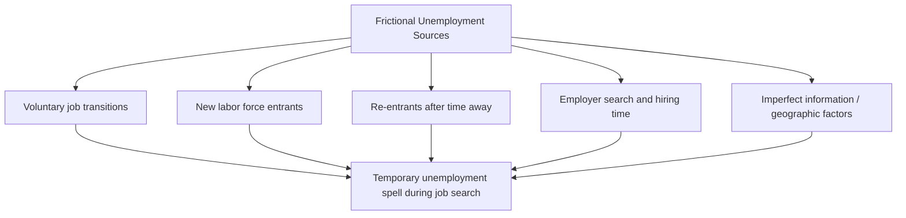

## Frictional Unemployment

### Overview

Frictional unemployment refers to the temporary joblessness that arises from the normal, ongoing process of workers transitioning between jobs or entering the labor force for the first time, rather than from a deficiency in the overall number of available jobs. It is generally considered a natural and largely unavoidable feature of a well-functioning, dynamic labor market, distinguishing it conceptually from structural or cyclical unemployment.

### Definition

Frictional unemployment is the unemployment that results from the time it takes for workers to search for and find jobs that match their skills, preferences, and circumstances, and for employers to search for and identify suitable candidates to fill open positions, given imperfect and costly information in the job-matching process.

### Key Characteristics

**Key Points**

- Frictional unemployment exists even in an economy operating at **full employment**, since some degree of job search and matching time is unavoidable in any dynamic economy where workers voluntarily change jobs, enter, or re-enter the labor force.
- It is generally **short-term** in nature relative to structural unemployment, though the specific duration varies by individual circumstances, industry, and prevailing labor market conditions.
- Frictional unemployment is considered largely a function of **information asymmetry and search costs** rather than a mismatch of skills (which characterizes structural unemployment) or a shortfall in aggregate demand (which characterizes cyclical unemployment).

### Causes of Frictional Unemployment

**Voluntary Job Transitions**

- Workers voluntarily leaving one job to search for a better-suited position, whether due to compensation, career advancement, work-life balance preferences, or dissatisfaction with a current role.
- The time between leaving one job and starting another constitutes a frictional unemployment spell, even though the worker faces no fundamental skill mismatch with available positions.

**New Entrants and Re-entrants**

- Recent graduates entering the labor force for the first time and searching for their initial job.
- Individuals re-entering the labor force after a period outside it (e.g., after raising children, completing further education, or recovering from an illness) who require time to search for and secure a position.

**Employer-Side Search**

- Firms with job openings require time to advertise positions, review applications, conduct interviews, and make hiring decisions, during which the position remains unfilled and any workers seeking that type of role remain frictionally unemployed.
- This process is often referred to in labor economics as **search and matching frictions**, formalized in models such as the Diamond-Mortensen-Pissarides search and matching framework, which explains unemployment as arising from the time-consuming process of matching heterogeneous workers to heterogeneous job vacancies. [Unverified: specific technical details of this model's formal derivation are beyond the scope of this summary and would require dedicated treatment.]

**Geographic and Informational Factors**

- Imperfect information about available job openings and their specific requirements can extend job search duration.
- Geographic relocation costs or willingness constraints can lengthen the time between jobs for workers unwilling or unable to move to where relevant openings exist. [Note: some economists classify pronounced or persistent geographic mismatch as more structural in nature rather than purely frictional; the boundary between the two categories can be somewhat context-dependent.]

### Example

Consider a marketing professional who voluntarily resigns from their current position to search for a role with better long-term career prospects. During the subsequent 6 weeks:

- They are not currently employed.
- They are available to work.
- They are actively submitting applications and attending interviews.

Under standard labor force classification, this individual is counted as **unemployed** during this period, and this spell of joblessness represents frictional unemployment — it arises purely from the time required to find a suitable new match, not from a lack of demand for marketing professionals generally or a mismatch between the worker's skills and the broader job market.

Similarly, consider a recent college graduate with a relevant, in-demand degree who spends 8 weeks after graduation searching for and securing a first job in their field. This search period, even though the graduate's skills are well-matched to available openings, also constitutes frictional unemployment, reflecting the inherent time cost of the job search and matching process.

### Frictional Unemployment and the Natural Rate of Unemployment

**Key Points**

- Frictional unemployment, together with structural unemployment, is generally considered a component of the **natural rate of unemployment** — the unemployment rate that persists even when the economy is operating at full employment or potential output, absent cyclical fluctuations in aggregate demand.

$$\text{Natural Rate of Unemployment} = \text{Frictional Unemployment} + \text{Structural Unemployment}$$

- Because frictional unemployment reflects normal labor market churn rather than a market failure or demand deficiency, most economists do not consider it a target for demand-side policy interventions (such as expansionary monetary or fiscal policy), since such policies are generally more effective at addressing cyclical unemployment caused by inadequate aggregate demand.
- Policies more commonly associated with reducing frictional unemployment focus on **improving labor market information and matching efficiency** rather than stimulating aggregate demand.

### Policy Approaches to Reducing Frictional Unemployment

**Key Points**

- **Job search assistance and information services**: Public or private employment services that centralize job listings and connect job seekers with openings can reduce the time required for successful matching.
- **Improved information transparency**: Online job platforms and professional networking services can reduce the search costs associated with information asymmetry between employers and job seekers. [Inference: the specific quantitative impact of any particular information platform or service on aggregate frictional unemployment levels is difficult to isolate empirically and would require dedicated study.]
- **Unemployment insurance design considerations**: Unemployment insurance can support workers financially during a job search, but sufficiently generous or long-duration benefits are sometimes argued to extend the average duration of frictional unemployment spells by reducing the urgency of accepting the first available offer, though the empirical magnitude of this effect and the appropriate related policy tradeoffs are subjects of ongoing debate among labor economists. [Inference: this remains a contested empirical question, with the effect size varying across studies, countries, and specific program designs.]

### Frictional Unemployment vs. Other Types

| Feature | Frictional Unemployment | Structural Unemployment | Cyclical Unemployment |
| --- | --- | --- | --- |
| Root cause | Time needed for job search/matching | Skills mismatch or structural economic shifts | Deficient aggregate demand |
| Duration | Generally short-term | Can be long-term | Varies with business cycle |
| Present at full employment? | Yes | Yes | No (by definition, zero at full employment) |
| Typical policy response | Improve information/matching efficiency | Retraining, education, labor mobility support | Monetary/fiscal stimulus |
| Considered part of "natural rate"? | Yes | Yes | No |

### Measuring Frictional Unemployment in Practice

- Frictional unemployment is not directly observable as a separately labeled category in standard labor force statistics (such as the BLS unemployment rate); rather, it is a conceptual/theoretical classification that economists infer based on factors such as short unemployment duration, voluntary job separation reasons, and labor market conditions.
- Metrics such as the **duration of unemployment spells** and the **reason for unemployment** (e.g., voluntary job leaver, new entrant, re-entrant, versus job loser) collected in labor force surveys can help distinguish frictional unemployment from other categories, though the classification is inherently somewhat interpretive rather than a precise statistical category with a fixed, universally agreed threshold. [Inference: there is no single universally standardized quantitative threshold that definitively separates "frictional" from "structural" unemployment spells in published statistics.]

### Broader Economic Significance

- A certain baseline level of frictional unemployment is generally viewed as a sign of a **healthy, dynamic labor market** rather than a problem to be eliminated entirely, since it reflects workers' ability to voluntarily seek better job matches and firms' ability to search for well-suited candidates, both of which contribute to more efficient long-run resource allocation in the labor market.
- Attempting to reduce frictional unemployment to zero through aggressive demand stimulus would likely be ineffective and could instead risk generating excess inflationary pressure, since frictional unemployment is not primarily caused by a shortfall in aggregate demand for labor. This is one of the key distinctions underlying the natural rate of unemployment concept and its relationship to the non-accelerating inflation rate of unemployment (NAIRU).

**Next Steps**

- Structural unemployment: causes and policy responses
- Cyclical unemployment and its relationship to aggregate demand
- The natural rate of unemployment and NAIRU
- Diamond-Mortensen-Pissarides search and matching model
- Unemployment insurance design and labor market incentives
- Duration of unemployment as a labor market indicator
- Okun's Law and the unemployment-output relationship
- The Beveridge Curve: job vacancies and unemployment relationship